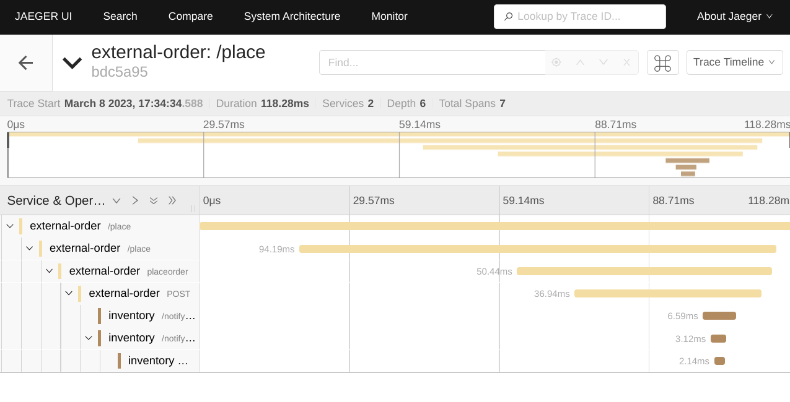
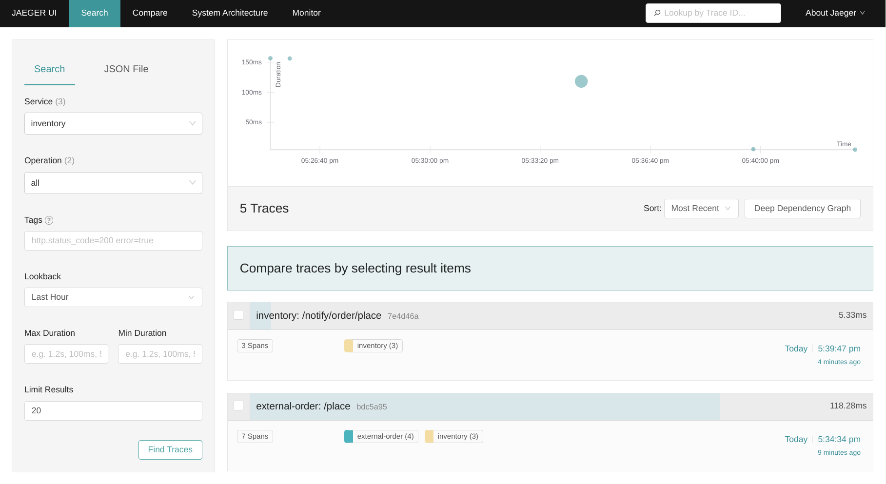
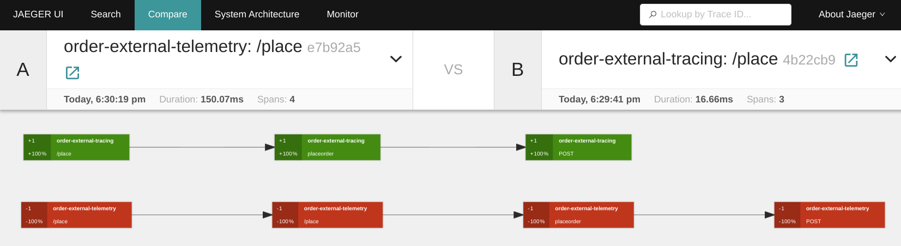

Tracing is an important approach for controlling and monitoring the experience of users, it allows us to gather more information about an integration's performance. 

Camel K has been providing support for distributed tracing using OpenTracing since long time. At the beginning of 2022, the [CNCF](https://www.cncf.io) announced that they were [archiving the OpenTracing project](https://www.cncf.io/blog/2022/01/31/cncf-archives-the-opentracing-project/) in favor of the [OpenTelemetry project](https://opentelemetry.io/). OpenTelemetry is the latest solution created by merging OpenTracing and OpenCensus. As a result, we decided in Camel K 1.12 to introduce the [`telemetry` trait](/camel-k/next/traits/telemetry.html) based on OpenTelemetry. At the same time we decided to deprecate the [`tracing` trait](/camel-k/next/traits/tracing.html) based on OpenTracing.

I'll walk you through the configurations needed to support Distributed tracing for your Camel integrations in this blog post.

## Distributed Tracing tools

OpenTelemetry defines the [OpenTelemetry Protocol (OTLP)](https://github.com/open-telemetry/opentelemetry-specification/blob/main/specification/protocol/otlp.md) that allows any Distributed Tracing tool that provides an OTLP compatible collector API to be used. While OpenTelemetry is still CNCF incubating project, it has become an industry-standard and is now natively supported by many Distributed Tracings tools.

The `telemetry` trait has been tested on Jaeger (v1.35+), OpenTelemetry Collector and Grafana Tempo at the time of writing this blog post.

We will be using Jaeger for this blog post manipulations.

## Camel K

The `telemetry` trait is available starting from Camel K version 1.12, so you should first check your kamel client version

```sh
$ kamel version
Camel K Client 1.12.0
```

To install the Camel K operator just execute
```sh
$ kamel install
```

Check if the Camel K operator is available
```sh
$ kubectl get pods -l name=camel-k-operator
NAME                                READY   STATUS    RESTARTS   AGE
camel-k-operator-5b897ddcdd-4qwqb   1/1     Running   0          50s
```

For more information see the [documentation](/camel-k/next/installation/installation.html)

## Install Jaeger

For this installation, you should first ensure that ingress is available on your kubernetes. If you are working on minikube `minikube addons enable ingress` should be enough.

If Jaeger is not already available on your kubernetes instance, an easy way to install it on a kubernetes is to install the Jaeger operator (see https://www.jaegertracing.io/docs).

In short, to install the Jaeger operator you should:

* Install cert-manager if it is not installed as it is required 
```sh
 # The cert manager is a prerequisite to the Jaeger operator (see https://cert-manager.io/docs/installation/)
$ kubectl apply -f https://github.com/cert-manager/cert-manager/releases/download/v1.10.1/cert-manager.yaml
```
Wait 1 or 2 minutes, we want to ensure the cert-manager has had enough time to be fully deployed

```sh
 # see https://www.jaegertracing.io/docs/1.42/operator/#installing-the-operator-on-kubernetes
$ kubectl create namespace observability
$ kubectl create -f https://github.com/jaegertracing/jaeger-operator/releases/download/v1.42.0/jaeger-operator.yaml -n observability
```

Check if Jaeger-operator is available:
```sh
$ kubectl get deployment jaeger-operator -n observability

NAME              DESIRED   CURRENT   UP-TO-DATE   AVAILABLE   AGE
jaeger-operator   1         1         1            1           48s
```

To use Jaeger, you can install the AllInOne image:

```sh
$ kubectl apply -f - << EOF
apiVersion: jaegertracing.io/v1
kind: Jaeger
metadata:
  name: instance
EOF
```

Check the presence of the Jaeger instance:

```sh
$ kubectl get jaeger
NAME       STATUS    VERSION   STRATEGY   STORAGE   AGE
instance   Running   1.42.0    allinone   memory    8s
```


## Run some Camel K Integrations with Telemetry trait

Now that we have Jaeger available on the Kubernetes cluster, the next step is to run some integrations in a Kubernetes cluster where Camel K is installed.
You can find the source code in the [Camel K example GitHub repository](https://github.com/apache/camel-k-examples/tree/main/generic-examples/traits/telemetry).

We will be creating two integration routes as the distributed services:

* *Inventory* which is also a rest service in charge of product's inventory management

**`InventoryService.java`**
```java
import org.apache.camel.builder.RouteBuilder;
import org.apache.camel.model.rest.RestBindingMode;
import org.apache.camel.component.jackson.JacksonDataFormat;
import java.text.SimpleDateFormat;
import org.apache.camel.Exchange;
import java.util.Date;
import java.util.Map;


public class InventoryService extends RouteBuilder {

    @Override
    public void configure() throws Exception {
        restConfiguration()
            .enableCORS(true)
            .bindingMode(RestBindingMode.json);

        rest()
            .post("/notify/order/place")
                .to("direct:notify");

        JacksonDataFormat invDataFormat = new JacksonDataFormat();
        invDataFormat.setUnmarshalType(InventoryNotification.class);

        from("direct:notify")
            .log("notifyorder--> ${body}")
            .setHeader(Exchange.CONTENT_TYPE, constant("application/json"))
            .bean(InventoryNotification.class, "getInventoryNotification(${body['orderId']},${body['itemId']},${body['quantity']} )")
            .marshal(invDataFormat)
            .log("Inventory Notified ${body}")
            .convertBodyTo(String.class)
        ;
    }

    private static class InventoryNotification {
        private Integer orderId;
        private Integer itemId;
        private Integer quantity;
        private String department;
        private Date datetime;

        public static InventoryNotification getInventoryNotification(Integer orderId, Integer itemId, Integer quantity ){
            InventoryNotification invenNotification  = new InventoryNotification();
            invenNotification.setOrderId(orderId);
            invenNotification.setItemId(itemId);
            invenNotification.setQuantity(quantity);
            invenNotification.setDepartment("inventory");
            SimpleDateFormat formatter= new SimpleDateFormat("yyyy-MM-dd 'at' HH:mm:ss z");
            invenNotification.setDatetime(new Date(System.currentTimeMillis()));
            return invenNotification;
        }


        public void setOrderId(Integer orderId){
            this.orderId=orderId;
        }
        public void setItemId(Integer itemId){
            this.itemId=itemId;
        }
        public void setQuantity(Integer quantity){
            this.quantity=quantity;
        }
        public Integer getOrderId(){
            return this.orderId;
        }
        public Integer getItemId(){
            return this.itemId;
        }
        public Integer getQuantity(){
            return this.quantity;
        }
        public String getDepartment() {
            return department;
        }
        public void setDepartment(String department) {
            this.department = department;
        }
        public Date getDatetime() {
            return datetime;
        }
        public void setDatetime(Date datetime) {
            this.datetime = datetime;
        }
    }
}
```

* *Order* which is a rest service called by a user to place an order for a product, that will then notify the *Inventory* service

**`OrderService.java`**
```java
import java.util.HashMap;
import org.apache.camel.Processor;
import org.apache.camel.builder.RouteBuilder;
import org.apache.camel.model.rest.RestBindingMode;
import org.apache.camel.Exchange;
import org.apache.camel.component.jackson.JacksonDataFormat;
import org.apache.camel.processor.aggregate.GroupedBodyAggregationStrategy;

public class OrderService extends RouteBuilder {

    @Override
    public void configure() throws Exception {

        restConfiguration()
            .enableCORS(true)
            .bindingMode(RestBindingMode.json);

        rest()
            .post("/place")
                .to("direct:placeorder");

        JacksonDataFormat jacksonDataFormat = new JacksonDataFormat();
        jacksonDataFormat.setUnmarshalType(Order.class);

        from("direct:placeorder")
            .log("-----IN ${headers}")
            .marshal(jacksonDataFormat)
            .log("inputBody --> ${body}")
            .to("http://inventory/notify/order?bridgeEndpoint=true")
            .removeHeaders("*")
            .log("responseBody from inventory --> ${body}")
            .setHeader(Exchange.CONTENT_TYPE, constant("application/json"))
            .setBody(simple("{\"inventory\":${body}}"))
            .unmarshal().json()
        ;
    }

    private static class Order implements java.io.Serializable{
        private static final long serialVersionUID = 1L;
        private Integer orderId;
        private Integer itemId;
        private Integer quantity;

        private String orderItemName;
        private Integer price;

        public void setOrderId(Integer orderId){
            this.orderId=orderId;
        }
        public void setItemId(Integer itemId){
            this.itemId=itemId;
        }
        public void setQuantity(Integer quantity){
            this.quantity=quantity;
        }
        public void setOrderItemName(String orderItemName){
            this.orderItemName=orderItemName;
        }
        public void setPrice(Integer price){
            this.price=price;
        }
        public Integer getOrderId(){
            return this.orderId;
        }
        public Integer getItemId(){
            return this.itemId;
        }
        public Integer getQuantity(){
            return this.quantity;
        }
        public String getOrderItemName(){
            return this.orderItemName;
        }
        public Integer getPrice(){
            return this.price;
        }

    }
}
```

Let's run our camel integrations:

* the *Inventory* integration
```sh
$ kamel run InventoryService.java --name inventory \
   -d camel-jackson \
   -t telemetry.enabled=true \
   -t telemetry.sampler=on \
   -t ingress.enabled=true \
   -t ingress.host=inventory.local
Integration "inventory" created
```
* the *Order* integration
```sh
$ kamel run OrderService.java --name order \
   -d camel-jackson \
   -t telemetry.enabled=true \
   -t telemetry.sampler=on \
   -t telemetry.service-name=external-order \
   -t ingress.enabled=true \
   -t ingress.host=order.local
Integration "order" created
```

This configuration will:
* enable tracing for our integrations
* sample all traces
* send traces to OTLP API endpoint

We are also using inventory.local and order.local host in ingress for the rest services so make sure that your DNS pointing to your cluster for both hostnames. You can execute `echo "$(minikube ip) order.local inventory.local" | sudo tee -a /etc/hosts` if you are working on minikube.

As you can see we did not provide the OTLP API endpoint as Camel K automatically discovered the **Jaeger** OTLP API endpoint available in the namespace. For any other Distributed Tracing tool you will have to declare it through `-t telemetry.endpoint=xxxx`. The `telemetry` trait is expecting an [OTLP trace endpoint](https://opentelemetry.io/docs/concepts/sdk-configuration/otlp-exporter-configuration/#otel_exporter_otlp_traces_endpoint).

Now that everything is up let's make some traces!

## Generate some integration traces

1. Let's place some order:

```sh
$ curl  http://order.local/place -d '{"orderId":1, "itemId":5, "quantity":1, "orderItemName":"best product", "price":99}' -H "Content-Type: application/json"
{"inventory":"{\"orderId\":1,\"itemId\":5,\"quantity\":1,\"department\":\"inventory\",\"datetime\":1678293274691}"}
```

If the call went well, you should have this response indicating that the inventory service has been called.

In Jaeger's interface we should see the call with the spans referencing to the rest services and camel components.




2. Now, we will stop collecting the traces for the *Order* integration:
```
kamel run OrderService.java --name order \
   -d camel-jackson \
   -t ingress.enabled=true \
   -t ingress.host=order.local
Integration "order" updated
```

If we create another order:
```sh
$ curl  http://order.local/place -d '{"orderId":2, "itemId":18, "quantity":1, "orderItemName":"another product", "price":5}' -H "Content-Type: application/json"
{"inventory":"{\"orderId\":2,\"itemId\":18,\"quantity\":1,\"department\":\"inventory\",\"datetime\":1678293771675}"}
```

As we can see in Jaeger's interface looking for the inventory traces the call will only show the spans for inventory and no longer the order parent spans.



As you can see, it is quite easy to improve the observability of your integrations using the new `telemetry` trait.

## From tracing to telemetry

We are encouraging migration from the `tracing` trait to the `telemetry` trait.

To give you some inputs on your migration, I will show you how to collect and compare the traces using both traits.

Let's deploy two different *Order* integrations to compare the traces generated :
* stop collecting the traces from *Inventory* integration
```sh
kamel run InventoryService.java --name inventory \
   -d camel-jackson
Integration "inventory" updated
```
* update the *Order* integration using the `telemetry` trait
```sh
$ kamel run OrderService.java --name order \
   -d camel-jackson \
   -t telemetry.enabled=true \
   -t telemetry.sampler=on \
   -t telemetry.service-name=order-external-telemetry \
   -t ingress.enabled=true \
   -t ingress.host=order.local
Integration "order" updated
```
* the *Order* integration using the `tracing` trait
```sh
$ kamel run OrderService.java --name order-tracing \
   -d camel-jackson \
   -t tracing.enabled=true \
   -t tracing.sampler-type=const \
   -t tracing.sampler-param=1 \
   -t tracing.service-name=order-external-tracing \
   -t ingress.enabled=true \
   -t ingress.host=order-tracing.local
Integration "order-tracing" created
```

Don't forget to ensure the new order-tracing.local hostname is configured for your kubernetes cluster!

Let's create the same orders with the two order services:
* one with the order service using the new `telemetry` trait
```sh
$ curl  http://order.local/place -d '{"orderId":20, "itemId":5, "quantity":1, "orderItemName":"strange product", "price":10}' -H "Content-Type: application/json"
{"inventory":"{\"orderId\":20,\"itemId\":5,\"quantity\":1,\"department\":\"inventory\",\"datetime\":1678296117315}"}
```
* another with the order services using the deprecated `tracing` trait
```sh
$ curl  http://order-tracing.local/place -d '{"orderId":21, "itemId":5, "quantity":1, "orderItemName":"strange product", "price":10}' -H "Content-Type: application/json"
{"inventory":"{\"orderId\":21,\"itemId\":5,\"quantity\":1,\"department\":\"inventory\",\"datetime\":1678296184049}"}
```

As you can see, going from the `trancing` to the `telemetry` is quite effortless. On the trace side, from one protocol to another you should expect some differences in your tracing:




# Conclusion

This blog post showed how you can use the new `telemetry` trait and how to work with the Jaeger Distributed Tracing tool. We also took the time to see how you can migrate from the deprecated `tracing` trait to the `telemetry` trait.


If you have any feedback, ideas or find a new issue, please [create a new issue report in GitHub](https://github.com/apache/camel-k/issues)!
