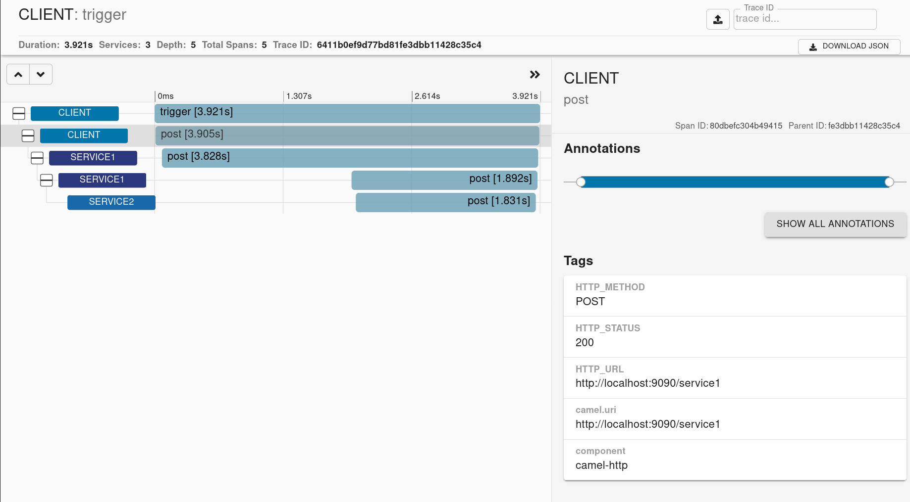
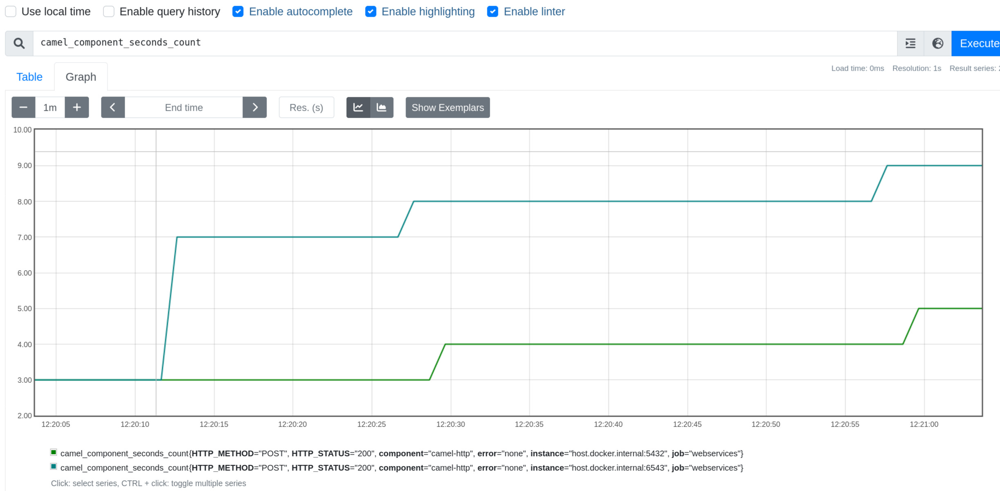

The Spring Observability Team has added native observability support for Spring Applications with Spring Framework 6 and Spring Boot 3. You can read more about the feature in [the Spring blog](https://spring.io/blog/2022/10/12/observability-with-spring-boot-3) where the Micrometer team explains what Observability and [Micrometer Observation](https://micrometer.io/docs/observation) projects are. This blog post will explain  how to set up Micrometer Observation and how you can add observability to your Camel projects.

## Setting up the ObservationRegistry

The following snippet of code shows how to set up basic metrics and tracing capabilities for an `ObservationRegistry`.

```java
// Micrometer Core JAR
import io.micrometer.core.instrument.MeterRegistry;
import io.micrometer.core.instrument.simple.SimpleMeterRegistry;
// Micrometer Observation JAR
import io.micrometer.core.instrument.observation.DefaultMeterObservationHandler;
import io.micrometer.observation.ObservationRegistry;
// Micrometer Tracing JAR
import io.micrometer.tracing.Tracer;

// [Tracing]
// Skipped the whole setup of a Micrometer Tracing tracer
// you can check the https://micrometer.io/docs/tracing docs
// for examples of Brave and OpenTelemetry Tracer setup
io.micrometer.tracing.Tracer tracer = ...; // <1>

// [Metrics]
MeterRegistry meterRegistry = new SimpleMeterRegistry(); // <2>

// Setting up ObservationRegistry
ObservationRegistry registry = ObservationRegistry.create(); // <3>
// Adding metrics support
registry.observationConfig().observationHandler(new DefaultMeterObservationHandler(meterRegistry)); // <4>
// Adding basic tracing support
registry.observationConfig().observationHandler(new DefaultTracingObservationHandler(tracer)); // <5>
```

- <1> - for tracing a `Tracer` is needed. Check the [docs](https://micrometer.io/docs/tracing) on more information on how to set it up
- <2> - for metrics a `MeterRegistry` is needed. Check the [docs](https://micrometer.io/docs/concepts) on more information on how to wotk with Micrometer
- <3> - an `ObservationRegistry` is required to create `Observation`. Check the [docs](https://micrometer.io/docs/observation) on more information on how to set it up
- <4> - to add capabilities to `ObservationRegistry` one needs to add handlers. Here you have an example of a handler for metrics
- <5> - Here you have an example of a handler for tracing. This is a basic sample, for moew information check this [part of the docs](https://micrometer.io/docs/tracing#_handler_configuration)

## How does Micrometer Observation work with Camel?

Apache Camel comes with an abstraction of a [`Tracer`](/components/3.20.x/others/tracing.html). It automatically creates spans for Camel Routes.

With Micrometer Observation there's the modified concept of a `Tracer` to allow distingushing between high and low cardinality tags. That in turn allows to use the `Tracer` API to create `Observations` instead of spans. That allows to automatically create both traces and metrics depending on your `ObservationRegistry` setup.

### Setting up Micrometer Observation with Camel

In order to set up Micrometer Observation with Camel you need to use the new `camel-observation` component and set up a `MicrometerObservationTracer` and register it in the `CamelContext`.

```java
// Camel
CamelContext context = ...;
MicrometerObservationTracer micrometerObservationTracer = new MicrometerObservationTracer();

// Micrometer Core
MeterRegistry meterRegistry = new SimpleMeterRegistry();

// Micrometer Tracing
Tracer tracer = ...;
Propagator propagator = ...;

// Micrometer Observation setup
ObservationRegistry observationRegistry = ObservationRegistry.create();
observationRegistry.observationConfig().observationHandler(new DefaultMeterObservationHandler(meterRegistry));
observationRegistry.observationConfig().observationHandler(
    new ObservationHandler.FirstMatchingCompositeObservationHandler(
        new PropagatingSenderTracingObservationHandler<>(tracer, propagator),
        new PropagatingReceiverTracingObservationHandler<>(tracer, propagator),
        new DefaultTracingObservationHandler(tracer)
    )
);

// Camel
// Setting up Micrometer Observation Tracer
micrometerObservationTracer.setObservationRegistry(observationRegistry);
micrometerObservationTracer.setTracer(tracer);
micrometerObservationTracer.init(context);
```

With this setup you will start creating spans and metrics for your routes.

### Setting up Micrometer Observation with Camel and Spring Boot

With Spring Boot the setup is easier, because all the components come pre-configured for you. Just annotate your class with `@CamelObservation` and your `CamelContext` will automatically be setup depending on your classpath.

```java
@SpringBootApplication
@CamelObservation
public class ClientApplication {

    public static void main(String[] args) {
		SpringApplication.run(ClientApplication.class, args);
	}
}
```

## Example

In this section you will see an example of running different applciations that use Camel with Micrometer, send their spans to [Zipkin](https://zipkin.io) and expose their metrics on a [Prometheus](https://prometheus.io/) endpoint. You can find the Camel & Micrometer Observation examples [here](https://github.com/apache/camel-spring-boot-examples/tree/main/observation).

For Metrics let's use Micrometer Core, for Tracing Micrometer Tracing with [Brave](https://github.com/openzipkin/brave). The application have their tracing sampling probabilities set to always sample. Check the [Spring Boot docs](https://docs.spring.io/spring-boot/docs/current/reference/htmlsingle/#actuator.micrometer-tracing.getting-started) for more information on how to configure Spring Boot with Micrometer Tracing.

The example includes three applications

* client
* service1
* service2

Where client -> service1 -> service2 using HTTP.

All of them have `org.apache.camel.springboot:camel-observation-starter` dependency on the classpath.

### Outcome

You should get a trace view similar to this one



You will get Camel metrics. Example of one of the metrics from Prometheus


Example of plotting metrics in Grafana



## Summary

In this blog post you've managed to learn how you can leverage the new `camel-observation` component that uses Micrometer Observation to make your Camel routes observable.
