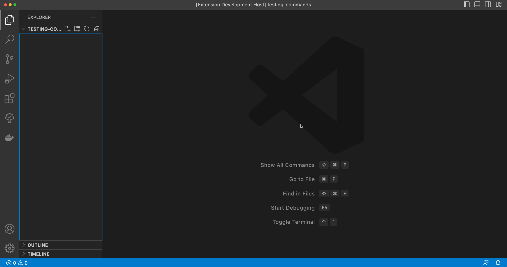

There is a new release of VS Code extension [Language support for Apache Camel](https://github.com/camel-tooling/camel-lsp-client-vscode/blob/0.7.0/Changelog.md#070) 0.7.0

Available at [Visual Studio Marketplace](https://marketplace.visualstudio.com/items?itemName=redhat.vscode-apache-camel) and [Open VSX Registry](https://open-vsx.org/extension/redhat/vscode-apache-camel).

# Camel versions upgrades

- Update default Camel Catalog version from 3.20.0 to 3.20.3
- Update Kamelet Catalog from 0.10.0 to 3.20.2
- Update Camel Quarkus Catalog from 2.15.0 to 2.16.0

# New features

## Command to create a Camel route with Yaml DSL

With new release there is an addition of a new vscode command `Camel: Create a Camel Route using Yaml DSL`. It allows to user create a new Camel Route file defined in Yaml DSL. The new `*.camel.yaml` file is automatically created inside the active workspace using [Apache Camel JBang](/manual/camel-jbang.html).

# New requirements

Beginning this release, for some features it is required to have [JBang](https://www.jbang.dev) available on a system command-line.
