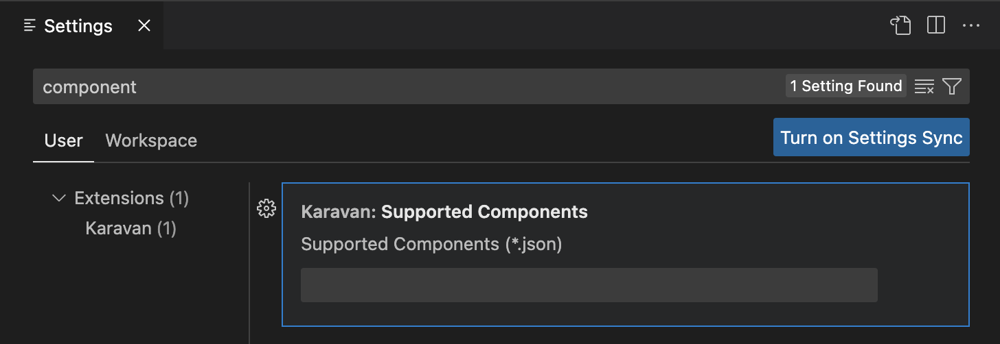

Karavan is an Integration Toolkit for Apache Camel aimed to increase developer performance through the visualization of routes, integration with runtimes and pipelines for package, image build and deploy to kubernetes out-of-the-box.

This is a short [Karavan introduction](/blog/2023/01/karavan-intro/) aimed to help to understand if this tool is right for your needs.

# New features
 In this release we continue to make developers' lives easy.

## Hybrid Developer Experience

Starting from this release, developers can work on the same repository from Karavan application as well as with Karavan VS Code extension. 

To synchronize repository and Karavan application, polling interval can be configured in Karavan CRD.

If polling activated, it updates project information in Karavan application as well as starts pipeline for deployment if development environment.
 

## Configurable subset of components
Developer can limit component palette with a subset of components to be used by configuring path to the component list in Settings. Subset should be defined in JSON file in the same format as an output of `camel catalog component --json`.

In current release subset of components implemented in VS Code extension only. Karavan application support coming soon.

## Nice-to-have small improvements
1. Developer can add custom Git commit message through Karavan application
2. Developer can stop running pipeline in Karavan application
3. **Choice** DSL element comes with default **when** and **other** elements

4. **Log** DSL element has default `${body}` message

## Framework and runtimes upgrades:
1. Camel 3.20.3
2. Spring Boot 2.7.10

# Feedback is gold

Deploy Karavan as a [cloud-native integration toolkit](https://github.com/apache/camel-karavan/tree/main/karavan-cloud) or install [VS Code extension](https://marketplace.visualstudio.com/items?itemName=camel-karavan.karavan) from the Marketplace.

If you have any idea or find a new issue, please [create a new issue report in GitHub](https://github.com/apache/camel-karavan/issues)!
