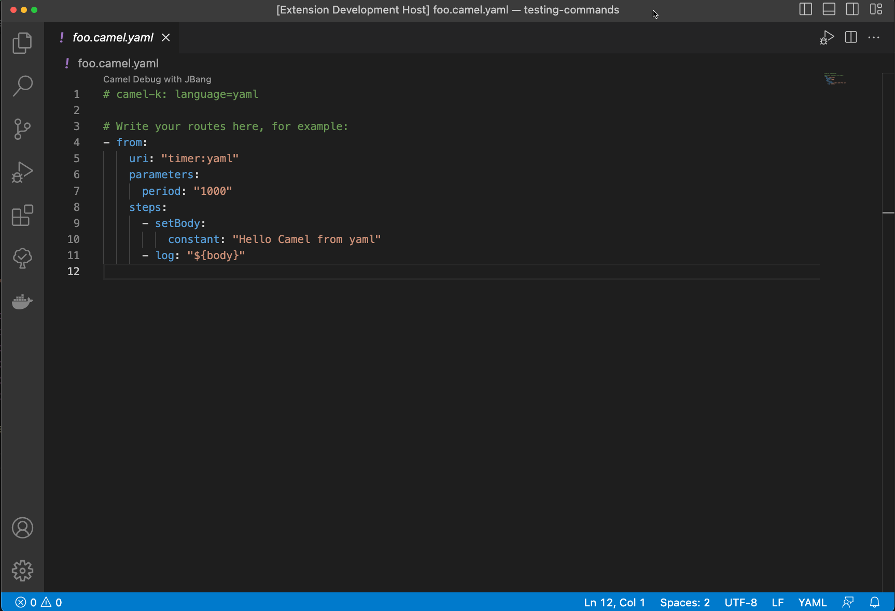
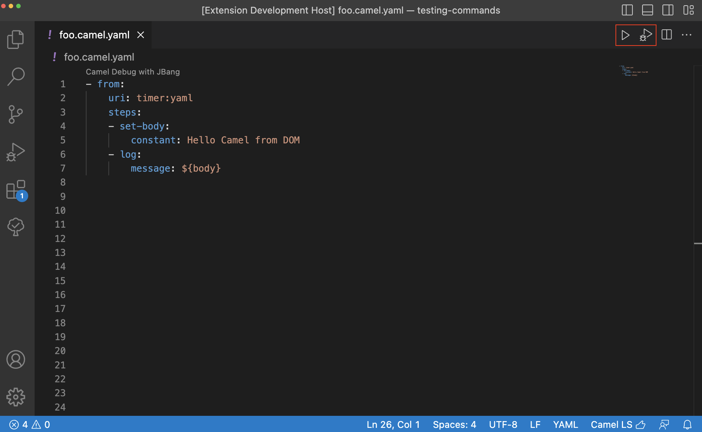

There is a new release of VS Code extension [Debug Adapter for Apache Camel](https://github.com/camel-tooling/camel-dap-client-vscode/blob/0.6.0/CHANGELOG.md#060) 0.6.0

Available at [Visual Studio Marketplace](https://marketplace.visualstudio.com/items?itemName=redhat.vscode-debug-adapter-apache-camel) and [Open VSX Registry](https://open-vsx.org/extension/redhat/vscode-debug-adapter-apache-camel).

# What's changed

- In this release there is a new label `Run Camel Application with JBang and Debug` for command to start and attach the Camel debugger.
- Currently all available extension commands are grouped under `Camel` category

  

- Camel commands are available only in case there is a valid Camel file opened in editor

# New features

## Command to run Camel file with JBang

With next release there is an addition of a new VS Code command `Camel: Run Camel Application with JBang`. It allows the user to run Camel integration without attaching the Camel debugger.

## Editor actions

Beginning this release there is new one-click option to `Run` or `Run and Debug` the Camel files via actions in top right corner of editor. Actions are available only in case there is valid `*.camel.yaml` file opened in editor.

# What's next

You can submit bugs, enhancement requests on the [GitHub Issues](https://github.com/camel-tooling/camel-dap-client-vscode/issues) or in the [Red Hat Jira](https://issues.redhat.com/browse/FUSETOOLS2).
