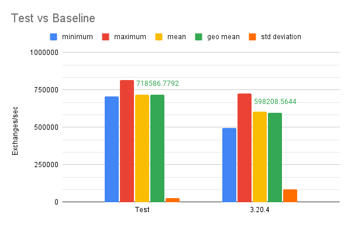
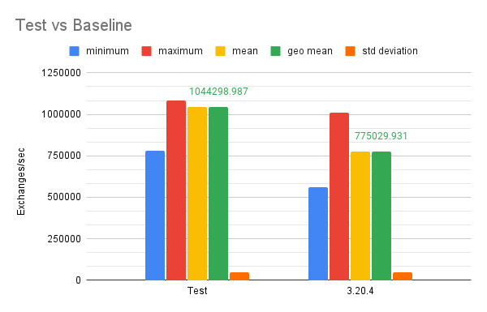
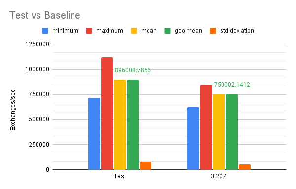
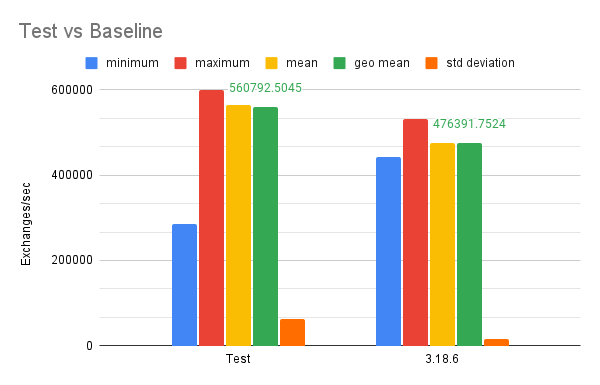
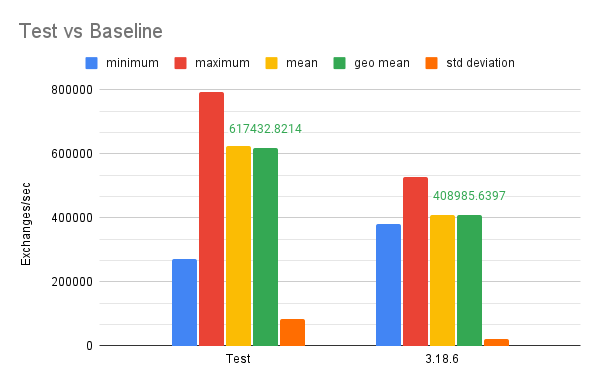
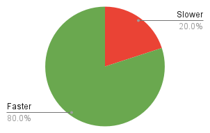
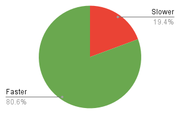
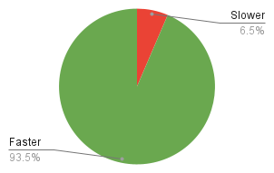

# Introduction

We are thrilled to share the remarkable advancements in the performance of Apache Camel 4, achieved through our diligent efforts in addressing a critical JVM issue (JDK-8180450). In this article, we will delve into the details of our investigation, the tools employed, and the subsequent optimizations that have propelled Apache Camel 4 to new heights of speed and efficiency.

# Identifying the Performance Challenge

The JVM issue [JDK-8180450](https://bugs.openjdk.org/browse/JDK-8180450), known for its potential performance penalties during type checking, became our focal point. To gain a comprehensive understanding of the issue, we extensively utilized diagnostic tools such as perf stat, perf c2c, the async-profiler, and the type-pollution-agent, as recommended in the [JDK-8180450 troubleshooting documentation](https://github.com/RedHatPerf/type-pollution-agent/blob/master/benchmarks/WHATIF.md).

**Note**:
> For readers interested in learning more about this issue, one invaluable resource that can help understading the implications of JDK-8180450 is the enlightening talk ["Cracking the scalability wall"](https://www.youtube.com/watch?v=PxcO3WHqmng) delivered by Francesco Nigro and Sanne Grinovero at Devoxx UK. This talk provides valuable insights about the implications of the issue, its root causes and discusses how some projects have solved it.

# Unveiling Performance Insights

Our investigation highlighted a significant concern related to the instructions per cycle (IPC) when utilizing the disruptor component in earlier versions of Camel (e.g., Camel 3.14, 3.18, and 3.20). Notably, we observed IPC values of approximately 0.71, 0.81, and 0.77, respectively. These numbers indicated a performance bottleneck where the CPU experienced delays due to memory I/O.

To delve deeper, we employed the [type-pollution-agent](https://github.com/RedHatPerf/type-pollution-agent), which successfully generated a comprehensive report detailing the affected conversions. This report [validated](https://issues.apache.org/jira/browse/CAMEL-19058) our suspicions and [emphasized the need](https://issues.apache.org/jira/browse/CAMEL-19060) for immediate attention to overcome the performance [barriers](https://issues.apache.org/jira/browse/CAMEL-19319). Notably, we discovered that the `Exchange`, `CamelContext`, and `Message` were among the critical elements affected by this performance issue.

# Refining for Optimal Results

Armed with crucial insights, we leveraged the [async-profiler](https://github.com/async-profiler/async-profiler) to identify performance plateaus and determine the methods on CPU most of the time. This analysis shed light on additional areas within the code base that required optimization.

Luckily, our journey towards optimizing Apache Camel 4's performance was accompanied by an [overlapping improvement request](https://issues.apache.org/jira/browse/CAMEL-15105), specifically designed for Camel 4.x. This presented an opportunity for us to combine efforts and work towards implementing the necessary workarounds to tackle the JVM issue at hand. The improvement request centered around the concept of standardizing the access to internal plugins within the `Context`, with subsequent extensions to include the `Exchange`, ensuring uniformity across the framework. By addressing the core code impacted by JDK-8180450, we not only resolved the JVM issue but also laid the groundwork for implementing this much-needed feature.

Through meticulous workarounds addressing the JVM issue and implementing optimizations in other identified slow paths, we achieved remarkable improvements in Apache Camel 4's performance. The disruptor and SEDA components demonstrated substantial gains across various scenarios:

* With 3 consumers and 2 producers, the disruptor component witnessed a remarkable 20% performance enhancement.

* Scaling up to 6 consumers and 5 producers, the disruptor component maintained its accelerated pace, delivering a consistent 35% improvement.

* Furthermore, with 9 consumers and 9 producers, the disruptor component exhibited a notable 19% increase in performance.

Similarly, the SEDA component showcased significant advancements:

* Utilizing 2 consumers and 1 producer, the seda component achieved an impressive 19% boost in performance.

* Scaling up to 4 consumers and 1 producer, it demonstrated a commendable 18% improvement.

* Scaling further to 8 consumers and 1 producer, the seda component soared with a remarkable 51% performance enhancement.

# Validation Through Rigorous Testing

To validate the impact of these enhancements, we conducted comprehensive tests, comparing Apache Camel 4 with previous versions.
We used both the [Java Microbenchmark Harness (JMH)](https://github.com/openjdk/jmh/) as well as [custom load generator](https://github.com/orpiske/camel-load-tester).

The results were highly encouraging, with Apache Camel 4 outperforming its predecessors:

* In 80% of the cases, the SEDA component of Apache Camel 4 surpassed SEDA on Camel 3.20.4 in terms of performance.

* The disruptor component in Apache Camel 4 outperformed disruptor on Camel 3.18.6 in 80.6% of the tests.

* Notably, the disruptor component in Apache Camel 4 demonstrated its superiority, outperforming disruptor on Camel 3.20.4 in a remarkable 93.5% of the cases.

# Future Endeavors

As we celebrate these significant achievements, our commitment to optimizing the core of Apache Camel remains resolute. We are actively exploring further improvements and advancements that will drive Apache Camel 4 to even greater heights in performance and efficiency.

# Conclusion

Through meticulous analysis, strategic workarounds, and comprehensive optimizations, we have successfully addressed the JVM issue (JDK-8180450) and propelled Apache Camel 4 to an unrivaled level of performance. These advancements unlock new possibilities and ensure that Apache Camel remains a trusted solution for enterprise integration needs.

We invite you to embrace the future of Apache Camel 4, where boundaries are shattered, limitations cease to exist, and performance knows no bounds. If you find a performance issue, don't hesitate to [report an issue](https://issues.apache.org/jira), provide a [contribution](https://github.com/apache/camel) to Apache Camel or [reach out to the community](http://camel.zulipchat.com/) if you would like to suggest additional testing scenarios.

------

