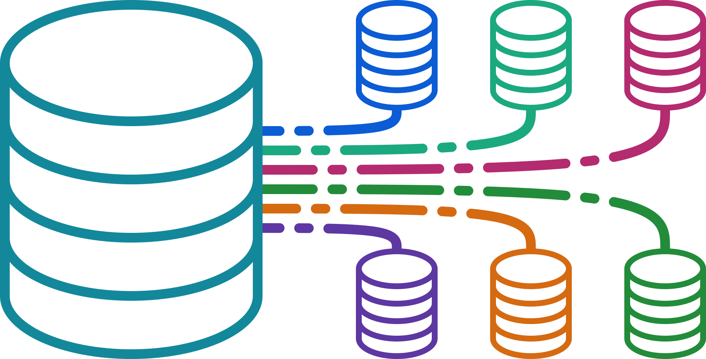
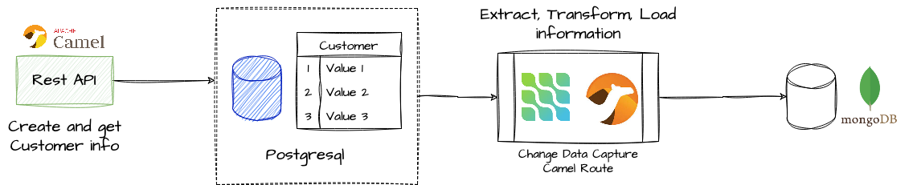
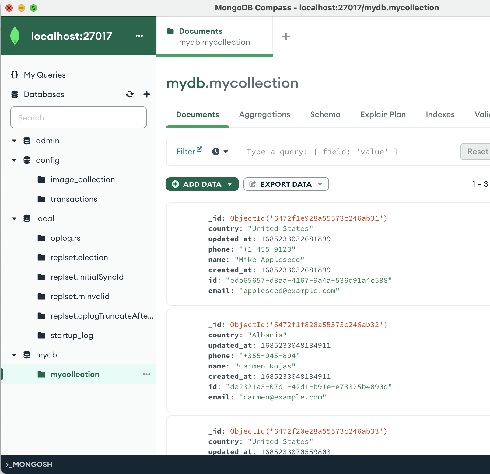

<p align="center">

</p>

In this article, we will explore how to use Debezium and Apache Camel in conjunction with Quarkus to build a reactive application efficiently and send real-time changes from a database to a destination, such as webservice or message queue or another database.

# What is Debezium?

Debezium is a distributed, event-driven data change platform used to capture data changes in database systems and send them to other systems in real time so that applications can respond to all database insertions, updates and deletions made by other applications. Debezium can connect to a variety of database systems, including MySQL, PostgreSQL, MongoDB, SQL Server and Oracle.

# What is Apache Camel?

Apache Camel is an open source integration framework that provides a wide variety of components and integration patterns to help developers integrate applications efficiently. Camel integrates easily with other systems and technologies, making it a valuable tool for developers who need to integrate multiple systems efficiently.

# What is Quarkus?

Quarkus is a Java application development framework designed for the cloud and optimized for OpenJDK HotSpot and GraalVM. Quarkus is based on the Java EE platform and provides a complete set of features for developing cloud-native applications. Quarkus also supports several popular open source frameworks and libraries, making it easy to integrate technologies such as Debezium and Apache Camel.

# Apache Camel y Debezium

Using Debezium with Apache Camel can provide several advantages, including:

- `Full integration`: Camel provides a wide range of connectors/components that can be used to integrate with different data sources and destinations. Debezium can easily integrate with Camel, allowing you to capture and transmit database changes to various destinations/systems.
- `Simplified data transformations`: Camel provides data transformation capabilities that can be used to convert data formats and structures. When used in conjunction with Debezium, Camel can be used to transform and filter database changes, facilitating data processing.
- `Flexible Routing`: Camel provides a flexible routing engine that can be used to route data based on various criteria, such as the source or destination of the data. When used in conjunction with Debezium, Camel can be used to route database changes to different destinations based on data content.
- `Scalability`: Debezium provides a distributed architecture that can be used to scale horizontally. When used with Apache Camel, you can leverage the scalability of Debezium and Camel to handle large volumes of data changes and process them in real time.

In addition, using Debezium with Camel allows you to not rely on an external Kafka cluster or configure *"Kafka Service Connectors"*. Instead, Debezium runs directly in the context of the application, capturing the same change events within the database.

This is useful for ETL (Extract, Transform, Load) processes, as it allows moving data from one system to another in real time, as in the following example:

<p align="center">

</p>

Camel includes components for Debezium in its implementation which allows to use it inside Apache Camel as a consumer endpoint which allows running the [Debezium engine in an embedded way](https://debezium.io/documentation/reference/stable/development/engine.html) in the running instance of Camel.

Some of the components currently available are:
- [Debezium MySQL Connector Component](https://camel.apache.org/components/latest/debezium-mysql-component.html)
- [Debezium PostgreSQL Connector Component](https://camel.apache.org/components/latest/debezium-postgres-component.html)
- [Debezium SQL Server Connector Component](https://camel.apache.org/components/latest/debezium-sqlserver-component.html)
- [Debezium MongoDB Connector Component](https://camel.apache.org/components/latest/debezium-mongodb-component.html)
- [Debezium Oracle Connector Component](https://camel.apache.org/components/latest/debezium-oracle-component.html) (So far it is still not supported in Quarkus)

Now that we have introduced the different technologies we are going to use, let's start building our application.

You can find the complete [source code](https://github.com/mikeintoch/quarkus-debezium-camel) of the example on GitHub.

`Step 1.` Create a quarkus application using maven, with the dependencies needed to build our application.
```bash
mvn io.quarkus:quarkus-maven-plugin:2.15.3.Final:create \                                                                                          
    -DprojectGroupId=dev.mikeintoch \
    -DprojectArtifactId=quarkus-debezium-camel \
    -Dextensions="camel-quarkus-core,camel-quarkus-debezium-postgres,camel-quarkus-direct,camel-quarkus-rest,camel-quarkus-jsonpath,camel-quarkus-jackson,camel-quarkus-mongodb,camel-quarkus-jpa,quarkus-hibernate-orm,quarkus-agroal"
```

`Step 2.` Configure Debezium to connect to the PostgreSQL database and capture the changes. Create a new file called `application.properties` and add the following properties:
```properties
#Camel Debezium Properties
camel.component.debezium-postgres.offset-storage=org.apache.kafka.connect.storage.FileOffsetBackingStore
camel.component.debezium-postgres.offset-storage-file-name=/tmp/offset.dat
camel.component.debezium-postgres.database-server-name=my_db_server
camel.component.debezium-postgres.database-hostname=localhost
camel.component.debezium-postgres.database-dbname=my_db
camel.component.debezium-postgres.database-user=my_username
camel.component.debezium-postgres.database-password=my_password
camel.component.debezium-postgres.database-port=5432
camel.component.debezium-postgres.plugin-name=pgoutput
camel.component.debezium-postgres.schema-include-list=public
camel.component.debezium-postgres.table-include-list=public.customer
camel.component.debezium-postgres.offset-flush-interval-ms=10000
```

`Step 3.` Create a Camel route to process the changes captured by Debezium. Create a new file named `DebeziumRoute.java` and add the following code:
```java
import java.util.Map

import org.apache.camel.builder.RouteBuilder;

public class DebeziumRoute extends RouteBuilder {

    @Override
    public void configure() throws Exception {

        from("debezium-postgres:my_connector")
        .log("${body}")
        .choice()
          .when(header("CamelDebeziumOperation").isEqualTo("c"))
              .process(exchange -> {
                  // Transform the data to a format suitable for MongoDB
                  Map<String, Object> data = exchange.getIn().getBody(Map.class);
                  data.remove("updated_at");
                  data.remove("created_at");
                  data.remove("phone");
                  exchange.getIn().setBody(data);
                })
              .to("mongodb:mydb?database={{mongodb.database}}&collection={{mongodb.collection}}&operation=insert");
    }
}
```

This route will listen for changes in the client table of the `my_db` database and send them to a `mongodb database`. Also processing the data to only process the record creation events, curing the message by removing unneeded information.

`Step 5.` Configure services to test locally.

Use [Quarkus Dev Services](https://quarkus.io/guides/dev-services), a powerful feature of the Quarkus framework that simplifies the development and testing of applications that rely on external services such as databases, messaging systems, and other resources. It allows developers to automatically start and manage these external services during development and testing, eliminating the need to manually configure them or use a separate environment for testing. This feature reduces the complexity of the development process, increases efficiency and helps ensure that your application works properly in production environments. With Quarkus DevServices, developers can focus on writing code and building high-quality applications instead of managing complex dependencies by using containers to pull up these services.

In this case use two database services `Postgresql` and `MongoDB`, then configure the services for these components, add the following properties in the `application.properties` file
```properties
#Quarkus postgresql database devservices
quarkus.datasource.devservices.enabled=true
quarkus.datasource.devservices.port=5432
quarkus.datasource.devservices.db-name=my_db
quarkus.datasource.devservices.username=my_username
quarkus.datasource.devservices.password=my_password
quarkus.datasource.devservices.command=postgres -c wal_level=logical

# MongoDB dev services
quarkus.mongodb.devservices.enabled=true
quarkus.mongodb.devservices.port=27017
```

`Step 6.` Run the application.
```bash
mvn quarkus:dev
```
This will deploy two containers, a Postgresql container and a MongoDB container to test the application.

In the meantime in another terminal run the creation of some records within the database to capture them.
```bash
curl http://localhost:8080/customer -XPOST -i -H 'Content-Type: application/json' -d '{"name": "Mike Appleseed","email": "appleseed@example.com","phone":"+1-455-9123","country": "United States"}'

curl http://localhost:8080/customer -XPOST -i -H 'Content-Type: application/json' -d '{"name": "Carmen Rojas","email": "carmen@example.com","phone":"+355-945-894","country": "Albania"}'

curl http://localhost:8080/customer -XPOST -i -H 'Content-Type: application/json' -d '{"name": "Joe Robinson","email": "joerobinson@example.com","phone":"+1-746-8796","country": "United States"}
```

`Step 7.` Finally verify that the data is at its final destination.

<p align="center">

</p>

# Conclusion

Apache Camel and Debezium provide an excellent combination for building event-driven architectures that can capture and process changes in your data sources.

By using these tools together, you can create microservices and applications that can react in real time to changes in your data sources, without the need for costly and complex data synchronization processes. This can lead to significant improvements in data consistency and reliability, as well as faster and more efficient data processing.

You can find the complete [source code](https://github.com/mikeintoch/quarkus-debezium-camel) of the example on GitHub.
