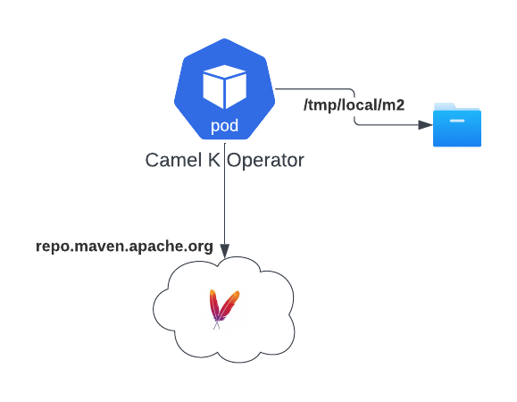
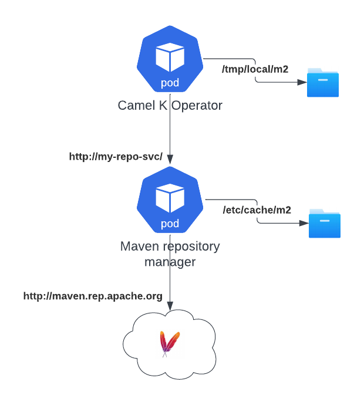

One of the main effort we're putting in Camel K version 2 is to have a enterprise grade building system. Not that Camel K version 1 has not this capability, but some of the key features are not very explicit. So I thought that, while waiting for Camel K version 2 release, where we're making all this configuration explicit, I can share some tip on how to improve the capacity to build and have a production enterprise ready environment also in Camel K 1.

All the work explained here is part of the development done for Camel K version 2, and it may become "first class citizen" in the new version.

# Camel K and Maven relationship

Let's start by a little explaination about how Camel K and Maven work togheter in order to build and run Camel applications. The operator is in charge to optimize this process and recognize when a new build is required. If your Integration has the same set of dependencies used by a previously built Integration, then, the operator reuse the binaries built previously, making Camel K deployment that fast.

But, when these dependencies are missing, it still requires a Java build in order to package the binary required later at runtime. Here we enter in the world of [Maven](https://maven.apache.org/). You like it or not, Maven is the standard when it comes to package Java applications. And a Camel application is no difference.

The intelligence of the operator is to create a Maven project on the fly adding all the dependencies required by the components and any other capabilities, scanning the Integration source. Just to understand, it parses the route and add those dependencies to the Maven project. Once the project is created, then it starts a classic `mvn package` that will take care of producing the artifacts required for the application to run (ie, the `jar` package dependency).

That dependency (plus any other runtime dependency) is the one that is bundled into a JVM based container image that is used by Kubernetes to run your Camel application as a Pod (controlled by a Deployment).

## Maven process explained

Let's look in details at the Maven building process. I'm going to explain the obvious, but bear with me as I need this to explain the optimization we're willing to introduce. When the Maven process starts, it essentially parse the `pom.xml` configuration, **download from a Maven repository all the dependencies** required for the build and for your application, store them locally in the file system and build the Java application and package it in a new dependency ready to be executed.

If you have a look at a typical `mvn package` execution, you will see that most of the time is spent in network operations, ie, downloading the dependencies from the Internet (if you're lucky and the repository is not dead...)

# Camel K default configuration

Let's have a look at the default configuration for Camel K.



When you install Camel K, if you do not specify otherwise, the default configuration for Maven (the `settings.xml` file) will be basically empty. It means that the operator will always connect to the default Maven repository (Maven central repo). That's not necessarily a problem, but it creates a dependency to such repo. Not counting that when your Operator Pod crashes, you will loose all the dependencies downloaded so far.

# Put a Maven proxy in your life

Let's have a look now at one of the [Maven best practices: using a repository manager](https://maven.apache.org/repository-management.html). I'm not entering in the details about all the benefits. I just want to focus on the one related to bandwidth savings.



As you can see in the diagram, there are not big changes in play. By introducing a proxy, Camel K Operator will be able to continue working normally with the same Maven protocol. However, the proxy is the one that is really in charge to download the dependencies and store them locally to its local storage (so it won't make an outboud network call when something is cached). This is a great bandwidth saver for companies, as it reduces to the bare minimum the Egress traffic.

In a cloud environment this is vital as it will save a lot of money in traffic that is typically charged (above all in an hybrid or multi cloud environment).

## How to configure the proxy

Configuring a Maven proxy in Camel K is fairly simple, altough it requires some manual intervention. First of all, you need to provide the settings in a Configmap or a Secret. This is a basic example, you may require to include much more configuration such as certificates and authentication:

```xml
<settings xmlns="http://maven.apache.org/SETTINGS/1.0.0" xmlns:xsi="http://www.w3.org/2001/XMLSchema-instance" xsi:schemaLocation="http://maven.apache.org/SETTINGS/1.0.0 https://maven.apache.org/xsd/settings-1.0.0.xsd">
    <mirrors>
        <mirror>
            <id>camel-k-maven-repository-manager</id>
            <name>Maven Repository Manager</name>
            <url>http://my-company-maven-repository-proxy/</url>
            <mirrorOf>*</mirrorOf>
        </mirror>
    </mirrors>
</settings>
```

In our case it will be enough to tell Maven that the repository manager is a mirror for any outgoing request. With this file, you need to create a Configmap (or a Secret):

```bash
kubectl create cm my-maven-proxy --from-file settings.xml
```

Then you either install Camel K providing this configuration or edit the IntegrationPlatform configuration:

```
kamel install --maven-settings configmap:my-maven-proxy/settings.xml
```
```yaml
apiVersion: camel.apache.org/v1
kind: IntegrationPlatform
...
spec:
  build:
    maven:
      settings:
        configMapKeyRef:
          key: settings.xml
          name: my-maven-proxy
```

## Create your own proxy

If you're adopting Camel K in an enterprise, then you should be able to use the configuration above and use your company proxy. If you don't have it and you want to create one, we give you a quick solution: install and manage your Maven Repository Manager in Kubernetes. This example is based on [OSS Nexus](https://www.sonatype.com/products/sonatype-nexus-repository).

NOTE: the example provided here is illustrative only and not ready for production scopes.

You need to run the following yaml configuration in order to create a Deployment and the Service where the repository will be exposed:

```yaml
apiVersion: v1
kind: Service
metadata:
  name: nexus
spec:
  selector:
    app: nexus
  ports:
    - protocol: TCP
      port: 80
      targetPort: 8081
---
apiVersion: apps/v1
kind: Deployment
metadata:
  name: nexus
spec:
  selector:
    matchLabels:
      app: nexus
  template:
    metadata:
      labels:
        app: nexus
    spec:
      containers:
        - name: nexus
          image: sonatype/nexus3
          ports:
            - containerPort: 8081
              name: 8081-tcp
          livenessProbe:
            httpGet:
              path: /service/rest/v1/status
              port: 8081
            initialDelaySeconds: 90
            periodSeconds: 3
          readinessProbe:
            httpGet:
              path: /service/rest/v1/status
              port: 8081
            initialDelaySeconds: 90
            periodSeconds: 3
          volumeMounts:
            - name: nexus-data
              mountPath: /nexus-data
      volumes:
        - name: nexus-data
          emptyDir: {}
```

You can `kubectl apply` it and after a while, you should be able to use the service in Camel K connecting via http://nexus/. You can infact change the address in the `settings.xml` above with the new service and run `kamel install --maven-settings configmap:my-maven-proxy/settings.xml`. From now on Camel K will interact only with this proxy.

## Some stats

Let's run some experiment to show the level of improvements we have got. When we start a brand new installation, we have no dependencies, so we expect some time for the build:
```
kamel run Test.java
...
camel-k-operator-5b897ddcdd-sk7vs camel-k-operator {"level":"info","ts":1686234265.6455615,"logger":"camel-k.maven.build","msg":"Total time:  44.800 s (Wall Clock)"}
```
Now, let's `kamel reset` in order to clean any previous binary and make sure we don't reuse. We also crash our operator Pod forcefully in order to start from a clean state (`kubectl delete pods camel-k-operator-5b897ddcdd-sk7vs`).

```
kamel run Test.java
...
camel-k-operator-5b897ddcdd-4kx54 camel-k-operator {"level":"info","ts":1686234372.8376727,"logger":"camel-k.maven.build","msg":"Total time:  11.988 s (Wall Clock)"}
```

Cool. We've reduced the time to build from 44 to 12 seconds (70% improvement) and we have saved 150 MB of egress bandwidth.

```
kubectl exec -it camel-k-operator-5b897ddcdd-dst6s -- du -h /tmp/artifacts/m2
...
153M	/tmp/artifacts/m2
```

# Conclusion

Time to market and cost savings are certainly important topics we're quite sensitive at. All the work demonstrated here is serving as a base improvement for Camel K 2.0. However, you can still benefit in Camel K 1 by applying the same concepts and certain configurations.
