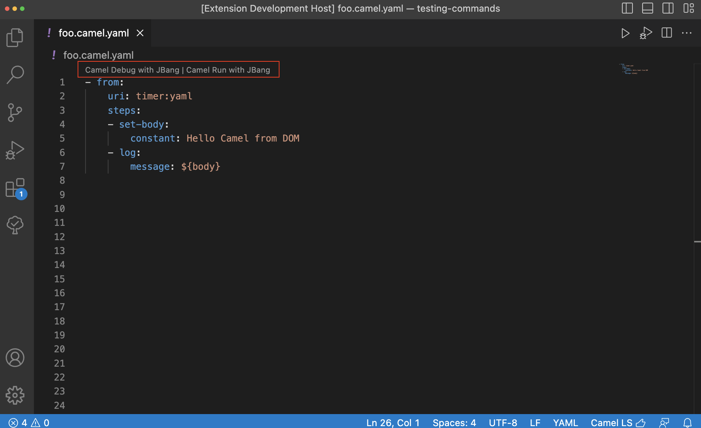

There is a new release of VS Code extension [Debug Adapter for Apache Camel](https://github.com/camel-tooling/camel-dap-client-vscode/blob/0.7.0/CHANGELOG.md#070) 0.7.0

Available at [Visual Studio Marketplace](https://marketplace.visualstudio.com/items?itemName=redhat.vscode-debug-adapter-apache-camel) and [Open VSX Registry](https://open-vsx.org/extension/redhat/vscode-debug-adapter-apache-camel).

# What's changed

- Minimal version of Visual Studio Code to run this extension is 1.76.0
- Bump default Camel JBang version to 3.20.5

# New features

## Contextual Menu

Added missing Contextual Menu item, to allow users execute `Run Camel Application with JBang` from right-click on integration file.

## Codelens

Added missing Codelens item, to allow users execute `Camel Run with JBang` from codelenses inside opened integration file.

## Automatic Reloading

This release is enabling [Camel JBang - Dev Mode with Live Reload](/manual/camel-jbang.html#_dev_mode_with_live_reload). Currently it is available only for `Run Camel Application with JBang` command. This option is enabled by default.

## Settings

Beginning this release, there is new setting available for Apache Camel JBang version, which is used by extension commands:

- `Run Camel Application with JBang`
- `Run Camel Application with JBang and Debug`

# What's next

You can submit bugs, enhancement requests on the [GitHub Issues](https://github.com/camel-tooling/camel-dap-client-vscode/issues) or in the [Red Hat Jira](https://issues.redhat.com/browse/FUSETOOLS2).
