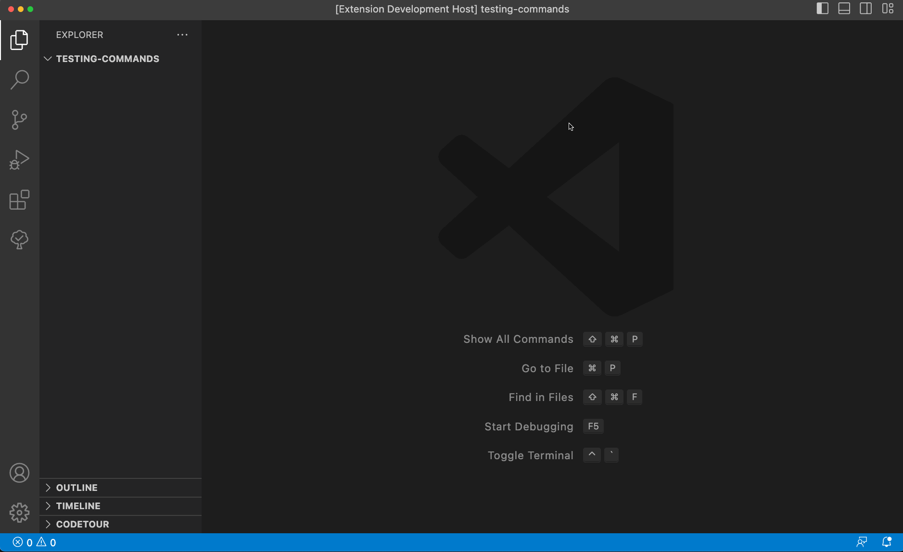
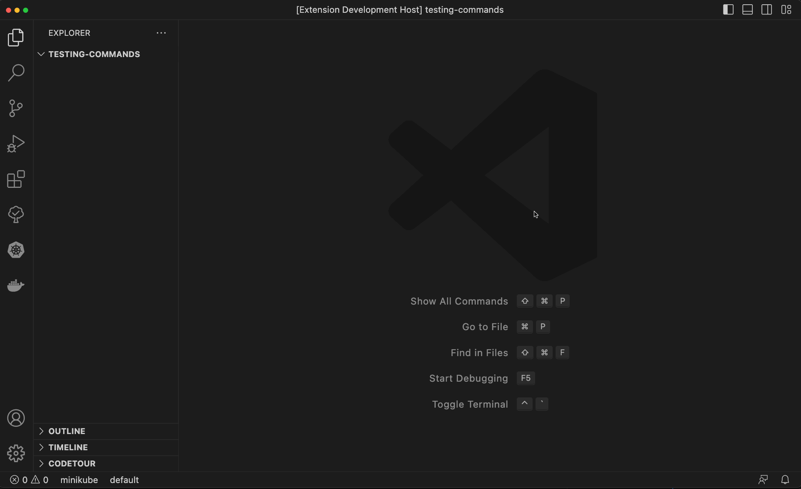
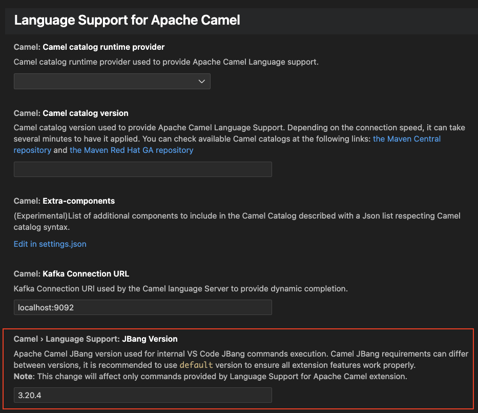

There is a new release of VS Code extension [Language support for Apache Camel](https://github.com/camel-tooling/camel-lsp-client-vscode/blob/0.8.0/Changelog.md#080) 0.8.0

Available at [Visual Studio Marketplace](https://marketplace.visualstudio.com/items?itemName=redhat.vscode-apache-camel) and [Open VSX Registry](https://open-vsx.org/extension/redhat/vscode-apache-camel).

# What's changed

- Minimal version of Visual Studio Code to run this extension is 1.76.0
- Deprecate features related to Camel Kafka Connector
- Update default Camel Catalog version from 3.20.3 to 3.20.5
- Update default Camel JBang version from 3.20.3 to 3.20.5
- Update Kamelet Catalog from 3.20.2 to 3.20.4

# New features

## Command to create a Camel route with Java DSL and XML DSL

With next release there is an addition of new VS Code commands `Camel: Create a Camel Route using Java DSL` and `Camel: Create a Camel Route using XML DSL`. It allows to user create a new Camel Route file defined in Java DSL or XML DSL. The new `*.java` or `*.camel.xml` file is automatically created inside the active workspace using [Apache Camel JBang](/manual/camel-jbang.html).

- Command to create a Camel route with Java DSL

- Command to create a Camel route with XML DSL

## Settings

Beginning this release, there is a new setting available for Apache Camel JBang version, which is used by extension commands:

- `Camel: Create a Camel Route using Yaml DSL`
- `Camel: Create a Camel Route using Java DSL`
- `Camel: Create a Camel Route using XML DSL`

# What's next

You can submit bugs, enhancement requests on the [GitHub Issues](https://github.com/camel-tooling/camel-lsp-client-vscode/issues) or in the [Red Hat Jira](https://issues.redhat.com/browse/FUSETOOLS2).
