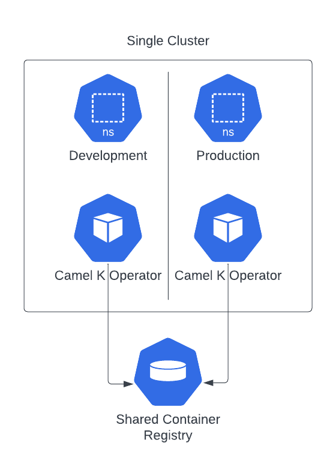
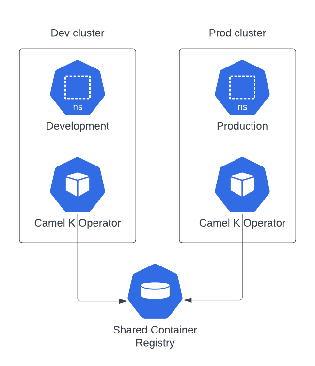
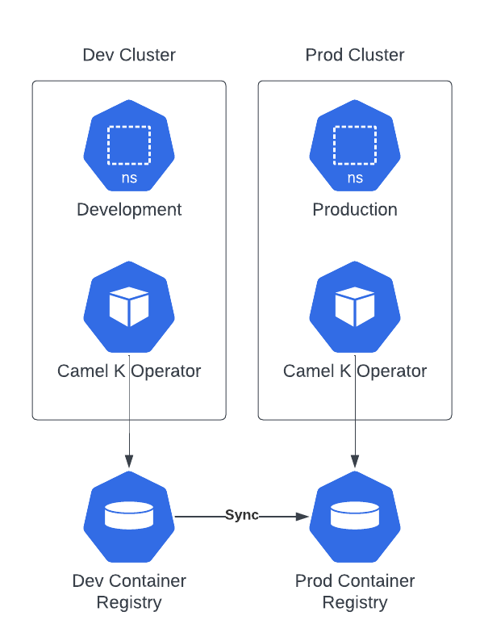

In this blog post we'll be talking about **GitOps** and we'll provide some approach that we hope can help you understand better how you can do such kind of operations togheter with Camel K. As we're talking about processes, all the discussion we're going to provide can be different in each company, environment and according the set of tools you're using.

The idea of the blog is to show the possibilities offered by Camel K in order to help you understand better how you can adapt your own tools and process to Camel K deployment model.

# What's GitOps

GitOps is a paradigm used to manage cloud-native applications. The main focus, as the name suggest is to have a "Git-centric" approach, where the developer provides any required change of a cloud native application on the source code repository, and some CD tool takes care to apply such changes in the target cluster. It matches very well in a microservice oriented architecture and if you're willing to provide a continuous delivery for your application.

# A simple GitOps strategy with Camel K

Let's see how we can get the full benefits of **GitOps with Camel K** with some example. The route example chosen is very simple, as we just want to illustrate the process we've followed. It should be easy enough to apply the same approach to more complex routes.

The process we're following is one that we think tipically applies to most of the companies:

* we create a route, testing it in a development environment
* we package the configuration required to run with a GitOps CICD tool
* we push the changes to a Git repository
* we provide the CD configuration targetting the Git repository
* we apply any application change to the Git repository

## Camel K environments topology

Before starting with the example, I think it's important to understand how Camel K manages the different environments and how we can make each environment to share artifacts. What we finally want to do is to test some application in the development environment and later use the very same application (which we suppose has been throughoutfully tested) in a production environment.

In Camel K we use the container registry as the common place where to store the artifacts we use to run the applications. When you create an Integration, the Camel K operator is in charge to build (or reuse) a container image which is stored in the container registry. Once the image is available you can use it in any other environment/cluster.

We can think on three different topologies:



This is the simples topology where you have a single cluster and a logical separation with namespaces. In such configuration you need to have both operators to share the same container registry.



Here you will have a physical separation as there are two separate clusters. However, in order to properly use the containers tested in development, both operators needs also to share the same container registry.



This topology is similar to the previous one, but you have dedicated container registries. The only caveat is that you need to put in place a mechanism to promote (or synchronize) the containers images which are created in development.

Whichever is the topology you're choosing there won't be any change in the way we're performing our deployment operations when we adopt a GitOps strategy. Each environment (or cluster) will have to provide the proper CD configuration targeting the Git repository (and the right profile).

## Directory structure preparation

The first thing we can do is to provide a folder based structure that will host our example and it will be the source for our Git repository. We're going to use [Kustomize](https://kustomize.io/) as we think it's easier to provide different "profiles", so, if you're using other methodologies, the organization may change accordingly.

```
mkdir -p my-ck-gitops
mkdir -p my-ck-gitops/base
mkdir -p my-ck-gitops/overlays/dev
mkdir -p my-ck-gitops/overlays/prod
cd my-ck-gitops
```

We've used the generic approach suggested in this [GitOps promotion model article](https://codefresh.io/blog/how-to-model-your-gitops-environments-and-promote-releases-between-them/). With this configuration we have a _base_ directory which we use to store all the generic configuration and two _overlays_ directories where we define the customization which is related to _development_ and productions _environments_.

## Prepare development Integration

NOTE: this example was originally developed for Camel K operator version 1.12.x and won't work out of the box with Camel K operator version 2.3.x and 2.4.x. We suggest to try this example with other available versions or adjust it to include the IntegrationKit resource which was needed by those operator versions. From version 2.5 onward, however, the example shown here should work out of the box.

You can do the development according your company strategy, using [Camel JBang](/blog/2022/11/camel-k-jbang/), a [pipeline](https://github.com/apache/camel-k/tree/main/cicd/tekton/kamel-run/0.1) or directly the `kamel` CLI. As we want to just focus on the GitOps part, we're using `kamel` CLI which results more self-explainatory for the blog purpose.

Everything starts with some kind of prototype. We can create a `my-route.yaml` route which we'll populate with some YAML DSL. The YAML route we're creating is using some configmap in order to show how we can apply configuration dynamically based on the environment we run. You can image the same when applied to databases, services, etcetera.

```yaml
- from:
    uri: "timer:yaml"
    parameters:
      period: "1000"
    steps:
      - setBody:
          simple: resource:classpath:my-configmap-file
      - to: "log:info"
```
Before testing the route in a cluster, let's also create a configmap using `kubectl` for simplicity:

```
kubectl create cm my-cm --from-literal my-configmap-file="I am a development environment"
```

Once this is applied, we can run the Integration:

```
kamel run my-route.yaml --dev --config configmap:my-cm
```

As this is a development environment, we do want to limit the quantity of resource used. Let's use the Container trait for this purpose:

```
kamel run my-route.yaml --config configmap:my-cm -t container.limit-cpu=0.1 -t container.limit-memory=256Mi
```

Once we're happy with the test, we're ready to wrap it into a Git repository which we'll be using for all our GitOps operations.

### Git repository

At this stage we can export the Integration either by getting the value from the cluster or reusing the same `kamel` CLI with the dry-run option. Let's use this second approach as it frees us by the need to remove the `.spec.status` of the Integration:

```
kamel run my-route.yaml --config configmap:my-cm -t container.limit-cpu=0.1 -t container.limit-memory=256Mi -o yaml > base/my-it.yaml
```

We can use Kustomize now to provide the configuration required for development profile:

```
cd base/
kustomize create --resources my-it.yaml
kustomize edit add configmap my-cm --from-literal=my-configmap-file="I am a default environment" --behavior create --disableNameSuffixHash
cd ../overlays/dev/
kustomize create --resources ../../base
kustomize edit add configmap my-cm --from-literal=my-configmap-file="I am a development environment" --behavior replace
```

In a real development you will probably need to include more customization, depending on the complexity of the Integration. You can learn more about all the details of Kustomize reading the official documentation.

## Prepare production Integration

What we have done, so far, should be good enough to enable GitOps on a development profile. Before testing it with some CD technology, let's prepare also the production profile.

We can start creating the `kustomization.yaml` file in a very similar way we did for the development profile. Additionally we specify which is the new target namespace.

```
cd ../../overlays/prod/
kustomize create --resources ../../base/
kustomize edit add configmap my-cm --from-literal=my-configmap-file="I am a production environment" --behavior replace
kustomize edit set namespace prod
```

We should now prepare a yaml configuration file for those parameters we want to override from the base. It will be something like:

```yaml
apiVersion: camel.apache.org/v1
kind: Integration
metadata:
  annotations:
    camel.apache.org/operator.id:
  name: my-route
spec:
  traits:
    container:
      image: 10.110.251.124/default/camel-k-kit-cijrbp8vl1rc73dg99h0@sha256:038254c5c3d627eb230a1df2d6a140fb54d704f7d14443396e7273ee53d2ce3e
      limitCPU: "1"
      limitMemory: 1024Mi
```
The first thing we need to do is to remove the `operator.id` annotation in order to let the production operator to pick up the resource for reconciliation (you may also decide to set the id of the operator that takes care to reconcile). Then, you can see we're specifically overriding the `.spec.trait.container.image` (which represent the container created and tested in development). The value can be taken from the Integration that has been tested, checking the `.spec.status.image` value. Finally we're editing the resources which are now wider in a production environment. Let's save this file as `settings.yaml`.

We can use this file as a patch to Kustomize:

```
kustomize edit add patch --path settings.yaml
```

If you're using a different technology such as [Helm charts](https://helm.sh/docs/topics/charts/) or [Jsonnet](https://jsonnet.org/) the configuration will change according to the spec. However, the fields you'll need to configure will be the same as we've shown in Kustomize example.

This production configuration is now ready to run in your CD technology. You can therefore create a repo or you can reuse the one we've used in this example: https://github.com/squakez/camelk-gitops-example

## Run with ArgoCD

When we talk about CD tools for GitOps, [ArgoCD](https://argo-cd.readthedocs.io/en/stable/) results in the most popular choice. We will show some basic usage to integrate the application we've prepared in the previous chapters, assuming you've installed already ArgoCD on your Kubernetes cluster and you have some familiarity with it.

For the sake of brevity I'll only show you how to apply to the production environment only.We start setting the default namespace to the one where ArgoCD is tipycally installed:

```
kubectl config set-context --current --namespace=argocd
```

Now, assuming you have `argocd` CLI installed on your machine, we'll prepare the configuration required to run your Camel K application:

```
argocd app create my-ck-it-prod --repo https://github.com/squakez/camelk-gitops-example.git --path overlays/prod --dest-server https://kubernetes.default.svc --dest-namespace prod
```

Notice that we're providing the Git repository path (the production overlay) and we specify the destination namespace. We also need to specify the destination cluster server, which, in our case, is a local Kubernetes cluster. Now that the application is installed, let's have a look at the status of the application:

```
argocd app list

NAME                  CLUSTER                         NAMESPACE  PROJECT  STATUS     HEALTH   SYNCPOLICY  CONDITIONS  REPO                                                  PATH           TARGET
argocd/my-ck-it-prod  https://kubernetes.default.svc  prod       default  OutOfSync  Healthy  <none>      <none>      https://github.com/squakez/camelk-gitops-example.git  overlays/prod
```

You can see that the application status is `OutOfSync` which is normal the first time we install the application. Let's run a manual syncronization to have it started:

```
argocd app sync my-ck-it-prod
...
2023-07-07T09:05:37+02:00  camel.apache.org  Integration        prod              my-route    Synced  Missing              integration.camel.apache.org/my-route created
```

The application should run immediately as, in the production profile we won't require a build (we'll use the IntegrationKit already tested in development environment):

```
kamel logs my-route -n prod
...
[1] 2023-07-07 07:05:45,913 INFO  [info] (Camel (camel-1) thread #1 - timer://yaml) Exchange[ExchangePattern: InOnly, BodyType: String, Body: I am a production environment]
```

Well done. From now on the ArgoCD will take care to monitor the application and alert when some change happen on the source code in order to run the necessarily sync action. Let's make some change in the prod overlay. For example, we can change the text of the Configmap and we can reduce the number of memory required for the container.

> NOTE: changing the Configmap only may not trigger an Integration rebuild as Camel K is not able ([yet](https://github.com/apache/camel-k/issues/1235)) to restart an Integration on Configmap/Secret hot reloads.

We can perform all the tipycal Git workflow here (PRs, actions checks, etc). Once the changes will land on `main`, ArgoCD will notify the application has gone `OutOfSync`

```
argocd app list

NAME                  CLUSTER                         NAMESPACE  PROJECT  STATUS     HEALTH   SYNCPOLICY  CONDITIONS  REPO                                                  PATH           TARGET
argocd/my-ck-it-prod  https://kubernetes.default.svc  prod       default  OutOfSync  Healthy  <none>      <none>      https://github.com/squakez/camelk-gitops-example.git  overlays/prod
```

We can re-sync and see the changes applied immediately:

```
argocd app sync my-ck-it-prod
kamel logs my-route -n prod
...
[1] 2023-07-07 07:58:16,906 INFO  [info] (Camel (camel-1) thread #1 - timer://yaml) Exchange[ExchangePattern: InOnly, BodyType: String, Body: I am a production environment [edited!]]
```

# Conclusion

**GitOps** is a very interesting deployment tecnique which result very handy when applied to Cloud Native and Microservices architecture. In the blog we've seen how we can apply it to Camel K applications. We've seen how tools such **Kustomize** and **ArgoCD** can easily integrates with the outcome expected by Camel K to run a multi environment application. We wanted to show you some unopinionated approach that will help you organize your own GitOps strategy in order to learn which are the most important configuration required for a Camel K application.

The tools we've provided here can be replaced by any other available in the market. Also the process can be adapted to your own. The main takeaway is how you can leverage the tested application which will be pushed to a given container registry, and how you can reuse the tested artifacts in the different environments that your process requires.
