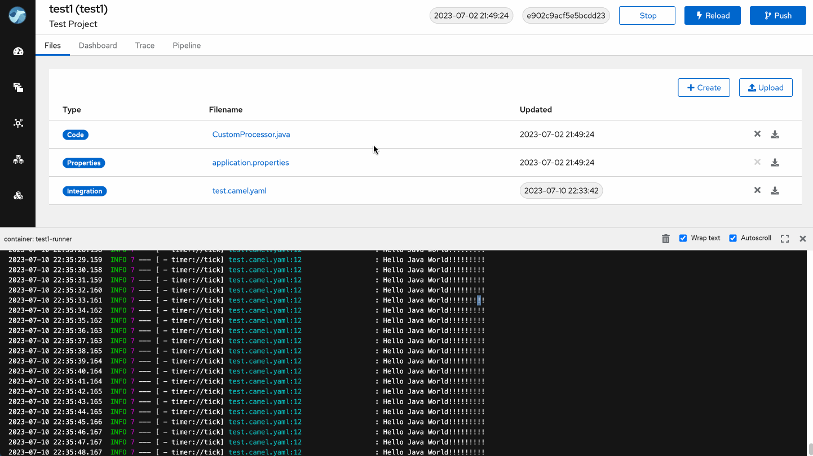

In this blog post, we are excited to announce the latest updates and improvements in Apache Camel Karavan. This version brings significant improvements focused on developer productivity in the Karavan Cloud Application. 

Let's dive into the details and explore what's new!

# What's new

## Karavan CLI

To simplify the installation of Karavan Cloud Application on Kubernetes, we have introduced the Karavan CLI. This command-line interface allows you to effortlessly install Karavan and generate resource YAML files. With just one command, you can set up your Karavan environment quickly and easily, ex.:
```
jbang org.apache.camel.karavan:karavan-cli:3.21.0 install --git-repository=$REPO --git-password=$PASWORD --git-username=$USERNAME  --node-port=30777
```
 
## Fast Prototyping

We understand the importance of rapid development and iteration. To streamline the prototyping process, we have implemented fast prototyping capabilities in Karavan Cloud Application. Now, you can swiftly iterate on your ideas and bring your projects to life with greater efficiency.


## Tracing

Tracing allows you to monitor and inspect the headers and body data during the execution of every Camel Exchange instance. With this powerful debugging tool, you gain valuable insights into the flow of data and can easily troubleshoot issues or optimize your integration processes. Tracing empowers you with greater visibility and control over your application's execution.



## Fixes

1. Corrected RouteConfiguration YAML: We have addressed several issues related to RouteConfiguration YAML. This includes fixing configurations for `intercept`, `interceptFrom`, `interceptSendToEndpoint`, `onCompletion`, and `onException`. These fixes ensure that the routing configurations work as intended and provide a seamless experience.

2. Exposed Delay EIP: We have made the Delay Enterprise Integration Pattern (EIP) accessible in this version of Karavan Designer. You can now easily introduce delays in your integration flows.

## Breaking Changes

Path Parameters Update: Starting from this version, Karavan sets path parameters in the same way as query parameters (key: value). This change enhances consistency in the handling of parameters and simplifies the overall DSL design.
```
- route:
    from:
      uri: activemq
      parameters:
        destinationType: topic
        destinationName: topic1
```

## Framework and runtimes upgrades:
1. Camel 3.21.0
2. Kamelets 3.21.0
3. Spring Boot 2.7.13
4. jkube 1.13.1
5. Quarkus 2.16.7.Final
6. React 18


**Happy integrating!**