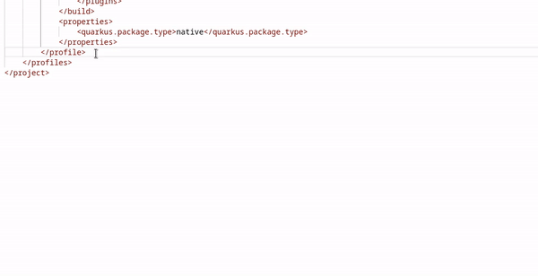
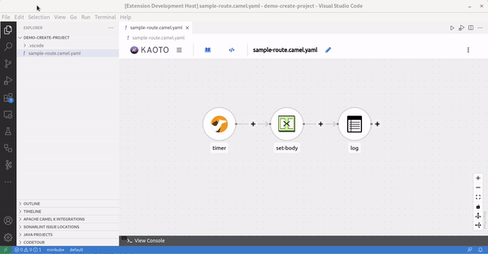
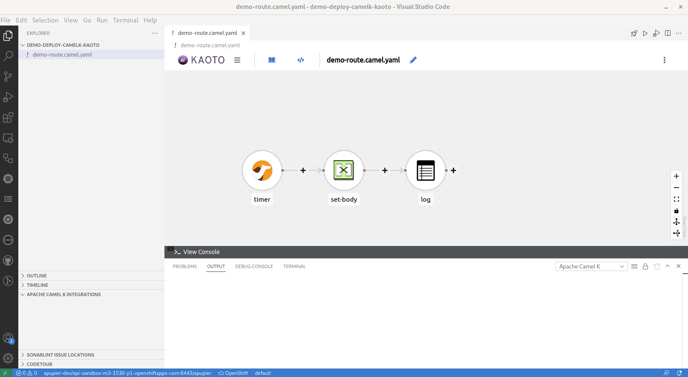
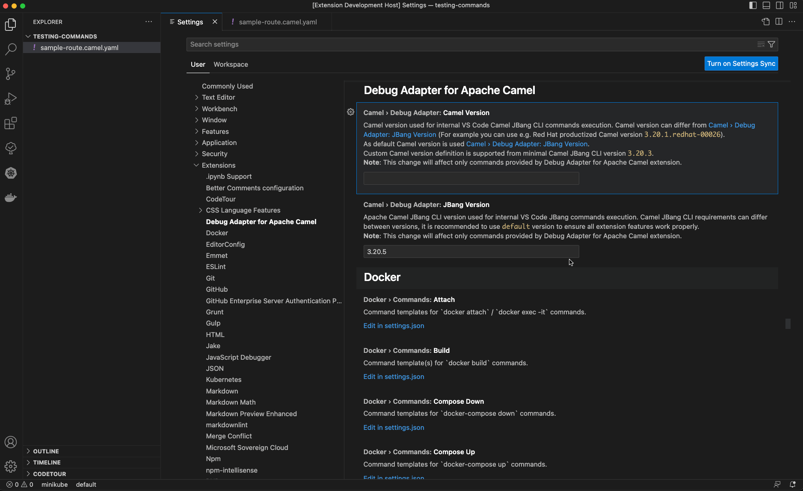

There are new releases of 3 VS Code extensions:

- [Language support for Apache Camel](https://github.com/camel-tooling/camel-lsp-client-vscode/blob/0.9.0/Changelog.md#090) 0.9.0
- [Debug Adapter for Apache Camel](https://github.com/camel-tooling/camel-dap-client-vscode/blob/0.8.0/Changelog.md#080) 0.8.0
- [Tooling for Apache Camel K](https://github.com/camel-tooling/vscode-camelk/blob/0.0.34/Changelog.md#0034) 0.0.34

# Version upgrades

Notable Camel related version upgrades:

- Update Kamelet Catalog from 3.20.4 to 3.21.0
- Update default Camel Catalog version from 3.20.5 to 3.21.0
- Update default Camel version used for Camel JBang from 3.20.5 to 3.21.0
- Update default Camel K runtime version from v1.11.0 to v1.12.1

# New features

## Completion for Camel Quarkus debug profile in pom.xml

It helps to configure a Camel on Quarkus application to use the Camel Route Textual debugger.

For an example of the whole process to use the Camel debugger with a Camel on Quarkus project, see [this video](https://youtu.be/uCE8VG5ZrxM).

## Commands to create Camel on Quarkus and SpringBoot project

Two commands have been created to create Camel projects:

* `Camel: Create a Camel Quarkus project`
* `Camel: Create a Camel on SpringBoot project`

This first iteration is coming with a minimal configuration. Only the GroupID, ArtifactID and version of the new project is asked to the end-user. In case, there are some Camel routes at the root of the workspace, they are copied at the correct place in the created project.

## Quick menu action on editor title to Deploy Integration with Apache Camel K

Previously, it was possible to deploy an integration with Camel K using command palette, contextual menu from the Explorer or a codelens in textual editor. A quick action has been added to the editor. It is very convenient when the editor used is a graphical one.

## Settings for specifying the Camel version to run integrations with Camel JBang CLI

Previously, it was reusing the version of Camel Jbang version, it is now possible to also provide the Camel version.

# What's next

It is planned to publish videos leveraging the new features in a more global scenario. Stay tuned and follow [Demo of Red Hat Integration and Apache Camel Tooling playlist](https://www.youtube.com/playlist?list=PLU-T8l-XOWOPjrXPojx2WDSegigcNzKs4).

Please provide feedback and ideas with your preferred channel:

* [Zulip #camel-tooling channel](https://camel.zulipchat.com/#narrow/stream/258729-camel-tooling)
* [VS Code Language support for Camel GitHub issues](https://github.com/camel-tooling/camel-lsp-client-vscode/issues)
* [VS Code Debug Adapter for Camel GitHub issues](https://github.com/camel-tooling/camel-dap-client-vscode/issues)
* [VS Code Tooling for Camel K GitHub issues](https://github.com/camel-tooling/vscode-camelk/issues)
* [Red Hat bugtracker FUSETOOLS2](https://issues.redhat.com/browse/FUSETOOLS2)
