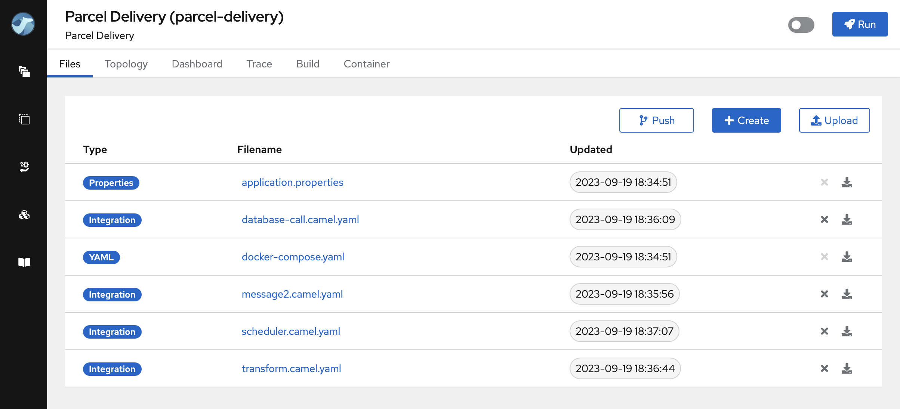
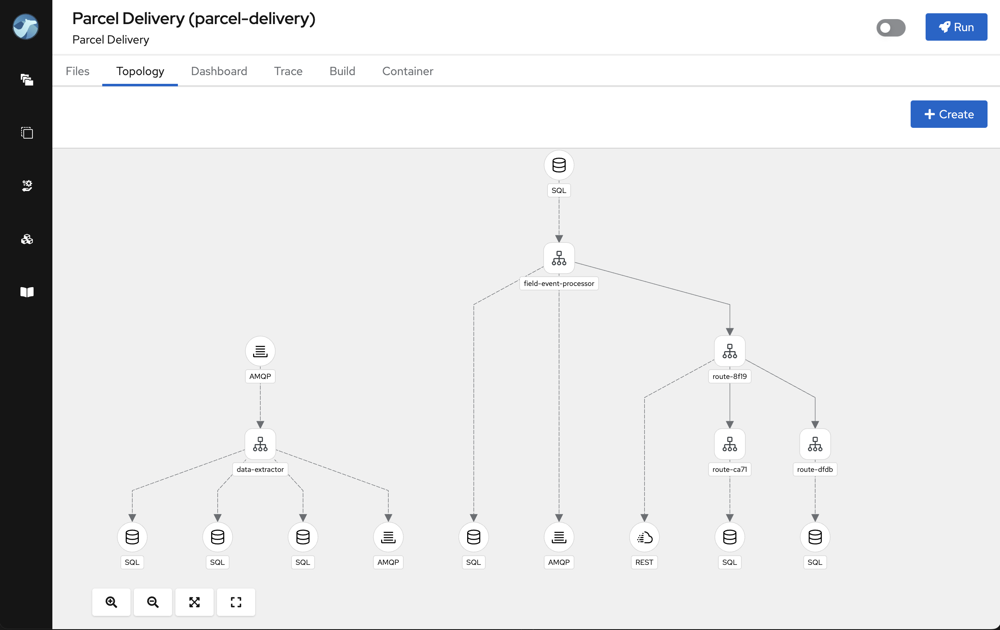

We are delighted to unveil Apache Camel Karavan 4.0.0. This release introduces a range of new features, enhancements and updates, making integration development more versatile and user-friendly.

Here are the key highlights of this release:

## Enhanced Platform Support

With this release, Apache Camel Karavan expands its compatibility across multiple platforms, offering developers greater flexibility in integration deployment. Karavan 4.0.0 is now compatible with the following platforms:

1. **Docker (New!)** - The primary benefit of utilizing Docker is to reduce infrastructure complexity, thereby speed-up platform utilization and accelerating adoption.

2. **Kubernetes** - Harness the power of Kubernetes for orchestrating your integrations with simplicity, ensuring scalability and resilience.

3. **OpenShift** - Benefit from the capabilities of OpenShift to securely manage and deploy your integrations in a enterprise environment.

## Project Topology View

A picture is worth a thousand words, and in the world of integration, clarity is key. In this release, we introduce the new Project Topology view, which provides a top-level overview of integrations within your project. This visualization helps you understand the structure and connections of your integrations at a glance, improving project management and collaboration.

When joining existing projects, integrators may find themselves sifting through numerous integration routes scattered across multiple files. Understanding the project's objectives and what has been implemented can be quite challenging. 

The topology view, however, provides a clear overview of the project's primary integration components, including external connections, routes, rest services and connections between routes. This view greatly assists in grasping the project's core concept and purpose.

## Streamlined Build Process

We recognize the importance of a straightforward development process. With Karavan 4.0.0, we introduce a configurable shell script located within your integration project's repository. This script simplifies the build process, making it more convenient and adaptable to your project's specific requirements.

## Camel-main

[Camel-main](/components/4.0.x/others/main.html) (aka standalone) runtime became the primary runtime implementation in this release. Its appeal lies in its pure Apache Camel nature, which requires no external dependencies/runtimes or additional configurations, thus reducing complexity and streamlining your integration projects. You can focus on building robust and efficient integrations without the burden of managing complex runtime environments. It aligns perfectly with the philosophy of Apache Camel Karavan — making integration development straightforward and efficient.

## Version Updates

To ensure your integrations stay up to date with the latest technologies, Apache Camel Karavan 4.0.0 includes updates to various components:

1. Camel 4.0.0 - Embrace the latest version of Apache Camel, featuring new capabilities and enhancements to elevate your integration capabilities.

2. Kamelets 4.0.0 - Keep up to date with Kamelets, which simplify connectivity to a wide range of data sources and services.

3. Jkube 1.14.0 - Stay in sync with the latest version of Jkube, an essential tool for Java developers working with Kubernetes deployments.

This release represents a significant leap forward in simplifying integration development and deployment, ensuring compatibility with contemporary platforms and technologies. We trust that these improvements will empower you to create seamless integrations and elevate your overall development experience.

To kickstart your integration projects, please use [Karavan Documentaion](https://github.com/apache/camel-karavan/tree/main/docs)

We appreciate your continued support for Apache Camel Karavan, and we eagerly await your feedback and contributions as we continue to evolve and enhance the integration landscape.

**Happy integrating!**