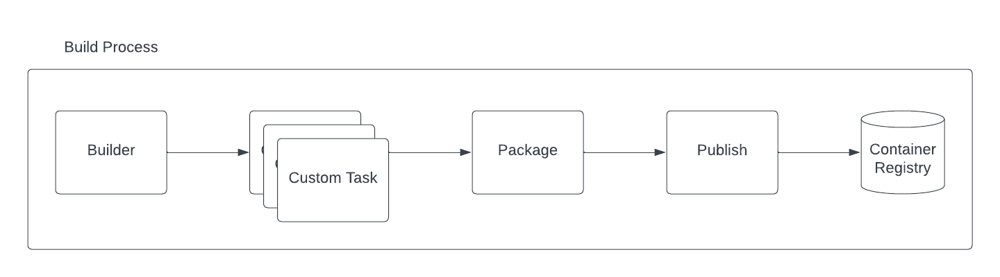

Apache Camel community is happy to announce the general availability of **Camel K 2.1**. We have worked on the introduction of a lot of new exciting feature that will further **simplify the deployment and management of Camel application on Kubernetes**. Let's see what you should expect from this release.

## Default Camel 4 runtime

As **Camel 4** is out since some time already, we've moved our default runtime to Camel K Runtime version 3.2.0, which is based on Camel Quarkus 3.2.0 and Camel 4. From now on, by default you will use this runtime version.

## More enterprise ready build

One of the main goal of 2023 roadmap was to make our **build system "enterprise ready"**. In this release we've worked a lot in that direction.

The pipeline concept we have introduced in version 2.0 is now more complete with the split of the build tasks into a proper `build` and a `package` which is in charge to prepare the context for a following publish with one of the strategies chosen by the user. The result is illustrated in the following diagram:


_Camel K Pipeline tasks_

This gives you more flexibility by letting you customize the build before the binaries are taken by the package task. Beside this change we have introduced a lot of advanced configuration in the Builder trait. Each custom task you will define, can be configured with limits and requests resources: `builder.tasks-request-cpu`, `builder.tasks-request-memory`, `builder.tasks-limit-cpu`, `builder.tasks-limit-memory`.
Another interesting option we have introduced, was to let the user disable the Incremental Image Build option via `builder.incremental-image-build`. It is not advisable, but there could be situations were you don't want your Integration inherit from existing IntegrationKits.

Always related to the builder, you will find now the presence of `builder.maven-profile` option. With this one you can provide a customized [Maven profile](https://maven.apache.org/guides/introduction/introduction-to-profiles.html#profiles-in-poms) to your build. This is cool if you want to influence the build phase in any manner.

Next thing, we have removed the dynamic builder catalog which will give the operator more stability, getting rid off one moving part (which may always fail for any reason). It was part of a more general Quarkus Native refactoring where we have also introduced a series of advanced configurations. From now on, in the Quarkus trait you can specify the `quarkus.native-builder-image` and the `quarkus.native-base-image` to respectively override which is the container image you want to use for the native build and which is the one you want to use in your Native integration.
We have also simplified the configuration required to run either a JVM or Native Quarkus application by introducing the trait parameter `quarkus.build-mode` which simply accept `jvm` or `native` values. The previous `quarkus.package-type` (now deprecated) was exposing implementation details not really user friendly (who of you can tell what a `fast-jar` is!?).

Our friends at Tekton have onboarded the [Camel K task in the Tekton Catalog](https://hub.tekton.dev/tekton/task/kamel-run). From now on, Camel K is a first class citizen in Tekton and we do support the task. Feel free to start using it in your CICD pipelines. Our internal pipeline may be limited when you're dealing with complex CICDs.

More on the builder side it is the introduction of **JIB as an additional builder strategy** and the deprecation of Buildah and Kaniko. As you may understand, we cannot really provide support for all existing technologies. In the future we may even deprecate Spectrum, letting Jib being the default choice. In any case, the flexibility of the pipeline will give you the possibility to use any custom publishing strategy on your own.

## Restricted security context

Security is something we have at hearth. From now on, by default, the operator and the Integration Pods will run with a **restricted security context**.

## Registry configuration and error condition

One of the questions we receive more from newbies is about failure when they start the Camel K Operator for the first time due to registry errors. This was never directly exposed, but, from now on, you will be able to see any error related to the registry. See this example:

```yaml
  status:
    conditions:
...
    - lastTransitionTime: "2023-09-29T13:53:17Z"
      lastUpdateTime: "2023-09-29T13:57:50Z"
      message: 'integration kit default/kit-ckbddjd5rv6c73cr99fg is in state "Error".
        Failure: Get "https://1.2.3.4/v2/": dial tcp 1.2.3.4:443: i/o timeout; Get
        "http://1.2.3.4/v2/": dial tcp 1.2.3.4:80: i/o timeout'
      reason: IntegrationKitAvailable
      status: "False"
      type: IntegrationKitAvailable
...
    phase: Error
```
Shoot! I forgot to change the registry IP placeholder!

## Kamelet runtime

Kamelet were originally conceived as a Camel K thing. We have substituted the old implementation with something **compatible with the Camel** framework. Once you run an Integration with a Kamelet, from now on you can see a Kamelet bundle Configmap attached to that Integration.

## Platform traits cannot be disabled

In the past there was the possibility to disable platform traits as well. But, does it make sense to disable them? We think it doesn't. Reason why we have removed the possibility to disable such traits.

## Configmap/Secret change, Integration hot reload

This one feature was request since long time. Now it's live! Use trait option `mount.hot-reload=true` and any Configmap or Secret you have mounted to be used by the Integration will restart the application once Kubernetes detect a change in such values. This is great for secret rotations. You don't want your SRE to do something that a machine can do, right!?

## Vault secret configuration

We have also worked to make the **Vault configuration more secure**, by having the ability to use a Kubernetes Secret (or Configmap) instead of a plain text.

## Camel K offline installation

An important effort in this version release was done to analyze how we can possibly provide an **offline installation**. It turns out that there is not a direct way to do that as Camel K is one of the component of the platform, but not the only one. However, we have provided an [offline installation](/camel-k/next/installation/advanced/offline.html) guideline that should help you in reaching the goal, given that you need to analyze on your own the overall installation (Kubernetes distribution included).

## Go Vulnerability check

As said before, security is something important for us. For this reason we have introduced a **vulnerability check** which will alert us if any dependency we use is affected by any CVE.

## Dependencies upgrades

Quite a few changes here to reflect. First of all, we are now building with Golang version 1.20. We have moved to **Kubernetes version 1.27.4** (and related dependencies). We have refreshed other dependencies as well, included KNative which is now supported to version 1.11.

## API changes

We have already provided some note about changes in traits. Beside that, it is important to know that we have deprecated v1.Pipe `.spec.Integration` field. This one was used in the past to allow configuring certain low level details of the Integration generated by the Pipe. However, it entails too much implementation details that should not be exposed at this level.

## Documentation

We have worked a lot trying to make our documentation more structured and simpler to read. We have also provided many entries. Among them we'd like to mention the most important ones which may be required to have a proper **production fine tuning**:

* [Network Architecture](/camel-k/next/installation/advanced/network.html)
* [Configuring Maven](/camel-k/next/installation/advanced/maven.html)
* [Configuring Registry](/camel-k/next/installation/registry/registry.html)
* [Camel K build tuning](/camel-k/next/installation/advanced/build-config.html)
* [Kamelets Distribution model](/camel-k/next/kamelets/kamelets-distribution.html)
* [Camel K Integration troubleshooting](/camel-k/next/troubleshooting/troubleshooting.html)

# Thanks

Thanks a lot to our contributors and the hard work happening in the community. Feel free to provide any feedback or comment using the Apache Camel available channels.
