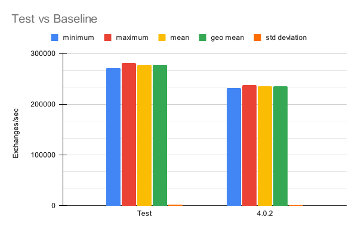
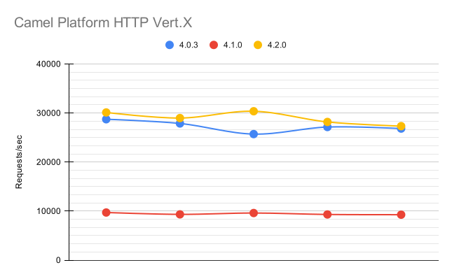
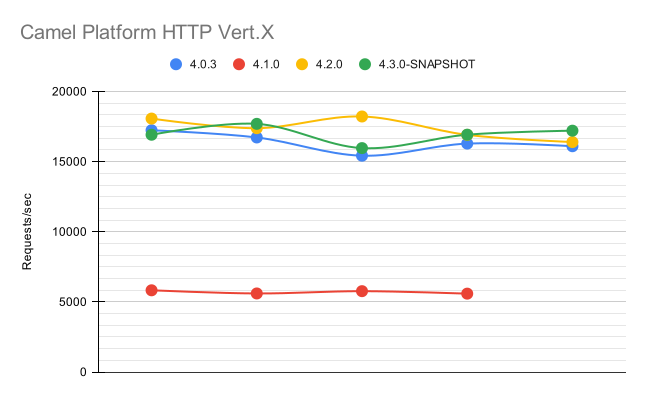

# Introduction

Apache Camel has [always been committed to delivering top-notch performance](/blog/2023/05/camel-4-performance-improvements/). As the development of Camel 4 progressed, so did the dedication to enhancing its performance. In this blog post, we'll explore the advances made in the pursuit of efficiency, focusing on key improvements introduced between Camel 4.1 and 4.2, with a few important improvements for the upcoming 4.3.

# Camel 4.1: A Leap Forward in Type Conversion

One of the notable enhancements in Camel 4.1 was the introduction of a new type converter. While being slightly more strict, this converter proved to be simpler to maintain and offered a modest boost in speed. This change was not without its challenges, as some minor issues and bugs surfaced in the wake of these adjustments. However, the development community swiftly addressed these concerns, ensuring a smoother experience for users.

# Camel 4.2: Optimizing for Peak Performance

Building on the momentum of Camel 4.1, version 4.2 brought about significant optimizations, particularly in the realm of type converter cache handling and resolution. The community also applied strategic micro-optimizations, designed to assist the JIT Compiler in effectively inlining code. Furthermore, attention was given to the platform-http-vertx component hot path, where inefficiencies were identified and rectified.

# Quantifying the Gains: Performance Metrics

The tangible results of these optimizations are evident in the performance improvements across various Camel EIPs (Enterprise Integration Patterns).

Comparing Camel 4.1 and 4.2 to their predecessors, it's clear that aggregator, content-based route, and filter EIPs run notably and consistently faster on the newer versions. For instance, the image below shows the result of just one of thousand of tests executed.

In this test, Camel version 4.2.0 processed exchanges about 18% faster than Camel 4.0.2 when doing so through a content-based router.

# Camel Platform HTTP Vert.x: A Highlight in Efficiency

The optimizations within the Platform HTTP Vert.x component delivered measurable performance gains.

In our tests, the throughput increased by approximately 5% from Camel 4.0 to 4.2.

With the current development code, there are indications of further gains, which are likely to be caused by a newer version of Vert.X:

The average response time exhibited a progressive decline: from 0.367ms in 4.0.3, to 0.345 ms in 4.2.0, stabilizing around the same value for the current development version with an average of 0.348 ms.

The numbers for Camel 4.1 show a significant decrease in performance due to a bug that caused a cache miss when trying to resolve a type converter. This bug was fixed in 4.2.0.

# Testing: Ensuring Reliability

The reliability of these performance enhancements was validated through rigorous testing methodologies. For core components, the [Camel Load Tester](https://github.com/orpiske/camel-load-tester) project was employed, ensuring a comprehensive evaluation of the framework's capabilities. The testing of Platform HTTP Vert.x components, on the other hand, leveraged [Hyperfoil](https://hyperfoil.io/), a powerful benchmarking tool.

Micro-optimizations, scattered throughout the codebase, underwent [meticulous scrutiny](https://github.com/apache/camel-performance-tests) using [JMH (Java Microbenchmark Harness)](https://github.com/openjdk/jmh/). This thorough testing approach guarantees that each optimization contributes positively to the overall performance without introducing unforeseen issues.

All of our tests were performed executed using Java 17.0.9, running on Red Hat Enteprise Linux 9.3. The test system was a PowerEdge R640 with 2 Intel Xeon Silver 4116 CPUs, each with 12 cores, and 192 Gb of memory.

# Looking Ahead: The Evolution Continues

As Camel progresses towards version 4.3.0, the commitment to performance remains unwavering. The community continues to explore innovative ways to enhance speed, efficiency, and overall user experience. Whether it's refining existing features or introducing new optimizations, Apache Camel is dedicated to being at the forefront of integration frameworks, empowering developers to build seamless, high-performance applications.

In conclusion, the journey of Apache Camel is not just about feature-rich functionality but also about delivering a robust and performant framework. The advancements in Camel 4.1 and 4.2, coupled with the promising improvements in the upcoming 4.3.0 release, underscore the project's commitment to excellence. As users embrace these updates, they can look forward to a more responsive and efficient integration experience with Apache Camel.