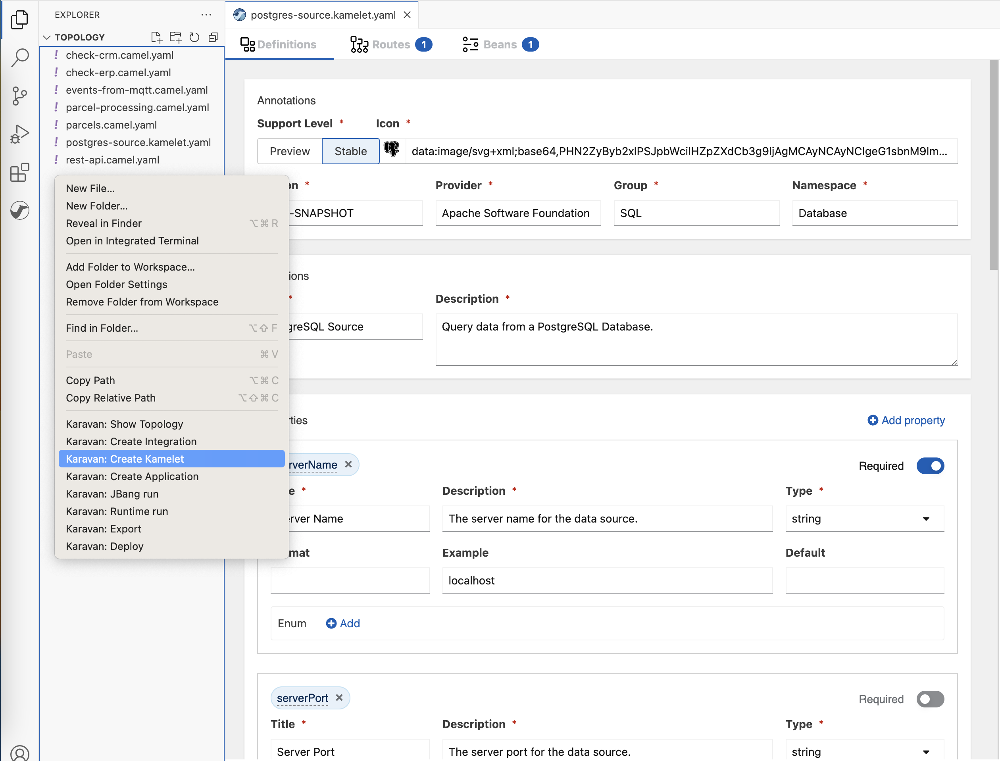
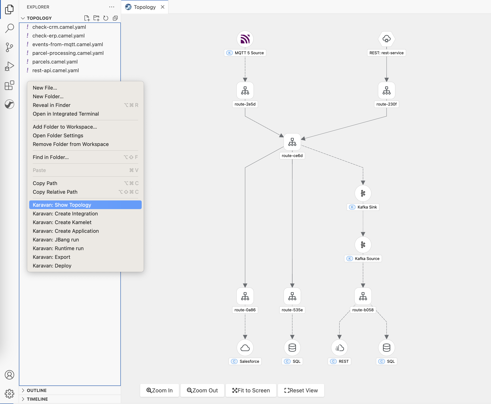

Apache Camel Karavan 4.1.0 has been launched!

## Custom Kamelets Development

With this release, Apache Camel Karavan is featuring the addition of Custom Kamelet Developmenet.

Kamelets allows users to connect to external systems via a simplified interface, hiding all the low level details about how those connections are implemented.

Furthermore, apart from simplifying connections, Kamelets can package reusable integration logic, making it easily deployable in various projects.

With this release, Karavan now offers full-fledged Kamelet development support right at your fingertips:

- Visual Design Kamelets Routes and Beans
- Kamelet Properties and Dependencies
- Copying from existing Kamelets for quick and efficient reuse.

## Project Topology View in VS Code

A picture is worth a thousand words, and in the world of integration, clarity is key. In this release, we introduce the new Project Topology view, which provides a top-level overview of integrations within your project. This visualization helps you understand the structure and connections of your integrations at a glance, improving project management and collaboration.

When joining existing projects, integrators may find themselves sifting through numerous integration routes scattered across multiple files. Understanding the project's objectives and what has been implemented can be quite challenging. 

The topology view, however, provides a clear overview of the project's primary integration components, including external connections, routes, rest services and connections between routes. This view greatly assists in grasping the project's core concept and purpose.

## Version Updates

Apache Camel Karavan 4.1.0 includes updates to various components:
1. Camel 4.1.0 
2. Kamelets 4.1.0 

To kickstart your integration projects, please use [Karavan Documentaion](https://github.com/apache/camel-karavan/tree/main/docs)

We appreciate your continued support for Apache Camel Karavan, and we eagerly await your feedback and contributions as we continue to evolve and enhance the integration landscape.

**Happy integrating!**