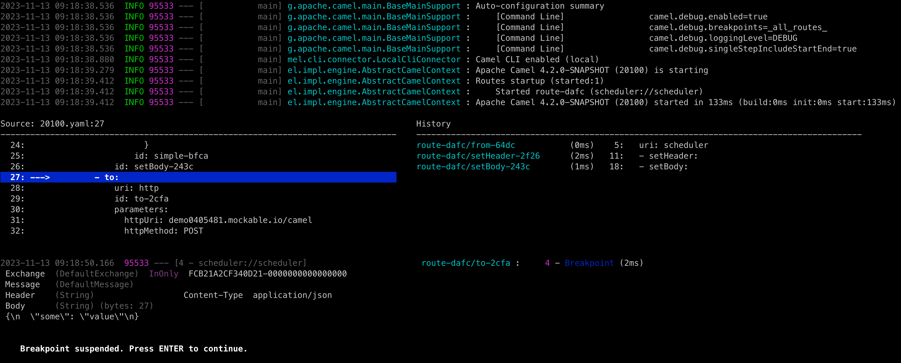

Apache Camel 4.2 (non LTS) has just been [released](/blog/2023/11/RELEASE-4.2.0/).

This release introduces a set of new features and noticeable improvements that we will cover in this blog post.

## Java 21

This is the first release that officially supports running on Java 21.

## Camel Core

We continue to fine-tune the new type converter that was introduced on Camel 4.1.0. This version brings a few cleanups to the code, some fixes to the type converter resolution logic, caching improvements and micro optimizations to the type matching algorithm.

This release also comes with a additional changes to cleanup, simplify and organize internal APIs provided by the CamelContext.

The Java DSL now supports String text-blocks when defining Camel URIs, as shown:

```
from("""debezium-postgres:customerEvents
        ?databasePassword={{myPassword}}
        &databaseDbname=myDB
        &databaseHostname=myHost
        &pollIntervalMs=2000
        &queryFetchSize=100""")
    .to("kafka:cheese");
```

You can now use a bean method call with property placeholders.

For example, a bean can be used to return the name of a topic to use in a Kafka route:

```
from("kafka:{{bean:myBean.computeTopic}}")
  .to("bean:cheese")
```

In this example Camel will invoke the method `computeTopic` on the bean with id `myBean` when the route is created.

## Camel Main

You can now configure the following in `application.properties`:

- Global SSL options using `camel.ssl.`
- Camel route debugger options using `camel.debug.`
- Camel Open Telemetry options using `camel.opentelemetry.`

## DSL

The kebab-case syntax in YAML DSL has been deprecated and Camel will now report a WARN if detected.
You should use Camel Case of course ;) For example `set-header` should be `setHeader`.

## Camel JBang (Camel CLI)

We have continued investing in Camel JBang, and this time we introduce the new DSL `debug` command, that is a Camel
route debugger from the CLI. This makes it very easy and quick to run and debug your Camel routes and better
see and understand what happens.



We plan to make a separate blog and video showing the debug command in action.

The Camel JBang now supports Java Agents when exporting to `camel-main` runtime. This makes it easy for example to
include Open Telemetry Java Agent JAR in the export, so you can easily build, package and run with the agent readily available.

We also made Camel JBang work better on Windows. However, we are interested in feedback from Windows users.

The `run clipboard.yaml` command (run from clipboard) now supports `--dev` mode for reload on changes (i.e. you can copy to clipboard your updates).

We have also improved support for migrating older Spring XML (classic Spring XML files) or Camel Karaf projects (OSGi blueprint XML files)
to Camel 4 with the `transform` command. A blog post is currently in the writing about this topic.
However, this effort, lead us to implement _best effort_ running existing Maven based projects via `camel run pom.xml`.
The need for this is to assist during migrating those older projects, but can be used for other purposes in the future.

## Spring and Spring Boot

Upgraded to latest [Spring Boot 3.1.5](https://spring.io/blog/2023/10/19/spring-boot-3-1-5-available-now) release.

Added support for Spring beans using `@Primary` for auto-wiring. This allows Camel to use the primary bean when there are multiple
bean instance for the same Java type (such as database connections).

## Rest DSL

You can now use wildcards (`*`) in Rest DSL to handle a wider range of requests from the same API service:

```
rest("myapi")
  .get("user/*")
  .to("direct:userStuff")
```

This will then let Camel service all HTTP GET requests that starts with `myapi/user/` such as `myapi/user/123`, `myapi/user/123/account/zip`, etc.

## Miscellaneous

The `camel-azure` can now send binary files to Azure Service Bus.

The `camel-micrometer` can be configured in backwards naming mode (Camel 3.20 or older). This allows to keep using old naming style,
that monitoring systems have been pre-configured to use.

The `camel-platform-http-vertx` now supports streaming big HTTP payloads directly if `useStreaming=true` has been set.

The `camel-dynamic-router` component has been refactored to use Camel's `MulticastProcessor` as its engine instead of custom processor.

The `camel-kafka` consumer will now fail on startup if you have an invalid broker port number, that previously would make Kafka
attempt endless reconnection.

The `camel-http` component now supports OAuth 2.0 client authentication.

## New Components

- `camel-azure-schema-registry` - Azure Schema Registry Component for utilities to deal with authentication.
- `camel-smb` - Receive files from SMB (Server Message Block) shares.

## Upgrading

Make sure to read the [upgrade guide](/manual/camel-4x-upgrade-guide-4_2.html) if you are upgrading from a previous Camel version.

## Release Notes

You can find more information about this release in the list of JIRA tickets resolved in the release:

- [Release notes 4.2](/releases/release-4.2.0/)

## Roadmap

The following 4.3 release is planned to support Spring Boot 3.2.

This release is likely to be the next LTS release in January 2024. But we may release it as a non-LTS
release in December and then let Camel 4.4 be the LTS release for January 2024.

