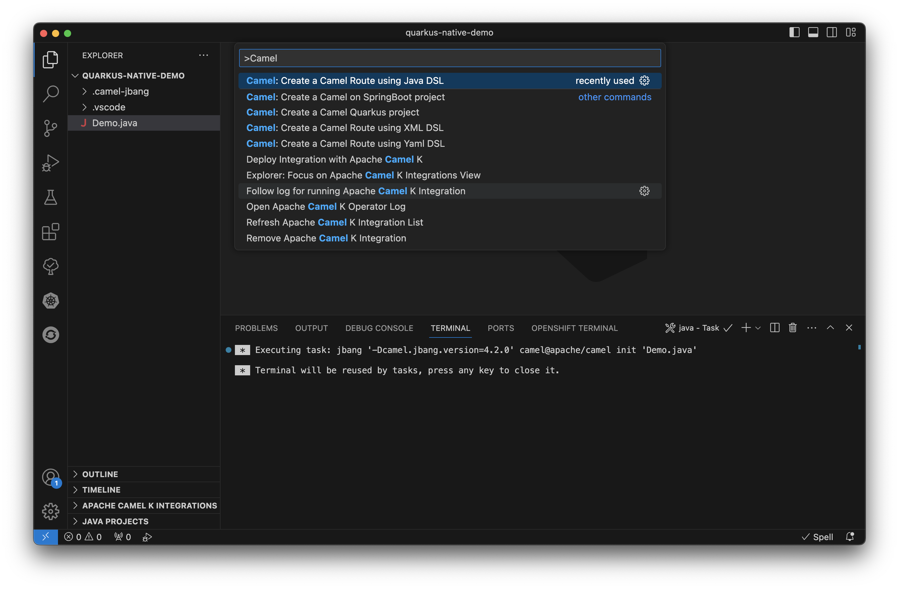

## Prerequisites

- [Visual Studio Code](https://code.visualstudio.com/download)
- [GraalVM](https://www.graalvm.org/downloads/) for JDK 20+
- [Maven](https://maven.apache.org/download.cgi) 3.9.3+
- [Extension Pack for Apache Camel by Red Hat](https://marketplace.visualstudio.com/items?itemName=redhat.apache-camel-extension-pack)

## Step-by-Step



These steps provide a structured approach to generating, setting up, building, and debugging a Camel Quarkus native application within the VS Code environment.

#### Generate Example Camel Route in VS Code Workspace

Within your clean VS Code workspace, initiate the creation of an exemplary Camel route using the command `Camel: Create a Camel Route using Java DSL`. This sets the foundation for your project's routing structure.

#### Transform the generated Camel Route into a Camel Quarkus Project

Utilize the command `Camel: Create a Camel Quarkus project` to generate a project based on the previously created Camel route. This action transforms your route into a robust Camel Quarkus project, ready for development.

#### Cleanup

This step ensures a clean structure. Remove the original Camel route file from the root of the newly generated project.

#### Build Camel Quarkus Native Application

Execute a predefined task from `.vscode/tasks.json` to initiate the build process for your Camel Quarkus Native application. This predefined task streamline the building procedure, ensuring a smooth and debug-ready build. You can run your tasks using VS Code Quick Open (`Ctrl/CMD + P`) by typing `task <command name>`.

#### Launch Application using Predefined Configuration

Navigate to the `Run and Debug` view within VS Code, where debugging configurations and controls are accessible. Execute the predefined launch configuration to initiate the start of Camel Quarkus Native application. This step seamlessly initiates the execution of your application, readying it for debugging.

#### Set Breakpoint in Camel Route

Place a breakpoint within the Camel route to interrupt the execution at a specific point. This move allows for detailed inspection and debugging of the application's behavior precisely where needed.

## What's next

Feel free to provide feedback and ideas using your preferred channel:

- [Zulip #camel-tooling channel](https://camel.zulipchat.com/#narrow/stream/258729-camel-tooling)
- [Language support for Apache Camel - GitHub issues](https://github.com/camel-tooling/camel-lsp-client-vscode/issues)
- [Debug Adapter for Apache Camel - GitHub issues](https://github.com/camel-tooling/camel-dap-client-vscode/issues)
- [Red Hat Issues Tracker](https://issues.redhat.com/browse/FUSETOOLS2)
