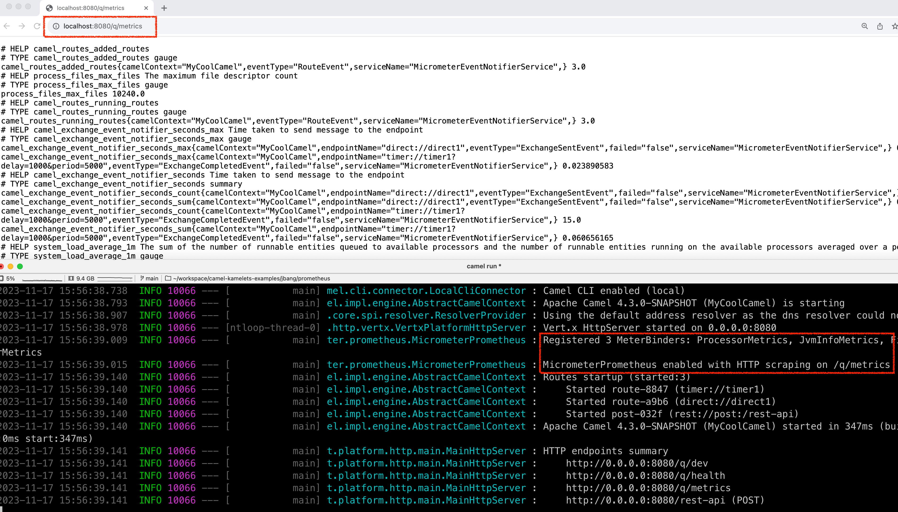
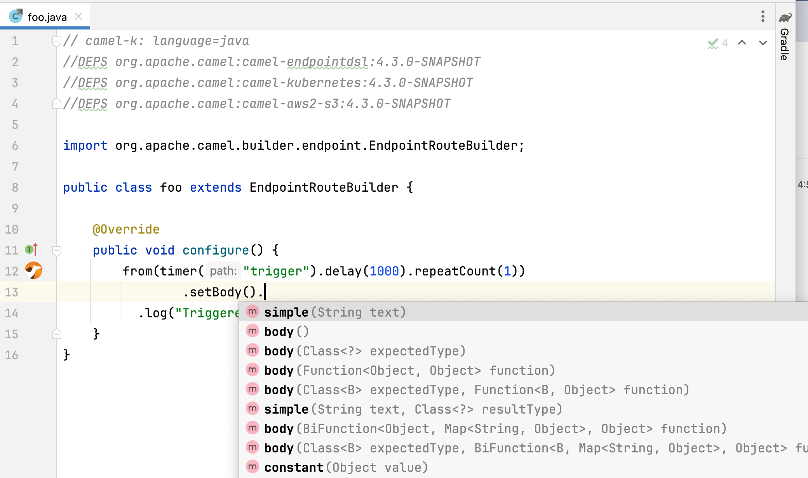

Apache Camel 4.3 (non LTS) has just been [released](/blog/2023/12/RELEASE-4.3.0/).

This release introduces a set of new features and noticeable improvements that we will cover in this blog post.

## Camel Core

Added basic support for Java 21 virtual threads. Note this is experimental and there is more work to complete
to have full support for virtual threads. More details at [threading model](/manual/threading-model.html). 

The simple language can now work better with JSon and XML with inlined jq/jsonpath/xpath functions. This
can be used for basic message transformation. You can find an examples at:

- [json transformation](https://github.com/apache/camel-kamelets-examples/tree/main/jbang/json-transform)
- [xml transformation](/components/next/languages/xpath-language.html#_transforming_a_xml_message)

We added `debugStandby` option to allow route debugging a running Camel application on demand. Being in standby mode
has no overhead and only when debugging is activated then Camel runs in debugging mode, which can then be deactivated
to go back to run in normal mode.

## Camel Main

Added support for Prometheus in the new `camel-micrometer-prometheus` component, that makes it possible to expose
metrics in Prometheus format, as shown below:



This can be configured in `application.properties`:

- Micrometer and Prometheus options using `camel.metrics.`

## DSL

We added the following EIPs:

- `setHeaders` EIP to make it easier and less verbose to set multiple headers from the same EIP.
- `convertHeaderTo` EIP to make it easy to convert header value to a specific type.

The `throttler` EIP has been refactored to throttle based on concurrent requests instead of sliding window.

We improved configuring beans, that can now support builder beans, that are used to build the actual bean.
For example in the following YAML notice how the `builderClass` refers to class responsible for building the target bean:

```yaml
- beans:
    - name: myCustomer
      type: com.mycompany.Customer
      builderClass: com.mycompany.CustomerBuilder
      properties:
         name: "Acme"
         street: "Somestreet 42"
         zip: 90210
         gold: true
- from:
    uri: "timer:yaml"
    parameters:
      period: "5000"
    steps:
      - bean:
          ref: myCustomer
          method: summary
      - log: "${body}"
```

The builder class is required to have a build method that Camel invokes. The name of the method is `build` by default.

To see more see the following examples:

- https://github.com/apache/camel-kamelets-examples/tree/main/jbang/bean-builder
- https://github.com/apache/camel-kamelets-examples/tree/main/jbang/bean-inlined-code

## Camel JBang (Camel CLI)

We have continued investing in Camel JBang, and this time we have some great new stuff in the release.

We have added support for using JBang style for declaring dependencies by using `//DEPS ` code comments, as shown
in the following Java file:

```java
//DEPS org.apache.camel:camel-bom:4.3.0@pom
//DEPS org.apache.camel:camel-endpointdsl
//DEPS org.apache.camel:camel-kubernetes
//DEPS org.apache.camel:camel-aws2-s3

import org.apache.camel.builder.endpoint.EndpointRouteBuilder;

public class foo extends EndpointRouteBuilder {

    @Override
    public void configure() {
        from(timer("trigger").delay(1000).repeatCount(1))
            // something that may use Java APIs from Kubernetes
    }
}
```

You can now also easily use JBang way of editing source code in your favorite editor, such as `jbang edit -b foo.java`,
shown in the screenshot below:



You can find an example at [jbang-edit example](https://github.com/apache/camel-kamelets-examples/tree/main/jbang/jbang-edit).

Another new functionality is the _live message transformer_ with the new `camel transform message` command.
You can find detailed information in the [camel-jbang docs](/manual/camel-jbang.html#_transforming_message_data_mapping),
a basic example is here [json transformation](https://github.com/apache/camel-kamelets-examples/tree/main/jbang/json-transform), and we have a [video recording on YouTube](https://www.youtube.com/watch?v=ntVRSBcBBLU). 

We have improved the `camel export` to avoid starting some services that was not needed, which could potentially
cause the export to fail or take longer time.

Camel JBang now accurately reports resolved vs download for dependency resolution. Previously it may report downloading
but the dependency was resolved from local disk.  You can also run in `--verbose` mode that shows verbose details
for dependency resolution that can be useful for troubleshooting.

Camel JBang export to `camel-main` can now configure authentication for container image registries.

## Spring and Spring Boot

Upgraded to latest [Spring Boot 3.2.0](https://spring.io/blog/2023/11/23/spring-boot-3-2-0-available-now) release.

The health checks in Camel now incorporate with the Spring Boot way of doing readiness and liveness check.

## SBOM

Starting from releases 4.0.3 and 4.2.0, we started to publish JSON and XML SBOM in the Camel website download section. An SBOM is a “software bill of materials” and in recent years has emerged as a key building block in software security and software supply chain risk management. An SBOM is a nested inventory, which means you could have an overview of all the components of your software.

In combination with other tools, the SBOM could be analyzed against the CVEs Database and anyone could be able to have a security analysis always up-to-date. We plan to include SBOMs in all of our releases and the work has already started. 

This is of particular interest for a project like Camel because we are using a large number of dependencies (direct and transitive) in our projects and it’s really hard to track everything. From the community perspective, this could also be a good entry point for new contributors to periodically have a look at new CVEs and try to fix them.

## Miscellaneous

The `camel-hdfs` component has been deprecated and planned for removal soon. The Apache Hadoop project is unfortunately
not offering client JARs with a limited set of dependencies, which leads to a giant dependency set that have many
old versions that has known CVEs.

The `camel-file` and `camel-ftp` components can now also write SHA checksum file, when uploading files.

The `camel-jetty` component has been upgraded from Jetty 10 to 12.

The `camel-openapi-java` now better support both OpenAPI 3.0 and 3.1 at the same time.

Components such as `camel-ftp` and others that can take a long time on first poll, will now report as ready
more eager in readiness check. Before they would become ready after first poll completed; this could cause
problems if downloading a large FTP file takes a long time, causing the readiness check to fail on startup.

Upgraded many 3rd party dependencies to latest release at time of release.

## New Components

- `camel-aws-config` - Manage AWS Config service.
- `camel-elasticsearch-rest-client` - Perform queries and other operations on Elasticsearch or OpenSearch (uses low-level client).
- `camel-kubernetes-cronjob` - Perform operations on Kubernetes CronJob.
- `camel-micrometer-prometheus` - Camel Micrometer Prometheus for Camel Main
- `camel-smb` - Receive files from SMB (Server Message Block) shares.

## Upgrading

Make sure to read the [upgrade guide](/manual/camel-4x-upgrade-guide-4_3.html) if you are upgrading from a previous Camel version.

## Release Notes

You can find more information about this release in the list of JIRA tickets resolved in the release:

- [Release notes 4.3](/releases/release-4.3.0/)

## Roadmap

The following 4.4 release (LTS) is planned for February 2024.

