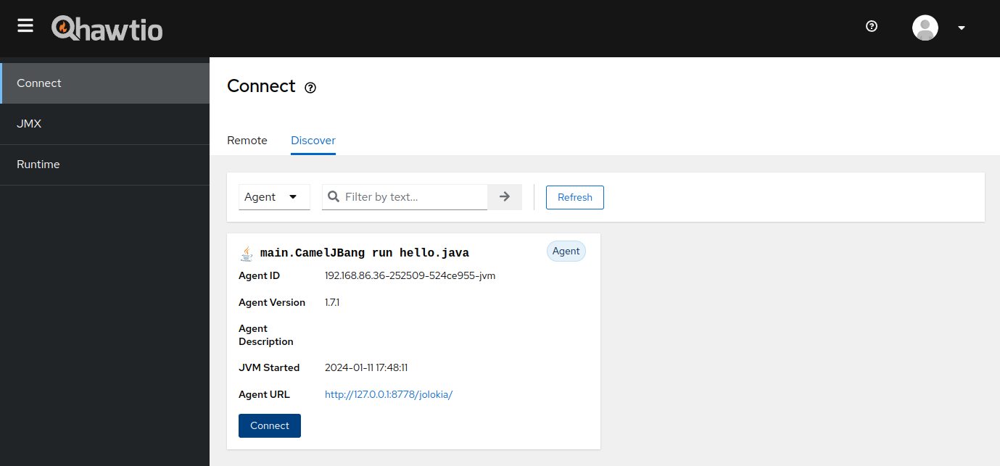

The Hawtio development team is really excited to announce the general availability of Hawtio 3.0.0 to the Apache Camel community!

[Hawtio](https://hawt.io/) is a classic tool for managing Java/JVM applications with a web UI. It has long been a core favourite among Java and Camel engineers as a web GUI management console for Java and Camel applications. However, it was based on stale JavaScript frameworks [^1], which made further enhancements and maintenance difficult. Hawtio has been still indispensable for the developers as there is no good alternative to the web-based JMX management console and JConsole only allows for very elementary application monitoring and management.

[^1]: Such as AngularJS 1.x and PatternFly 3.x.

The Hawtio development team was aware of the demand for Java developers and wanted to move to modern JavaScript frameworks, but it had been difficult to start because it would mean a complete re-implementation of the web UI part. Fortunately, we were able to start the rebooting project of next generation Hawtio last year and finally released [3.0.0 GA](https://github.com/hawtio/hawtio/releases/tag/hawtio-3.0.0) by the end of last year.

## Hawtio v3 highlights

So, what's Hawtio v3? Here are the highlights of the Hawtio v3 release:

**Frontend revamp:** \
While maintaining the basic UI look and functionality, the old JavaScript frameworks have been completely ditched in favour of the new ones: the frontend has been rebuilt with [React](https://react.dev/) and [PatternFly v4](https://www.patternfly.org/). By basing it on the new frameworks, we are now ready not only for security updates, but also for active contributions from the community who are familiar with the latest frontend technologies as well as the Java backend technologies.

**Maintaining functionality:** \
The appeal of Hawtio is a wealth of plugins customised for specific applications on top of the basic JMX management features. To ensure that the rebooting does not compromise its functionality, popular built-in plugins, such as Camel, Spring Boot, Quartz, and Logs plugins, have been migrated and reimplemented on the new console.

**New plugin system:** \
Hawtio has always been easy to extend by developing your own plugins, but in v3 the plugin system has been redesigned to comply with a new standard for micro frontends, [Webpack Module Federation](https://webpack.js.org/concepts/module-federation/). At the same time, a number of sample projects are available for interested users to easily try out the plugin development.

**New CLI:** \
Since the introduction of [JBang](https://www.jbang.dev/), the provision of a JBang-based CLI has become the new standard method for distribution in the Java ecosystem. Hawtio has been able to be launched from the Camel CLI (a.k.a. [Camel JBang](/manual/camel-jbang.html)), but starting with Hawtio v3, the JBang-based Hawtio CLI is introduced as the new distribution method replacing the previous `hawtio-app.jar`. It allows you to install and launch the latest Hawtio from the JBang catalog with a single command if you have JBang installed locally.

**Update on runtime support:** \
With the proliferation of microservices, application runtimes are becoming lighter and full-stack application servers are becoming less popular. To address such trends, in addition to Spring Boot runtime support, Hawtio v3 adds support for [Quarkus](https://quarkus.io/). On the other hand, in order to optimise our development resources, we have decided to discontinue distributions specialised for specific application servers (Karaf and WildFly), although we continue to offer a general WAR distribution which can be used on any web containers as before.

## Starting Hawtio v3 from Camel CLI

The Camel JBang CLI already has a nice `camel hawtio` command. [^2] We can expect that a future update will make Hawtio v3 default for the command, but meanwhile if it is still using the old v2 console, you can make it start the new Hawtio v3 from the CLI easily as follows: [^3]

[^2]: [Camel JBang - Using Jolokia and Hawtio](/manual/camel-jbang.html#_using_jolokia_and_hawtio)
[^3]: 3.0.0 has a problem with `camel hawtio`, so please use 3.0.1.

```console
camel hawtio --version=3.0.1
```

Let's see the complete steps from creating a new Camel route file with the CLI to viewing it on the Hawtio console.

First, open a terminal to create a Camel route file and run it:

```console
camel init hello.java
camel run hello.java
```

As a Camel developer, you should be already familiar with the steps so far. From here, open another terminal and attach the Jolokia agent to the `hello` route you have just run. You can then automatically recognise that route on Hawtio launched from the CLI.

```console
camel jolokia hello
camel hawtio --version=3.0.1
```

Once executed, a browser should automatically open and the Hawtio console should be visible at <http://localhost:8888/hawtio/>. Select the `Discover` tab in the `Connect` plugin. This will then discover a locally running Camel route with the Jolokia agent attached.



Now, if you press the `Connect` button, the Hawtio console should open in a new tab, where you can tweak the connected Camel route in various ways.

## What Camel plugin can do


Hawtio's enduring popularity among Camel engineers is due to the list of features you can do at runtime with it:

**Route visualisation (`Route Diagram`):** \
You can view the route definition of a running Camel route in a graphical diagram. Simple metrics information, such as the numbers of inflight and completed exchanges, is also displayed in the route diagram. With a browser, you can get a graphical view of the configuration of your Camel application without the need for any full-fledged development environment and developer plugins.

**Route definition source (`Source`):** \
The route definition of a running Camel route can be viewed as a XML DSL format in the browser. This is useful when you want to quickly check the details of a route definition you are running.

**Simple metrics (`Exchanges`, `Profile`, `Chart`):** \
It allows simple checking of the metrics provided by a Camel route in the browser. This function is intended for simple on-the-spot health checks only. If you want to create a full-fledged monitoring mechanism, you need a monitoring framework such as Prometheus.

**Debugging and tracing (`Debug`, `Trace`):** \
By enabling Camel's Debug/Trace options, you can step through Camel routes and trace exchanges in details in the browser. This can be utilised during route development and for troubleshooting problems.

**Operating on MBeans (`Operations`, `Attributes`):** \
This is merely a feature from the base Hawtio as a JMX console, but you can check the attributes of Camel-specific MBeans and call their MBean operations directly from the console. It allows you to check the detailed status of a route via MBeans, change their attributes, and invoke operations to change the behaviour of the route at runtime to help debug problems.

## The other plugins

In addition to the Camel plugin, Hawtio offers a number of other useful plugins out of the box.

**JMX plugin** \
Basic Hawtio functionality: read all MBeans from a JVM runtime with a Jolokia agent attached and browse them as a tree. For each MBean, attributes can be viewed and updated at runtime and JMX operations can be executed with parameters from the browser. Simple charting functionality is also provided.

**Runtime plugin** \
Provides a monitoring view on the JVM runtime. You can view system properties, simple metrics such as CPU/memory usages, view and dump running threads, etc.

**Quartz plugin** \
Provides a management view for instances of the [Quartz](https://www.quartz-scheduler.org/) scheduler when it is present on the JVM runtime, such as when using the Quartz component in a Camel route. You can change the scheduler, job, and trigger settings and fire them manually for testing.

**Logs plugin** \
By introducing the hook for a logging framework on the application side, application logs can be viewed in the browser. As a hook is required for each logging framework, only Logback is currently supported.

**Spring Boot plugin** \
For Spring Boot applications, provides a view to browse various information (basic information, health, and loggers) for its actuator endpoints.

If you still cannot find the management view you are looking for, you can extend the console by creating your own custom plugin, referencing the sample projects below. All you need is knowledge of JMX and React.

- <https://github.com/hawtio/hawtio-sample-plugin-ts> (for Spring Boot)
- <https://github.com/hawtio/hawtio-sample-war-plugin-ts> (for WAR deployments)

## Next step

If you are interested in trying Hawtio v3, please start by reading Get Started in the official documentation.

- [Hawtio - Get Started](https://hawt.io/docs/get-started.html)

With a refreshed codebase, the groundwork has been laid to continue the development of Hawtio as the de facto management console for JMX and Apache Camel. You may not have found many exciting new features in Hawtio v3, but that is exactly what Hawtio v3 aims to be. The main goal of the release was to lay the groundwork for community-based innovation.

From now on, we can focus on developing cool new features and enhancements. Please join the community and let's build the future of management console together!
