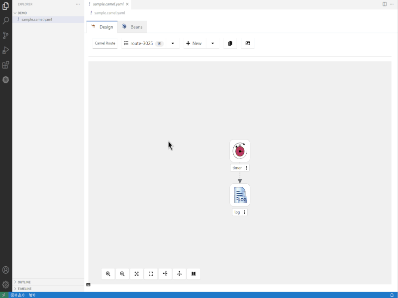
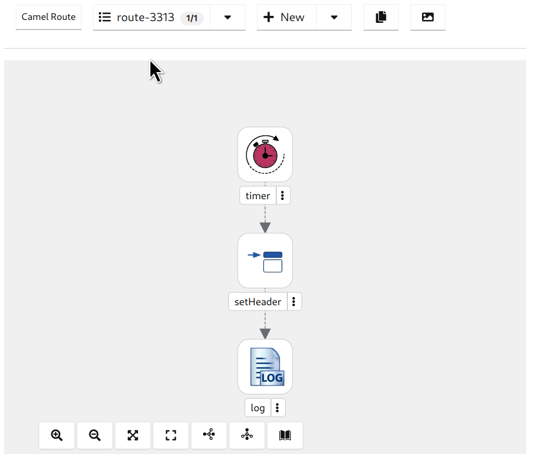
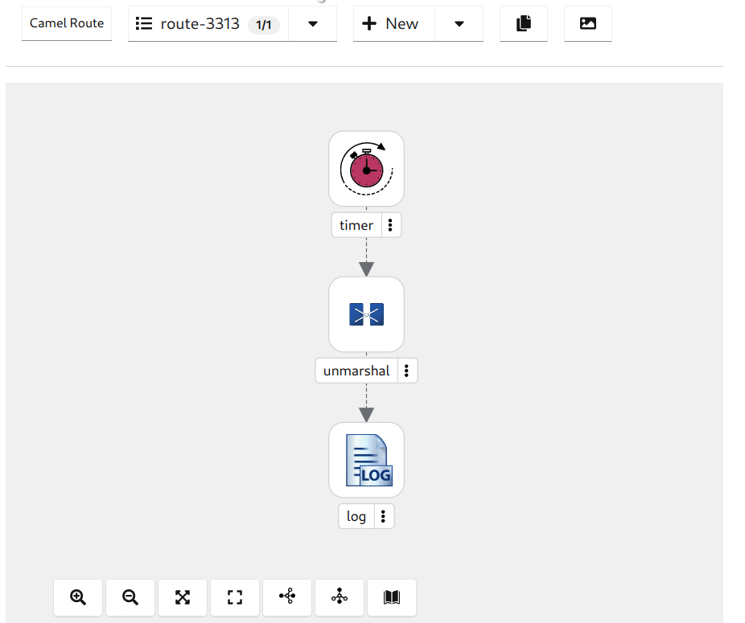
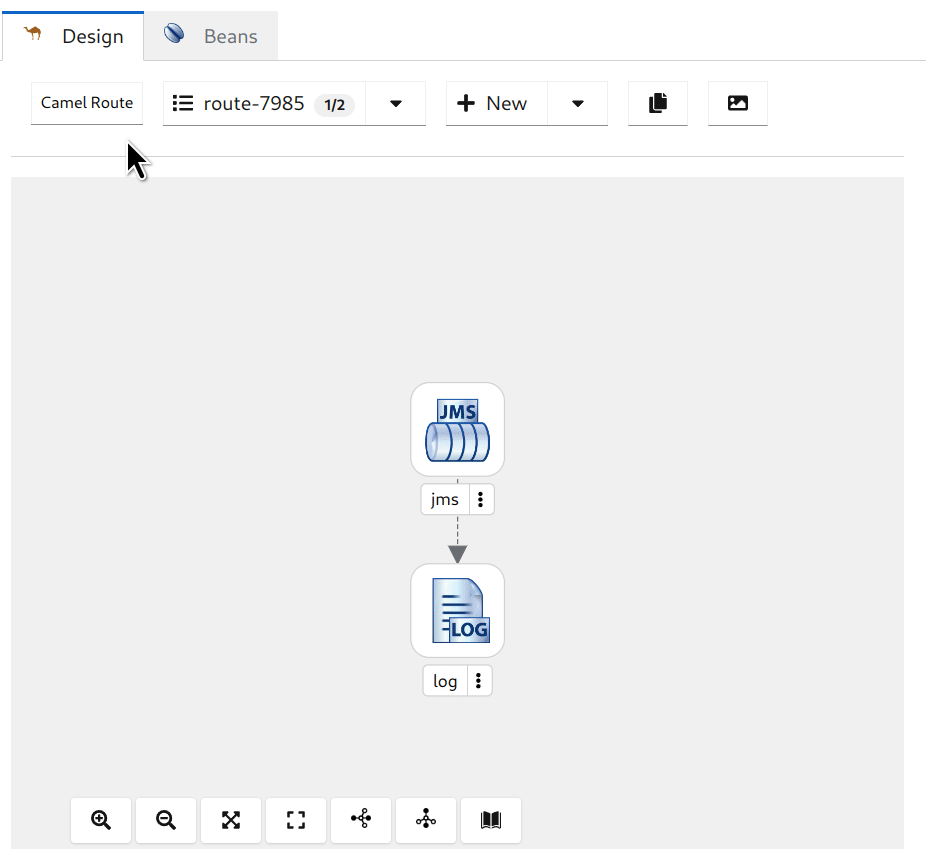

Introducing Kaoto 2.0 (Tech Preview) - A New Chapter for the Kaoto Project
We are thrilled to announce the first tech preview release of Kaoto 2.0, marking a significant milestone in the evolution of the Kaoto project.

Kaoto is a no-code / low-code editor for Apache Camel integrations, which lets you create and edit your routes in a graphical way.

## Highlights
A lot of effort has been put into bringing the Kaoto project closer to Apache Camel. We are now directly leveraging the Camel models and schemas to provide all the features Apache Camel is offering also in the Kaoto designer.

On top of that, we were busy adding a host of new features and usability improvements that promise to elevate your development experience. Here's a glimpse of what you can expect:

### New Catalog UI
Explore a brand-new catalog that provides comprehensive information about component and processor descriptions and parameters. Use the filter and search functionality to easily find what you are looking for.

### Expression Definition Support
Kaoto now provides an enhanced expression definition support, making it easier to define and manage expressions within your Camel routes. We support all languages which are part of Apache Camel.

### Dataformat Support
Handle data with ease using our improved data format support. Kaoto now offers a seamless experience when working with different data formats. We support all data formats included in Apache Camel.

### Beans support
We've introduced support for adding Beans directly from the Canvas Configuration Form, simplifying the process of configuring your Camel routes. The Beans page will offer you full control over all defined beans in one place.

### Fresh Icons
Check out the new set of icons which will help you to understand your integration better without looking at the details.

### Dynamic Labels
Experience dynamic labels for nodes, improving clarity and making it easier to understand and manage complex route structures. You can provide descriptions for your steps which will then show as the labels on the canvas.

### “setHeaders” Processor
We added support for the new [`setHeaders` processor](/components/next/eips/setHeaders-eip.html), enhancing your ability to add multiple headers effortlessly.

### Copy Routes to Clipboard
Take advantage of the "Copy Route to Clipboard" feature, perfect for leveraging the [JBang run from clipboard functionality](/manual/camel-jbang.html#_run_from_clipboard).


### Kamelet Integration
We now support adding Kamelets in a Camel Route, expanding your options, and simplifying integration tasks.

### Lightweight
This new version of Kaoto is a UI-only application, which makes it more portable for embedding it in different environments.

### Let's Build it Together
We're looking forward to get your feedback. Please join us in the dedicated [GitHub discussions](https://github.com/orgs/KaotoIO/discussions/747). Do you have ideas, would you love to see a useful feature implemented or simply ask a question? Don't hesitate to contact us through the project [GitHub issues](https://github.com/KaotoIO/kaoto-next/issues/new/choose)

## What comes next?
Our plan is to release Kaoto 2.0 Final at the end of Q1 / 2024. We still have some major features to implement - like for instance a REST editor. You can find a more comprehensive Roadmap on [the Kaoto website](https://kaoto.io).

Kaoto continues to be available as a [VS Code extension](https://marketplace.visualstudio.com/items?itemName=redhat.vscode-kaoto), ensuring seamless integration into your development environment. We also host a [showcase environment](https://kaotoio.github.io/kaoto-next/#) accessible in your browser for easy exploring.

We invite you to explore these exciting new features. Give it a try today and [tell us about](https://github.com/orgs/KaotoIO/discussions) your experiences!
