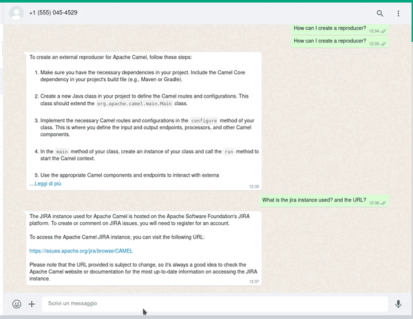

This blog shows how Apache Camel can help integrate multiple systems with an AI model, in particular, the [camel-whatsapp](/components/4.0.x/whatsapp-component.html) component is used to build a chat on WhatsApp; so that a user can easily communicate with the LLM (large Language Model) via WhatsApp.


# Overview


The objective is the following, I'd like to have specific conversations about some topic, in this case, how to contribute to Apache Camel, with an LLM via WhatsApp. In this context WhatsApp is just an example, Apache Camel offers 300+ components that can be easily integrated!


The objective is clear, but what about the implementation? Libraries like LangChain4j and Apache Camel help a lot with this kind of use case, in particular, we will leverage the following features:
* camel-whatsapp will take care of the integration with WhatsApp APIs and thanks to the camel-webhook feature the communication with the WhatsApp APIs is effortless.
* On the other hand, LangChain4j offers abstractions and toolkits that help developers interact with LLMs.


In this example, the model [GPT-3.5 Turbo](https://platform.openai.com/docs/models/gpt-3-5-turbo) is used, and the [camel core contribution documentation](/camel-core/contributing/) is used as an embedding, in this way it will be possible to have clear conversations about camel contributions.


# Set up


This is the hardest part, if you would like to test it by yourself some requirements need to be fulfilled before executing the code, in particular:


* A business WhatsApp account is needed, for development purposes this is free, you can follow the documentation in the [Camel WhatsApp component](/components/4.0.x/whatsapp-component.html)
* An OpenAI API key, the [LangChain4j getting started](https://github.com/langchain4j#getting-started) contains information how to generate the API key
* [Webhook](https://developers.facebook.com/docs/whatsapp/cloud-api/guides/set-up-webhooks) needs to be configured in the WhatsApp business account, so that way WhatsApp API can communicate with the running Apache Camel application
* If you are testing locally, the running application's webhook has to be exposed to the internet, for example via [ngrok](https://ngrok.com/)
* Finally, the [sample application](https://github.com/Croway/camel-whatsapp-chatbot) can be cloned and run via `mvn spring-boot:run`


# Route Definition


Given a chat service that returns a String to an input String message `ConversationalAIAgent.chat(...)`, let's focus on the Camel route.


We would like to achieve the following:
* a user sends a message to a WhatsApp business account
* The WhatsApp API then sends the message to our running application
* The application invokes `ConversationalAIAgent.chat(...)`
* under the hood, via LangChain4j abstraction, the GPT-3.5 is used to produce a response message
* The message is sent to the WhatsApp API and, finally, to the user.


This integration can be easily implemented by the following Camel route:


```java
@Autowired
ConversationalAIAgent agent; // [1]

...

from("webhook:whatsapp:{{camel.component.whatsapp.phone-number-id}}") // [2]
   .log("${body}")
   // A lot of events are received by the webhook, in this case, we want to choose only the ones that contain a message
   .choice().when().jsonpath("$.entry[0].changes[0].value.messages", true)
       // We will use this variable in the transformer to retrieve the recipient phone number
       .setVariable("PhoneNumber", jsonpath("$.entry[0].changes[0].value.contacts[0].wa_id"))
       // The body is used as input String in ConversationalAIAgent.chat(String)
       .setBody(jsonpath("$.entry[0].changes[0].value.messages[0].text.body")) // [3]
       // Invoke the LLM
       .bean(agent) // [4]
       .convertBodyTo(TextMessageRequest.class) // [5]
       // reply to the number that started the conversation
       .to("whatsapp:{{camel.component.whatsapp.phone-number-id}}") // [6]
   .end();
```


[1] `ConversationalAIAgent` is implemented with LangChain4j, it uses the camel-contributing.txt to gain information regarding the contributions rules, and GPT-3.5 to generate the response.


[2] `from("webhook:whatsapp:{{camel.component.whatsapp.phone-number-id}}")` Expose an HTTP endpoint that is known to the WhatsApp Business account, and, every time a user generates an event with the WhatsApp Business account associated number, events like a message sent, message read, writing message and so on, the HTTP endpoint is invoked with a JSON containing all the information.


```
{
  "object":"whatsapp_business_account",
  "entry":[
     {
        "id":"****",
        "changes":[
           {
              "value":{
                 "messaging_product":"whatsapp",
                 "metadata":{
                    "display_phone_number":"****",
                    "phone_number_id":"****"
                 },
                 "contacts":[
                    {
                       "profile":{
                          "name":"****"
                       },
                       "wa_id":"****"
                    }
                 ],
                 "messages":[
                    {
                       "from":"****",
                       "id":"****",
                       "timestamp":"1708091472",
                       "text":{
                          "body":"What about camels?"
                       },
                       "type":"text"
                    }
                 ]
              },
              "field":"messages"
           }
        ]
     }
  ]
}
```


This is an example JSON sent by the WhatsApp API to our webhook, as you can see the JSON structure is quite complex, but the Apache Camel jsonpath expression can be used to retrieve the required data.


[3] We are leveraging Apache Camel jsonpath capabilities to retrieve the message sent by the user `jsonpath("$.entry[0].changes[0].value.messages[0].text.body")`, and the user phone number `jsonpath("$.entry[0].changes[0].value.contacts[0].wa_id")` that we store in variables for further computation.


[4] The `bean(agent)` invokes the LLM with the message sent by the user, that we set into the Camel body in [3] once the computation is done, the response message from the LLM is set into the Camel body.


[5] `.convertBodyTo(TextMessageRequest.class)` is implemented by a Camel TypeConverter that takes a String message and the Exchange as input and creates a `TextMessageRequest` object that can be serialized and sent to the WhatsApp API.

The Converter is implemented by a simple TypeConverters implementation:

```java
@Converter
@Component
public class CamelWhatsAppTypeConverters implements TypeConverters {

	/**
	 * Create an object that can be serialized to WhatsApp APIs, a variable PhoneNumber is expected
	 * as well as a body containing the String message
	 */
	@Converter
	public static TextMessageRequest toTextMessageRequest(String message, Exchange exchange) {
		String phoneNumber = exchange.getVariable("PhoneNumber", String.class);

		TextMessageRequest responseMessage = new TextMessageRequest();
		responseMessage.setTo(phoneNumber);
		responseMessage.setText(new TextMessage());
		responseMessage.getText().setBody(message);

		return responseMessage;
	}
}
```

In this example, we handle only `TextMessageRequest` objects, but camel-whatsapp provides classes for multiple types of messages like media, location and template. A nice improvement to the example would be to have a `MediaMessageRequest` implementation that handles images generated by the agent.


[5] And finally, `.to(whatsapp:{{camel.component.whatsapp.phone-number-id}})` we reply to the phone number that initiated the conversation.


# Conclusion


This blog post shows how Apache Camel can be leveraged to integrate LLMs with bulletproof enterprise integration patterns, we just showed how few lines of code can implement such a complex use case. 

