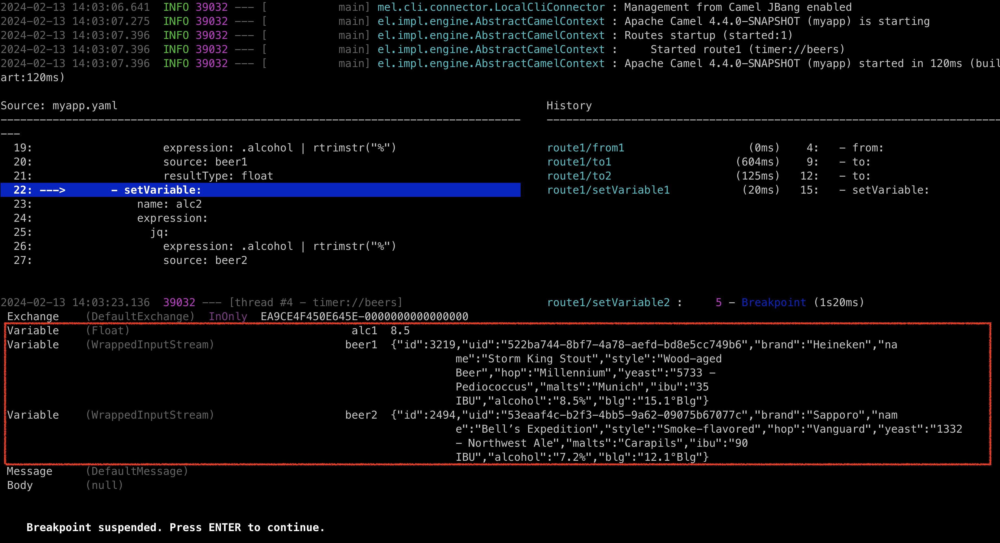

Apache Camel 4.4 (LTS) has just been [released](/blog/2024/02/RELEASE-4.4.0/).

This release introduces a set of new features and noticeable improvements that we will cover in this blog post.

## Camel Core

The simple language has been improved with `hash` function, and further improved the embedded functions for `jsonpath`, `jq` and `xpath`
making it easier to grab data from JSon or XML within your simple expression or predicates.

We have optimized data formats to avoid converting payload to `byte[]` when unmarshalling, but allowing each data format
to unmarshal the payload _as-is_.

Added JMX MBean operation to update routes at runtime via XML format (requires turning on this feature with setting JmxUpdateRouteEnabled=true).
This can be useful for tooling where you can then change routes during troubleshooting an existing running Camel integration.

The internal code on the core was adjusted to use a monotonic time source, via an internal Clock API, to provide more accurate duration reporting.
Additionally, we cleaned up usages of restricted identifiers across the code base, consolidated exchange constructors, and applied fixes to
improve handling of interrupts.

## DSL

We refactored the [Throttle EIP](/components/next/eips/throttle-eip.html) implementation to allow supporting two different modes of throttling.

### Variables

The biggest new feature in Camel 4.4 is the introduction of [variables](/manual/variables.html).

A variable is a key/value that can hold a value that can either be private per `Exchange`, or shared per route, or per Camel context.

With variables, you can now more easily share data between routes and/or globally. Variables are also readily accessible
from EIPs and languages, just as message _headers_ or _exchange properties_ are. In other words, they have been added
as first-class primitives into Camel.

You can find a small example here:

- https://github.com/apache/camel-kamelets-examples/tree/main/jbang/variables

We also made a selected number of EIPs to have _special use_ of variables. The idea is to make it easier to
collect various sets of data from external systems using Camel components and commonly used EIPs, without any
ceremony to prepare message body and headers, and cleanup afterward (i.e., removing HTTP headers).

And you can find a small example here using variables with EIPs:

- https://github.com/apache/camel-kamelets-examples/tree/main/jbang/variables-eip

The JBang debugger can also show variables if enabled with `--show-exchange-variables`, as shown in the screenshot below:


```bash
camel debug * --show-exchange-variables
```




In the screenshot, you can see three variables:

- `alc1` - Is a float with the alcohol percentage of beer 1
- `beer1` - Is the json structure of beer1
- `beer2` - Is the json structure of beer2

The debugger is suspended (blue) in the Camel route where we are about to set variable `alc2` computed as follows:


```yaml
- setVariable:
    name: alc2
    expression:
      jq:
        expression: .alcohol | rtrimstr("%")
        source: beer2
        resultType: float
```

Here you can see the `alc2` variable is set from a `jq` expression that grabs the alcohol field, and remove the `%` sign.
The source (input) is from another variable named `beer2`. You can also specify `header:myHeader` to refer to a header, or
if you remove `source` then the message body is used as input (default).
The result is converted to a Java `float`,

**NOTE:**
If you take a closer look in the screenshot above, then the debugger reveals that the `Exchange` has no message headers,
and that the message body is empty (`null`). The example is exclusively using variables to gather and compute data; without
the need to store and restore data on message header/body during routing. This is a cleaner and more elegant practice.

## Camel JBang (Camel CLI)

We have continued investing in Camel JBang, and this time we have some great new stuff in the release.

The `camel-jbang` now supports new commands as plugins. And the first set of commands is camel-k commands,
that allows to use `camel-jbang` to manage and operate Camel K integrations.

You can now run `camel-jbang` with `--prompt` that lets users type in placeholder values during startup,
making it easy to build examples and prototypes that can easily be customized to users need, when trying.

You can now more easily run `camel-jbang` with custom `log4j2.properties` file to use your logging configuration,
instead of the _built-in_ logging.

Added support for using Jolokia 2.x with `camel-jbang`.

Upgraded to Hawtio 3.x when running `camel hawtio`.

## Kamelets

When using Kamelets then the _route snippets_ do not use any error handler. This means that when calling a Kamelet
then if any error happens these are thrown back, and allows to use your current error handling configuration. This
avoids any confusion, and you can regard calling a Kamelet just as calling a component; If they fail the exception is thrown back.

## Camel Kafka

The Kafka component was improved to support batching, which makes it possible to consume and handle a set of
Kafka consumer records as one Camel `Exchange`. For greater flexibility, the Kafka component can support both automatic and manual commits.

This version also brings fixes for the Kafka idempotent repository and unifies the setup of the commit manager.

## Spring and Spring Boot

We have changed the recommended ordering of BOM from:

- `spring-boot-dependencies`
- `camel-spring-boot-bom`

... to reverse the order, so Camel comes first:

- `camel-spring-boot-bom`
- `spring-boot-dependencies`

See more in the [upgrade guide](/manual/camel-4x-upgrade-guide-4_4.html).

Upgraded to latest Spring Boot 3.2.2 release.


## Kotlin API

We have introduced new experimental [Kotlin API](/components/4.4.x/others/kotlin-api.html)
for defining Camel routes in Kotlin with the `camel-kotlin-api` JAR.
This provides Kotlin type-safe builders as building blocks of Camel entities.

Kotlin API is not the replacement of Kotlin DSL (it is a separate module for now).
While it is experimental there may be breaking changes in upcoming releases.


## Miscellaneous

The `camel-grpc` component can now do full streaming in proxy mode.

The `camel-netty` component has added support for using KQueue native transport.

The `camel-jms` component now adds a header to the `Message` with the actual JMS destination the message was sent to,
this is useful information, when using dynamic computed queue names.

The `camel-kubernetes` component can now auto-create `KubernetesClient` if needed, making it easier to use when running inside
a Kubernetes pod.

Upgraded many third-party dependencies to the latest release at the time of release.

## New Components

- `camel-beanio` - **Added back:** Marshal and unmarshal Java beans to and from flat files (such as CSV, delimited, or fixed length formats).
- `camel-jte` - Transform messages using a Java-based template engine (JTE).
- `camel-wasm` - Invoke Wasm functions.
- `kotlin-api` - API for the new Kotlin DSL

## Upgrading

Make sure to read the [upgrade guide](/manual/camel-4x-upgrade-guide-4_4.html) if you are upgrading from a previous Camel version.

If you are upgrading from, for example, 4.0 to 4.4, then make sure to follow the upgrade guides for each release in-between, i.e.
4.0 -> 4.1, 4.1 -> 4.2, and so forth.

## Release Notes

You can find more information about this release in the list of JIRA tickets resolved in the release:

- [Release notes 4.4](/releases/release-4.4.0/)

You can also find blog posts What's new in the previous releases since last LTS

- [What's new in Camel 4.1](/blog/2023/10/camel41-whatsnew/)
- [What's new in Camel 4.2](/blog/2023/11/camel42-whatsnew/)
- [What's new in Camel 4.3](/blog/2023/12/camel43-whatsnew/)

## Roadmap

The following 4.5 release (non LTS) is planned for April/May 2024.

