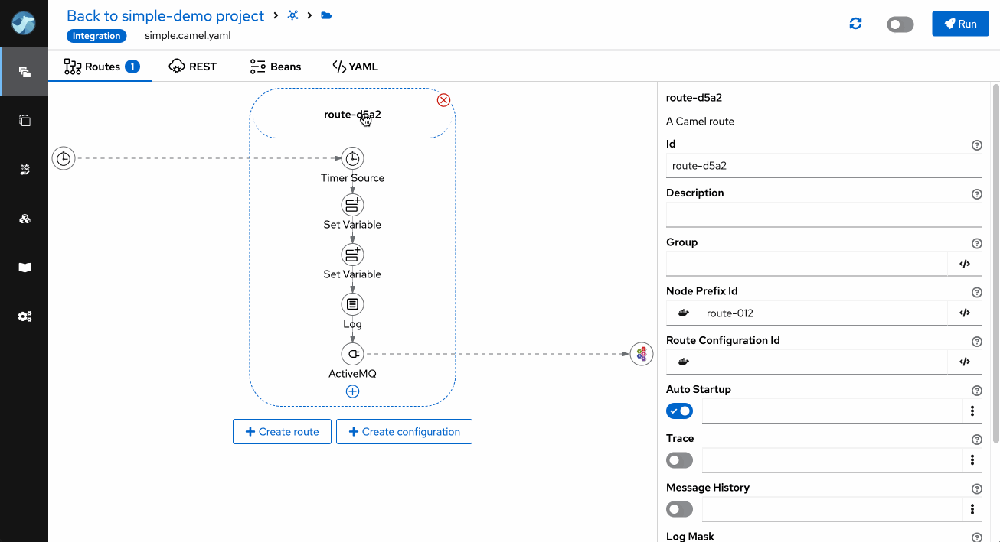

*There should have been an AI-generated image of animated camels in a setting vaguely related to the plot of this post. But I think we have already had enough of them ;-)*

We are announcing the Apache Camel Karavan 4.4.0, your one-stop shop for simplified and accelerated integration development with Apache Camel! This release packs a punch with a plethora of improvements, making your integration journey smoother and more efficient than ever.
 
## Variables are everywhere

Karavan 4.4.0 enhances variable support in DSLs, including elements like From, To, Marshall, and Unmarshall, DSLs for managing variables - setVariable, removeVariable, and convertVariableTo - and displays a list of existing variables in DSL properties. This update streamlines integration development, making Karavan more versatile and user-friendly.

## Enhanced Navigation

Real integration projects with Apache Camel typically consist of dozens of routes and are usually spread across multiple files. We have simplified navigation between directly (`direct`, `seda`) connected routes. 

## Property Handling

The Property Panel contains syntax tips for properties placeholder. Users can easily create new property values directly in the Properties panel.

## Bean Wizard

Creating beans in Apache Camel has never been a straightforward task. In addition to the syntax, you need to know which properties of the particular bean should be configured. We are introducing the Bean Wizard that simplifies bean configuration. The wizard's configuration can be enhanced with preconfigured properties in the templates project.

## Component and Kamelet palette configuration

Karavan offers over 300 Camel Components and more than 100 Kamelets, some of which may overlap in functionality (e.g., SQL, JDBC) or vary in maturity levels. Integration developers now have the capability to specify which Components and Kamelets are accessible for their project. While these are still available in the Knowledgebase for learning purposes, they are excluded from the Selector during development.

## Simple installation

We are constantly enhancing and streamlining the installation process. As of version 4.4, Karavan can be deployed on Docker using the docker-compose.yaml file and on Kubernetes through straightforward resource YAML files. There will no longer be a need for a custom installer or bespoke internal installation code.

1. [Install on Docker](https://github.com/apache/camel-karavan/blob/4.4.0/docs/WEB_DOCKER.md)
2. [Install on Kubernetes](https://github.com/apache/camel-karavan/blob/4.4.0/docs/WEB_KUBERNETES.md)

## The latest and greatest

Karavan is updated with the latest versions of the frameworks and libraries it utilizes and is built with.

- Camel 4.4.0
- Kamelets 4.4.0
- Jkube 1.16.1
- JBang v0.114.0
- Quarkus 3.8.1

To kickstart your integration projects, please use [Karavan Documentaion](https://github.com/apache/camel-karavan/tree/main/docs)

We appreciate your continued support for Apache Camel Karavan, and we eagerly await your feedback and contributions as we continue to evolve and enhance the integration landscape.

**Happy integrating!**