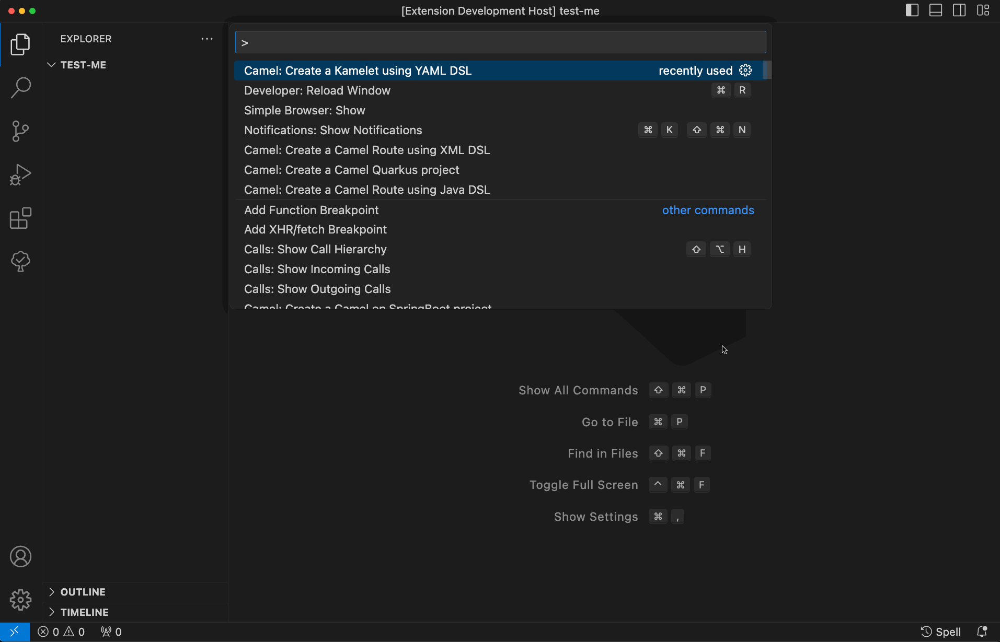

There is a new release of VS Code extension [Language Support for Apache Camel](https://github.com/camel-tooling/camel-lsp-client-vscode/blob/0.16.0/Changelog.md#0160) 0.16.0.

Available at [Visual Studio Marketplace](https://marketplace.visualstudio.com/items?itemName=redhat.vscode-apache-camel) and [Open VSX Registry](https://open-vsx.org/extension/redhat/vscode-apache-camel).

This blog post is covering changes made during multiple releases. Latest [blog posted](../../../2023/07/multi-release-vscode-extensions) changes were for Language Support for Apache Camel v0.9.0. But all listed below is available in latest published v0.16.0 extension release.

## What's changed

- Embedded Language Server for Apache Camel 1.18.0.
- Updated default Camel Quarkus Catalog from 2.16.0 to 3.7.0.
- Updated default Camel Catalog version from 4.0.0 to 4.3.0.
- Updated default Kamelet Catalog from 4.0.0 to 4.2.0.
- Updated default Camel JBang version from 4.0.0 to 4.3.0.
- Updated default Camel K trait Catalog from 1.7.0 to 2.0.1.
- Raised minimal version requirement to Java 17 for launching the embedded Camel Language Server.

## New features

### Command to create a Kamelet with YAML DSL

The newly added command to create a Kamelet with YAML DSL provides developers starting point for designing and implementing Kamelets within their Camel projects.

### Command to create a Custom Resource Pipe with YAML DSL

The introduction of the new command to create a Custom Resource Pipe with YAML DSL empowers developers to kick-off design and implement custom data processing pipelines within their Camel projects.

### Command to create a Camel route from an OpenAPI file

The new command to create a Camel route from an OpenAPI file introduces efficiency to developers' workflow by enabling seamless translation of OpenAPI specifications into Camel routes.

### Create a new Camel File menu entry

This new feature enhances the user experience by providing a convenient way to initiate Camel file creation directly from the file menu. This streamlines the workflow for developers, allowing them to quickly begin working on Camel files without needing to navigate through additional menus or commands.

## What's next

Please provide feedback and ideas with your preferred channel:

- [Zulip #camel-tooling channel](https://camel.zulipchat.com/#narrow/stream/258729-camel-tooling)
- [Language Support for Apache Camel GitHub Issues](https://github.com/camel-tooling/camel-lsp-client-vscode/issues)
- [Red Hat Bug Tracker FUSETOOLS2](https://issues.redhat.com/browse/FUSETOOLS2)
