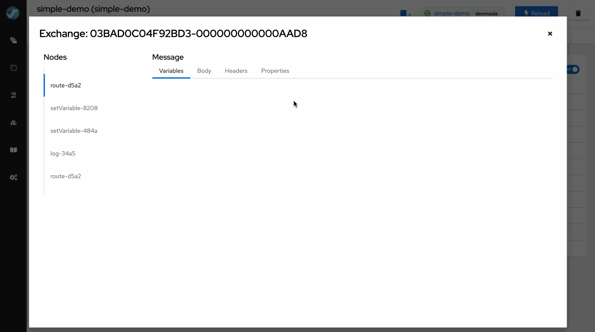
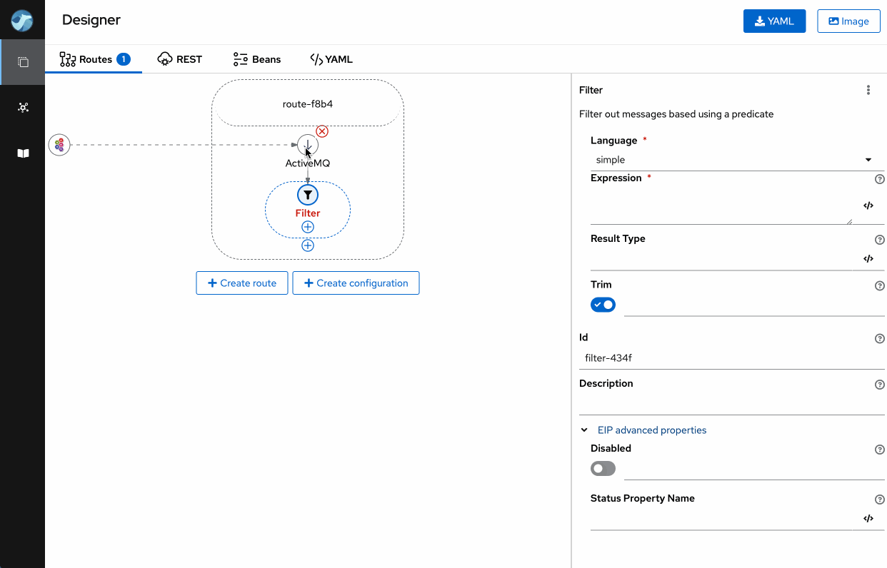
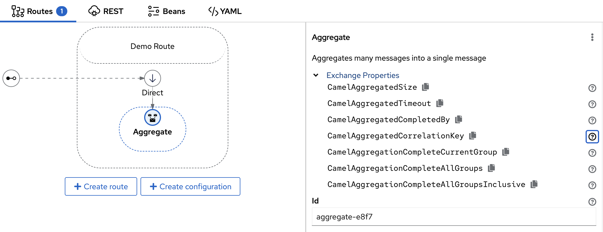
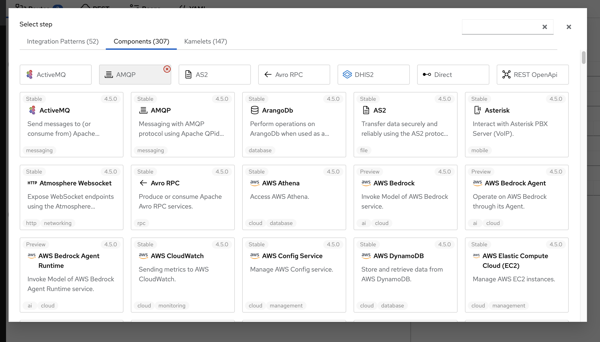
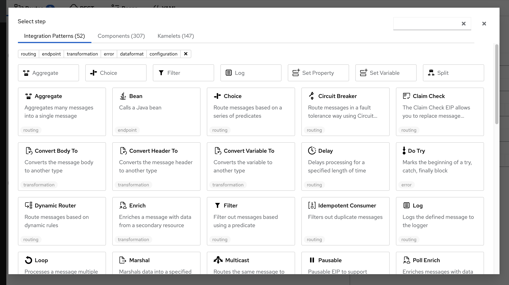

We're announcing the release of Apache Camel Karavan 4.5.0, your ultimate toolkit for streamlined and expedited integration development using Apache Camel! 

This new version is aligned with the latest Apache Camel Framework 4.5.0, ensuring compatibility and leveraging the newest features.

While this release may seem modest, it introduces a series of subtle enhancements aimed at simplifying the daily tasks of integrators. These improvements, though minor at first glance, are designed to reduce the need for frequent documentation lookups, thereby saving significant time and effort in larger projects.
 
## Variables in traces

While the introduction of variable support across Apache Camel and Karavan stands as the most significant feature in this release, we've also added the ability to track variable changes within Karavan Traces. This means that when running your integration in developer mode, you gain access to detailed insights into how exchange properties, headers, message body, and variables evolve throughout the defined route history.

## Component Headers

Apache Camel offers over 300 components. Traditionally, configuring these components often involved specifying component headers for advanced settings. This approach typically necessitated frequent reference to documentation during integration development.

Karavan simplifies this process by providing comprehensive information on component headers for producers, consumers, and common types. This user-friendly interface allows developers to easily browse and directly copy the required headers in the Properties Panel within the user interface.

## EIP Properties

Similar to the Component Headers discussed earlier, Apache Camel Karavan enhances the visibility and usability of EIP (Enterprise Integration Patterns) Properties. These properties are dynamically added by the Apache Camel Framework to the Exchange Message during execution. In Karavan, users can easily access and understand these properties, which can be instrumental in the routing logic. This feature allows developers to efficiently utilize EIP Properties in their integration strategies, ensuring more robust and flexible routing solutions within their applications.

## Enhanced Accessibility of Frequently Used Elements

We've introduced a dynamic feature to enhance your workflow efficiency. To expedite access, the Karavan interface now automatically prioritizes the seven most frequently used Enterprise Integration Patterns (EIPs), Components, and Kamelets at the top of the Palette. This prioritization is based on the number of times elements are added to the routes, ensuring that your most utilized tools are readily accessible. If preferred, users have the flexibility to remove any element from this list.

## Upgrading

Upgrade to Apache Camel Karavan 4.5.0 today and experience a more seamless and effective integration process, tailored to help you keep pace with the demands of complex integration scenarios. Embrace the power of small changes; they might just make a big difference!

**Happy integrating!**