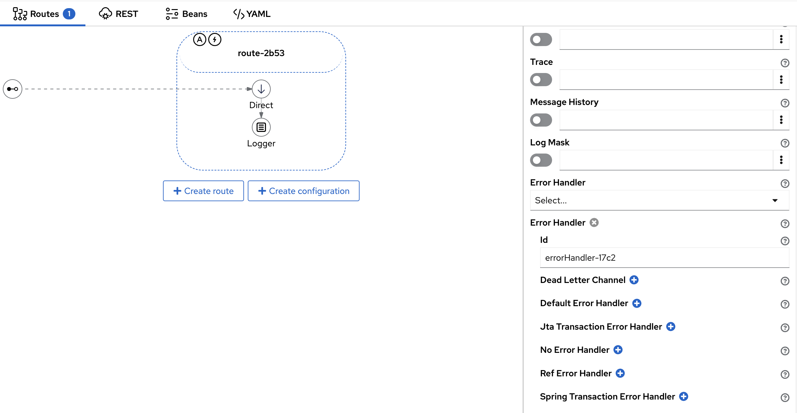
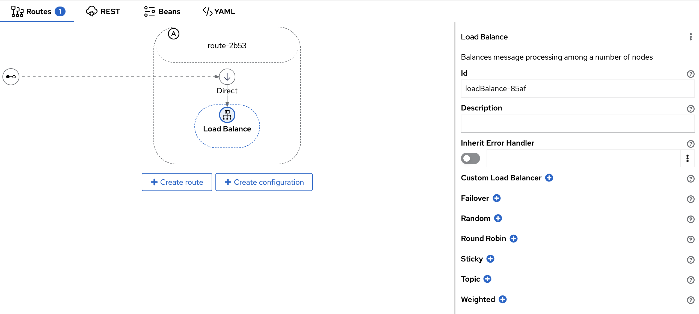

We're announcing the release of Apache Camel Karavan 4.6.0, your ultimate toolkit for streamlined and expedited integration development using Apache Camel! 

This new version is aligned with the latest Apache Camel Framework 4.6.0, ensuring compatibility and leveraging the newest features.

While this release may seem modest, it introduces a series of subtle enhancements aimed at simplifying the daily tasks of integrators. These improvements, though minor at first glance, are designed to reduce the need for frequent documentation lookups, thereby saving significant time and effort in larger projects.
 
## Developer Experience Improvements

1. **ErrorHandler Configuration on Route Level**

   Simplify error handling in your routes with the new configuration options. This allows for more granular control and management of errors, making your integrations more robust and easier to maintain.

   

2. **Autostart and ErrorHandler visual indicator on Route Diagram**

    We have introduced visual indicators for Autostart and ErrorHandler statuses on the route diagram. This enhancement allows for quicker and easier identification of route configurations, improving overall workflow efficiency.

2. **LoadBalance EIP**

   Introducing the LoadBalance Enterprise Integration Pattern (EIP). This feature ensures optimal distribution of workloads across your system, enhancing performance and reliability.

   

3. **Container Image and Commit Information in UI for Running Integration Project**

   Gain better visibility into your running projects with the ability to view container image and commit information directly in the UI. This improvement aids in troubleshooting and maintaining your integrations.

4. **Build Script Simplified Clone Git Repo**

   Cloning Git repositories has never been easier. Our simplified build script streamlines this process, saving you time and reducing complexity in your workflow.

5. **User Can Create Kamelet in Project**

   Empowering users to create Kamelets within their projects. This feature enhances flexibility and customization, allowing you to define reusable components tailored to your specific needs.

6. **User Can Configure REST DSL with OpenApi Contract**

   Configure REST DSL seamlessly with OpenApi contracts. This integration ensures your RESTful services are well-documented and adhere to standards, improving both development and API management.

## Latest Versions

Stay up to date with the latest versions included in this release:

**Camel 4.6.0**

  Enjoy the latest features and improvements in Camel 4.6.0, designed to enhance your integration capabilities.
  
**Kamelets 4.6.0**

  Utilize the updated Kamelets 4.6.0 for reusable and standardized integration components.
  
**Jkube 1.16.2**

  Take advantage of the latest updates in Jkube 1.16.2, offering better Kubernetes integration and management.
  
**JBang v0.116.0**

  Experience the enhancements in JBang v0.116.0, facilitating easier scripting and execution of Java applications.

We invite you to explore these new features and updates, and we look forward to seeing how they enhance your integration projects. Your feedback is invaluable to us, so please share your thoughts and experiences as you dive into this latest release.

**Happy integrating!**