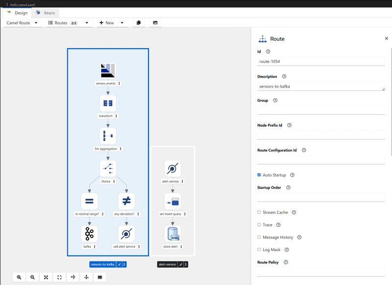
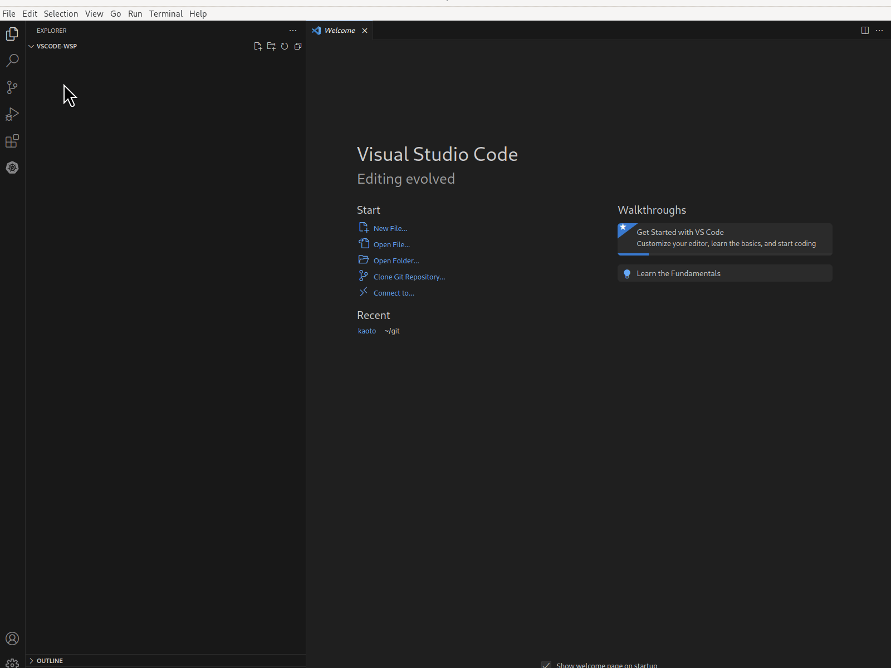
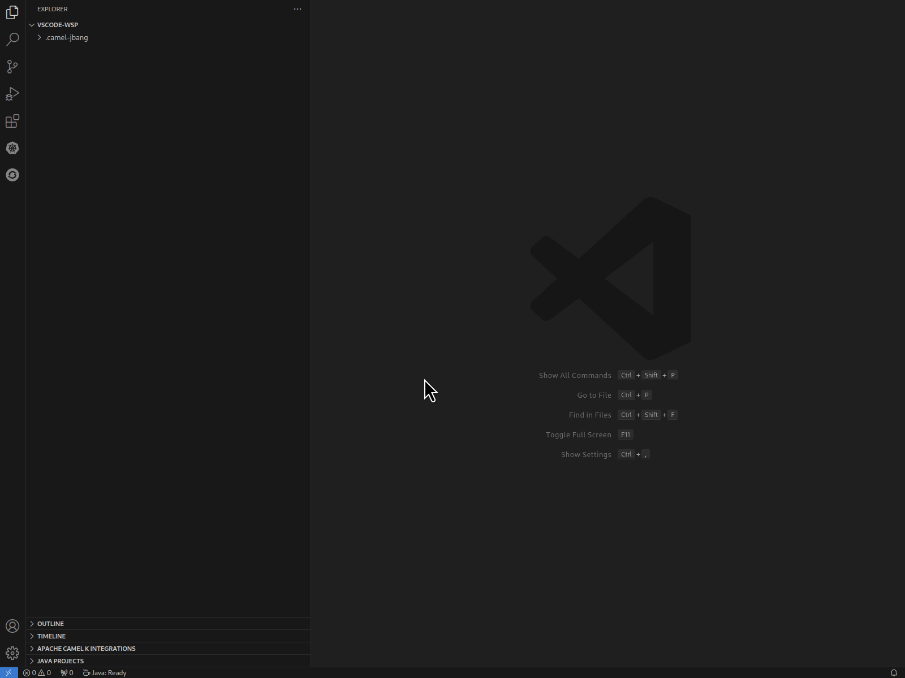
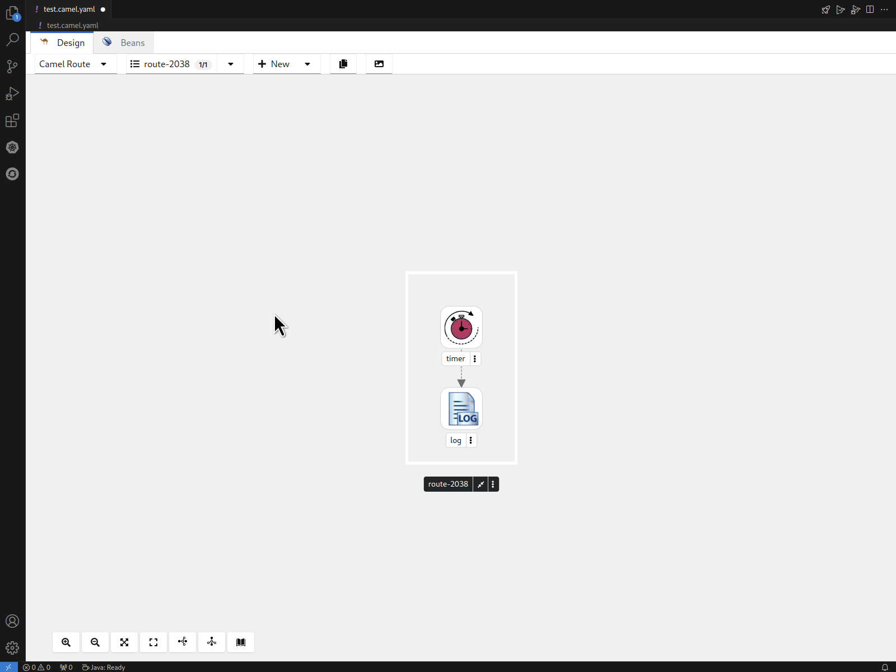
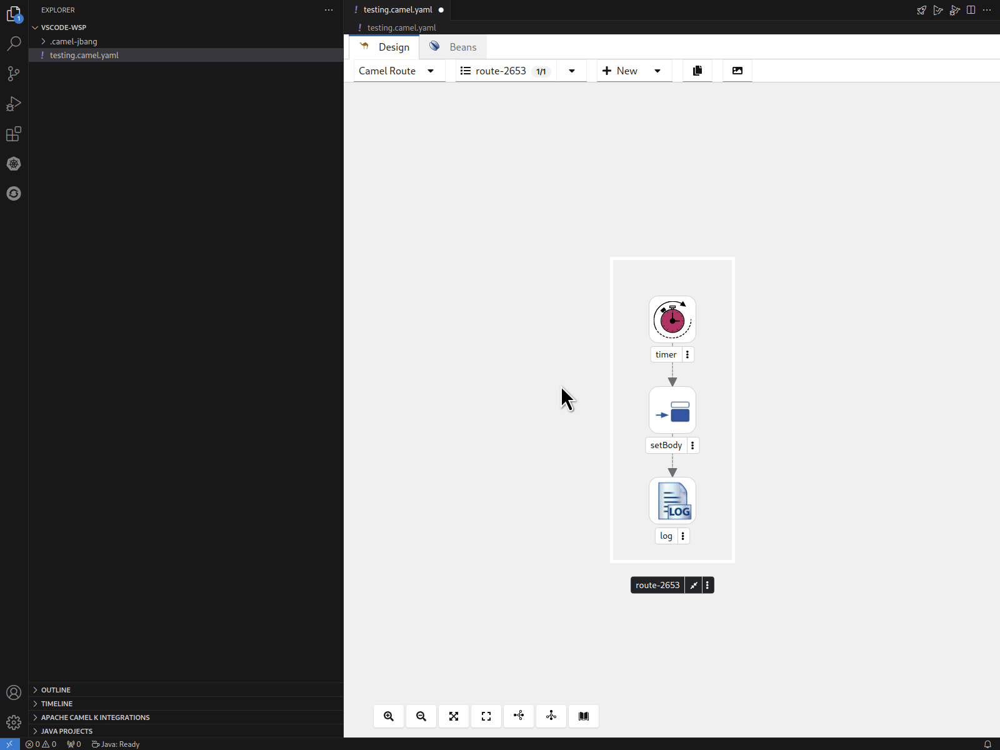
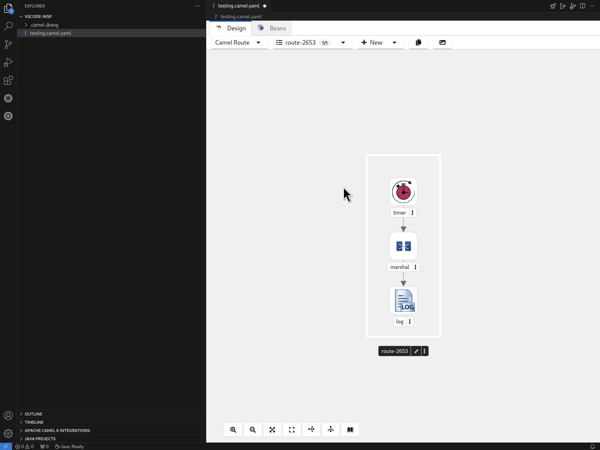
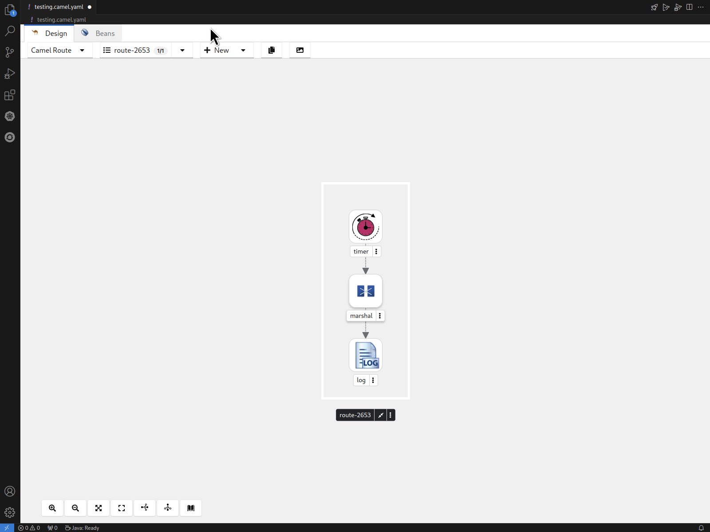
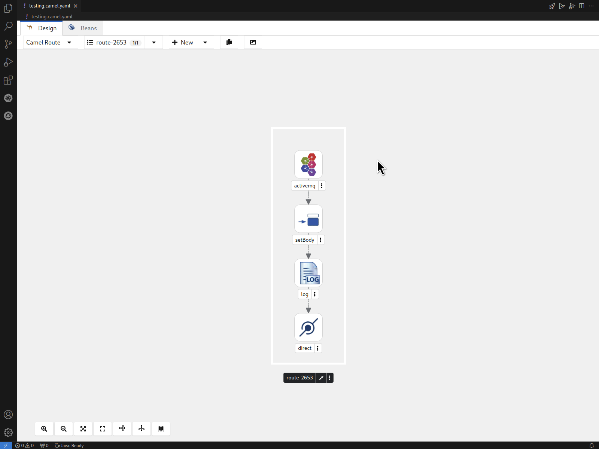

  

After previously releasing 3 technical previews, we are thrilled to finally announce the release of Kaoto 2.0, marking the first big release after the project aligned to be much closer to Apache Camel.

## What is Kaoto?

Kaoto, short for Kamel Orchestration Tool, is a low-code and no-code integration designer that allows users to create and edit integrations based on Apache Camel. It is extendable, flexible, and adaptable to various use cases, making it a versatile tool for integration projects. You can work both visually and also directly access the source code giving you a full round-trip editing experience.

## Kaoto in Action

  

## Where can I get Kaoto?

Our main environment is currently [Visual Studio Code](https://code.visualstudio.com/). That means Kaoto has created an extension for VS Code, which you can easily install from the VS Code marketplace. While you can go for simply installing [the Kaoto extension](https://marketplace.visualstudio.com/items?itemName=redhat.vscode-kaoto) we still suggest to install [the Extension Pack for Apache Camel](https://marketplace.visualstudio.com/items?itemName=redhat.apache-camel-extension-pack) which not only comes with Kaoto but also installs additional useful extensions like the textual debugger, source code assistance and a couple of other useful extensions which makes working with Camel integrations easier. There is also [the Camel CLI](/manual/camel-jbang.html) using JBang and we strongly recommend installing that as well as it will allow you to quickly run your integrations while you are working on it, giving you quick results. You want to know more about that? Please read our more comprehensive installation guide.

  

## Create Routes easily

The VS Code Extension pack for Apache Camel provides you with commands to easily create Camel routes, Kamelets, Pipes and others. You can filter for these commands when you type “Camel:”, which then will show the Camel related commands only. When using these commands, we do already provide you with a template to easily get started with prototyping. You can configure the steps of the integration by clicking and selecting them, which will open up a configuration side panel you can use for your changes.

  

## Use the Catalog to find what you need

Apache Camel ships with a huge amount of connectors and integration patterns as well as Kamelets to be used in your integrations. We created a catalog combining these tools in a single place to let you explore and find out more about each of these in a visual way. We put in a lot of effort to make the UI easy to use and bring the right results to you with less effort and clicks. Use the provided filter tags to quickly scan for what you need and if that is not enough you can also use the filter text field to further trim down the results. Give it a try!

  

## Working with Expressions

Kaoto provides you support when working with expressions. We support all languages that are part of Apache Camel and provide you with a language selector and the expression editor.

  

## Working with Data Formats

If you are working with transformations you will also use data formats. Kaoto allows you to easily select from predefined formats and configure them properly.

  

## Adding global configurations

The Canvas now supports additional entities, like RouteConfiguration and RestConfiguration allowing for more complex and detailed workflows.

  

## Enable / Disable Steps

You can now easily enable and disable steps of your flow to help you prototyping even more efficiently.

  

There are many more changes and improvements for you to discover. Try it out!

## Let's build it together

Let us know what you think by joining us in the [GitHub discussions](https://github.com/orgs/KaotoIO/discussions). Do you have an idea how to improve Kaoto? Would you love to see a useful feature implemented or simply ask a question? Please [create an issue](https://github.com/KaotoIO/kaoto/issues/new/choose) or use the [discussion forums](https://
github.com/orgs/KaotoIO/discussions).

You can also check out our [examples repository](https://github.com/KaotoIO/kaoto-examples) to see some more advanced use cases which were set up using Kaoto.

  <ins>All contributions are welcome!</ins>

## What comes next?

Our journey just started and we have a full backlog of exciting functionalities to work on. Kaoto 2.1 is already planned and scheduled for the end of June. You can find a more comprehensive Roadmap on [the Kaoto website](https://www.kaoto.io/roadmap/) or alternatively check out our [GitHub Planning Board](https://github.com/orgs/KaotoIO/projects/14/views/1).

Kaoto continues to be available as [a VS Code extension](https://marketplace.visualstudio.com/items?itemName=redhat.vscode-kaoto), ensuring seamless integration into your development environment. We also host [a showcase environment](https://kaotoio.github.io/kaoto/) accessible in your browser for easy exploring.

We invite you to explore these exciting new features and
unleash your inner Integration Wizard.

  

Give it a try today and <a href="https://github.com/orgs/KaotoIO/discussions">tell us</a> about your experience!

