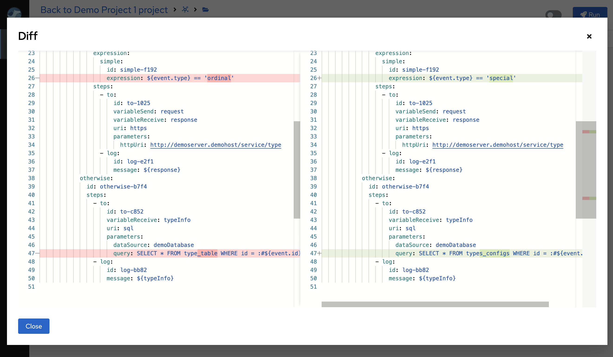
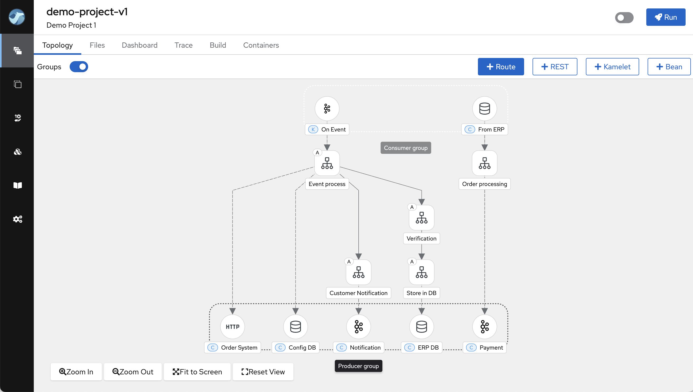
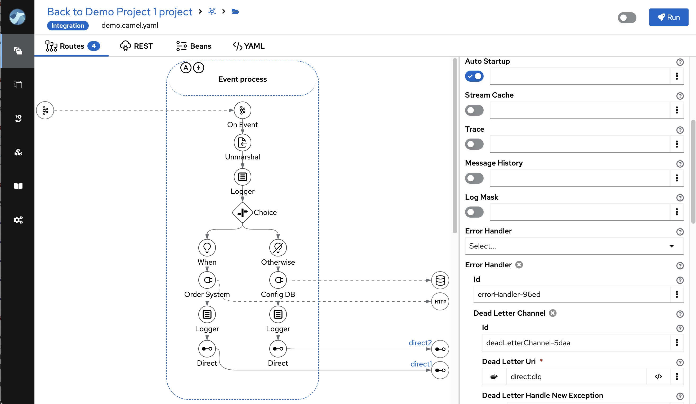

We're thrilled to announce the release of **Apache Camel Karavan 4.7.0**, your ultimate toolkit for streamlined and expedited integration development using Apache Camel! This new version is meticulously aligned with the latest Apache Camel Framework 4.7.0, ensuring seamless compatibility and enabling you to leverage the newest features for an enhanced development experience.

## What's New in Apache Camel Karavan 4.7.0?

Our latest release brings a slew of improvements aimed at making your integration development more efficient and intuitive. Here are the key enhancements:

### Adaptive Templates and Configuration
- **Docker or Kubernetes Templates**: The templates and configurations now dynamically adapt to the installed environment, providing a more seamless and intuitive setup experience.

### Enhanced Development and Build Modes in Docker
- **Environment variables propagation**: Environment variables configured in your project’s `docker-compose.yaml` are now propagated, ensuring consistent and reliable builds.
- **Volume Mounting**: Both Dev Mode and Build Mode in Docker now mount volumes as configured in the `docker-compose.yaml`, simplifying file management and access.

### Advanced DSL and Kamelet Support
- **Placeholders**: Karavan now supports placeholders in DSL and Kamelet Properties, offering greater flexibility and reusability in your configurations.

### Improved File Management
- **File Change Status**: The status of file changes is now determined based on content rather than change date, ensuring more accurate tracking of modifications.
- **File Diff Display**: Karavan displays diffs for changed files, enhancing visibility and traceability, making it easier to review and understand changes.

   

### Enhanced Visualization and Insights
- **Topology Visualization**: The topology feature can now visualize consumer and producer groups, providing better insights into data flow and interactions within your integration.

   

- **Route Visualization Enhancements**: Routes configured to be auto-started are now marked with an "A" badge, and routes with `errorHandler` configured are indicated with a lightning sign, enhancing the clarity and manageability of your integration routes.

   

### Optimized Performance and Resource Usage
- **ConcurrentMaps for Caching**: Karavan now uses simple `ConcurrentMaps` instead of Hazelcast to cache project data. This change reduces startup time and memory consumption, resulting in a faster and more efficient development environment.

### Streamlined Configuration Management
- **ConfigMaps in Kubernetes**: Configuration files can now be deployed as `ConfigMaps` through the UI in Kubernetes, streamlining configuration management and deployment.
- **Shared Folder in Docker**: Configuration files can be saved in a shared folder in Docker, facilitating easier access and management across your development environment.

## Latest Versions

Stay up to date with the latest versions included in this release:

**Camel 4.7.0**

**Kamelets 4.7.0**

**Jkube 1.16.2**

**JBang v0.117.1**

**Quarkus 3.12.3**

## Conclusion

Apache Camel Karavan 4.7.0 is packed with features and improvements designed to enhance your integration development process. By adapting to your environment, improving file management, and providing better visualization and performance, this release ensures that you have the most powerful and efficient tools at your disposal.

Upgrade to Apache Camel Karavan 4.7.0 today and experience the future of integration development!

For detailed documentation and download links, visit the [Apache Camel Karavan](https://github.com/apache/camel-karavan) page.

**Happy integrating!**