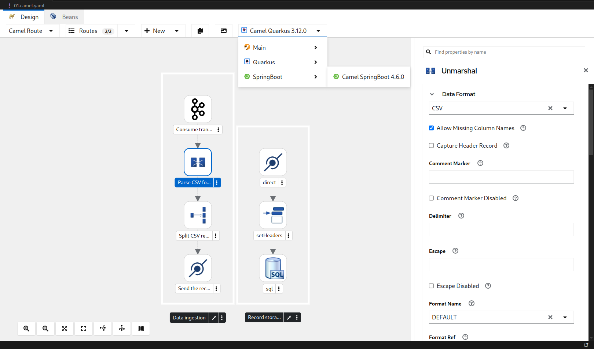
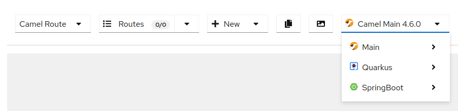
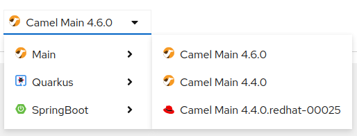
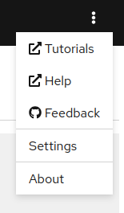
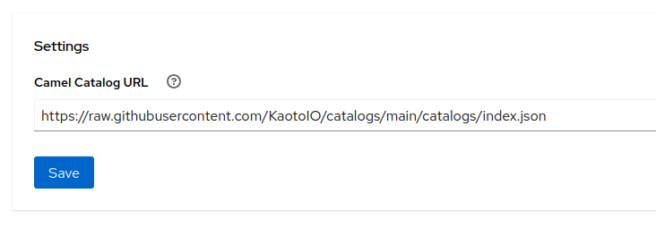
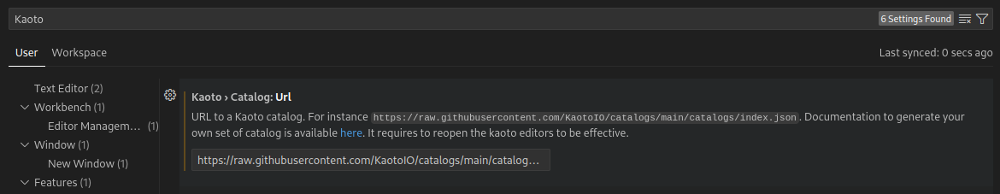
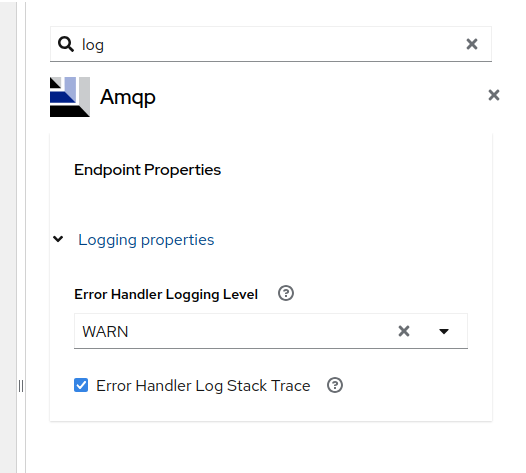
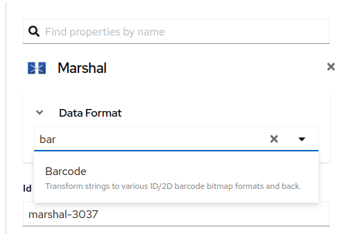
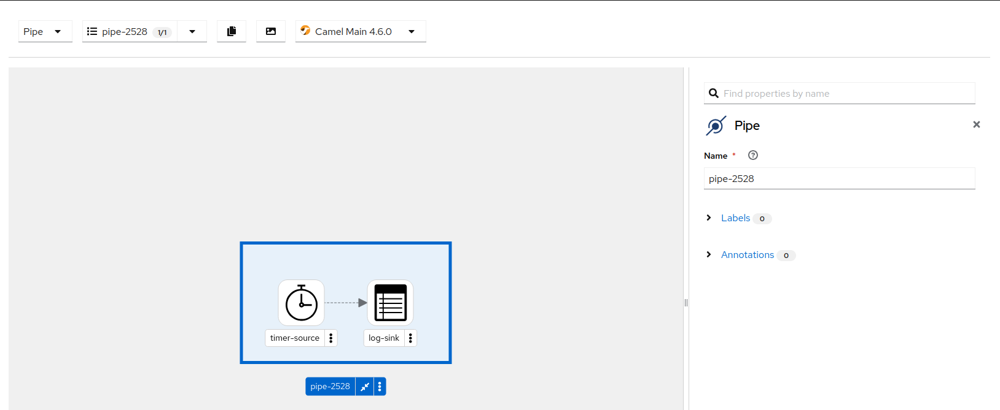

  

 <strong>
After the previous 2.0 GA release, we are happy to announce the release of Kaoto 2.1, packed with exciting new features, bug fixes, and various improvements to enhance the user experience.

This update introduces the capability to choose your preferred Runtime version among other notable upgrades. Read on to discover the key highlights of this release and how they can improve your workflow with Kaoto.
</strong>

## New Features

- Catalog: Empower users to pick a runtime and specific version to display the right components with their precise configurations. This means you can tailor your catalog to fit your exact runtime version, ensuring compatibility. Additionally, the catalog can be generated dynamically, allowing you to show different runtimes in the Runtime selector, such as Quarkus and Spring Boot. This dynamic generation is the first step towards fully customizing the Apache Camel catalog used by Kaoto.

  

  

- Settings: Introduced a new settings screen to manage the catalog URL, for the VSCode extension, this setting is seamlessly integrated into the VSCode settings panel.

  

  

  

- Filter parameters in the Config form: Users can now filter parameters directly in the Canvas Form, allowing them to find parameters by name quickly.

  

- TypeaheadEditor: A new TypeaheadEditor has been introduced and integrated with the DataFormatEditor for better lookup.

  

- Pipes: Introducing a new container to better organize and manage Pipes within the canvas.

  

- Kaoto Logo: The Kaoto logo has been updated to a more modern and sleek design.

  

This release brings a host of new features, bug fixes, and improvements to enhance your experience with Kaoto. Upgrade now to take advantage of these new capabilities!

## Let's build it together

Let us know what you think by joining us in the [GitHub discussions](https://github.com/orgs/KaotoIO/discussions). Do you have an idea how to improve Kaoto? Would you love to see a useful feature implemented or simply ask a question? Please do so [here](https://github.com/KaotoIO/kaoto/issues/new/choose).

You can also join the [Kaoto channel](https://camel.zulipchat.com/#narrow/stream/441302-kaoto) on the Camel Zulip Chat.

You can also check out our [examples repository](https://github.com/KaotoIO/kaoto-examples) to see some more advanced use cases which were set up using Kaoto.

  <ins>All contributions are welcome!</ins>

## What comes next?

Our journey just started and we have a full backlog of exciting functionalities to work on. You can find a more comprehensive Roadmap on [the Kaoto website](https://www.kaoto.io/roadmap/) or alternatively check out our [GitHub Planning Board](https://github.com/orgs/KaotoIO/projects/14/views/1).

Kaoto continues to be available as [a VS Code extension](https://marketplace.visualstudio.com/items?itemName=redhat.vscode-kaoto), ensuring seamless integration into your development environment. We also host [a showcase environment](https://kaotoio.github.io/kaoto/) accessible in your browser for easy exploring.

---
  

We invite you to explore these new features on your summer integrations.
  
  
  
Give it a try today and <a href="https://github.com/orgs/KaotoIO/discussions">tell us</a> about your experience!

