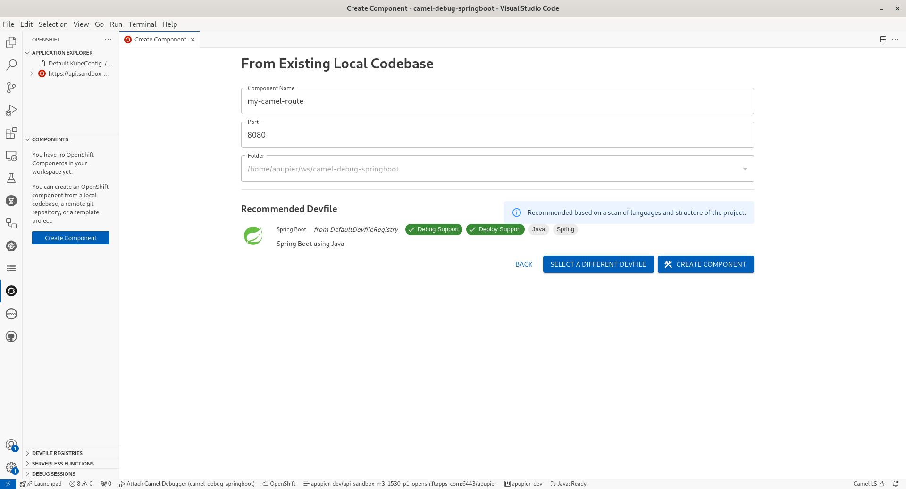

How to Camel Debug a Camel Spring Boot route deployed on OpenShift from VS Code

## Requirements

This how-to will not cover in details the following points, it is assumed that it is installed/preconfigured:

* [VS Code](https://code.visualstudio.com/) with the [Extension Pack for Apache Camel](https://marketplace.visualstudio.com/items?itemName=redhat.apache-camel-extension-pack) with a folder opened
* Active connection to an OpenShift cluster
* [JBang](https://www.jbang.dev/) available on Command-Line Interface (CLI)
* [Maven](https://maven.apache.org/) available on CLI

Note that this tutorial was made with the following versions:

* Camel 4.7.0
* VS Code Language support for Apache Camel 1.3.0
* VS Code Debug Adapter for Apache Camel 1.2.0
* VS Code OpenShift Toolkit connector 1.15.0

## Create a Camel route

* Open command palette (`Ctrl+Shift+P`)
* Search for the command `Camel: Create a Camel Route using Java DSL`
* Provide a name, for instance `MyRoute`
* Recommendation: close the editor as the corresponding file is duplicated in next step to be moved to correct place for the project.

## Create a Spring Boot project

* Open command palette (`Ctrl+Shift+P`)
* Search for the command `Camel: Create a Camel Spring Boot project`
* Default parameters can be used

You can notice the Camel route in `src/main/java/com/acme/myproject` folder (to adapt if parameters were customized)

## Pom configuration

* Open the pom.xml
* Notice that there is a `camel.debug` profile, you need to add a [Jolokia](https://jolokia.org/) enablement configuration:

```xml
         <profile>
            <id>camel.debug</id>
            <activation>
                <property>
                    <name>camel.debug</name>
                    <value>true</value>
                </property>
            </activation>
            <dependencies>
                <dependency>
                    <groupId>org.apache.camel.springboot</groupId>
                    <artifactId>camel-debug-starter</artifactId>
                </dependency>
            </dependencies>
            <build>
                <plugins>
                    <plugin>
                        <groupId>org.apache.maven.plugins</groupId>
                        <artifactId>maven-dependency-plugin</artifactId>
                        <version>3.7.1</version>
                        <executions>
                            <execution>
                                <id>copy</id>
                                <phase>generate-sources</phase>
                                <goals>
                                    <goal>copy</goal>
                                </goals>
                                <configuration>
                                    <artifactItems>
                                      <artifactItem>
                                        <groupId>org.jolokia</groupId>
                                        <artifactId>jolokia-agent-jvm</artifactId>
                                        <version>2.0.3</version>
                                        <type>jar</type>
                                        <classifier>javaagent</classifier>
                                      </artifactItem>
                                    </artifactItems>
                                    <stripVersion>true</stripVersion>
                                </configuration>
                            </execution>
                        </executions>
                    </plugin>
                    <plugin>
                        <groupId>org.springframework.boot</groupId>
                        <artifactId>spring-boot-maven-plugin</artifactId>
                        <configuration>
                            <jvmArguments>-javaagent:target/dependency/jolokia-agent-jvm-javaagent.jar=port=7878,host=localhost</jvmArguments>
                        </configuration>
                    </plugin>
                </plugins>
            </build>
        </profile>
```

In a nutshell, the Jolokia jvm agent jar is copied in target folder. Then when `springboot:run` is used, the javaagent is configured to point to this downloaded jar.

## OpenShift Component creation

* In the Activity bar (left menu), select the OpenShift activity.
* Ensure a connection is active, the `Application explorer` view in the primary sidebar should list it.
* In the `Components` view of the primary sidebar, click on `Create component`

* Click on `Create` button in panel `From Existing Local Codebase`

* Provide a Component name, for instance `my-camel-route`
* From the drop-down folder, pick the root folder of the workspace which is proposed
* Click `Next`

* Keep the recommended Spring Boot devfile and click `Create component`


## Devfile configuration

* Open the `devfile.yaml` file
* Activate the `camel.debug` profile, expose Jolokia port and configure Jolokia agent on the command starting directly from the jar, it will give something like:

```yaml
commands:
- exec:
    commandLine: mvn clean -Dmaven.repo.local=/home/user/.m2/repository package -Dmaven.test.skip=true -Pcamel.debug
    component: tools
    group:
      isDefault: true
      kind: build
    workingDir: ${PROJECT_SOURCE}
  id: build
- exec:
    commandLine: mvn -Dmaven.repo.local=/home/user/.m2/repository spring-boot:run -Pcamel.debug
    component: tools
    group:
      isDefault: true
      kind: run
    workingDir: ${PROJECT_SOURCE}
  id: run
- exec:
    commandLine: java -Xdebug -Xrunjdwp:server=y,transport=dt_socket,address=${DEBUG_PORT},suspend=n -javaagent:target/dependency/jolokia-agent-jvm-javaagent.jar=port=7878,host=localhost
      -jar target/*.jar
    component: tools
    group:
      isDefault: true
      kind: debug
    workingDir: ${PROJECT_SOURCE}
  id: debug
- apply:
    component: build
  id: build-image
- apply:
    component: deploy
  id: deployk8s
- composite:
    commands:
    - build-image
    - deployk8s
    group:
      isDefault: true
      kind: deploy
  id: deploy
components:
- container:
    command:
    - tail
    - -f
    - /dev/null
    endpoints:
    - name: port-8080-tcp
      protocol: tcp
      targetPort: 8080
    - name: port-jolokia
      protocol: http
      targetPort: 7878
    env:
    - name: DEBUG_PORT
      value: "5858"
    image: registry.access.redhat.com/ubi9/openjdk-17:1.20-2.1721752931
    memoryLimit: 768Mi
    mountSources: true
    volumeMounts:
    - name: m2
      path: /home/user/.m2
  name: tools
- name: m2
  volume:
    size: 3Gi
- image:
    dockerfile:
      buildContext: .
      rootRequired: false
      uri: docker/Dockerfile
    imageName: java-springboot-image:latest
  name: build
- kubernetes:
    endpoints:
    - name: https-8081
      protocol: https
      targetPort: 8081
    uri: kubernetes/deploy.yaml
  name: deploy
metadata:
  description: Java application using Spring Boot® and OpenJDK 17
  displayName: Spring Boot®
  globalMemoryLimit: 2674Mi
  icon: https://raw.githubusercontent.com/devfile-samples/devfile-stack-icons/main/spring.svg
  language: Java
  name: my-demo
  projectType: springboot
  tags:
  - Java
  - Spring
  version: 2.2.0
schemaVersion: 2.2.2
starterProjects:
- git:
    remotes:
      origin: https://github.com/devfile-samples/springboot-ex.git
  name: springbootproject
```

## Start in dev mode

* In OpenShift activity, right-click on the component and choose `Start dev`
* Be patient so that the application is building on OpenShift and then started
This kind of log will appear:

```
  __
 /  \__     Developing using the "my-demo" Devfile
 \__/  \    Namespace: apupier-dev
 /  \__/    odo version: v3.16.1 (817faa69f-nightly)
 \__/

↪ Running on the cluster in Dev mode
 ✓  Web console accessible at http://localhost:20000/
 ✓  API Server started at http://localhost:20000/api/v1
 ✓  API documentation accessible at http://localhost:20000/swagger-ui/
 •  Waiting for Kubernetes resources  ...
 ✓  Added storage m2 to component
===================
⚠  Pod is Pending
===================
 ✓  Pod is Running
 ✓  Syncing files into the container [2s]
 ✓  Building your application in container (command: build) [26s]
 •  Executing the application (command: debug)  ...
 ✓  Waiting for the application to be ready [16s]
 -  Forwarding from 127.0.0.1:20001 -> 8080

 -  Forwarding from 127.0.0.1:20002 -> 7878
 ```

## Check Camel route is running

* In OpenShift activity, right-click on the component and choose `Follow log`
This kind of log will appear when the route is started:

```
tools: 2024-08-09T12:54:09.436Z  INFO 104 --- [ - timer://java] MyRoute:15                               : Hello Camel from route1
```

## Configure VS Code remote debug launch configuration

* In the `odo dev` log of the started component, the mapped port for Jolokia is visible. It corresponds to the 7878. In our case, it is 20002.
* Open `.vscode/launch.json`
* Add an attach configuration through Jolokia using the mapped port found in log. It will give something like:

```yaml
{
    "name": "Attach Camel Debugger",
    "type": "apache.camel",
    "request": "attach",
    "attach_jmx_url": "service:jmx:jolokia://localhost:20002/jolokia/"
}
```

## Attach the debugger

* Open `Run and Debug` Activity (`Ctrl+Shift+D`)
* Select `Jolokia attach` in the drop-down
* Click on `Run` button

## Camel debug and Enjoy

Camel debugger is operational. You can place breakpoints, inspect ad modify variables, go step by step and more.

For instance, open `src/main/java/com/acme/myproject/MyRoute.java` and place a breakpoint on the `log` line.


Enjoy!

## What's next

Some ideas of related improvements:

* Pre-configure pom for Jolokia in camel.debug profile [CAMEL-21065](https://issues.apache.org/jira/browse/CAMEL-21065)
* Automatically configure Camel debugger and Jolokia when `springboot:run` is activated
* Include devfile when creating Spring Boot project
* Provide a Camel specific devfile in devfile registry
* Provide contextual menu to attach Camel debugger automatically in component view
* Support automatic reconnection of debugger when route is reloaded [FUSETOOLS2-1624](https://issues.redhat.com/projects/FUSETOOLS2/issues/FUSETOOLS2-1624)

Please provide feedback and ideas with your preferred channel:

- [Zulip #camel-tooling channel](https://camel.zulipchat.com/#narrow/stream/258729-camel-tooling)
- [Debug Adapter for Apache Camel GitHub Issues](https://github.com/camel-tooling/camel-dap-client-vscode/issues)
- [Red Hat Bug Tracker FUSETOOLS2](https://issues.redhat.com/browse/FUSETOOLS2)
