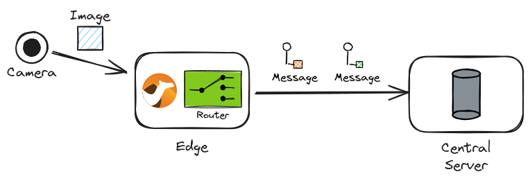
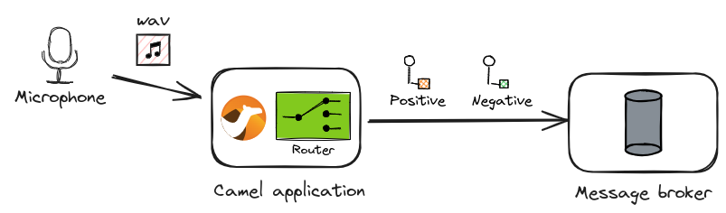

[Apache Camel AI](/components/next/ai-summary.html) is a set of components that allow various AI-related technologies to be integrated with Camel.

Nowadays, LLMs such as OpenAI ChatGPT and Meta Llama are gaining a lot of attention, and many frameworks and tools are exploring ways to utilise them. Camel AI also includes the LangChain4j component suite, and there are already blog posts about how you can utilise LLMs using [LangChain4j](https://docs.langchain4j.dev/) in the Camel Blog:

- [Integrate your AI models effortlessly with Apache Camel](/blog/2024/02/camel-whatsapp-langchain4j/) by Federico Mariani.
- [Experimenting extraction from unstructured data with Apache Camel and LangChain4j](/blog/2024/07/data-extraction-first-experiment/) by Alexandre Gallice

Behind this focus on LLMs, there is an often overlooked but yet important AI technology: inference using traditional neural network models that are not Transformer-based.

## Camel DJL component

The [DJL component](/components/next/djl-component.html) is a Camel component that allows you to integrate [Deep Java Library](https://djl.ai/), a deep learning library for Java, with your Camel routes. The component can run models trained with popular machine learning frameworks such as PyTorch and TensorFlow to do inference in Java. It also supports models in [ONNX](https://onnx.ai/) format, a standard format for machine learning models.

The idea of incorporating the inference of these traditional machine learning models in system-to-system integration has not yet been fully explored. One of the features of traditional machine learning models compared to LLMs is that inference is a relatively lightweight process and thus can be performed on the fly in an integration.

Unlike LLMs, each machine learning model is dedicated to a particular application, as follows:

- Computer vision (CV)
  - Image classification
  - Object detection and image segmentation
  - Body, facial expression and gesture analysis
  - Image manipulation
- Natural language processing (NLP)
  - Machine comprehension
  - Machine translation
  - Q&A
- Other
  - Speech recognition
  - Time series forecasting
  - Recommendation engines

The DJL component will be significantly improved in the coming Camel 4.8.0 LTS release [^1]. It will allow performing inference with models for those various applications.

[^1]: Actually, it has been already improved since 4.7.0. See: [Apache Camel 4.7 What's new](/blog/2024/07/camel47-whatsnew/)

This blog post presents two examples of Camel AI that combine image recognition, natural language processing and speech recognition, to demonstrate what kinds of intelligent routing become possible with the DJL component that were nearly infeasible without it on Camel.

## Image to Text routing

One of the areas where neural network models excel is image processing: without AI technologies, it would be almost impossible to implement Camel routing that can identify objects in an incoming image, classify what is in it, and so on. The DJL component makes it easy to implement routings for such processing in real-time.

Let's consider an example of edge AI. In this scenario, image data is recorded in snapshots from a camera input at the edge terminal, which is then read by Camel to perform classification and route the results to a central server.



### Image to Text: Source code

To realise this scenario, we use two pre-trained neural network models: [SSD](https://arxiv.org/abs/1512.02325) and [ResNet](https://en.wikipedia.org/wiki/Residual_neural_network). The code is as follows:

```java:image_to_text.java
// camel-k: dependency=camel:djl
//DEPS ai.djl.pytorch:pytorch-engine:0.29.0
//DEPS ai.djl.pytorch:pytorch-model-zoo:0.29.0
//DEPS net.sf.extjwnl:extjwnl:2.0.5
//DEPS net.sf.extjwnl:extjwnl-data-wn31:1.2

import java.util.List;
import org.apache.camel.Exchange;
import org.apache.camel.RuntimeCamelException;
import org.apache.camel.builder.RouteBuilder;
import org.apache.camel.component.djl.DJLConstants;
import ai.djl.modality.Classifications;
import ai.djl.modality.cv.Image;
import net.sf.extjwnl.data.POS;
import net.sf.extjwnl.data.PointerUtils;
import net.sf.extjwnl.dictionary.Dictionary;

public class image_to_text extends RouteBuilder {

    @Override
    public void configure() throws Exception {
        from("file:data/inbox?include=.*\\.(jpg|png)")    // (1)
            .log("Processing: ${headers.camelFileName}")
            .to("djl:cv/object_detection?artifactId=ssd") // (2)
            .convertBodyTo(Image[].class)                 // (3)
            .split(body())                                           // (4)
                .to("djl:cv/image_classification?artifactId=resnet") // (4)
                /*
                 * The output from the image classification model is classified
                 * as one of 1000 labels from WordNet.
                 * Since it's too fine-grained, we want to find the higher-level
                 * group (= hypernym) for the classification using the WordNet
                 * dictionary.
                 */
                .process(this::extractClassName)          // (5)
                .process(this::addHypernym)               // (5)
                .log("  => ${body}");                     // (6)
    }

    void extractClassName(Exchange exchange) {
        var body = exchange.getMessage().getBody(Classifications.class);
        var className = body.best().getClassName().split(",")[0].split(" ", 2)[1];
        exchange.getMessage().setBody(className);
    }

    void addHypernym(Exchange exchange) throws Exception {
        var className = exchange.getMessage().getBody(String.class);
        var dic = Dictionary.getDefaultResourceInstance();
        var word = dic.getIndexWord(POS.NOUN, className);
        if (word == null) {
            throw new RuntimeCamelException("Word not found: " + className);
        }
        var hypernyms = PointerUtils.getDirectHypernyms(word.getSenses().get(0));
        var hypernym = hypernyms.stream()
                .map(h -> h.getSynset().getWords().get(0).getLemma())
                .findFirst().orElse(className);
        exchange.getMessage().setBody(List.of(className, hypernym));
    }
}
```

What the code does is as follows:

1. Read image files (`.jpg` or `.png`) from the `data/inbox` directory
2. Feed them to a pre-trained SSD model for object detection
3. Convert the results of type `DetectedObjects` to `Image[]`
4. Split the `Image[]` data one by one and feed each into a pre-trained ResNet model for image classification
5. Look up the hypernym of each classification result with the WordNet database
6. Output the final results to log (or send them as a message to the central server in a real scenario)

### Image to Text: Running the example

The code can be run with [Camel JBang](/manual/camel-jbang.html):

```console
camel run --camel-version=4.8.0-SNAPSHOT image_to_text.java
```

(Post 4.8.0)

```console
camel run image_to_text.java
```

For example, let's copy an image of [Kabosu](https://kabosu112.exblog.jp/iv/detail/?s=9944144&i=201002%2F12%2F90%2Fa0126590_22301391.jpg) a.k.a. Doge into `data/inbox`. We should get the following result:

```console
cp doge.jpg data/inbox
```

```text
INFO 26599 --- [le://data/inbox] image_to_text.java:26 : Processing: doge.jpg
INFO 26599 --- [le://data/inbox] image_to_text.java:43 :   => [dingo, wild dog]
```

### GitHub repository of Image to Text sample code

The sample code is available in the following GitHub repository:

<https://github.com/megacamelus/camel-ai-examples/tree/main/image-to-text>

## Speech to Text routing

Another area where neural network models are particularly proficient is natural language processing. AI is excellent at ambiguous natural language processing that is difficult to represent with algorithms, such as knowledge-based Q&A, sentiment analysis of texts and machine translation.

Let's consider another example, which combines sentiment analysis of sentences with speech recognition. Wave files recorded from a microphone input are read by Camel to convert them into texts by speech recognition and then apply sentiment analysis to determine whether they are positive or negative.



### Speech to Text: Source code

_**WARNING:** At the moment, this sample code does not work on macOS (Apple Silicon). It is because the speech recognition model used is not compatible with Apple Silicon chips._

To realise this scenario, we combine two pre-trained neural network models: [wav2vec 2.0](https://arxiv.org/abs/2006.11477) and [DistilBERT](https://medium.com/huggingface/distilbert-8cf3380435b5). Here is the code:

```java
// camel-k: dependency=camel:djl
//DEPS ai.djl.pytorch:pytorch-engine:0.29.0
//DEPS ai.djl.pytorch:pytorch-model-zoo:0.29.0

import java.io.IOException;
import java.net.URI;
import java.net.URISyntaxException;
import java.nio.file.Files;
import org.apache.camel.builder.RouteBuilder;
import ai.djl.MalformedModelException;
import ai.djl.Model;
import ai.djl.modality.audio.translator.SpeechRecognitionTranslator;
import ai.djl.util.ZipUtils;

public class speech_to_text extends RouteBuilder {

    static final String MODEL_URL = "https://resources.djl.ai/test-models/pytorch/wav2vec2.zip";
    static final String MODEL_NAME = "wav2vec2.ptl";

    @Override
    public void configure() throws Exception {
        loadSpeechToTextModel();

        from("file:data/inbox?include=.*\\.wav")                    // (1)
            .log("Processing: ${headers.camelFileName}")
            .to("djl:audio?model=SpeechToTextModel&translator=SpeechToTextTranslator") // (2)
            // The output of the model is all uppercase, which tends to be recognised
            // as negative by the following distilbert model
            .setBody(simple("${body.toLowerCase()}"))
            .log("  => ${body}")
            .to("djl:nlp/sentiment_analysis?artifactId=distilbert") // (3)
            .log("  => ${body.best}");                              // (4)
    }

    void loadSpeechToTextModel() throws IOException, MalformedModelException, URISyntaxException {
        // Load a model
        var model = Model.newInstance(MODEL_NAME);
        // TfModel doesn't allow direct loading from remote input stream yet
        // https://github.com/deepjavalibrary/djl/issues/3303
        var modelDir = Files.createTempDirectory(MODEL_NAME);
        ZipUtils.unzip(new URI(MODEL_URL).toURL().openStream(), modelDir);
        model.load(modelDir);

        // Bind model beans
        var context = getContext();
        context.getRegistry().bind("SpeechToTextModel", model);
        context.getRegistry().bind("SpeechToTextTranslator", new SpeechRecognitionTranslator());
    }
}
```

What the code does is as follows:

1. Read audio files (`.wav`) from the `data/inbox` directory
2. Feed them to a pre-trained wav2vec 2.0 model for speech recognition
3. Apply the resulted texts to a pre-trained DistilBERT model for sentiment analysis (classified as either `positive` or `negative`)
4. Output the best results to log (or route them as a message to a queue in the message broker in a real scenario)

### Speech to Text: Running the example

This can also be run directly with Camel JBang:

```console
camel run --camel-version=4.8.0-SNAPSHOT speech_to_text.java
```

(Post 4.8.0)

```console
camel run speech_to_text.java
```

Let's try downloading sample Wave files `speech*.wav` from the [sample repository](https://github.com/megacamelus/camel-ai-examples/tree/main/data/speech) and copying them into `data/inbox`:

```console
cp speech1.wav data/inbox
cp speech2.wav data/inbox
cp speech3.wav data/inbox
```

You will get the following results:

```text
INFO 3351853 --- [le://data/inbox] speech_to_text.java:26 : Processing: speech1.wav
INFO 3351853 --- [le://data/inbox] speech_to_text.java:31 :   => oh grreat many things so
INFO 3351853 --- [le://data/inbox] speech_to_text.java:33 :   => {"class": "Positive", "probability": 0.87968}
INFO 3351853 --- [le://data/inbox] speech_to_text.java:26 : Processing: speech2.wav
INFO 3351853 --- [le://data/inbox] speech_to_text.java:31 :   => dan this is not acceptable i've not even been notified about this automatic change
INFO 3351853 --- [le://data/inbox] speech_to_text.java:33 :   => {"class": "Negative", "probability": 0.99945}
INFO 3351853 --- [le://data/inbox] speech_to_text.java:26 : Processing: speech3.wav
INFO 3351853 --- [le://data/inbox] speech_to_text.java:31 :   => many thanks that's so helpful i'm a bit more relieved now
INFO 3351853 --- [le://data/inbox] speech_to_text.java:33 :   => {"class": "Positive", "probability": 0.97949}
```

### GitHub repository of Speech to Text sample code

The sample code is available in the following GitHub repository:

<https://github.com/megacamelus/camel-ai-examples/tree/main/speech-to-text>

## How can inference be made more accurate?

I hope that the two samples using the DJL component have shown that there is great potential in the combination of Camel and neural networks. On the other hand, some of you may not have been satisfied with the results of running the samples.

The reliability of the outputs of an AI solution using machine learning models ultimately depends on how accurate the models are for the specific applications. All of the sample code here use only publicly available pre-trained models. There are already a large number of highly accurate pre-trained models available in the world:

- [ONNX Model Zoo](https://github.com/onnx/models)
- [OpenVINO - Open Model Zoo repository](https://github.com/openvinotoolkit/open_model_zoo)
- [PINTO_model_zoo](https://github.com/PINTO0309/PINTO_model_zoo)

To begin with, you can easily start building interesting AI solutions as Camel routing by simply combining some of the published models.

Then, when you get to the stage where you need more rigorous inference accuracy, you will eventually need to train your own custom models. This principle applies not just to Camel AI but to the development of any AI solution. In such cases, you will need to prepare your own custom dataset and environment for model training. Fortunately, Camel DJL component supports various model formats such as PyTorch, TensorFlow and ONNX, so you can use classic PyTorch and TensorFlow frameworks directly for model training.

## Where to perform inference: embedded vs. external serving

There is another important topic to consider when building routing with machine learning models in Camel: where inference should be performed.

In the examples, all inference is performed _embedded_ within the Camel route. This is because, unlike LLMs, it can perform inference at a speed that makes it possible. Nevertheless, multi-dimensional array data sent as messages must be computed in the multiple layers of a model. If the messages to be processed are large, or the model is complex with many layers, additional computational resources such as GPUs may be required to run the Camel route.

When implementing a full-fledged machine learning solution with a Camel route, what can be more scalable is a configuration that delegates the execution of inference to an external server; machine learning frameworks such as PyTorch and TensorFlow provide the _serving_ features that allow the frameworks' inference engines to act as external servers via REST APIs. Camel can consume the inference servers as a REST client. In this case, Camel does not perform the inference directly in a route, but delegates it by calling the API over HTTP. Experts recommend this approach as it is considered easier to scale out as an enterprise AI solution.

Which configuration really performs better is a difficult question. It reminds me of the EJB vs. POJO debate back in the application server days of the 2000s. The question is whether heavy processing should be distributed remotely or whether everything should be executed locally. In practice, it would be a trade-off between the efficiency of inference execution and the cost of transferring multi-dimensional arrays of input data over the network to make remote calls. Without benchmarking, it should not be possible to know which is really better.

## Summary

We have seen that the DJL component in the next Camel 4.8.0 LTS release will enable intelligent routing using various neural network models.

There is still much room for the application of LLM and other AI technologies in the field of Camel-enabled enterprise integration. In fact, the idea of using neural network models in the world of system-to-system integration and Enterprise Integration Patterns (EIP) has only just begun to be explored. We will continue to enhance the DJL component and add more new components to further extend the capabilities of Camel AI.

We will also continue to provide various examples of Camel AI in the following repository. If you are interested in this subject, please follow this repository:

<https://github.com/megacamelus/camel-ai-examples>
