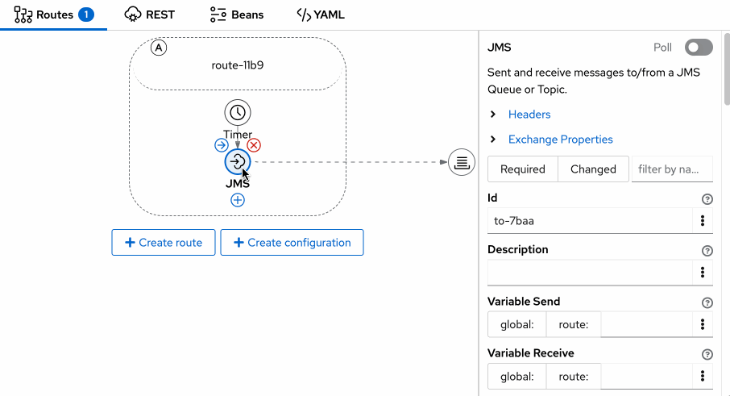
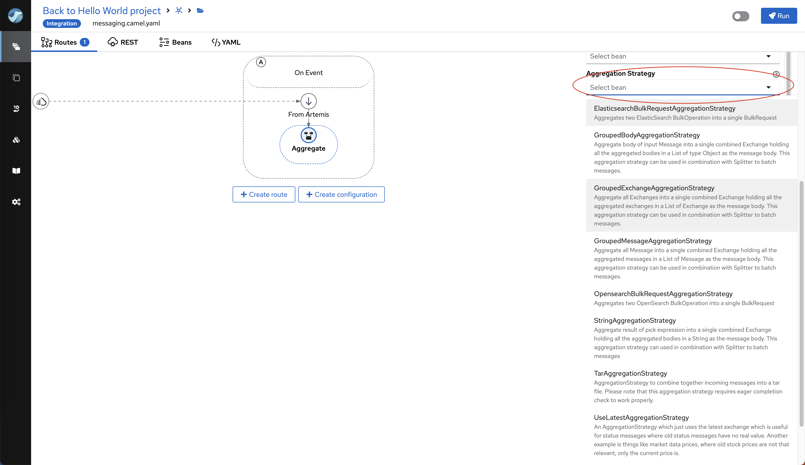
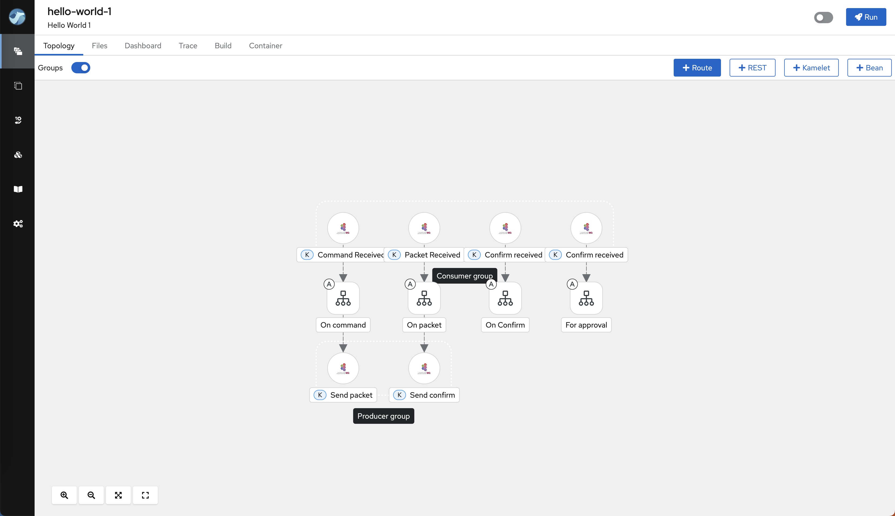
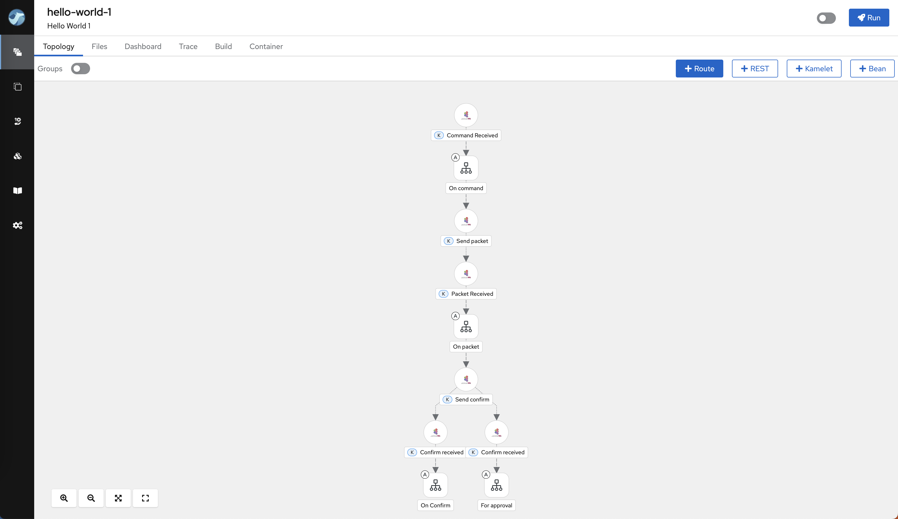
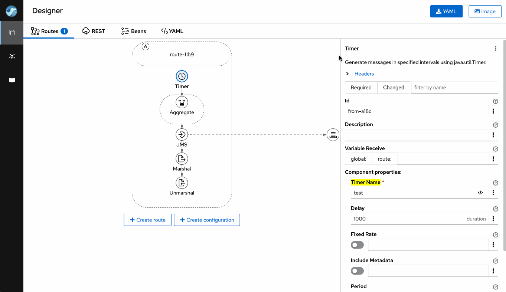
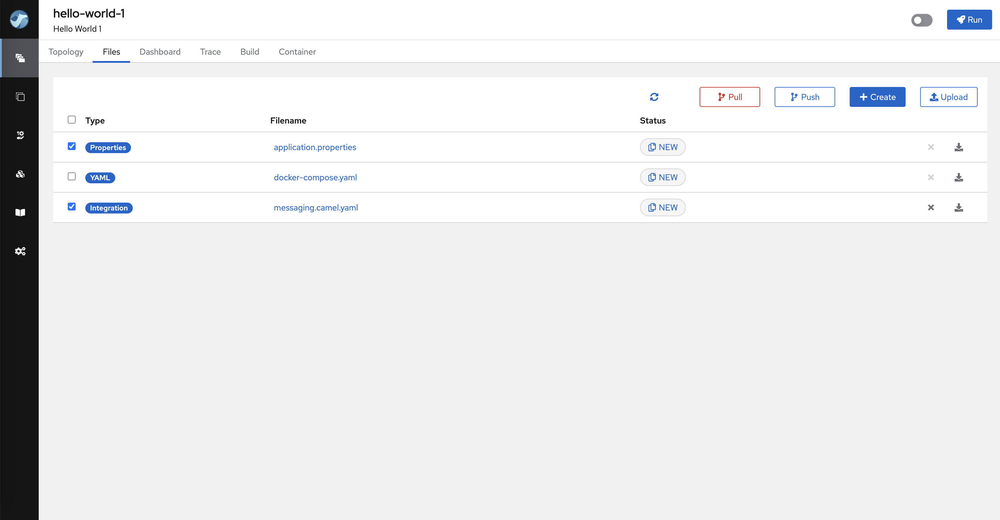
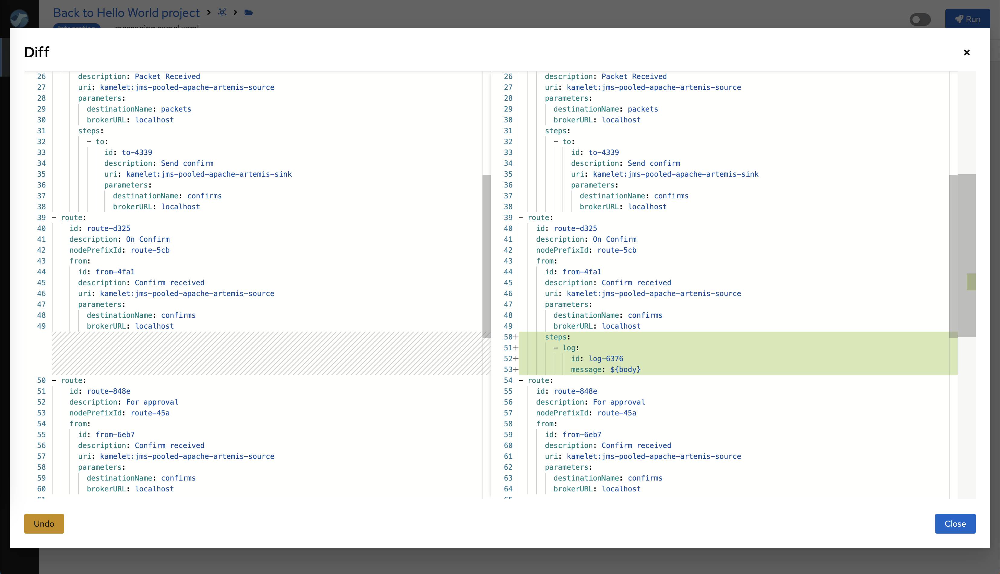
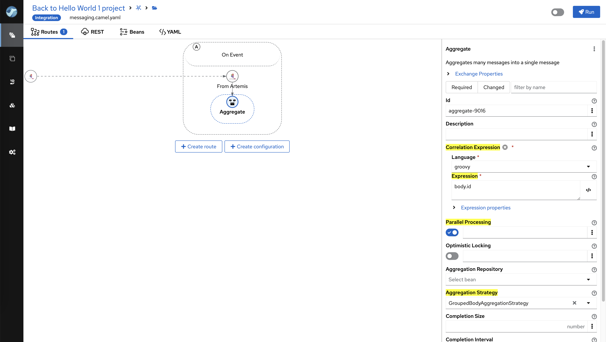
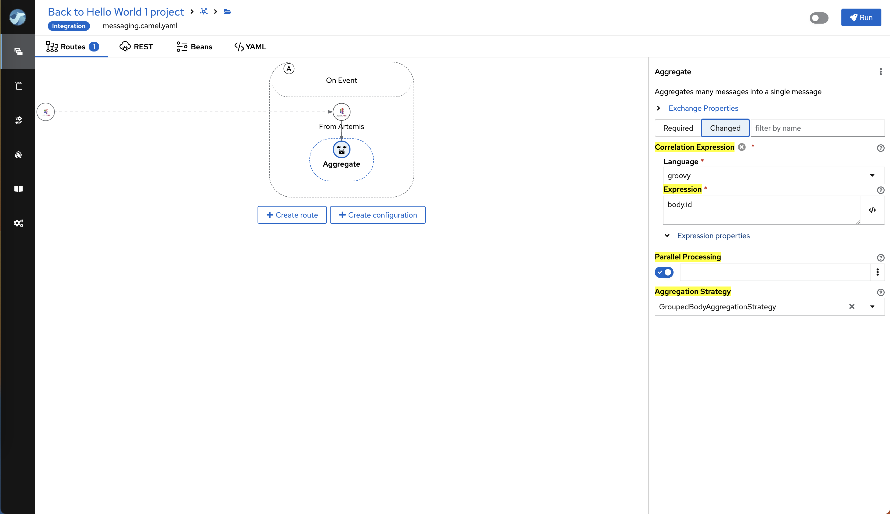
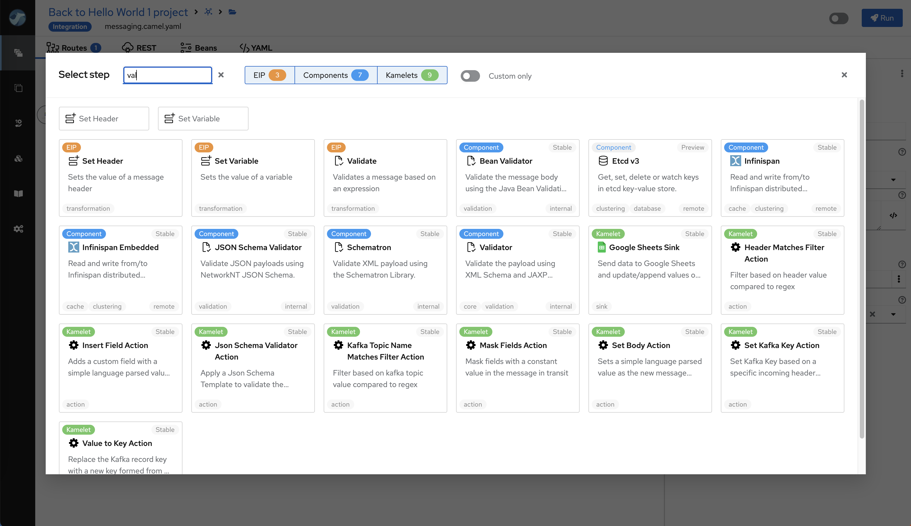

We’re excited to announce the release of **Apache Camel Karavan 4.8.0**, the ultimate toolkit for efficient and accelerated integration development with Apache Camel. This version is fully synchronized with the latest Apache Camel Framework 4.8.0, ensuring seamless compatibility and allowing you to take advantage of the newest features for an optimized development experience.

## What's New in Apache Camel Karavan 4.8.0?

Our latest release brings a slew of improvements aimed at making your integration development more efficient and intuitive. Here are the key enhancements:

### Easy Poll Maker
Apache Camel 4.8.0 introduces the new `poll` EIP, a simpler alternative to the existing `pollEnrich` EIP. With this update, users can easily switch between Producer (`to`) and Consumer (`poll`) elements based on the desired integration behavior. Karavan visualizes this functionality clearly, ensuring an intuitive and user-friendly experience.

### Magic beans
**Aggregator and Idempotent** now provide a list of available beans directly in the Properties panel, making it easier to configure and manage these integration processors.

   

### Connect the Dots
The Topology view has been upgraded to offer two types of visualization for route interactions and connections:

- **Grouped Consumers and Producers**: Displays consumers and producers grouped together, providing a consolidated view of the route components.

- **Connected Consumers and Producers with Matched URIs**: Shows direct connections between consumers and producers with matching URIs, making it easier to understand the flow and relationships between different routes.

### Forewarned Is Forearmed
- **Improved Security Alerts:** The Designer now highlights steps in red if a sensitive field contains a plain value. This visual warning helps you avoid security risks by ensuring that sensitive information is not exposed directly.
- **Use Placeholders for Sensitive Fields:** It is recommended to set sensitive fields using placeholders. Apache Camel supports various options for securely handling sensitive data, including environment variables, Kubernetes secrets, and different types of vaults.

### Never Too Late
Previously, changing the initial Component or Kamelet of a route (`from`) required manually editing the YAML file—a tedious and error-prone task. With this release, users can now change the initial Component or Kamelet directly through the user interface, eliminating the need for manual edits and reducing the risk of errors.

### To Commit or Not to Commit
**File Selection for Commits:** Users can now select specific files to include in a commit, providing greater control over versioning and project management.

### Bring It Back
**Revert to Last Committed Version:** Users can now easily revert all changes in any file that has not yet been committed, returning it to the latest committed version. This feature allows for quick rollbacks and helps maintain a clean and consistent development environment.

### Properties Juggling
The Property Panel has been enhanced to provide better visibility and control over configuration properties. Key improvements include:

- **Highlighting Changes**: Properties that have been modified or differ from their default values are now visually highlighted.
- **Filtering Options**: Users can filter properties to display only those that are required or have been changed.
- **Search Functionality**: The panel now includes a search feature, allowing users to quickly find properties by name.

These updates make it simpler to manage and navigate through property configurations, leading to a more efficient development experience.

   

   

### Three Course Meal
- **Enhanced Element Selector:** The element selector now displays all available EIP Processors, Components, and Kamelets, allowing users to select the next step with fewer clicks.
- **Improved Search and Filtering:** Users can now search elements by name or description and filter them by type (Component, Kamelet, or EIP Processor), streamlining the process of finding and using the right elements in their integrations.

## Latest Versions

Stay up to date with the latest versions included in this release:

**Camel 4.8.0**

**Kamelets 4.8.0**

**Jkube 1.17.0**

**JBang 0.118.0**

**Quarkus 3.15.0**

## Conclusion

Apache Camel Karavan 4.8.0 is packed with features and improvements designed to enhance your integration development process. By adapting to your environment, improving file management, and providing better visualization and performance, this release ensures that you have the most powerful and efficient tools at your disposal.

Upgrade to Apache Camel Karavan 4.8.0 today and experience the future of integration development!

For detailed documentation and download links, visit the [Apache Camel Karavan](https://github.com/apache/camel-karavan) page.

**Happy integrating!**