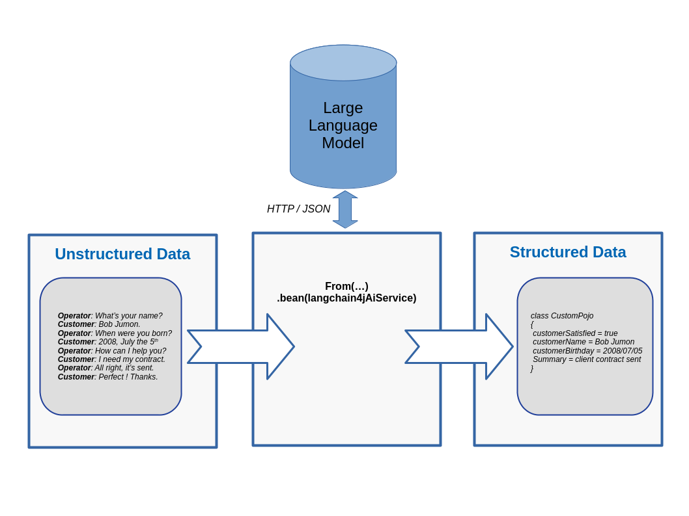

This blog post shows a concrete example of transforming raw unstructured text into structured Java objects with [Camel Quarkus](/camel-quarkus/3.8.x/index.html) and [Quarkus LangChain4j](https://docs.quarkiverse.io/quarkus-langchain4j/dev/index.html).

# Introduction

Following previous [experiments about unstructured data extraction](/blog/2024/07/data-extraction-first-experiment/), some directions were given about how a large language model could be setup to transform unstructured data into its structured counterpart. In this blog post, we will see a ready to use example that could serve as a starting point to create your own Camel route performing data extraction.

Let's imagine an insurance company where an integration flow look as below:



Some raw text conversations are provided as input. A [Quarkus LangChain4j AI service](https://docs.quarkiverse.io/quarkus-langchain4j/dev/ai-services.html), will then build a prompt requesting a large language model to extract some information. After a bit of inferencing time, the large language model answers with a JSON document strictly complying to a target schema. Finally, the JSON answer is transformed into a Java object. Let's see this in action.

# Run the example

The complete example implemented with Camel Quarkus is located [here](https://github.com/apache/camel-quarkus-examples/tree/camel-quarkus-main/data-extract-langchain4j).

All instructions are provided in the [README](https://github.com/apache/camel-quarkus-examples/blob/camel-quarkus-main/data-extract-langchain4j/README.adoc) file.
Let's see it by running some commands in 3 distinct terminals:

Serve a large language model from a first terminal:

```shell
docker run -p11434:11434 langchain4j/ollama-codellama:latest
```

Compile and run the Camel Quarkus route from a second terminal:

```shell
git clone https://github.com/apache/camel-quarkus-examples.git
cd camel-quarkus-examples/
git checkout camel-quarkus-main
cd data-extract-langchain4j/
mvn clean package -DskipTests
java -jar target/quarkus-app/quarkus-run.jar
```

Send raw text conversations to the Camel route from a third terminal:

```shell
cd camel-quarkus-examples/data-extract-langchain4j/
cp -rf src/test/resources/transcripts/ target/transcripts-tmp
mv target/transcripts-tmp/*.json target/transcripts/
```

After a few minutes of inference, you should see extracted Java objects as below:

```shell
{
    "customerSatisfied": "false",
    "customerName": "John Doe",
    "customerBirthday": "01 November 2001",
    "summary": "Insurance company failed to notify customer of automatic cancellation of full reimbursement option and only provided half reimbursement for accident."
}
```

Some technical explanations were already given in the [previous blog post](/blog/2024/07/data-extraction-first-experiment/).
Still, this Camel Quarkus example contains a few more tips that we will review in the next section.

# Technical explanations

As we use Quarkus LangChain4j, we are able to register an [AI service](https://docs.quarkiverse.io/quarkus-langchain4j/dev/ai-services.html) in the registry by using the `@io.quarkiverse.langchain4j.RegisterAiService` annotation like below:

```java
@RegisterAiService
@ApplicationScoped
public interface CustomPojoExtractionService {
...
  @Handler
  CustomPojo extractFromText(String text);
...
}
```

Furthermore, notice how we are using the `@org.apache.camel.Handler` annotation to specify that Camel needs to invoke the `extractFromText` method.
Logically, we should be able to use the full power of [the bean binding](/manual/bean-binding.html), even with Quarkus LangChain4j AI services.
Could you imagine injecting Camel headers and variables into the LLM prompt?

Once the AI service is available in the registry, it's easy to invoke it from a Camel route, for instance, as below:

```java
from("file:target/transcripts")
  .setBody(jsonpath("$.content"))
  .bean(customPojoExtractionService)
```

See how we consume the conversation transcripts from files.
Then, we get the raw text transcripts from the JSON field name content.
Finally, we use the `bean` keyword to let Camel bind the incoming exchange to the AI service method named `extractFromText`.
As a result, the conversation transcript will be injected into the method parameter named `text`.

That said, there is a last thing to understand.
So, the method parameter named `text` will automatically be inserted into the prompt through the `{text}` placeholder, like below.

```
String PROMPT = "Extract information about a customer from the text delimited by triple backticks: ```{text}```.";
...
...
CustomPojo extractFromText(String text);
```

So, the parameter name is important and need to be present in the JVM byte code.
As such, we need to explicitly use the `-parameters` argument of the `maven-compiler-plugin`:

```xml
<plugin>
 <groupId>org.apache.maven.plugins</groupId>
 <artifactId>maven-compiler-plugin</artifactId>
 <configuration>
  <compilerArgs>
   <arg>-parameters</arg>
  </compilerArgs>
 </configuration>
</plugin>
```

If we don't configure the `maven-compiler-plugin` as above, we would need to annotate the method parameter as below:

```java
CustomPojo extractFromText(@dev.langchain4j.service.V("text") String text);
```

That's it folks, we now have covered the key technical explanations needed.

# Conclusion

Camel is already known as a good bridge to integrate old technologies with new technologies, low level systems with high level systems.
Now, we have seen that it's technically possible to use Camel in order to transform unstructured data into structured data.

As the volume of unstructured data is rapidly growing while IT folks struggle to get value from it, data extraction could take more importance.
But this unstructured data might come from a source system, and the resulting structured data would probably need to be stored in a target system.
Told that way, it seems Apache Camel routes doing data extraction could become a good asset.

That said, this example only demonstrates a working prototype.
It would be very interesting to see a concrete larger scale experiment with actual data from a true organization.
It should possible to learn what accuracy is achievable from 100 raw texts with their corresponding expected JSON output.
Having access to some GPUs could speed up the inference computation that takes quite some time to be honest.
If any reader would be interested in such a larger scale experiment, feel welcome to ping us.
