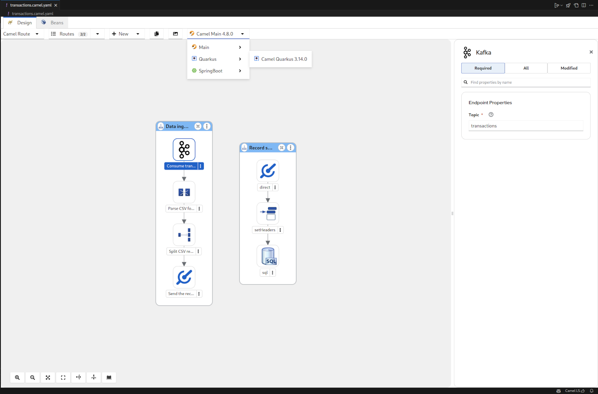
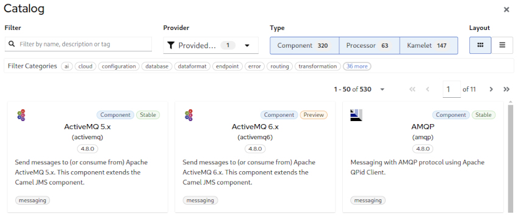
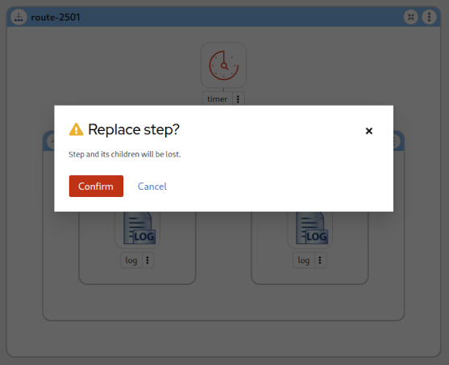

Following the Apache Camel 4.8 release, we are happy to announce the release of Kaoto 2.2 with many improvements to enhance the user experience.

This time, the theme was to improve the visualizations and the user experience in the Canvas, as well as to provide more flexibility to the users. Read on to discover the key highlights of this release and how they can improve your workflow with Kaoto.

## What’s New in Kaoto 2.2?

### New look and feel
The flow elements have been redesigned to provide a more modern and clean look. The new design is more intuitive and user-friendly, making it easier to work with your integrations.

### Added containers for better organization
This feature allows you to expand and collapse integration parts, making it easier to work with complex integrations.

### Open source code to the side
There is a quick action button to open the source code with a single click, making it easier to work with both the visual and textual representation of your integration.

### Filter configuration properties
You can now filter the configuration properties in the side panel, showing by default the required properties, and allowing you to see the modified ones as well.

| Required properties | Modified properties |
| --- | --- |
|  |  |

### Updated the components icons
The icons for the components have been updated to provide a more consistent and modern look, especially around the AI related components.

### Pagination for the catalog
The catalog now supports pagination, making it easier and faster to navigate through the components and find the one you need.

### Warning when replacing steps
When replacing a step in the canvas, you will now get a warning if the step you are replacing has child steps, preventing you from losing your work.

### Choose the label to display
You can now choose whether to use the step id or the step description for the step labels, offering more flexibility in how you work with the canvas.

### Remember side bar width
The side panel width is now remembered between sessions, making it easier to work with the side panel.

### Expose models through the NPM package
You can now use the Kaoto models in your own projects by installing the Kaoto NPM package, making easier to integrate Kaoto in your own projects.

## Let's build it together

Let us know what you think by joining us in the [GitHub discussions](https://github.com/orgs/KaotoIO/discussions). Do you have an idea how to improve Kaoto? Would you love to see a useful feature implemented or simply ask a question? Please do so [here](https://github.com/KaotoIO/kaoto/issues/new/choose).

You can also join the [Kaoto channel](https://camel.zulipchat.com/#narrow/stream/441302-kaoto) on the Camel Zulip Chat.

You can also check out our [examples repository](https://github.com/KaotoIO/kaoto-examples) to see some more advanced use cases which were set up using Kaoto.

**All contributions are welcome!**

## What comes next?

Kaoto 2.2 is a step forward in our commitment to prove a powerful and flexible visual integration platform. We’ll continue to focus on improving the usability, adding new features, and making Kaoto the best tool for your integration needs.

Kaoto continues to be available as [a VS Code extension](https://marketplace.visualstudio.com/items?itemName=redhat.vscode-kaoto), ensuring seamless integration into your development environment. We also host [a showcase environment](https://kaotoio.github.io/kaoto/) accessible in your browser for easy exploring.

Feel free to explore the new features and improvements, and let us know what you think!

---

We invite you to explore these new features on your fashion integrations.

Give it a try today and [tell us](https://github.com/orgs/KaotoIO/discussions) about your experience!
