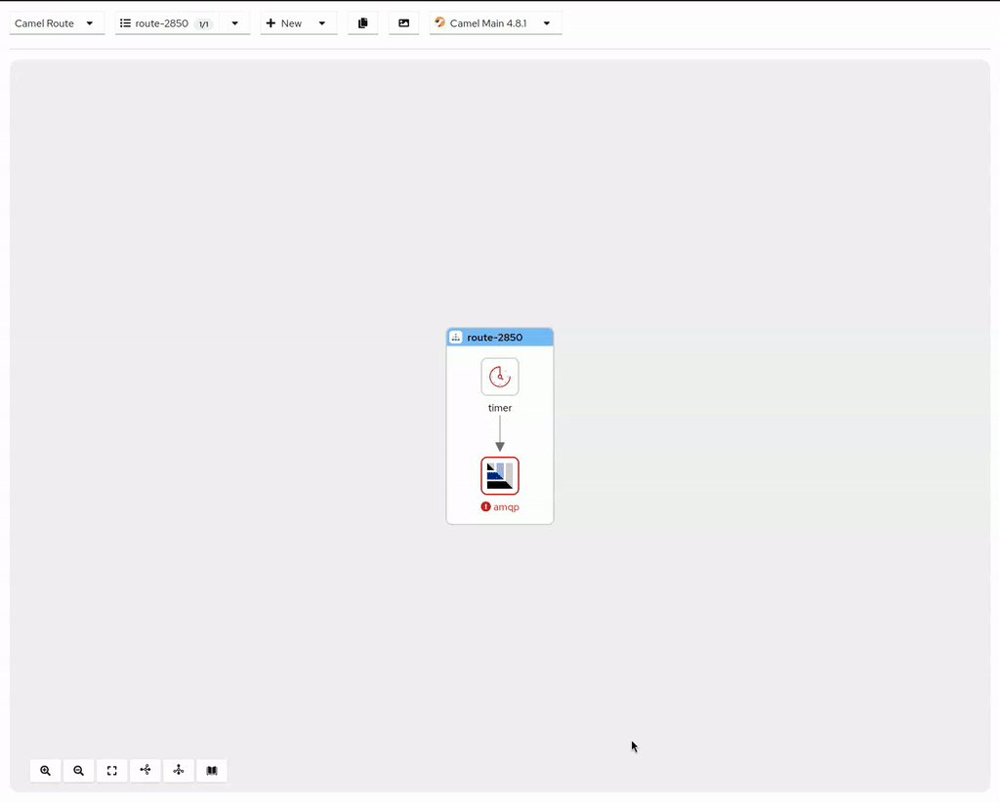
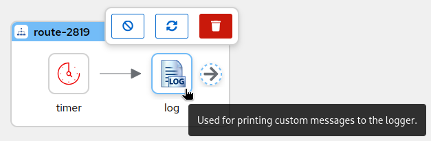
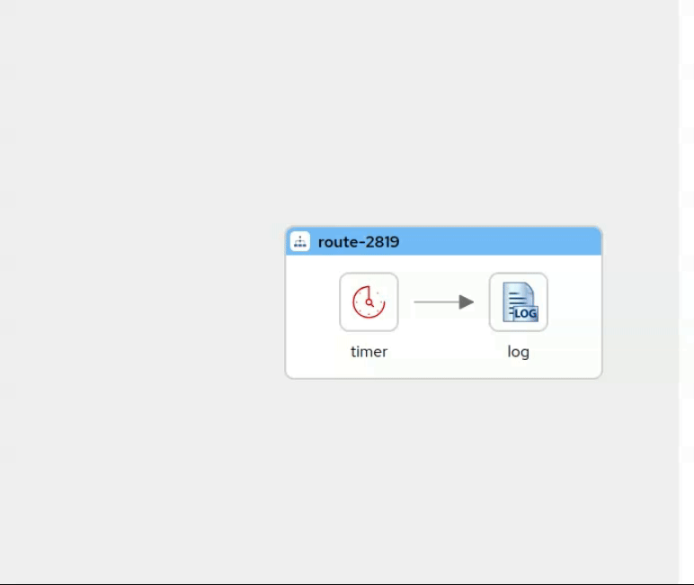
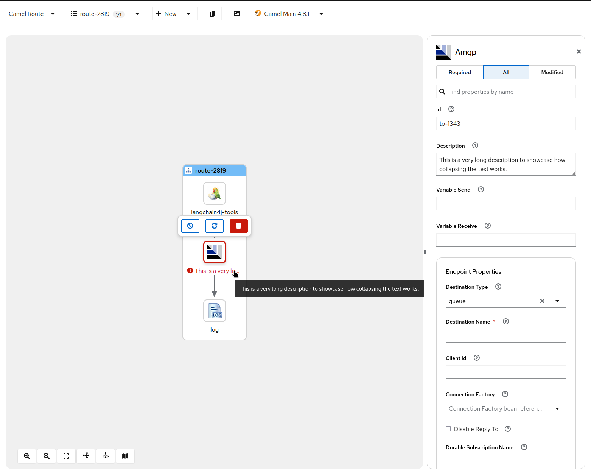

Following the Apache Camel 4.9.0 release, we're happy to announce the release of Kaoto 2.3.

## What’s New in Kaoto 2.3?

We're thrilled to announce the release of Kaoto 2.3, bringing new features, improvements, and bug fixes to enhance your integration experience.
This release also brings the first technical preview of a long awaited feature: the Kaoto DataMapper with the ability to perform data transformations using Camel.

## Here are the key highlights of this release:

### Kaoto DataMapper technical preview
In this release, we are introducing the new **Kaoto DataMapper**, a graphical way of authoring data mappings inside your routes using Kaoto.

#### How to use it?
When creating a Camel route, like any other step, just search for **Kaoto DataMapper** in the catalog and add it from there.

| Tile view                          | List view                          |
|------------------------------------|------------------------------------|
|  |  |

Once the **Kaoto DataMapper** step is added in the route, you can launch it using by clicking the `Configure` button in config form.

Now you can attach the XML schema file to render the Document structure as a tree, and start creating data mappings by drag and drop between those.

When you don't yet have an active DataMapper canvas opened, if you click the `DataMapper` tab, it shows the built-in step-by-step instructions of how to use Kaoto DataMapper UI.

As an initial technical preview version, Kaoto DataMapper only supports XML schema for rendering the data structure.
And it internally generates a single XSLT step to perform configured data mappings at runtime.
While you can consume multiple XML documents with using Camel Variables and/or Message Headers that are mapped to XSLT Parameters, the output is only a Camel Message Body for this release.

#### What's next for the Kaoto DataMapper?

We have a plan to iteratively add more features to the Kaoto DataMapper, for example:
 - JSON support
 - Improve XPath expression editor
   - syntax assist & highlight
   - better Drag and Drop capability for fields and functions
 - Data Preview - feed an example input, and instantly see the mapping outcome directly in the UI
 - Support Setting Camel Variables/Message Headers directly in the UI
 - Support assuming data structure (schema) by attaching a data example, such as XML instance and JSON instance
 - `xs:include` and `xs:import` support for XML schema
 - Enum mapping

and much more, so stay tuned!

### [Breaking] deprecated URI field serialization in favor of the YAML parameters field approach
The URI field has been deprecated in favor of the YAML parameters field approach. This change allows for a more flexible and user-friendly experience when configuring components.

| URI serialized | Parameters serialized |
| --- | --- |
|  |  |

### Improved look and feel
The canvas look and feel has been redesigned to provide a more modern and clean look. The new design is cleaner, with less borders and wider, making it more intuitive and user-friendly.

### More Camel versions included in the catalog
Kaoto includes more Camel versions in the catalog, providing a more comprehensive and up-to-date experience when working with different versions of Camel. By default it will bring the latest version of Camel, plus the last 2 LTS versions.
Kaoto 2.3 includes the following Camel versions:
| Runtime     | Versions                                                        |
| ---         | ---                                                             |
| Core        | 4.9.0, 4.8.2, 4.4.4                                             |
| Quarkus     | 3.17.0 (Camel 4.9.0), 3.15.1 (Camel 4.8.1), 3.8.4 (Camel 4.4.4) |
| Spring Boot | 4.9.0, 4.8.2, 4.4.4                                             |

### Show a placeholder to add a new step
A placeholder is now displayed when there are no steps in the canvas, providing a more intuitive experience when adding new steps.

### A quicker way to append a step
A new way to append a step has been added, allowing you to append a step directly from the catalog by clicking on the  button in the canvas, or  depending on the layout.

### Add step between two steps
Clicking on the  between two steps will now add a new step between them, providing a more convenient way to insert a step in the canvas.

### Toggle visibility of all flows
The visibility of all flows can now be toggled at once, providing a more convenient way to show or hide all flows in the canvas.

### Contextual toolbar on hovering Nodes
A contextual toolbar is now displayed when hovering over nodes, providing quick access to the most common actions for the selected node. It can be configured to also be shown on selecting the node.

### Less movement for the Canvas
The autofit functionality when selecting nodes has been removed, instead, the Canvas will move only when necessary to make the node visible, providing a more stable and predictable experience.

### Parameters Field
The Parameters Field styling has been improved to provide more room for editing and better visibility of the parameters, being open by default for a more intuitive experience.

### Sorting Languages and DataFormats properties
The properties for languages and data formats are now sorted following the official Camel catalog for easier navigation and discovery.

### Navigate to related locations
The web version of Kaoto now have convenient links to [the Kaoto examples repository](https://github.com/KaotoIO/kaoto-examples), [the Apache Camel website](/camel-core/getting-started/index.html) and [the Hawtio project](https://hawt.io/docs/get-started.html).

### Group EIPs parameters consistently also from older Apache Camel versions
The parameters for EIPs are now grouped consistently across multiple Apache Camel versions, providing a more uniform experience when working with different versions of Camel.

### Show the appropriate Consumer / Producer properties
The Consumer and Producer properties are now displayed appropriately in the Config panel, ensuring the right properties are shown for the selected component.

### Kamelets sorting
Kamelets are now sorted alphabetically for easier discovery and navigation.

### Support for the new tokenizer EIP
[The new Tokenizer EIP](/components/4.8.x/others/langchain4j-tokenizer.html) is now supported in the Canvas, allowing you to tokenize (chunk) larger blocks of texts into text segments that can be used when interacting with LLMs.

### Catalog ranked search
The catalog now supports ranked search, providing more relevant results when searching for components.
kudos to [@ibek](https://github.com/ibek/) for the contribution.

### Close the configuration panel clicking outside
The configuration panel can now be closed by clicking outside of it, providing a more intuitive experience when configuring components.
Once again, many kudos to [@ibek](https://github.com/ibek/) for the contribution.

### Enable all functionality
There's now an "Enable All" functionality to reenable multiple disabled EIPs at once.
Three in a row for [@ibek](https://github.com/ibek/) 💪.

### Nodes titles are collapsed by default
The nodes titles are now collapsed by default, providing a cleaner and more focused view of the Canvas, while still allowing you to see them when hovering over the nodes.

### Show endpoint URI for the `direct` component
The endpoint URI for the `direct` component is now displayed in the Config panel, making it easier to understand the configuration of the component.

