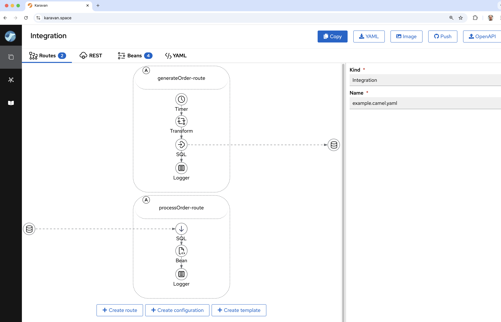
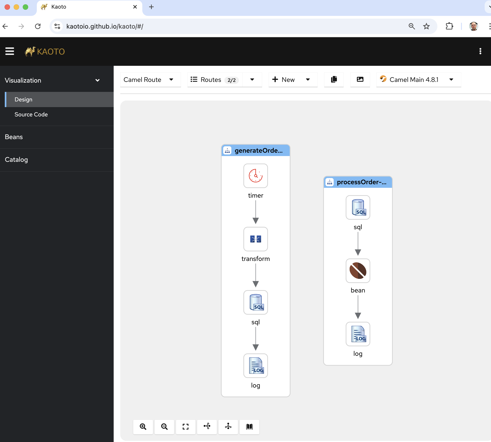

This is the 2nd blog post in a series of _migration blogs_ to provide details and help for
users to Camel 4.

The first blog post that focus on [general migration principles can be found here](/blog/2023/10/migrate4]. 

This blog post focuses on migrating from legacy Apache Karaf OSGi Blueprint to Camel 4.

## Migration Tasks

The migration from Camel Karaf and OSGi Blueprint to Camel 4 is not a trivial migration effort.

The migration consists of the following major _tasks_:

1. Upgrading from Camel 2.x/3.x to Camel 4.x.
2. Upgrading to Java 17 or 21
3. Replacing Karaf (OSGi) with Spring Boot, Quarkus, Standalone Camel, etc.
4. Migrating your Camel integrations

All these tasks may seem overwhelming at first, but don't panic. 

## Migrating Camel Karaf to Camel 4

To migrate Camel integrations that are camel-karaf based requires migrating:

1. Java code from Camel 2.x/3.x to Camel 4.x
2. Migrate OSGi Blueprint XML files to Camel 4 XML/YAML DSL.

To help you with this migration effort on the way, we have built support into [camel-jbang](/manual/camel-jbang.html),
that can be used during this migration.

Let's use one of the examples from camel-karaf and go over the effort needed.

### Migration your first example

We will first go over the [camel-example-sql-blueprint](https://github.com/apache/camel-karaf-examples/tree/main/examples/camel-example-sql-blueprint) example.
This example has some custom Java source and Camel routes in OSGi blueprint XML file.

To quickly check _how bad_ the situation is, we will use `camel-jbang` and let it run the example and see what happens:

```
cd examples/camel-example-sql-blueprint
camel run pom.xml
```

In `camel-jbang` we have made it possible to let Camel run as _best effort_ any existing Maven based project, but running the `pom.xml` file.
This is not expected to be a replacement for Maven or how you should use to run Camel, but its part of the migration experience that greatly helps you.

If you run the example you will notice it runs without any error. 

What happens is that `camel-jbang` was able to load the OSGi blueprint XML file, parse <bean> and <camelContext> and run this on a modern Camel 4.
This means the migration effort for this example is minimal.

#### Migrating Blueprint XML files 

What is needed to be migrated is the OSGi Blueprint XML file to either XML or YAML DSL. This can be done with the new `transform` command in
`camel-jbang` as follows:

```
camel transform route pom.xml 
```

#### UI Designer 

The YAML DSL can be edited in Camel designers such as Apache Camel Karavan og Kaoto as shown in the following screen shoots.





#### Dumping to XML

For migrating this example we will keep using XML so we specify `--format=xml` as follows:

```
camel transform route pom.xml --format=xml
```

#### Writing dump to files

You can also use `camel transform route` to write the output to file/dirs, instead of printing to console.

```
camel transform route pom.xml --format=xml --output=code
```

This will write the migrated files into code sub folder. 

Use `camel transform route --help` to see more details of this command.

The migration effort, is then afterward to export this to a chosen runtime such as Spring Boot, Quarkus or Camel Main.

**IMPORTANT**: Notice that the export functionality does not support migrate and transform in one go. So you would need to manually
copy the transformed OSGi Blueprint file into appropriate folder afterward.

#### Exporting to Spring Boot

You can export as shown below to Spring Boot:

```
camel export pom.xml --gav=com.mycompany:myproject:1.0 --runtime=spring-boot --dir=code 
```

Or if you want to use Camel Quarkus

```
camel export pom.xml --gav=com.mycompany:myproject:1.0 --runtime=quarkus --dir=code 
```

#### Finishing the migration

After the export you would need to clean up the project a bit as the export is not fully supporting Camel Karaf based projects.

```
cd code
```

You would need to copy the transformed route (previous tasks) into `src/main/resources/camel` folder, and delete the old OSGI blueprint file.

PS: If you forget this, you can redo the transformation and output directly into the expected folder such as:

```
cd ..
camel transform route pom.xml --format=xml --output=code/src/main/resources/camel
cd code
```

Also, the karaf `features.xml` file should be deleted.

You also need to copy over values from `sql.properties` as the export tool only support when they are defined in `application.properties`.
So we copy the values from `sql.properties` to `code/src/main/resources/application.properties`.

When running on Spring Boot its best practice to use its web server so we need to add the following dependency
in the `pom.xml` as follows:

```xml
<dependency>
    <groupId>org.springframework.boot</groupId>
    <artifactId>spring-boot-starter-web</artifactId>
</dependency>
```

And after this you can compile and run this with Spring Boot:

```
mvn package spring-boot:run
```

The application runs on Spring Boot and has been successfully migrated.

```log

  .   ____          _            __ _ _
 /\\ / ___'_ __ _ _(_)_ __  __ _ \ \ \ \
( ( )\___ | '_ | '_| | '_ \/ _` | \ \ \ \
 \\/  ___)| |_)| | | | | || (_| |  ) ) ) )
  '  |____| .__|_| |_|_| |_\__, | / / / /
 =========|_|==============|___/=/_/_/_/

 :: Spring Boot ::                (v3.4.0)

2024-12-04T08:24:19.113+01:00  INFO 45359 --- [           main] c.mycompany.myproject.CamelApplication   : Starting CamelApplication using Java 17.0.11 with PID 45359 (/Users/davsclaus/workspace/camel-karaf-examples/examples/camel-example-sql-blueprint/code/target/classes started by davsclaus in /Users/davsclaus/workspace/camel-karaf-examples/examples/camel-example-sql-blueprint/code)
2024-12-04T08:24:19.114+01:00  INFO 45359 --- [           main] c.mycompany.myproject.CamelApplication   : No active profile set, falling back to 1 default profile: "default"
2024-12-04T08:24:19.679+01:00  INFO 45359 --- [           main] o.s.b.w.embedded.tomcat.TomcatWebServer  : Tomcat initialized with port 8080 (http)
2024-12-04T08:24:19.685+01:00  INFO 45359 --- [           main] o.apache.catalina.core.StandardService   : Starting service [Tomcat]
2024-12-04T08:24:19.685+01:00  INFO 45359 --- [           main] o.apache.catalina.core.StandardEngine    : Starting Servlet engine: [Apache Tomcat/10.1.33]
2024-12-04T08:24:19.708+01:00  INFO 45359 --- [           main] o.a.c.c.C.[Tomcat].[localhost].[/]       : Initializing Spring embedded WebApplicationContext
2024-12-04T08:24:19.709+01:00  INFO 45359 --- [           main] w.s.c.ServletWebServerApplicationContext : Root WebApplicationContext: initialization completed in 574 ms
2024-12-04T08:24:19.897+01:00  WARN 45359 --- [           main] o.a.c.i.e.DefaultCamelBeanPostProcessor  : No CamelContext defined yet so cannot inject into bean: startupConditionStrategy
2024-12-04T08:24:20.160+01:00  INFO 45359 --- [           main] o.s.b.a.e.web.EndpointLinksResolver      : Exposing 1 endpoint beneath base path '/actuator'
2024-12-04T08:24:20.231+01:00  INFO 45359 --- [           main] o.s.b.w.embedded.tomcat.TomcatWebServer  : Tomcat started on port 8080 (http) with context path '/'
2024-12-04T08:24:20.289+01:00  INFO 45359 --- [           main] o.apache.camel.example.sql.DatabaseBean  : Creating table orders ...
2024-12-04T08:24:20.509+01:00  INFO 45359 --- [           main] o.apache.camel.example.sql.DatabaseBean  : ... created table orders
2024-12-04T08:24:20.613+01:00  INFO 45359 --- [           main] o.a.c.impl.engine.AbstractCamelContext   : Apache Camel 4.9.0 (camel-example-sql-blueprint) is starting
2024-12-04T08:24:20.619+01:00  INFO 45359 --- [           main] o.a.c.impl.engine.AbstractCamelContext   : Routes startup (total:2)
2024-12-04T08:24:20.619+01:00  INFO 45359 --- [           main] o.a.c.impl.engine.AbstractCamelContext   :     Started generateOrder-route (timer://foo)
2024-12-04T08:24:20.619+01:00  INFO 45359 --- [           main] o.a.c.impl.engine.AbstractCamelContext   :     Started processOrder-route (sql://select%20*%20from%20orders%20where%20processed%20=%20false)
2024-12-04T08:24:20.619+01:00  INFO 45359 --- [           main] o.a.c.impl.engine.AbstractCamelContext   : Apache Camel 4.9.0 (camel-example-sql-blueprint) started in 6ms (build:0ms init:0ms start:6ms boot:715ms)
2024-12-04T08:24:20.620+01:00  INFO 45359 --- [           main] c.mycompany.myproject.CamelApplication   : Started CamelApplication in 1.653 seconds (process running for 1.782)
2024-12-04T08:24:21.685+01:00  INFO 45359 --- [2 - timer://foo] generateOrder-route                      : Inserted new order 0
2024-12-04T08:24:22.187+01:00  INFO 45359 --- [sed%20=%20false] processOrder-route                       : Processed order id 0 item 222 of 10 copies of ActiveMQ in Action
```

Now let's migrate another example that is a bit more complex and requires more effort 


### Migrating with more difficulty 

This time we migrate [camel-example-openapi-osgi](https://github.com/apache/camel-karaf-examples/tree/main/examples/camel-example-openapi-osgi) example,
that requires changes in the DSL as well.

So first lets try to run it out of the box:

```
cd camel-example-openapi-osgi
camel run pom.xml
```

When you run this you will see an error as follows:
```log
org.apache.camel.xml.io.XmlPullParserLocationException: Unexpected attribute '{}apiContextListing'
in file:src/main/resources/OSGI-INF/blueprint/camel.xml, line 42, column 42:
                       enableCORS="true">
                                        ^
```

This is expected as migrating to Camel 4 may require DSL changes. In this example the `apiContextListing`
has been removed, so you should manually change a line in the `src/main/resources/OSGI-INF/blueprint/camel.xml` file:

```
-                        apiContextPath="api-docs" apiContextListing="true"
+                        apiContextPath="api-docs"
```

And then try running again with `camel run pom.xml`.

The next error is about `description`:

```log
org.apache.camel.xml.io.XmlPullParserLocationException: Unexpected element '{http://www.osgi.org/xmlns/blueprint/v1.0.0}description'
in file:src/main/resources/OSGI-INF/blueprint/camel.xml, line 58, column 20:
      <description>User rest service</description>
```

The `<description>` should be migrated to an attribute. So you need to do this for all `<description>`
in the `src/main/resources/OSGI-INF/blueprint/camel.xml`. After this then run again, and you have another error:

```log
org.apache.camel.xml.io.XmlPullParserLocationException: Unexpected attribute '{}uri'
in file:src/main/resources/OSGI-INF/blueprint/camel.xml, line 60, column 99:
      <get uri="/{id}" outType="org.apache.camel.example.rest.User" description="Find user by id">
```

For all the REST verbs such as GET,PUT,POST then the `uri` attribute should be renamed to `path` as shown below:

```
-       <get path="/{id}" outType="org.apache.camel.example.rest.User" description="Find user by id">
+       <get path="/{id}" outType="org.apache.camel.example.rest.User" description="Find user by id">
```

Okay we are almost there, there is one last error which is:
```log
org.apache.camel.xml.io.XmlPullParserLocationException: Unexpected element '{http://www.osgi.org/xmlns/blueprint/v1.0.0}route'
in file:src/main/resources/OSGI-INF/blueprint/camel.xml, line 64, column 16:
        <route>
```

In the Rest DSL then inlined `<route>` is no longer supported and you must move these inlined routes
into separate routes and call then via `direct` endpoints.

Before:
```xml
      <get path="/{id}" outType="org.apache.camel.example.rest.User" description="Find user by id">
        <param name="id" type="path" description="The id of the user to get" dataType="integer"/>
        <responseMessage message="The user that was found"/>
        <responseMessage code="404" message="User not found"/>
        <route>
          <to uri="bean:userService?method=getUser(${header.id})"/>
          <filter>
            <simple>${body} == null</simple>
            <setHeader name="Exchange.HTTP_RESPONSE_CODE">
              <constant>404</constant>
            </setHeader>
          </filter>
        </route>
      </get>
```

After:

```xml
      <get path="/{id}" outType="org.apache.camel.example.rest.User" description="Find user by id">
        <param name="id" type="path" description="The id of the user to get" dataType="integer"/>
        <responseMessage message="The user that was found"/>
        <responseMessage code="404" message="User not found"/>
        <to uri="direct:getUser"/>
      </get>

    <routes>
      <route>
      <from uri="direct:getUser"/>
      <to uri="bean:userService?method=getUser(${header.id})"/>
      <filter>
        <simple>${body} == null</simple>
        <setHeader name="Exchange.HTTP_RESPONSE_CODE">
          <constant>404</constant>
        </setHeader>
      </filter>
    </route>
  </routes>      
```

And yes finally the application can run on Camel 4

```log
$ camel run pom.xml
2024-12-04 08:43:40.809  INFO 45721 --- [           main] org.apache.camel.main.MainSupport        : Apache Camel (JBang) 4.9.0 is starting
2024-12-04 08:43:40.917  INFO 45721 --- [           main] org.apache.camel.main.MainSupport        : Using Java 17.0.11 with PID 45721. Started by davsclaus in /Users/davsclaus/workspace/camel-karaf-examples/examples/camel-example-openapi-osgi
2024-12-04 08:43:43.599  INFO 45721 --- [           main] .main.download.MavenDependencyDownloader : Resolved: org.apache.camel:camel-spring:4.9.0 (took: 2s678ms)
2024-12-04 08:43:47.734  INFO 45721 --- [           main] .main.download.MavenDependencyDownloader : Resolved: org.apache.camel:camel-openapi-java:4.9.0 (took: 2s219ms)
2024-12-04 08:43:47.761  INFO 45721 --- [           main] org.apache.camel.main.BaseMainSupport    : Properties location: file:src/main/resources/log4j2.properties
2024-12-04 08:43:47.794  INFO 45721 --- [           main] org.apache.camel.main.ProfileConfigurer  : The application is starting with profile: dev
2024-12-04 08:43:53.110  INFO 45721 --- [           main] .main.download.MavenDependencyDownloader : Resolved: org.apache.camel:camel-xml-io-dsl:4.9.0 (took: 2s79ms)
2024-12-04 08:43:53.540  INFO 45721 --- [           main] n.xml.blueprint.BlueprintXmlBeansHandler : Discovered 1 OSGi <blueprint> XML beans
2024-12-04 08:43:53.649  INFO 45721 --- [           main] he.camel.cli.connector.LocalCliConnector : Camel JBang CLI enabled
2024-12-04 08:43:54.710  INFO 45721 --- [           main] e.camel.impl.engine.AbstractCamelContext : Apache Camel 4.9.0 (myCamel) is starting
2024-12-04 08:43:54.982  INFO 45721 --- [           main] org.eclipse.jetty.server.Server          : jetty-12.0.15; built: 2024-11-05T19:44:57.623Z; git: 8281ae9740d4b4225e8166cc476bad237c70213a; jvm 17.0.11+9-LTS
2024-12-04 08:43:55.001  INFO 45721 --- [           main] ipse.jetty.server.handler.ContextHandler : Started oeje10s.ServletContextHandler@10a064bd{ROOT,/,b=null,a=AVAILABLE,h=oeje10s.ServletHandler@2de7fe0e{STARTED}}
2024-12-04 08:43:55.003  INFO 45721 --- [           main] jetty.ee10.servlet.ServletContextHandler : Started oeje10s.ServletContextHandler@10a064bd{ROOT,/,b=null,a=AVAILABLE,h=oeje10s.ServletHandler@2de7fe0e{STARTED}}
2024-12-04 08:43:55.010  INFO 45721 --- [           main] g.eclipse.jetty.server.AbstractConnector : Started ServerConnector@26f11b40{HTTP/1.1, (http/1.1)}{0.0.0.0:8080}
2024-12-04 08:43:55.011  INFO 45721 --- [           main] org.eclipse.jetty.server.Server          : Started oejs.Server@3883b5e9{STARTING}[12.0.15,sto=0] @15508ms
2024-12-04 08:43:55.092  INFO 45721 --- [           main] e.camel.impl.engine.AbstractCamelContext : Routes startup (total:3 rest-dsl:2)
2024-12-04 08:43:55.092  INFO 45721 --- [           main] e.camel.impl.engine.AbstractCamelContext :     Started route2 (direct://getUser)
2024-12-04 08:43:55.092  INFO 45721 --- [           main] e.camel.impl.engine.AbstractCamelContext :     Started route1 (rest-api://api-docs)
2024-12-04 08:43:55.092  INFO 45721 --- [           main] e.camel.impl.engine.AbstractCamelContext :     Started route3 (rest://get:/echo:/ping)
2024-12-04 08:43:55.092  INFO 45721 --- [           main] e.camel.impl.engine.AbstractCamelContext : Apache Camel 4.9.0 (myCamel) started in 381ms (build:0ms init:0ms start:381ms boot:13s900ms)
```

#### Migrating to Camel Quarkus

For this example we will migrate to Camel Quarkus instead of Spring Boot.

```
camel export pom.xml --gav=com.mycompany:myproject:1.0 --runtime=quarkus --dir=code 
```

You will then see another error:

```log
Generating fresh run data
Running using Quarkus v3.17.2 (preparing and downloading files)
org.apache.camel.FailedToStartRouteException: Failed to start route route3 because of Component jetty is not a RestConsumerFactory
```

This is because the old Karaf example was using Jetty as the HTTP server for hosting the Rest DSL services.
You need to remove this and let Camel use the default `platform-http` that comes out of the box with Quarkus (or Spring Boot).

So change the XML file accordingly:

```xml
    <restConfiguration bindingMode="json"
                       contextPath="rest" port="8080"
                       apiContextPath="api-docs"
                       enableCORS="true"
                       inlineRoutes="false">
```

**IMPORTANT**: You also need to set `inlineRoutes="false"` because when using Rest DSL the routes should be separated,
to make Camel JBang able to transform the routes. This may get fixed for Camel 4.10 onwards to happen automatic.

And then run the export again.

And then we want to migrate the Blueprint XML file and output directly to the `src/main/resources/camel` folder as shown below:

```
camel transform route pom.xml --format=xml --output=code/src/main/resources/camel
```

Next we need to cleanup the example to be fully migrated to Camel 4 on Quarkus.

In the `pom.xml` remove the `camel-jetty` and `camel-spring` dependency.

And in the `src/main/resources/camel.xml` file you need to add the `<restConfiguration>` as these
are not automatically included in the `camel transform route` command.

So add this in the top of the file under the `<camel>` root tag:

```xml
    <restConfiguration bindingMode="json"
                       contextPath="rest" port="8080"
                       apiContextPath="api-docs"
                       enableCORS="true"
                       inlineRoutes="false">

        <!-- we want json output in pretty mode -->
        <dataFormatProperty key="prettyPrint" value="true"/>

        <!-- setup openapi api descriptions -->
        <apiProperty key="base.path" value="rest"/>
        <apiProperty key="api.version" value="1.2.3"/>
        <apiProperty key="api.title" value="User Services"/>
        <apiProperty key="api.description" value="Camel Rest Example with OpenApi that provides an User REST service"/>
        <apiProperty key="api.contact.name" value="The Apache Camel team"/>

    </restConfiguration>
```

After this you should be able to compile and run the migrated example on Camel Quarkus as follows:

```log
$ mvn package quarkus:run
__  ____  __  _____   ___  __ ____  ______
 --/ __ \/ / / / _ | / _ \/ //_/ / / / __/
 -/ /_/ / /_/ / __ |/ , _/ ,< / /_/ /\ \
--\___\_\____/_/ |_/_/|_/_/|_|\____/___/
2024-12-04 11:09:03,974 INFO  [org.apa.cam.qua.cor.CamelBootstrapRecorder] (main) Apache Camel Quarkus 3.16.0 is starting
2024-12-04 11:09:03,979 INFO  [org.apa.cam.mai.MainSupport] (main) Apache Camel (Main) 4.8.1 is starting
2024-12-04 11:09:04,066 INFO  [org.apa.cam.mai.BaseMainSupport] (main) Auto-configuration summary
2024-12-04 11:09:04,066 INFO  [org.apa.cam.mai.BaseMainSupport] (main)     [MicroProfilePropertiesSource] camel.main.routesIncludePattern = camel/camel.xml
2024-12-04 11:09:04,066 INFO  [org.apa.cam.mai.BaseMainSupport] (main)     [MicroProfilePropertiesSource] camel.main.name = camel-example-openapi-osgi
2024-12-04 11:09:04,158 INFO  [org.apa.cam.imp.eng.AbstractCamelContext] (main) Apache Camel 4.8.1 (camel-example-openapi-osgi) is starting
2024-12-04 11:09:04,463 INFO  [org.apa.cam.imp.eng.AbstractCamelContext] (main) Routes startup (total:5 rest-dsl:4)
2024-12-04 11:09:04,463 INFO  [org.apa.cam.imp.eng.AbstractCamelContext] (main)     Started route2 (direct://getUser)
2024-12-04 11:09:04,463 INFO  [org.apa.cam.imp.eng.AbstractCamelContext] (main)     Started route1 (rest-api://api-docs)
2024-12-04 11:09:04,464 INFO  [org.apa.cam.imp.eng.AbstractCamelContext] (main)     Started route3 (rest://get:/user:/%7Bid%7D)
2024-12-04 11:09:04,464 INFO  [org.apa.cam.imp.eng.AbstractCamelContext] (main)     Started route4 (rest://put:/user)
2024-12-04 11:09:04,464 INFO  [org.apa.cam.imp.eng.AbstractCamelContext] (main)     Started route5 (rest://get:/user:/findAll)
2024-12-04 11:09:04,465 INFO  [org.apa.cam.imp.eng.AbstractCamelContext] (main) Apache Camel 4.8.1 (camel-example-openapi-osgi) started in 305ms (build:0ms init:0ms start:305ms)
2024-12-04 11:09:04,567 INFO  [io.quarkus] (main) myproject 1.0 on JVM (powered by Quarkus 3.17.2) started in 0.989s. Listening on: http://0.0.0.0:8080
2024-12-04 11:09:04,567 INFO  [io.quarkus] (main) Profile prod activated.
2024-12-04 11:09:04,568 INFO  [io.quarkus] (main) Installed features: [camel-attachments, camel-bean, camel-core, camel-direct, camel-jackson, camel-microprofile-health, camel-openapi-java, camel-platform-http, camel-rest, camel-xml-io-dsl, cdi, smallrye-context-propagation, smallrye-health, vertx]
```

And you should be able to call the Rest service such as:

```shell
curl http://0.0.0.0:8080/rest/user/123
{
  "id" : 123,
  "name" : "John Doe"
}
```

Phew, this was a bit tricky. 

## Summary

The Camel JBang tool is a tool that can assist to migrate OSGi Blueprint XML files to modern Camel.
If you have built more complex OSGi applications that uses special OSGi features then you would need
to manually migrate this. 

On Camel 4 then future upgrades is much easier, as you would be on a modern stack with Spring Boot or Quarkus,
which has a much larger community, and user base than legacy Apache Karaf.

You can find more details in the Camel 3.x/4.x [migration and upgrade guides](/manual/migration-and-upgrade.html).
Most of the migration _pain_ would be related to changes documented in the guide (above).

The Camel JBang tool can assist you to quickly give a try to migrate an existing project as shown in this blog post.

Feedback on the migration tool is welcome. Good luck, and see you in the modern Camel 4 world.
