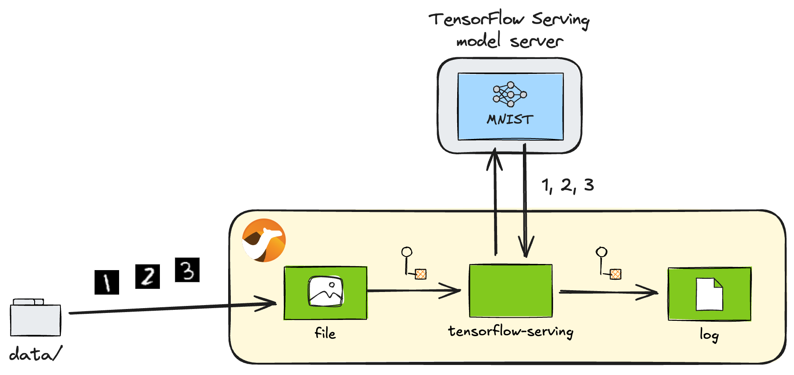
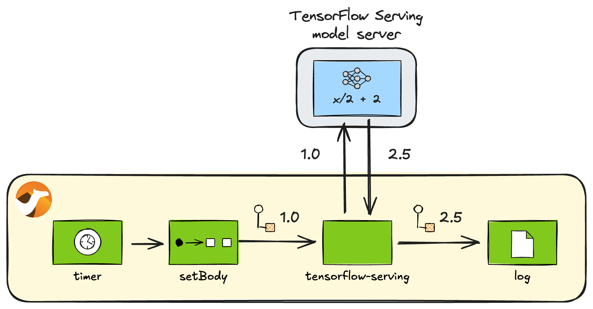

## Introduction

As noted in the [previous article](/blog/2025/02/camel-torchserve/), the recent release of [Apache Camel 4.10 LTS](/blog/2025/02/camel410-whatsnew/) introduced three new AI model serving components into its supported component family. [^1]

[^1]: Camel TorchServe component has been provided since 4.9.

* [TorchServe component](/components/4.10.x/torchserve-component.html)
* [TensorFlow Serving component](/components/4.10.x/tensorflow-serving-component.html)
* [KServe component](/components/4.10.x/kserve-component.html)

Previously we [wrote about the TorchServe component](/blog/2025/02/camel-torchserve/), this time we introduce the TensorFlow Serving component.

## TensorFlow Serving component

[TensorFlow Serving](https://www.tensorflow.org/tfx/guide/serving) is the serving feature provided by the popular machine learning framework TensorFlow. By using the [Camel TensorFlow Serving](/components/4.10.x/tensorflow-serving-component.html) component, you can invoke AI models deployed on the TensorFlow Serving model servers through their [gRPC Client APIs](https://github.com/tensorflow/serving/blob/2.18.0/tensorflow_serving/apis/prediction_service.proto).

## Preparation

Before diving into the sample code of the Camel TensorFlow Serving component, let's set up the running environment.

First, let's install [Camel CLI](/manual/camel-jbang.html) if it is not installed yet:

----

_**INFO:** If JBang is not installed, first install JBang by referring: <https://www.jbang.dev/download/>_

----

```console
jbang app install camel@apache/camel
```

Check that the installation has been successful:

```console
$ camel --version
4.10.0
```

### Launching the server with the pre-deployed models

Next, let's set up a TensorFlow Serving server locally. The easiest way is to [use a Docker image](https://www.tensorflow.org/tfx/serving/docker), but at the time of writing the official Docker image `tensorflow/serving` only supports the `amd64` architecture, so we will instead use [Bitnami's Docker image](https://github.com/bitnami/containers/tree/main/bitnami/), which also supports `arm64`, so that macOS users can also try the component.

Note that, unlike PyTorch, TensorFlow Serving requires specifying models in advance before starting the server. This article uses two models:

- `mnist` ⋯ A MNIST model pre-trained with TensorFlow
- `half_plus_two`（`x/2 + 2`） ⋯ A test model in the TensorFlow Serving repository ([testdata](https://github.com/tensorflow/serving/tree/master/tensorflow_serving/servables/tensorflow/testdata))

To simplify the process, we have provided [models](https://github.com/megacamelus/camel-ai-examples/tree/main/tensorflow-serving/models) that can be used directly in the sample code repository. Let's download this `models` directory to proceed.

----

_**TIPS:** To download files under a specific directory in a GitHub repository in one go, you can clone the entire repository, but [VS Code for the Web](https://code.visualstudio.com/docs/editor/vscode-web) is easiest: with the GitHub repository displayed, press `.` on your keyboard or by rewriting the URL from `github.com` to `github.dev`, you can open that repository in VS Code in your browser. Then find the directory you want to download and select `Download` from the right-click menu. By selecting a locally created directory, you can batch download files from that entire directory into it._

----

Once the `models` directory has been downloaded, start the container from the location where the `models` is located with the following command:

```console
docker run --rm -it --name tf-serving \
    -p 8500:8500 -p 8501:8501 \
    -v ./models:/models \
    -v ./models/models.pbtxt:/bitnami/tensorflow-serving/conf/tensorflow-serving.conf \
    bitnami/tensorflow-serving
```

## Operations on the model

----

_**INFO:** If you are not interested in how to operate TensorFlow models from Camel, or if you just want to quickly learn how to perform inference with Camel, you can skip this section and start reading from the [Inference](#inference) section._

----

TensorFlow Serving basically provides two model management operations:

* Status check ([Model status API](https://www.tensorflow.org/tfx/serving/api_rest#model_status_api))
* Metadata retrieval ([Model Metadata API](https://www.tensorflow.org/tfx/serving/api_rest#model_metadata_api))

Next, we will explore how to call each of these from the Camel routes.

### Model status check

First, you can check if a model is ready for inference with the following endpoint. Let's check the status of the `mnist` model.

```uri
tensorflow-serving:model-status?modelName=mnist&modelVersion=1
```

**model_status.java**

```java
//DEPS org.apache.camel:camel-bom:4.10.0@pom
//DEPS org.apache.camel:camel-core
//DEPS org.apache.camel:camel-tensorflow-serving

import org.apache.camel.builder.RouteBuilder;

public class model_status extends RouteBuilder {
    @Override
    public void configure() throws Exception {
        from("timer:model-status?repeatCount=1")
            .to("tensorflow-serving:model-status?modelName=mnist&modelVersion=1")
            .log("Status: ${body.getModelVersionStatus(0).state}");
    }
}
```

Run the following Camel CLI command:

```console
camel run model_status.java
```

If successful, the status of the model can be checked as follows:

```console
Status: AVAILABLE
```

### Retrieving model metadata

To call a TensorFlow model for inference, it is essential to check the input/output signatures of the model.

----

_**IMPORTANT:** In TensorFlow, the input and output tensor formats must match precisely; otherwise, you cannot pass data to the model or receive the results._

----

Typically, you call the following [REST API](https://www.tensorflow.org/tfx/serving/api_rest#model_metadata_api) to check the model signatures in JSON format (for the `mnist` model):

<http://localhost:8501/v1/models/mnist/metadata>

Although it is likely less useful than hitting the REST API to check, you can also retrieve the model metadata from the Camel routes as follows.

```uri
tensorflow-serving:model-metadata?modelName=mnist&modelVersion=1
```

**model_metadata.java**

```java
//DEPS org.apache.camel:camel-bom:4.10.0@pom
//DEPS org.apache.camel:camel-core
//DEPS org.apache.camel:camel-tensorflow-serving

import org.apache.camel.builder.RouteBuilder;

public class model_metadata extends RouteBuilder {
    @Override
    public void configure() throws Exception {
        from("timer:model-metadata?repeatCount=1")
            .to("tensorflow-serving:model-metadata?modelName=mnist&modelVersion=1")
            .log("Metadata: ${body.getMetadataOrThrow('signature_def')}");
    }
}
```

Run the following Camel CLI command:

```console
camel run model_metadata.java
```

If successful, the metadata for the model can be seen below:

```console
Metadata: type_url: "type.googleapis.com/tensorflow.serving.SignatureDefMap"
value: "\n\245\001\n\005serve\022\233\001\n?\n\fkeras_tensor\022/\n\024serve_keras_tensor:0\020\001\032\025\022\v\b\377\377\377\377\377\377\377\377\377\001\022\002\b\034\022\002\b\034\022<\n\boutput_0\0220\n\031StatefulPartitionedCall:0\020\001\032\021\022\v\b\377\377\377\377\377\377\377\377\377\001\022\002\b\n\032\032tensorflow/serving/predict\n\273\001\n\017serving_default\022\247\001\nI\n\fkeras_tensor\0229\n\036serving_default_keras_tensor:0\020\001\032\025\022\v\b\377\377\377\377\377\377\377\377\377\001\022\002\b\034\022\002\b\034\022>\n\boutput_0\0222\n\033StatefulPartitionedCall_1:0\020\001\032\021\022\v\b\377\377\377\377\377\377\377\377\377\001\022\002\b\n\032\032tensorflow/serving/predict\n>\n\025__saved_model_init_op\022%\022#\n\025__saved_model_init_op\022\n\n\004NoOp\032\002\030\001"
```

## Inference

Here, we focus on the main topic of inference. These operations (endpoints) are the ones most commonly used from the Camel routes in practice. TensorFlow Serving provides three types of inference APIs:

* [Predict API](https://www.tensorflow.org/tfx/serving/api_rest#predict_api) - Generic inference API
* [Classify API](https://www.tensorflow.org/tfx/serving/api_rest#classify_and_regress_api) - A specialised inference API for classification problems
* [Regress API](https://www.tensorflow.org/tfx/serving/api_rest#classify_and_regress_api) - A specialised inference API for regression analysis

### Generic prediction (Predict API)

We will begin by looking at the generic Predict API. This API is not tied to any particular problem and can be used with any model. As a result, the data input/output API is also generic, which makes it a bit more complicated to configure the data correctly.

Let's use the Predict API to call the MNIST model deployed earlier. MNIST is a model that recognises 28x28 greyscale handwritten images as numbers. We will be using the same [test data](https://github.com/pytorch/serve/tree/master/examples/image_classifier/mnist/test_data) as we did for TorchServe.



_Recognition of handwritten numbers with MNIST_

The following endpoint will be used for inference:

```uri
tensorflow-serving:predict?modelName=mnist&modelVersion=1
```

**predict.java**

```java
//DEPS org.apache.camel:camel-bom:4.10.0@pom
//DEPS org.apache.camel:camel-core
//DEPS org.apache.camel:camel-tensorflow-serving

import java.awt.image.BufferedImage;
import java.io.ByteArrayInputStream;
import java.io.IOException;
import java.util.ArrayList;
import java.util.List;
import java.util.stream.IntStream;
import javax.imageio.ImageIO;
import org.apache.camel.Exchange;
import org.apache.camel.RuntimeCamelException;
import org.apache.camel.builder.RouteBuilder;
import org.tensorflow.framework.DataType;
import org.tensorflow.framework.TensorProto;
import org.tensorflow.framework.TensorShapeProto;
import org.tensorflow.framework.TensorShapeProto.Dim;
import com.google.protobuf.Int64Value;
import tensorflow.serving.Model.ModelSpec;
import tensorflow.serving.Predict.PredictRequest;
import tensorflow.serving.Predict.PredictResponse;

public class predict extends RouteBuilder {
    @Override
    public void configure() throws Exception {
        from("file:data?noop=true&recursive=true&include=.*\\.png")
            .process(this::toPredictRequest)   // (1)
            .to("tensorflow-serving:predict?modelName=mnist&modelVersion=1")
            .process(this::argmax)             // (2)
            .log("${headers.camelFileName} => ${body}");
    }

    void toPredictRequest(Exchange exchange) { // (3)
        byte[] body = exchange.getMessage().getBody(byte[].class);
        List<Float> data = preprocess(body);
        TensorProto inputs = TensorProto.newBuilder()
                .setDtype(DataType.DT_FLOAT)
                .setTensorShape(TensorShapeProto.newBuilder()
                        .addDim(Dim.newBuilder().setSize(28))
                        .addDim(Dim.newBuilder().setSize(28)))
                .addAllFloatVal(data)
                .build();
        PredictRequest request = PredictRequest.newBuilder()
                .putInputs("keras_tensor", inputs)
                .build();
        exchange.getMessage().setBody(request);
    }

    List<Float> preprocess(byte[] data) {      // (4)
        try {
            BufferedImage image = ImageIO.read(new ByteArrayInputStream(data));
            int width = image.getWidth();
            int height = image.getHeight();
            if (width != 28 || height != 28) {
                throw new RuntimeCamelException("Image size must be 28x28");
            }
            List<Float> normalised = new ArrayList<>(width * height);
            for (int y = 0; y < height; y++) {
                for (int x = 0; x < width; x++) {
                    int rgb = image.getRGB(x, y);
                    normalised.add((rgb & 0xFF) / 255.0f);
                }
            }
            return normalised;
        } catch (IOException e) {
            throw new RuntimeCamelException("Error reading image", e);
        }
    }

    void argmax(Exchange exchange) {           // (5)
        PredictResponse response = exchange.getMessage().getBody(PredictResponse.class);
        TensorProto tensor = response.getOutputsOrThrow("output_0");
        int result = IntStream.range(0, tensor.getFloatValCount())
                .reduce((max, i) -> tensor.getFloatVal(max) > tensor.getFloatVal(i) ? max : i)
                .orElseThrow();
        exchange.getMessage().setBody(result);
    }
}
```

Here, we breakdown the important points of the code:

1. To call the inference endpoint, the input data must be converted into a TensorFlow Serving `PredictRequest` object.
2. Extract the output data from the `PredictResponse` object returned from the inference endpoint for subsequent processing. The argmax function is used here.
3. Convert the `byte[]` data in the file into a `PredictRequest`. First, the data must be properly pre-processed (`preprocess(body)`) and wrapped in a `TensorProto` object with the correct data type (`DT_FLOAT`) and dimensions (`28x28`). Then, register the `TensorProto` input object with the label `keras_tensor` in the `PredictRequest`. To call the model using TensorFlow Serving, all of these parameters must be set correctly. All necessary information can be obtained from the model metadata (see [Retrieving model metadata](#retrieving-model-metadata)).
4. Pre-process the `byte[]` data from the loaded image file. Here, only the blue channel is extracted from the 28x28 RGB image data and normalised to the 0-1 Float value expected by the MNIST model.
5. Since there is no handy library in Java that provides the argmax function, we implement it ourselves. The name of the label -- `output_0` -- for the output data from `PredictResponse` can also be obtained from the model metadata (again, see [Retrieving model metadata](#retrieving-model-metadata)).

Now, to run the code, first download the [test data](https://github.com/pytorch/serve/tree/master/examples/image_classifier/mnist/test_data) to your local `data/` directory. Then, execute the following Camel CLI command:

```console
camel run predict.java
```

If successful, you will get the following results. You can see that handwritten numbers are recognised correctly:

```console
8.png => 8
9.png => 9
4.png => 4
5.png => 5
7.png => 7
6.png => 6
2.png => 2
3.png => 3
1.png => 1
0.png => 0
```

### Classification (Classify API)

Next, let's introduce the Classify API. This API is designed to solve classification problems, where a set of input data is categorised into specific labels. It takes a list of sample data as input and returns a list of scores for each each classification label as output.

Since the MNIST model we used earlier does not support the Classify API, we will instead use the other deployed model, `half_plus_two`. As the name suggests, this simple model calculates and returns the value of:

$$
\frac{x}{2} + 2
$$

given the input $x$. The result is returned as a single unlabelled score.



_half_plus_two_

The following endpoint is used for inference. Since this model has multiple signatures, the signature `classify_x_to_y` must be specified in the endpoint option `signatureName`.

```uri
tensorflow-serving:classify?modelName=half_plus_two&modelVersion=123&signatureName=classify_x_to_y
```

**classify.java**

```java
//DEPS org.apache.camel:camel-bom:4.10.0@pom
//DEPS org.apache.camel:camel-core
//DEPS org.apache.camel:camel-tensorflow-serving

import org.apache.camel.builder.RouteBuilder;
import org.tensorflow.example.Example;
import org.tensorflow.example.Feature;
import org.tensorflow.example.Features;
import org.tensorflow.example.FloatList;
import tensorflow.serving.InputOuterClass.ExampleList;
import tensorflow.serving.InputOuterClass.Input;

public class classify extends RouteBuilder {
    @Override
    public void configure() throws Exception {
        from("timer:classify?repeatCount=1")
            .setBody(constant(createInput("x", 1.0f)))
            .to("tensorflow-serving:classify?modelName=half_plus_two&modelVersion=123&signatureName=classify_x_to_y")
            .log("Result: ${body.result}");
    }

    Input createInput(String key, float f) {  // (1)
        Feature feature = Feature.newBuilder()
                .setFloatList(FloatList.newBuilder().addValue(f))
                .build();
        Features features = Features.newBuilder()
                .putFeature(key, feature)
                .build();
        Example example = Example.newBuilder()
                .setFeatures(features)
                .build();
        ExampleList exampleList = ExampleList.newBuilder()
                .addExamples(example)
                .build();
        return Input.newBuilder()
                .setExampleList(exampleList)
                .build();
    }
}
```

As with the Predict API, you need to create a TensorFlow `Input` object for the input data. However, the process is simpler and only involves the following steps:

1. Compile each input data (`Feature`) into features (`Features`) within an example (`Example`), which is then compiled into a list (`ExampleList`).

Run the following Camel CLI command:

```console
camel run classify.java
```

If successful, you will get the following results. It is $\frac{1.0}{2} + 2 = 2.5$.

```console
Result: classifications {
  classes {
    score: 2.5
  }
}
```

### Regression analysis (Regress API)

Finally, let's explore the Regress API. This API is used for regression analysis, a technique for predicting relationships between input data series. It takes a list of sample data as input and returns a list of predicted data series as output.

As with before, the `half_plus_two` model is used.

The following endpoint is used for inference, with the signature `regress_x_to_y` specified in the endpoint option `signatureName`:

```uri
tensorflow-serving:regress?modelName=half_plus_two&modelVersion=123&signatureName=regress_x_to_y
```

**regress.java**

```java
//DEPS org.apache.camel:camel-bom:4.10.0@pom
//DEPS org.apache.camel:camel-core
//DEPS org.apache.camel:camel-tensorflow-serving

import org.apache.camel.builder.RouteBuilder;
import org.tensorflow.example.Example;
import org.tensorflow.example.Feature;
import org.tensorflow.example.Features;
import org.tensorflow.example.FloatList;
import tensorflow.serving.InputOuterClass.ExampleList;
import tensorflow.serving.InputOuterClass.Input;

public class regress extends RouteBuilder {
    @Override
    public void configure() throws Exception {
        from("timer:regress?repeatCount=1")
            .setBody(constant(createInput("x", 1.0f)))
            .to("tensorflow-serving:regress?modelName=half_plus_two&modelVersion=123&signatureName=regress_x_to_y")
            .log("Result: ${body.result}");
    }

    Input createInput(String key, float f) {
        Feature feature = Feature.newBuilder()
                .setFloatList(FloatList.newBuilder().addValue(f))
                .build();
        Features features = Features.newBuilder()
                .putFeature(key, feature)
                .build();
        Example example = Example.newBuilder()
                .setFeatures(features)
                .build();
        ExampleList exampleList = ExampleList.newBuilder()
                .addExamples(example)
                .build();
        return Input.newBuilder()
                .setExampleList(exampleList)
                .build();
    }
}
```

Run the following Camel CLI command:

```console
camel run regress.java
```

If successful, you will get the following results. Normally a list of values is returned from the API, but this model only returns one value: $\frac{1.0}{2} + 2 = 2.5$.

```console
Result: regressions {
  value: 2.5
}
```

## Summary

Following on from the TorchServe component, we have had a quick look at the functionality of the TensorFlow Serving component, one of the AI model serving components available in the latest Camel 4.10.0 LTS release.

The TensorFlow Serving component makes it easy to incorporate AI models trained with TensorFlow into integrations built on Camel, opening up the possibilities of creative TensorFlow-based AI integration systems that have been difficult to achieve in the past.

Finally, the sample code introduced in this article is available in this repository:

<https://github.com/megacamelus/camel-ai-examples>

The next article will conclude this AI model serving components series with a deep dive into KServe. Stay tuned!
