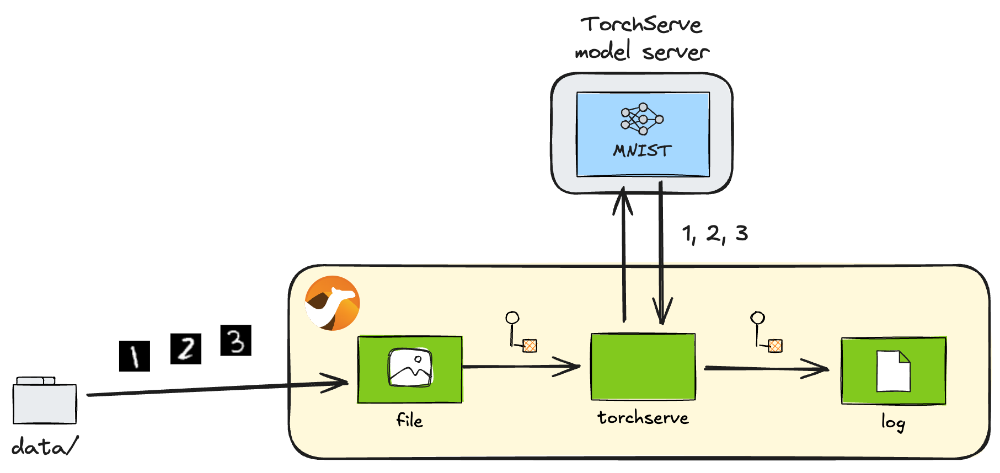

## Introduction

In the just released [Apache Camel 4.10 LTS](/blog/2025/02/RELEASE-4.10.0/), AI-related components have been further enhanced. Among others, three new components related to AI model serving have been added. [^1]

[^1]: Camel TorchServe component has been provided since 4.9.

* [TorchServe component](/components/next/torchserve-component.html)
* [TensorFlow Serving component](/components/next/tensorflow-serving-component.html)
* [KServe component](/components/next/kserve-component.html)

My previous article [Apache Camel AI: Leverage power of AI with DJL component](/blog/2024/09/camel-ai-examples/) demonstrated how the DJL component can be used to perform AI model inference within the Camel routes. Starting from 4.10, in addition to the in-route inference by DJL, these new components will allow the Camel routes to invoke external model servers to perform inference.

In the MLOps platforms such as [Kubeflow](https://www.kubeflow.org/), the trained models will eventually be deployed to the model servers for use. Those enhanced serving components will make it easier to incorporate Camel-based applications into the _Model Serving_ phase of the MLOps lifecycles.

In this article, let's see how you can use the TorchServe component.

## TorchServe component

[TorchServe](https://pytorch.org/serve/index.html) is the serving feature provided by the popular machine learning framework PyTorch. The [Camel TorchServe](/components/next/torchserve-component.html) component allows you to call the [REST API](https://pytorch.org/serve/rest_api.html) served by the TorchServe server from within the Camel routes.

### Basic usage

The basic steps to use TorchServe is as follows:

1. Register the models trained with PyTorch on the server
2. Check the metadata of the registered models
3. Perform inference by calling models based on the metadata
4. Unregister the used models from the server

When using Camel TorchServe component, the third step is practically the most important. But let's go through how each step can be achieved with the Camel component.

## Preparation

First, let's install [Camel CLI](/manual/camel-jbang.html) if it is not installed yet:

----

_**INFO:** If JBang is not installed, first install JBang by referring: <https://www.jbang.dev/download/>_

----

```console
jbang app install camel@apache/camel
```

Check that the installation has been successful:

```console
$ camel --version
4.10.0
```

Next, you need a TorchServe server up and running. The easiest way to do this is to [use a Docker image](https://github.com/pytorch/serve/blob/master/docker/README.md):

```console
docker run --rm -it --name torchserve \
    -p 8080:8080 -p 8081:8081 -p 8082:8082 \
    pytorch/torchserve \
    torchserve \
        --disable-token-auth \
        --enable-model-api \
        --model-store /home/model-server/model-store
```

## Server health check

The readiness of the TorchServe server can be checked by accessing <http://localhost:8080/ping>, but it can also be checked from the Camel route using the TorchServe component.

```text
torchserve:inference/ping
```

**ping.java**

```java
//DEPS org.apache.camel:camel-bom:4.10.0@pom
//DEPS org.apache.camel:camel-core
//DEPS org.apache.camel:camel-torchserve

import org.apache.camel.builder.RouteBuilder;

public class ping extends RouteBuilder {
    @Override
    public void configure() throws Exception {
        from("timer:ping?period=10000")
            .to("torchserve:inference/ping")
            .log("Status: ${body}");
    }
}
```

Run the following from the Camel CLI:

```console
camel run ping.java
```

If the server is up and running successfully, you will get the following status:

```console
Status: Healthy
```

## Model management

TorchServe has [Management API](https://pytorch.org/serve/management_api.html) from which you can manage models corresponding to steps 1, 2 and 4 in [Basic usage](#basic-usage). Camel TorchServe component also supports this management API and allows you to perform the respective management operations from the Camel routes.

----

_**INFO:** If you are not interested in how to manage models from Camel routes and you want to manage models directly on TorchServe, or if you just want to know how to perform inference with Camel quickly, you can skip this section and start reading from the [Inference](#inference) section._

----

### Registration of models

Right after the launch, the model server does not provide any models that can be served for inference.

Let's register a model using Camel. Here we will use a pre-trained MNIST V2 model provided at the [PyTorch Model Zoo](https://pytorch.org/serve/model_zoo.html).

```text
torchserve:management/register?url=https://torchserve.pytorch.org/mar_files/mnist_v2.mar
torchserve:management/scale-worker?modelName=mnist_v2
```

**register_model.java**

```java
//DEPS org.apache.camel:camel-bom:4.10.0@pom
//DEPS org.apache.camel:camel-core
//DEPS org.apache.camel:camel-torchserve

import org.apache.camel.builder.RouteBuilder;
import org.apache.camel.component.torchserve.TorchServeConstants;
import org.apache.camel.component.torchserve.client.model.ScaleWorkerOptions;

public class register_model extends RouteBuilder {
    @Override
    public void configure() throws Exception {
        from("timer:register?repeatCount=1")
            .to("torchserve:management/register?url=https://torchserve.pytorch.org/mar_files/mnist_v2.mar")
            .log("Status: ${body}")
            .to("direct:scale-worker");

        // Set up workers for the model after registration to make it available for inference
        from("direct:scale-worker")
            .setHeader(TorchServeConstants.SCALE_WORKER_OPTIONS,
                constant(ScaleWorkerOptions.builder().minWorker(1).maxWorker(2).build()))
            .to("torchserve:management/scale-worker?modelName=mnist_v2")
            .log("Status: ${body}");
    }
}
```

----

_**NOTE:** Note that the worker processes for the model are also set up right after the registration. It is because TorchServe does not allocate any workers automatically by default and the model is not ready for inference until they are assigned explicitly._

----

Run the following from the Camel CLI:

```console
camel run register_model.java
```

If the model is successfully registered, you will get the following statuses:

```console
Status: Model "mnist_v2" Version: 2.0 registered with 0 initial workers. Use scale workers API to add workers for the model.
Status: Processing worker updates...
```

### Setting the default version of a model

Normally, both the model name and version must be specified for running inference. However, if you set the default version of the model, the version can be omitted afterwards.

```text
torchserve:management/set-default?modelName=mnist_v2&modelVersion=2.0
```

**set_default.java**

```java
//DEPS org.apache.camel:camel-bom:4.10.0@pom
//DEPS org.apache.camel:camel-core
//DEPS org.apache.camel:camel-torchserve

import org.apache.camel.builder.RouteBuilder;

public class set_default extends RouteBuilder {
    @Override
    public void configure() throws Exception {
        from("timer:set-default?repeatCount=1")
            .to("torchserve:management/set-default?modelName=mnist_v2&modelVersion=2.0")
            .log("Status: ${body}");
    }
}
```

Run the following from the Camel CLI:

```console
camel run set_default.java
```

If the setup is successful, you will get the following status:

```console
Status: Default version successfully updated for model "mnist_v2" to "2.0"
```

### Retrieving model details

You can retrieve detailed information on models that have already been registered.

```text
torchserve:management/describe?modelName=mnist_v2
```

**describe_model.java**

```java
//DEPS org.apache.camel:camel-bom:4.10.0@pom
//DEPS org.apache.camel:camel-core
//DEPS org.apache.camel:camel-torchserve

import org.apache.camel.builder.RouteBuilder;

public class describe_model extends RouteBuilder {
    @Override
    public void configure() throws Exception {
        from("timer:describe?repeatCount=1")
            .to("torchserve:management/describe?modelName=mnist_v2")
            .log("${body[0]}");
    }
}
```

Run the following from the Camel CLI:

```console
camel run describe_model.java
```

If successful, the following information of the model will be received:

```console
ModelDetail {
    modelName: mnist_v2
    modelVersion: 2.0
    modelUrl: https://torchserve.pytorch.org/mar_files/mnist_v2.mar
    minWorkers: 1
    maxWorkers: 2
    batchSize: 1
    maxBatchDelay: 100
    status: null
    workers: [Worker { id: 9000, startTime: 2025-02-10T11:08:36.160Z, gpu: false, status: READY }]
    metrics: null
    jobQueueStatus: JobQueueStatus { remainingCapacity: 1000, pendingRequests: 0 }
}
```

### Obtaining the list of models

You can also retrieve the list of models registered on the model server.

```text
torchserve:management/list
```

```java:list_models.java
//DEPS org.apache.camel:camel-bom:4.10.0@pom
//DEPS org.apache.camel:camel-core
//DEPS org.apache.camel:camel-torchserve

import org.apache.camel.builder.RouteBuilder;

public class list_models extends RouteBuilder {
    @Override
    public void configure() throws Exception {
        from("timer:list?repeatCount=1")
            .to("torchserve:management/list")
            .log("${body.models}");
    }
}
```

Run the following from the Camel CLI:

```console
camel run list_models.java
```

If successful, you will get the following result. This time, only one model has been registered yet, so there is only one model in the list:

```console
[Model { modelName: mnist_v2, modelUrl: https://torchserve.pytorch.org/mar_files/mnist_v2.mar }]
```

### Unregistering models

We haven't done any inference with this model yet, so we won't do so, but you can unregister it when you have finished using the model.

```text
torchserve:management/unregister?modelName=mnist_v2
```

```java:unregister_model.java
//DEPS org.apache.camel:camel-bom:4.10.0@pom
//DEPS org.apache.camel:camel-core
//DEPS org.apache.camel:camel-torchserve

import org.apache.camel.builder.RouteBuilder;

public class unregister_model extends RouteBuilder {
    @Override
    public void configure() throws Exception {
        from("timer:unregister?repeatCount=1")
            .to("torchserve:management/unregister?modelName=mnist_v2")
            .log("Status: ${body}");
    }
}
```

Run the following from the Camel CLI:

```console
camel run unregister_model.java
```

If successful, you will get the following status:

```console
Status: Model "mnist_v2" unregistered
```

## Inference

Now for the main topic of inference. As we wrote earlier in [Basic usage](#basic-usage), it is this operation (endpoint) that is mainly used from the Camel routes.

Here we use a MNIST model, which is a model that recognises 28x28 greyscale handwritten images as numbers. Let's use the [test data](https://github.com/pytorch/serve/tree/master/examples/image_classifier/mnist/test_data) hosted in the TorchServe GitHub repository and let TorchServe infer them from a Camel route.



_Recognition of handwritten numbers with MNIST_

The following endpoint will be used for inference:

```
torchserve:inference/predictions?modelName=mnist_v2
```

```java:predictions.java
//DEPS org.apache.camel:camel-bom:4.10.0@pom
//DEPS org.apache.camel:camel-core
//DEPS org.apache.camel:camel-torchserve

import org.apache.camel.builder.RouteBuilder;

public class predictions extends RouteBuilder {
    @Override
    public void configure() throws Exception {
        from("file:data?noop=true&recursive=true&include=.*\\.png")
            .to("torchserve:inference/predictions?modelName=mnist_v2")
            .log("${headers.camelFileName} => ${body}");
    }
}
```

After downloading the [test data](https://github.com/pytorch/serve/tree/master/examples/image_classifier/mnist/test_data) to your local `data/` directory, run the following from the Camel CLI:

----

_**TIPS:** To download files under a specific directory in a GitHub repository in one go, you can clone the entire repository, but [VS Code for the Web](https://code.visualstudio.com/docs/editor/vscode-web) is easiest: with the GitHub repository displayed, press `.` on your keyboard or by rewriting the URL from `github.com` to `github.dev`, you can open that repository in VS Code in your browser. Then find the directory you want to download and select `Download` from the right-click menu. By selecting a newly created `data/` directory, you can batch download files from that entire directory._

----

```console
camel run predictions.java
```

If successful, you will get the following results. You can see that handwritten numbers are recognised correctly:

```console
8.png => 8
9.png => 9
4.png => 4
5.png => 5
7.png => 7
6.png => 6
2.png => 2
3.png => 3
1.png => 1
0.png => 0
```

## Metrics

Finally, it is also worth mentioning TorchServe's [Metrics API](https://pytorch.org/serve/metrics_api.html), which outputs model usages as Prometheus-style metrics.

----

_**NOTE:** The default mode for TorchServe metrics is `log`, which is set to write metrics to the log directory. To get Prometheus-style metrics using the Metrics API, the metrics mode must be set to `prometheus` in the TorchServe's `config.properties`:_

**config.properties**

```text
metrics_mode=prometheus
```

_To set up a customised `config.properties` for the Docker container, mount the file as follows:_

```console
docker run --rm -it --name torchserve \
    -p 8080:8080 -p 8081:8081 -p 8082:8082 \
    -v /path/to/config.properties:/home/model-server/config.properties \
    pytorch/torchserve \
    torchserve \
        --disable-token-auth \
        --enable-model-api \
        --model-store /home/model-server/model-store
```

----

```text
torchserve:metrics/metrics?metricsName=MemoryUsed
```

**metrics.java**

```java
//DEPS org.apache.camel:camel-bom:4.10.0@pom
//DEPS org.apache.camel:camel-core
//DEPS org.apache.camel:camel-torchserve

import org.apache.camel.builder.RouteBuilder;

public class metrics extends RouteBuilder {
    @Override
    public void configure() throws Exception {
        from("timer:metrics?period=10000")
            .to("torchserve:metrics/metrics?metricsName=MemoryUsed")
            .log("${body}");
    }
}
```

Run the following from the Camel CLI:

```console
camel run metrics.java
```

If successful, you will get the specified metrics in Prometheus format as follows:

```console
# HELP MemoryUsed Torchserve prometheus gauge metric with unit: Megabytes
# TYPE MemoryUsed gauge
MemoryUsed{Level="Host",Hostname="6f4ed8f42a64",} 821.91796875
```

## Summary

We have taken a look at the full functionality of the TorchServe component, one of the AI model serving components available in the latest Camel 4.10.0 LTS release.

With the TorchServe component, AI models trained with PyTorch and deployed to TorchServe can be immediately available for use from Camel applications. Camel already has more than 300 components available, allowing to develop integration applications connecting various external systems and services. By incorporating PyTorch AI models into such applications, you can build more creative AI-based integrations that have been difficult to achieve in the past.

Finally, the sample code introduced in this article is available in this repository:

<https://github.com/megacamelus/camel-ai-examples>

The next article will introduce the remaining two serving components. Stay tuned!
