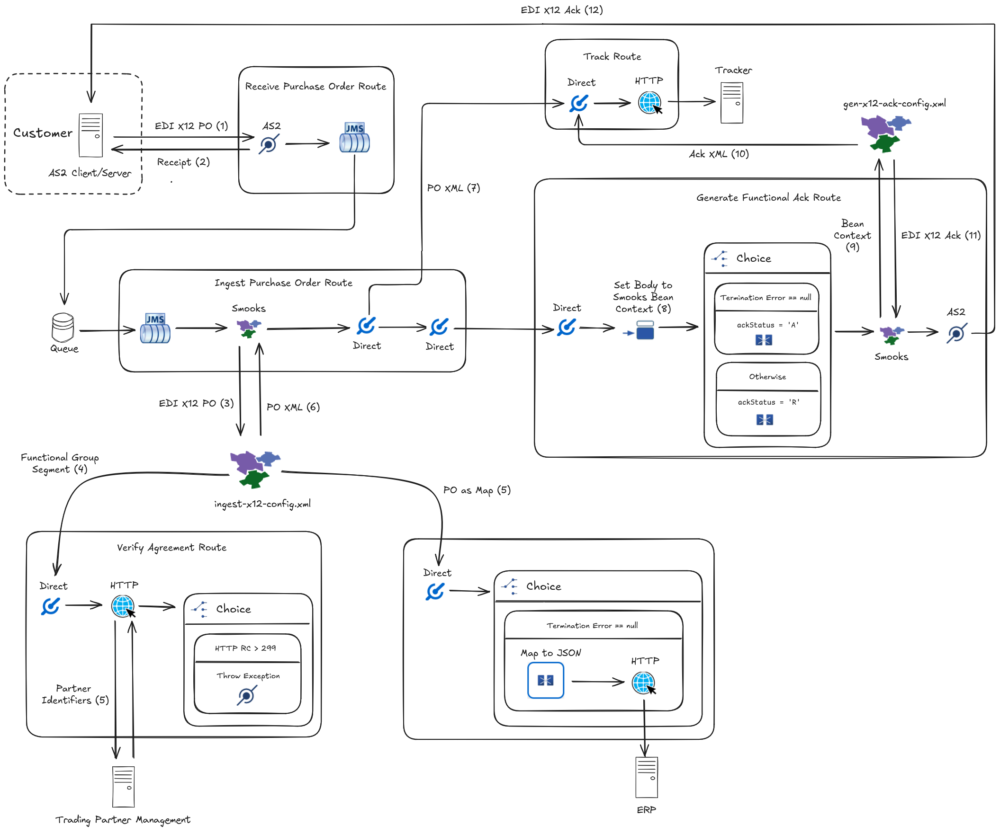

[Electronic Data Interchange (EDI)](https://en.wikipedia.org/wiki/Electronic_data_interchange) underpins the flow of information in numerous industries. From healthcare, retail, and aviation, to finance, manufacturing, and logistics, EDI is the workhorse carrying billions of transactions across applications in these industries.

Historically viewed as a long, complex and costly journey, connecting EDI to the enterprise is traditionally thought to belong in the realm of expensive proprietary software or organisations with sizeable in-house IT teams. The goal of this blog post is to dispel this perception. I will illustrate how sustainable, mature open-source software can stand up the advanced infrastructure required to integrate EDI with an organisation’s downstream systems. Despite the complexities and nuances of EDI, the end result is a low-code flexible solution that can be run with a single keystroke thanks to [Camel JBang](/manual/camel-jbang.html).

The open-source frameworks forming the backbone of this EDI integration are Camel and Smooks. [Smooks](https://www.smooks.org/) is the engine powering EDI implementations around the world. It is an extensible framework used to build event-driven data integration applications that target structured data (XML, [CSV](https://www.smooks.org/documentation/#csv), [EDI](https://www.smooks.org/documentation/#edi), [binary formats](https://www.smooks.org/documentation/#dfdl), etc…) with [XPath-like selectors](https://www.smooks.org/documentation/#selectors) to break it up into fragments. Smooks's ability to transform as well as slice and dice EDI documents together with [Camel’s rich palette of connectors](/components/next/index.html) means that we have a solid foundation to the integration described next.

Depicted below is a common supply chain transaction flow where (1) a customer transmits an EDI purchase order to a supplier requesting goods or services followed by (2) the supplier acknowledging the transaction. Between receiving the purchase order and acknowledging it, the supplier exchanges bits and pieces of the order with its internal systems.



The Camel application I will showcase exchanges [X12](https://x12.org/) documents, a flavour of EDI, to implement the supplier-side flow. While Smooks ships with out-of-the-box support for [EDIFACT](https://www.smooks.org/documentation/#edifact), an EDI dialect popular within Europe, X12 is broadly adopted in North America. It is considered one of the more challenging standards to follow, in small part due to its licensed approach in acquiring the guides governing the data exchange. Later on, we will see how one can parse the X12 purchase orders and generate acknowledgements without these implementation guides in hand.

I will break down the above integration into stages in order to comprehend the overall flow (for those hungry to see the solution in action, you can skip the in-depth explanation and follow the [repo README instructions](https://github.com/apache/camel-jbang-examples/blob/main/edi-x12-as2/README.adoc) to run and test the JBang app):

1. The customer's system transmits an EDI X12 purchase order in an [AS2](/components/next/as2-component.html) message sent over HTTP (HTTP is used for illustration purposes: a production system would typically transmit the AS2 message over HTTPS). The EDI capturing the information in the purchase order would resemble:

   ```edi
   ISA*00*          *00*          *ZZ*ACME           *ZZ*MYCORP         *071216*1406*U*00204*000000263*1*T*>~
   GS*IN*ACME*MYCORP*20071216*1406*000000001*X*004010~
   ST*850*0001~
   BEG*00*SA*XX-1234**20170301**NA~
   PER*BD*ED SMITH*TE*8001234567~
   TAX*53247765*SP*CA*********9~
   N1*BY*ABC AEROSPACE*9*1234567890101~
   N2*AIRCRAFT DIVISION~
   N3*2000 JET BLVD~
   N4*FIGHTER TOWN*CA*98898~
   PO1*1*25*EA*36*PE*MG*XYZ-1234~
   MEA*WT*WT*10*OZ~
   IT8*******B0~
   SCH*25*EA***106*20170615~
   CTT*1~
   AMT*TT*900~
   SE*15*0001~
   GE*1*000000001~
   IEA*1*000000263~
   ```

   Transporting EDI with AS2, in contrast with transporting EDI with plain HTTPS or FTPS, is appealing for business-to-business exchanges because AS2 offers strong security guarantees such as non-repudiation of receipts.

2. Focusing on the supplier side, the _Receive Purchase Order_ Camel route listening for AS2 messages accepts the message containing the purchase order. This route pushes the X12 document onto a [JMS](/components/next/jms-component.html) queue. Immediately after, the AS2 listener endpoint delivers a notification to the AS2 client (i.e., the customer) confirming receipt of the message.

3. The _Ingest Purchase Order_ route picks up the X12 document from the queue and sends it to a [Smooks endpoint](/components/next/smooks-component.html) in order to ingest the EDI. The Smooks endpoint references the file `ingest-x12-config.xml` which configures Smooks to turn the EDI into a stream of events. Under the hood, Smooks is taking advantage of DFDL for parsing and writing the EDI. [DFDL (Data Format Description Language)](https://ogf.org/ogf/doku.php/standards/dfdl/dfdl) is an open standard modeling language for describing general text and binary data. Smooks uses DFDL to emit events from EDI. For instance, given the EDI sample shown earlier, Smooks leverages DFDL to emit, conceptually:

   ```xml
   <interchange>
       <segment>
           <segmentId>ISA</segmentId>
           <dataElement>00</dataElement>
           <dataElement></dataElement>
           <dataElement>00</dataElement>
           <dataElement></dataElement>
           <dataElement>ZZ</dataElement>
           <dataElement>ACME</dataElement>
           <dataElement>ZZ</dataElement>
           <dataElement>MYCORP</dataElement>
           <dataElement>071216</dataElement>
           <dataElement>1406</dataElement>
           <dataElement>U</dataElement>
           <dataElement>00204</dataElement>
           <dataElement>000000263</dataElement>
           <dataElement>1</dataElement>
           <dataElement>T</dataElement>
           <dataElement>&gt;</dataElement>
       </segment>
       ...
       ...
       <segment>
           <segmentId>IEA</segmentId>
           <dataElement>1</dataElement>
           <dataElement>000000263</dataElement>
       </segment>
   </interchange>
   ```

   Each emitted **event** corresponds to a segment or data element within the EDI document. Within `ingest-x12-config.xml`, Smooks is configured to **bind** these events to POJOs using **visitors** which target the events with **selectors**. Different visitors then **route** the POJOs via Camel to (a) verify the document identifiers with a Trading Partner Management system, AND (b) send them to an ERP for purchase order fulfillment.

4. The Smooks endpoint produces an XML representation of the EDI purchase order, even if a non-fatal error happens while binding the events or routing the beans. The _Ingest Purchase Order_ route goes on to post this XML to a tracking system for transaction visibility and monitoring purposes.

5. To complete the circle, the _Generate Functional Ack_ route transmits an X12 acknowledgement of the transaction over AS2 to the customer. In particular, the route takes the POJOs, which were derserialised from EDI segments in the previous Smooks execution, and sends them to another Smooks endpoint. This endpoint calls Smooks with the `gen-x12-ack-config.xml` config to:
    1. Generate the acknowledgment event stream by materialising an XML template with [FreeMarker](https://freemarker.apache.org/) (a popular template engine),
    2. Record the acknowledgement via Camel, and
    3. Serialise the acknowledgement to EDI

---

We will now dive into the individual YAML routes and Smooks XML configs orchestrating the B2B exchange.

#### Receive Purchase Order Route

The following route receives the purchase order from the customer:

```yaml
- routeConfiguration:
    id: as2Error
    onException:
      - onException:
          handled:
            constant: true
          exception:
            - java.lang.Exception
          steps:
            - script:
                groovy: |
                  httpContext = exchangeProperties['CamelAs2.interchange']
                  httpContext.setAttribute(org.apache.camel.component.as2.api.AS2Header.DISPOSITION_TYPE,
                                           org.apache.camel.component.as2.api.entity.AS2DispositionType.FAILED)

- route:
    id: receivePurchaseOrder
    routeConfigurationId: as2Error
    from:
      uri: as2:server/listen
      parameters:
        serverPortNumber: 8081
        requestUriPattern: /mycorp/orders
      steps:
        - to: jms:queue:edi
```

The route `receivePurchaseOrder` has an AS2 endpoint listening for AS2 messages on the URL path `/mycorp/orders`. The AS2 endpoint will return a successful receipt to the client once the route pushes the purchase order to the JMS queue `edi`. However, because the route references the `as2Error` route configuration, a failure receipt will be returned to the client should there be an exception (e.g., broker connection timeout) before the order is placed on to the JMS queue.

#### Ingest Purchase Order Route

The next route consumes the order from `edi` queue:

```yaml
- route:
    id: ingestPurchaseOrder
    from:
      uri: jms:queue:edi
      steps:
        - to: smooks:file:../smooks/ingest-x12-config.xml
        - to: direct:track
        - to: direct:genAck
```

This route sends the order to the Smooks endpoint for translating the EDI into XML. This allows the supplier to track the purchase order. Opening the `ingest-x12-config.xml` file referenced from the Smooks endpoint reveals the following:

```xml
<?xml version="1.0"?>
<smooks-resource-list
        xmlns="https://www.smooks.org/xsd/smooks-2.0.xsd"
        xmlns:jb="https://www.smooks.org/xsd/smooks/javabean-1.6.xsd"
        xmlns:edi="https://www.smooks.org/xsd/smooks/edi-2.0.xsd"
        xmlns:camel="https://www.smooks.org/xsd/smooks/camel-1.5.xsd"
        xmlns:ftl="https://www.smooks.org/xsd/smooks/freemarker-2.1.xsd"
        xmlns:core="https://www.smooks.org/xsd/smooks/smooks-core-1.6.xsd">

    <!-- Configures Smooks to tolerate run-time exceptions which allows the EDI to be tracked even when
         errors occur -->
    <core:filterSettings terminateOnException="false"/>

    <!-- Emits an event stream from the EDI input. The 'segmentTerminator' and 'dataElementSeparator' attributes
         configure the expected EDI delimiters ('%WSP*;' means zero or more whitespaces while '%NL;' means a newline). The default
         schema driving the parsing behaviour is a generic EDI schema written in DFDL but can be overridden with the 'schemaUri'
         config attribute -->
    <edi:parser segmentTerminator="~%WSP*; %NL;%WSP*;" dataElementSeparator="*"/>

   <!-- Runs a pipeline (essentially a nested Smooks execution) on each 'segment' event in order to rewrite the
        segments events, making it easier to target the segments we are interested in. The child 'dataElement' events
        for the segment being processed are kept in-memory since the 'maxNodeDepth' attribute is set to 0 (i.e., max
        possible depth) -->
    <core:smooks filterSourceOn="segment" maxNodeDepth="0">
        <core:config>
            <smooks-resource-list>
                <!-- Rewrites the pipeline root event (i.e., the first event which is 'segment') with a custom FreeMarker template such
                     that it has an attribute called 'segmentId' holding the segment ID. For example:

                     <segment>...</segment>

                     becomes

                     <segment segmentId="ISA">...</segment>

                     Side note: the EDI parser's underlying DFDL processor doesn't support attributes but the
                     'core:rewrite' construct allows us to add attributes which permits us to target segments based on
                     the segment ID rather than on the segment position in the stream -->
                <core:rewrite>
                   <!-- Materialises the FreeMarker template when it encounters the pipeline root event. The template can be
                        viewed at: https://github.com/apache/camel-jbang-examples/blob/main/edi-x12-as2/ftl/segment-id-attr.xml.ftl -->
                   <ftl:freemarker applyOnElement="#document">
                        <ftl:template baseDir="../ftl">segment-id-attr.xml.ftl</ftl:template>
                    </ftl:freemarker>
                </core:rewrite>

                <!-- Binds the segment event having the segmentId attribute ISA' to a HashMap named 'isa' -->
                <jb:bean beanId="isa" class="java.util.HashMap" createOnElement="segment[@segmentId = 'ISA']" retain="true">
                    <jb:value property="interchangeSenderIdQualifier" data="#/dataElement[5]"/>
                    <jb:value property="interchangeSenderId" data="#/dataElement[6]"/>
                    <jb:value property="interchangeReceiverIdQualifier" data="#/dataElement[7]"/>
                    <jb:value property="interchangeReceiverId" data="#/dataElement[8]"/>
                    <jb:value property="interchangeControlNumber" data="#/dataElement[13]"/>
                </jb:bean>

                <!-- Binds the segment event having the segmentId attribute 'GS' to a HashMap named 'gs' -->
                <jb:bean beanId="gs" class="java.util.HashMap" createOnElement="segment[@segmentId = 'GS']" retain="true">
                    <jb:value property="functionalIdCode" data="#/dataElement[1]" />
                    <jb:value property="applicationSenderCode" data="#/dataElement[2]" />
                    <jb:value property="applicationReceiverCode" data="#/dataElement[3]" />
                    <jb:value property="groupControlNumber" data="#/dataElement[6]" />
                </jb:bean>
                <!-- Sends the bean 'gs' to the 'direct:tpm' Camel endpoint when the segment attribute is 'GS' -->
                <camel:route beanId="gs" routeOnElement="segment[@segmentId = 'GS']">
                    <camel:to endpoint="direct:tpm"/>
                </camel:route>

                <!-- Binds the segment event having the segmentId attribute 'PO1' to a HashMap named
                    'purchaseOrder' -->
                <jb:bean beanId="purchaseOrder" class="java.util.HashMap" createOnElement="segment[@segmentId = 'PO1']" retain="true">
                    <jb:value property="quantityOrdered" data="#/dataElement[2]" />
                    <jb:value property="totalAmount" data="segment[@segmentId = 'AMT']/dataElement[2]" />
                    <jb:expression property="status" initVal="'open'"/>
                    <jb:expression property="priority" initVal="'standard'"/>
                </jb:bean>

                <!-- Sends the bean 'purchaseOrder' to the 'direct:erp' Camel endpoint when the segment attribute is
                     equal to 'AMT' -->
                <camel:route beanId="purchaseOrder" routeOnElement="segment[@segmentId = 'AMT']">
                    <camel:to endpoint="direct:erp"/>
                </camel:route>

                <!-- Binds the segment event having the segmentId attribute 'ST' to a HashMap named 'st' -->
                <jb:bean beanId="st" class="java.util.HashMap" createOnElement="segment[@segmentId = 'ST']"
                         retain="true">
                    <jb:value property="transactionSetIdentifier" data="#/dataElement[1]" />
                </jb:bean>
            </smooks-resource-list>
        </core:config>
    </core:smooks>

</smooks-resource-list>
```

The comments in the above Smooks config unpack the EDI processing step by step. Nevertheless, it is worth highlighting that:

* Apart from translating the EDI, Smooks takes advantage of Camel's routing from within the Smooks config to transport individual EDI segments to the supplier's downstream systems.
* The beans Smooks create are retained (but not accumulated) in the [bean context](https://www.smooks.org/documentation/#bean_context). A number of these beans are referenced from a separate Smooks config when generating the acknowledgement.
* Besides producing an XML representation of the inbound EDI in the message body, the Smooks endpoint adds the Smooks execution context to the Camel message headers. As we will see later on, the execution context is used in the `generateFunctionalAck` route to retrieve the bean context and, from it, generate the acknowledgement.

In the XML config, a Smooks visitor is configured to send the `gs` bean, capturing the _Functional Group Header_ segment, to the `direct:tpm` endpoint. The subsequent route receives the EDI segment from `direct:tpm`:

#### Verify Agreement Route

```yaml
- route:
    id: verifyAgreement
    from:
      uri: direct:tpm
      steps:
        - toD:
            uri: "http://{{tpm.address}}"
            parameters:
              sender: ${body['applicationSenderCode']}
              receiver: ${body['applicationReceiverCode']}
              httpMethod: GET
        - choice:
            when:
              - simple: ${headers.CamelHttpResponseCode} == 200
                steps:
                  - throwException:
                      exceptionType: org.apache.camel.edi.example.InvalidPartnerException
```

The `verifyAgreement` route is transmitting properties from the `gs` bean as query parameters in an HTTP call to an external verification service. The `applicationReceiverCode` and `applicationReceiverCode` properties map to the _Functional Group Header_ data elements which identify the trading parties by code. Typically, these codes should be verified. Our use case assumes a Trading Partner Management (TPM) solution is available for verifying the codes. Notice that any non-200 HTTP status code originating from the TPM will lead to the route throwing an exception. Needless to say, it is fairly easy to implement [fine-grained error handling](/manual/exception-clause.html) depending on one's requirements.

Besides the `gs` bean, another visitor is routing the `purchaseOrder` bean to `direct:erp`. `purchaseOrder` captures some X12 segments which are important for fulfilling the order and is processed by the following route:

#### Create ERP Order Route

```yaml
- route:
    id: createErpOrder
    from:
      uri: direct:erp
      steps:
        - choice:
            when:
              - simple: ${headers.CamelSmooksExecutionContext.getTerminationError} == null
                steps:
                  - marshal:
                      json: {}
                  - to:
                      uri: "http://{{erp.address}}/purchase_orders"
                      parameters:
                        httpMethod: POST
```

`createErpOrder` checks whether there were any errors during the Smooks execution, and if not, marshals the bean to JSON before sending the serialised bean to the supplier's ERP system. The JSON transformation and bean content are deliberately kept simple, but in the real-world, it will likely be more complicated than what is shown.

Let us return the `ingestPurchaseOrder` route which called the Smooks endpoint. As mentioned before, the endpoint produces an XML body that `ingestPurchaseOrder` sends to the subsequent route:

#### Track Route

```yaml
- route:
    id: track
    from:
      uri: direct:track
      steps:
        - setHeader:
            name: Content-Type
            constant: application/xml
        - to:
            uri: "http://{{tracker.address}}"
            parameters:
              httpMethod: POST
```

`track` route delivers the XML payload to a tracking system, essentially a data store. The business would use such a system to diagnose errors, perform analytics, build reports, populate dashboards, and so on. As in the `createErpOrder` route, this route omits steps like further transformation for the sake of brevity.

The final stage to our integration is generating as well as transmitting the business acknowledgement to the customer. In this stage, `ingestPurchaseOrder` sends a message to `direct:genAck` which includes the Smooks execution context in one of its headers. Here is the route receiving the message from `direct:genAck` and which goes on to generate the acknowledgement, track it, and deliver it to the customer using AS2:

#### Generate Functional Ack Route

```yaml
- route:
     id: generateFunctionalAck
     from:
        uri: direct:genAck
        steps:
           - setBody:
                groovy: new org.smooks.io.source.JavaSource([*:headers.CamelSmooksExecutionContext.beanContext.beanMap])
           - choice:
                when:
                   - simple: ${headers.CamelSmooksExecutionContext.getTerminationError} == null
                     steps:
                        - transform:
                             groovy: body.with {beans.ackStatus = 'A'; body}
                otherwise:
                   steps:
                      - transform:
                           groovy: body.with {beans.ackStatus = 'R'; body}
           - to: smooks:file:../smooks/gen-x12-ack-config.xml
           - to:
                uri: as2:client/send
                parameters:
                   targetHostName: "{{partner.host.name}}"
                   targetPortNumber: 8081
                   ediMessageContentType: application/edi-x12;charset=US-ASCII
                   as2To: acme
                   as2From: mycorp
                   from: bob@example.org
                   requestUri: /acme/gateway
                   subject: Purchase Order Ack
                   as2MessageStructure: PLAIN
                   inBody: ediMessage
```

1. The first step in the preceding route sets the message body to a Smooks `JavaSource`. The source is holding the bean context created from the previous Smooks execution. Bear in mind that Smooks stashes away the beans, such as the `isa` and `st` beans, inside the bean context.
2. After the `setBody` step, the route adds to the `JavaSource` body a status (i.e., `ackStatus`) denoting whether an error occurred during the Smooks execution. FreeMarker inserts the status into the acknowledgement it generates from the template referenced in the next Smooks config. This status informs the customer whether the business transaction succeeded.
3. The `JavaSource` is fed to Smooks through the `smooks` endpoint. The `../smooks/gen-x12-ack-config.xml` endpoint parameter points to the subsequent Smooks config:

   ```xml
   <?xml version="1.0"?>
   <smooks-resource-list
           xmlns="https://www.smooks.org/xsd/smooks-2.0.xsd"
           xmlns:edi="https://www.smooks.org/xsd/smooks/edi-2.0.xsd"
           xmlns:camel="https://www.smooks.org/xsd/smooks/camel-1.5.xsd"
           xmlns:ftl="https://www.smooks.org/xsd/smooks/freemarker-2.1.xsd"
           xmlns:core="https://www.smooks.org/xsd/smooks/smooks-core-1.6.xsd">

      <!-- Prevents Smooks from emitting an event stream from the 'JavaSource' -->
      <reader>
          <features>
              <setOff feature="http://www.smooks.org/sax/features/generate-java-event-stream" />
          </features>
      </reader>

     <!-- Exports the EDI result as a string instead of the default output stream since the outbound AS2 Camel
          endpoint does not handle output streams -->
      <core:exports>
          <core:result type="org.smooks.io.sink.StringSink"/>
      </core:exports>

      <!-- Runs a pipeline to replace the result event stream with the EDI stream emitted from within the pipeline.
           Prior to being replaced, the result stream in this execution consists of a single "stub" event because
           event streaming is disabled
      -->
      <core:smooks filterSourceOn="#document">
          <!-- Configures the pipeline to replace current event stream with the event stream emitted from the nested
               <smooks-resource-list>...</smooks-resource-list>
           -->
          <core:action>
              <core:inline>
                  <core:replace/>
              </core:inline>
          </core:action>
          <core:config>
              <smooks-resource-list>
                 <!-- Emits an intermediate event stream from a FreeMarker XML template. This template references the
                      'isa', 'gs', 'st', and 'ackStatus' beans from the input `JavaSource` to materialise the
                      acknowledgement. The template can be viewed at https://github.com/apache/camel-jbang-examples/blob/main/edi-x12-as2/ftl/x12-ack.xml.ftl -->
                  <core:rewrite>
                     <!-- Materialises the FreeMarker template when visiting the root event (i.e., stub event) -->
                      <ftl:freemarker applyOnElement="#document">
                          <ftl:template baseDir="../ftl">x12-ack.xml.ftl</ftl:template>
                      </ftl:freemarker>
                  </core:rewrite>

                  <!-- Runs a pipeline on the acknowledgement event stream in order to serialise the stream to
                       XML and bind this XML to the bean 'x12AckAsXml' -->
                  <core:smooks filterSourceOn="#document">
                      <core:action>
                          <core:bindTo id="x12AckAsXml"/>
                      </core:action>
                  </core:smooks>

                  <!-- Sends the 'x12AckAsXml' bean to the Camel endpoint 'direct:track' -->
                  <camel:route beanId="x12AckAsXml" routeOnElement="#document">
                      <camel:to endpoint="direct:track"/>
                  </camel:route>

                  <!-- Uses the default DFDL schema to serialise the event stream to EDI. The 'unparseOnNode'
                       attribute is set to a wildcard to serialise all emitted events while 'segmentTerminator' and
                       'dataElementSeparator' are set to the delimiters to write out ('%NL;' means a newline) -->
                  <edi:unparser segmentTerminator="~%NL;" dataElementSeparator="*" unparseOnNode="*"/>
              </smooks-resource-list>
          </core:config>
      </core:smooks>

   </smooks-resource-list>
   ```

   As explained in the config comments above, Smooks is configured to produce an X12 acknowledgement for Camel. Additionally, it creates a side-channel to Camel in order to track the XML acknowledgement.

4. The final step in `generateFunctionalAck` and in this integration is the delivery of the EDI acknowledgement to the customer's AS2 server. Note: error handling logic for the AS2 message delivery has been left out for the sake of brevity.

   The AS2 server receives an acknowledgement from the supplier such as the one shown below:

   ```edi
   ISA*00*          *00*          *ZZ*MYCORP         *ZZ*ACME           *250130*1842*U*00204*000000264*1*T*>~
   GS*FA*MYCORP*ACME*20250130*184236*000000001*X*004010~
   ST*997*0001~
   AK1*850*000000001~
   AK9*A~
   SE*4*0001~
   GE*1*000000001~
   IEA*1*000000264~
   ```

---

This concludes my brief tour of EDI integration with Camel. What I have showcased challenges the narrative that production-grade EDI middleware can only be built upon closed-source solutions. In fact, I have only scratched the surface of what Camel and Smooks can accomplish together, with EDI and beyond. Read the [instructions](https://github.com/apache/camel-jbang-examples/blob/main/edi-x12-as2/README.adoc) in the [project's repo](https://github.com/apache/camel-jbang-examples/tree/main/edi-x12-as2) to give the demonstrated JBang app a whirl. Do not forget to head over to the [Smooks user guide](https://www.smooks.org/documentation/) to learn more about Smooks. Have feedback or need help on Smooks (better still, want to contribute)? Drop a message in the [Smooks user forum](https://groups.google.com/g/smooks-user).
