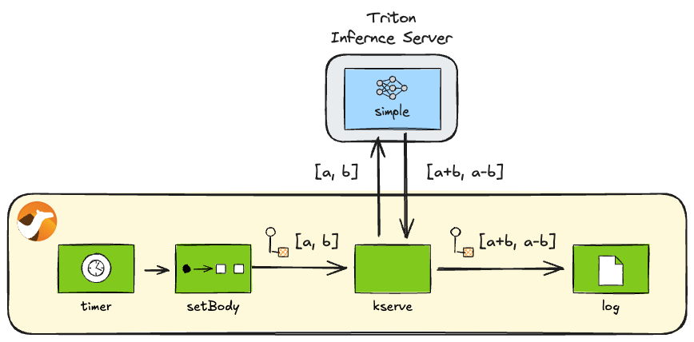

## Introduction

In the previous blog posts ([camel-tensorflow-serving](/blog/2025/02/camel-tensorflow-serving/) and [camel-torchserve](/blog/2025/02/camel-torchserve/)), we discussed the recent release of [Apache Camel 4.10 LTS](/blog/2025/02/camel410-whatsnew/), which introduced three new AI model serving components. [^1]

[^1]: The Camel TorchServe component has been available since version 4.9.

* [TorchServe component](/components/4.10.x/torchserve-component.html)
* [TensorFlow Serving component](/components/4.10.x/tensorflow-serving-component.html)
* [KServe component](/components/4.10.x/kserve-component.html)

We previously wrote about the [TorchServe](/blog/2025/02/camel-torchserve/) and [TensorFlow Serving](/blog/2025/02/camel-tensorflow-serving/) components. This post introduces the KServe component, concluding the series.

## KServe Component

[KServe](https://kserve.github.io/website/) is a platform for serving AI models on Kubernetes. KServe defines an API protocol enabling clients to perform health checks, retrieve metadata, and run inference on model servers. This KServe API [^2] allows you to interact uniformly with KServe-compliant model servers. The [Camel KServe](/components/4.10.x/kserve-component.html) component enables you to request inference from a Camel route to model servers via the KServe API.

[^2]: [KServe Open Inference Protocol V2](https://kserve.github.io/website/latest/modelserving/data_plane/v2_protocol/)

## Preparation

Before diving into the sample code for the Camel KServe component, let's set up the necessary environment.

First, let's install the [Camel CLI](/manual/camel-jbang.html) if you haven't installed it yet:

----

_**INFO:** If JBang is not installed, first install JBang by referring to: <https://www.jbang.dev/download/>_

----

```console
jbang app install camel@apache/camel
```

Verify the installation was successful:

```console
$ camel --version
4.10.2 # Or newer
```

### Launching the server with pre-deployed models

Next, let's set up a KServe-compliant model server on your local machine. To experiment with the KServe component, you'll need a model server that supports the [KServe Open Inference Protocol V2](https://kserve.github.io/website/latest/modelserving/data_plane/v2_protocol/). Several model servers are available, such as [OpenVINO](https://docs.openvino.ai/) and [Triton](https://docs.nvidia.com/deeplearning/triton-inference-server/user-guide/docs/index.html). In this blog post, we will use the [Triton Inference Server Docker image](https://docs.nvidia.com/deeplearning/triton-inference-server/user-guide/docs/getting_started/quickstart.html). The Triton Inference Server image supports not only `amd64` but also `arm64`, making it accessible for macOS users as well.

Since the KServe API doesn't include an operation for registering models, we'll load the model beforehand when starting the server. In this blog post, we will use the demo model [simple](https://github.com/triton-inference-server/server/tree/main/docs/examples/model_repository/simple) provided in the Triton Inference Server repository. Details about this model are provided later in the [Inference](#inference) section.

Download the entire [simple](https://github.com/megacamelus/camel-ai-examples/tree/main/kserve/models/simple) directory from the Triton Inference Server repository and place it within a `models` directory.

----

_**TIPS:** To download files under a specific directory in a GitHub repository efficiently, you can clone the entire repository. However, using [VS Code for the Web](https://code.visualstudio.com/docs/editor/vscode-web) is often easier: with the GitHub repository displayed, press `.` on your keyboard or change the URL from `github.com` to `github.dev`. This opens the repository directly in VS Code within your browser. Then, locate the directory you wish to download and select `Download` from the context menu (right-click). Select a local directory, and you can download all files from the chosen repository directory into it._

----

Once the `simple` directory is downloaded and placed under `models`, start the container from the directory containing the `models` folder using the following command:

```console
docker run --rm --name triton \
    -p 8000:8000 \
    -p 8001:8001 \
    -p 8002:8002 \
    -v ./models:/models \
    nvcr.io/nvidia/tritonserver:25.02-py3 \
    tritonserver --model-repository=/models
```

----

_**INFO:** The Triton Inference Server Docker image `nvcr.io/nvidia/tritonserver` is quite large (approx. 18.2GB), so pulling the image for the first time might take some time._

----

## Server and model operations

----

_**INFO:** If you're primarily interested in learning how to perform inference with Camel KServe, feel free to skip this section and proceed directly to the [Inference](#inference) section._

----

The KServe Open Protocol V2 defines management operations other than inference, categorised as follows:

1. Server Operations
    * Readiness and Liveness Checks ([Server Ready](https://kserve.github.io/website/latest/modelserving/data_plane/v2_protocol/#server-ready) / [Server Live](https://kserve.github.io/website/latest/modelserving/data_plane/v2_protocol/#server-live) API)
    * Metadata Retrieval ([Server Metadata](https://kserve.github.io/website/latest/modelserving/data_plane/v2_protocol/#server-metadata) API)
2. Model Operations
    * Readiness Check ([Model Ready](https://kserve.github.io/website/latest/modelserving/data_plane/v2_protocol/#model-ready) API)
    * Metadata Retrieval ([Model Metadata](https://kserve.github.io/website/latest/modelserving/data_plane/v2_protocol/#model-metadata) API)

Let's examine how to invoke each of these operations from a Camel route.

### Server readiness check

To check if the server is running and ready from a Camel route, use the following endpoint:

```uri
kserve:server/ready
```

**server_ready.java**

```java
//DEPS org.apache.camel:camel-bom:4.10.2@pom
//DEPS org.apache.camel:camel-core
//DEPS org.apache.camel:camel-kserve

import org.apache.camel.builder.RouteBuilder;

public class server_ready extends RouteBuilder {
    @Override
    public void configure() throws Exception {
        from("timer:server-ready?repeatCount=1")
            .to("kserve:server/ready")
            .log("Ready: ${body.ready}");
    }
}
```

Execute it using the Camel CLI:

```console
camel run server_ready.java
```

Upon successful execution, you can verify the server readiness status:

```console
Ready: true
```

### Server liveness check

To check if the server is live from a Camel route, utilise the following endpoint:

```uri
kserve:server/live
```

**server_live.java**

```java
//DEPS org.apache.camel:camel-bom:4.10.2@pom
//DEPS org.apache.camel:camel-core
//DEPS org.apache.camel:camel-kserve

import org.apache.camel.builder.RouteBuilder;

public class server_live extends RouteBuilder {
    @Override
    public void configure() throws Exception {
        from("timer:server-live?repeatCount=1")
            .to("kserve:server/live")
            .log("Live: ${body.live}");
    }
}
```

Execute it using the Camel CLI:

```console
camel run server_live.java
```

Upon successful execution, you can verify the server liveness status:

```console
Live: true
```

### Retrieving server metadata

To retrieve server metadata from a Camel route, use the following endpoint:

```uri
kserve:server/metadata
```

**server_metadata.java**

```java
//DEPS org.apache.camel:camel-bom:4.10.2@pom
//DEPS org.apache.camel:camel-core
//DEPS org.apache.camel:camel-kserve

import org.apache.camel.builder.RouteBuilder;

public class server_metadata extends RouteBuilder {
    @Override
    public void configure() throws Exception {
        from("timer:server-metadata?repeatCount=1")
            .to("kserve:server/metadata")
            .log("Metadata:\n${body}");
    }
}
```

Execute it using the Camel CLI:

```console
camel run server_metadata.java
```

Upon successful execution, you can retrieve the server metadata:

```console
Metadata:
name: "triton"
version: "2.55.0"
extensions: "classification"
extensions: "sequence"
extensions: "model_repository"
extensions: "model_repository(unload_dependents)"
extensions: "schedule_policy"
extensions: "model_configuration"
extensions: "system_shared_memory"
extensions: "cuda_shared_memory"
extensions: "binary_tensor_data"
extensions: "parameters"
extensions: "statistics"
extensions: "trace"
extensions: "logging"
```

### Model readiness check

To check if a specific model is ready for inference, use the following endpoint:

```uri
kserve:model/ready?modelName=simple&modelVersion=1
```

**model_ready.java**

```java
//DEPS org.apache.camel:camel-bom:4.10.2@pom
//DEPS org.apache.camel:camel-core
//DEPS org.apache.camel:camel-kserve

import org.apache.camel.builder.RouteBuilder;

public class model_ready extends RouteBuilder {
    @Override
    public void configure() throws Exception {
        from("timer:model-ready?repeatCount=1")
            .to("kserve:model/ready?modelName=simple&modelVersion=1")
            .log("Ready: ${body.ready}");
    }
}
```

Execute it using the Camel CLI:

```console
camel run model_ready.java
```

Upon successful execution, you can verify the model readiness status:

```console
Ready: true
```

### Retrieving model metadata

Similar to TorchServe and TensorFlow Serving, understanding the input and output signatures of an AI model is crucial for interacting with it effectively. To achieve this, you need to retrieve the model's metadata.

Since metadata retrieval is typically a one-time operation, you can inspect the model signatures in JSON format by calling the following REST API (for the `simple` model):

<http://localhost:8000/v2/models/simple/versions/1>

To retrieve model metadata from within a Camel route, use the following endpoint:

```uri
kserve:model/metadata?modelName=simple&modelVersion=1
```

**model_metadata.java**

```java
//DEPS org.apache.camel:camel-bom:4.10.2@pom
//DEPS org.apache.camel:camel-core
//DEPS org.apache.camel:camel-kserve

import org.apache.camel.builder.RouteBuilder;

public class model_metadata extends RouteBuilder {
    @Override
    public void configure() throws Exception {
        from("timer:model-metadata?repeatCount=1")
            .to("kserve:model/metadata?modelName=simple&modelVersion=1")
            .log("Metadata:\n${body}");
    }
}
```

Execute it using the Camel CLI:

```console
camel run model_metadata.java
```

Upon successful execution, you can retrieve the model metadata:

```console
Metadata:
name: "simple"
versions: "1"
platform: "tensorflow_graphdef"
inputs {
  name: "INPUT0"
  datatype: "INT32"
  shape: -1
  shape: 16
}
inputs {
  name: "INPUT1"
  datatype: "INT32"
  shape: -1
  shape: 16
}
outputs {
  name: "OUTPUT0"
  datatype: "INT32"
  shape: -1
  shape: 16
}
outputs {
  name: "OUTPUT1"
  datatype: "INT32"
  shape: -1
  shape: 16
}
```

## Inference

Let's perform inference on a model using KServe. Here, we'll use the `simple` model to perform a basic calculation.

As observed in the [Retrieving model metadata](#retrieving-model-metadata) section, the `simple` model accepts two `INT32` lists of size 16 (`INPUT0` and `INPUT1`) as input and returns two `INT32` lists of size 16 (`OUTPUT0` and `OUTPUT1`) as output. This model calculates the element-wise sum of `INPUT0` and `INPUT1`, returning the result as `OUTPUT0`, and calculates the element-wise difference, returning it as `OUTPUT1`.

In the example code below, we provide the following inputs to the model:

```console
INPUT0  = [1,  2,  3,  4,  5,  6,  7,  8,  9, 10, 11, 12, 13, 14, 15, 16]
INPUT1  = [0,  1,  2,  3,  4,  5,  6,  7,  8,  9, 10, 11, 12, 13, 14, 15]
```

Consequently, we expect to receive the following outputs:

```console
OUTPUT0 = [1,  3,  5,  7,  9, 11, 13, 15, 17, 19, 21, 23, 25, 27, 29, 31]
OUTPUT1 = [1,  1,  1,  1,  1,  1,  1,  1,  1,  1,  1,  1,  1,  1,  1,  1]
```



_Calling the simple model_

Use the following endpoint for inference:

```uri
kserve:infer?modelName=simple&modelVersion=1
```

**infer_simple.java**

```java
//DEPS org.apache.camel:camel-bom:4.10.2@pom
//DEPS org.apache.camel:camel-core
//DEPS org.apache.camel:camel-kserve

import java.nio.ByteOrder;
import java.util.ArrayList;
import java.util.stream.Collectors;
import java.util.stream.IntStream;
import org.apache.camel.Exchange;
import org.apache.camel.builder.RouteBuilder;
import com.google.protobuf.ByteString;
import inference.GrpcPredictV2.InferTensorContents;
import inference.GrpcPredictV2.ModelInferRequest;
import inference.GrpcPredictV2.ModelInferResponse;

public class infer_simple extends RouteBuilder {
    @Override
    public void configure() throws Exception {
        from("timer:infer-simple?repeatCount=1")
            .setBody(constant(createRequest()))
            .to("kserve:infer?modelName=simple&modelVersion=1")
            .process(this::postprocess)
            .log("Result[0]: ${body[0]}")
            .log("Result[1]: ${body[1]}");
    }

    ModelInferRequest createRequest() {
        var ints0 = IntStream.range(1, 17).boxed().collect(Collectors.toList());
        var content0 = InferTensorContents.newBuilder().addAllIntContents(ints0);
        var input0 = ModelInferRequest.InferInputTensor.newBuilder()
                .setName("INPUT0").setDatatype("INT32").addShape(1).addShape(16)
                .setContents(content0);
        var ints1 = IntStream.range(0, 16).boxed().collect(Collectors.toList());
        var content1 = InferTensorContents.newBuilder().addAllIntContents(ints1);
        var input1 = ModelInferRequest.InferInputTensor.newBuilder()
                .setName("INPUT1").setDatatype("INT32").addShape(1).addShape(16)
                .setContents(content1);
        return ModelInferRequest.newBuilder()
                .addInputs(0, input0).addInputs(1, input1)
                .build();
    }

    void postprocess(Exchange exchange) {
        var response = exchange.getMessage().getBody(ModelInferResponse.class);
        var outList = response.getRawOutputContentsList().stream()
                .map(ByteString::asReadOnlyByteBuffer)
                .map(buf -> buf.order(ByteOrder.LITTLE_ENDIAN).asIntBuffer())
                .map(buf -> {
                    var ints = new ArrayList<Integer>(buf.remaining());
                    while (buf.hasRemaining()) {
                        ints.add(buf.get());
                    }
                    return ints;
                })
                .collect(Collectors.toList());
        exchange.getMessage().setBody(outList);
    }
}
```

Execute it using the Camel CLI:

```console
camel run infer_simple.java
```

Upon successful execution, you should observe the following results. The calculation results match the explanation provided earlier.

```console
Result[0]: [1, 3, 5, 7, 9, 11, 13, 15, 17, 19, 21, 23, 25, 27, 29, 31]
Result[1]: [1, 1, 1, 1, 1, 1, 1, 1, 1, 1, 1, 1, 1, 1, 1, 1]
```

## Summary

Concluding our series on AI model serving components, this post provided a brief overview of the KServe component's functionality, one of the AI model serving components introduced in the latest Camel 4.10 LTS release.

With the addition of the KServe component, alongside TorchServe and TensorFlow Serving, Camel now supports most mainstream AI model servers. This prepares the ground for building integrations that combine Camel with these model servers.

Furthermore, KServe is emerging as the de facto standard API for model serving within Kubernetes-based MLOps pipelines. This enables you to leverage Camel integrations as the application layer for AI models within AI systems built on MLOps platforms such as Kubeflow.

Explore the possibilities of intelligent integration using Apache Camel AI.

The sample code presented in this blog post is available in the following repository:

<https://github.com/megacamelus/camel-ai-examples>
