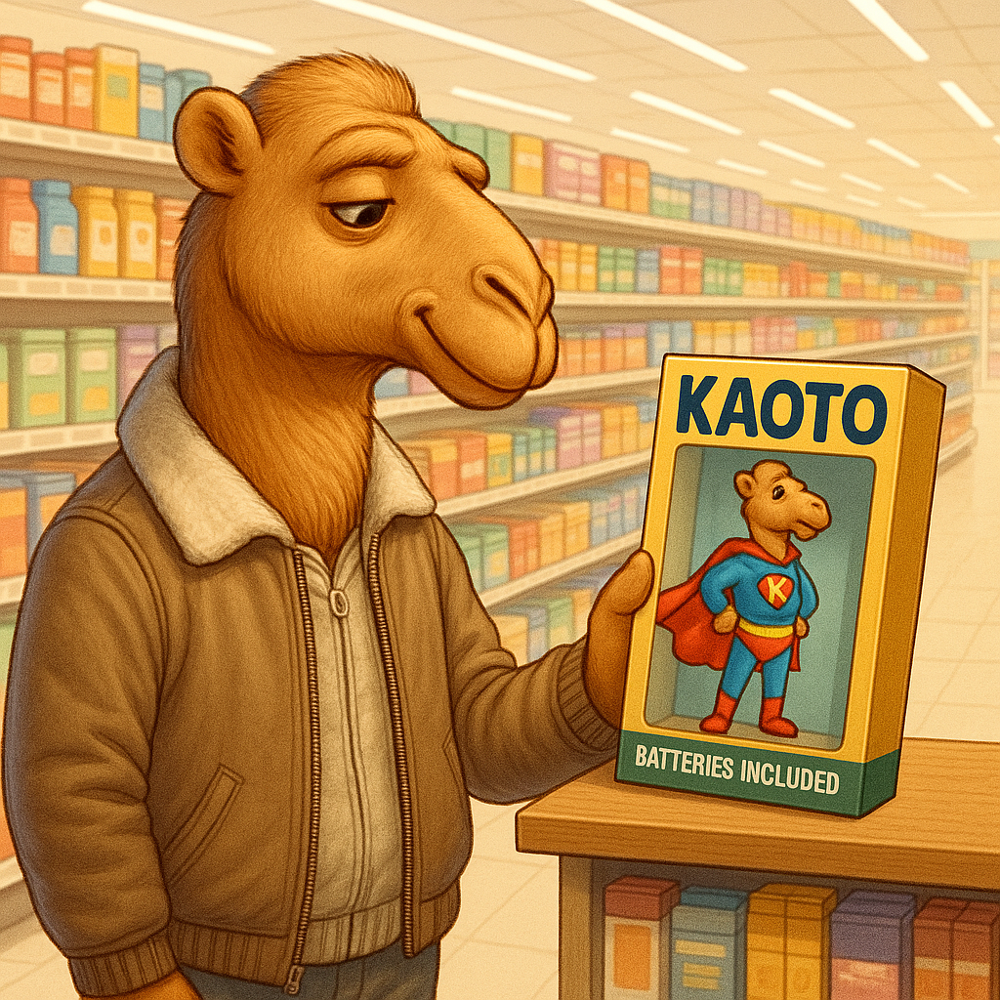
Following the Apache Camel 4.11.0 release, we're happy to announce the release of Kaoto 2.5.

## What’s New in Kaoto 2.5?

We're thrilled to announce the release of Kaoto 2.5, bringing new features, improvements, and bug fixes to enhance your integration experience.

With significant improvements to the UI, expanded support for Camel XML, and new export and documentation tools, Kaoto continues to evolve as the go-to low-code integration editor for Apache Camel.
## Here are the key highlights of this release

### New Kaoto Perspective in VS Code
Kaoto now has a dedicated perspective in VS Code to provide a more focused and streamlined experience for users.  Our goal is to deliver Kaoto with essential tools built in, allowing you to start building integration flows with fewer external extensions.

The new perspective includes the following sections:
* **Integrations**: A dedicated view for your project integrations, making it easier to navigate and running your integration flows.
* **Deployments**: Provides a view for monitor local running integrations and their status.
* **Help & Feedback**: A collection of resources to help you get started with Kaoto, Apache Camel and Enterprise Integration Patterns, alongside with a feedback form to help us improve the project.
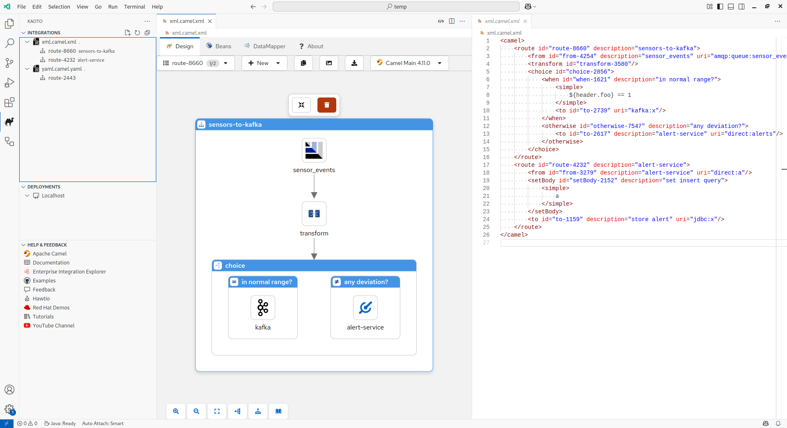

### XML Import/Export Support (Experimental)
Kaoto can now parse and serialize Camel routes from/to XML DSL via Camel XML IO. While still experimental, this is a major step toward better interoperability with traditional Camel development workflows.
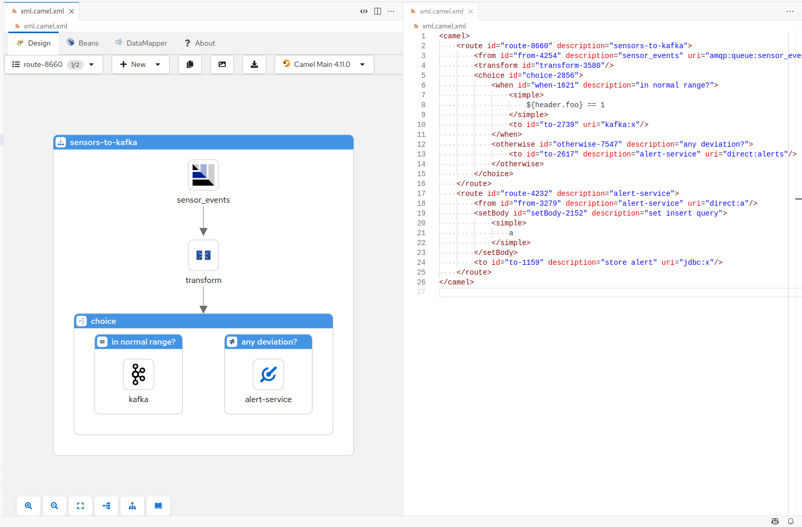

### Export Your Routes to Markdown
Do you want to document your routes effortlessly? You can now export your integration flows with Kaoto as Markdown documents, including a visual representation of the flow in addition to the route parameters, making it easier to share and review routes.
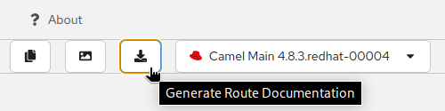
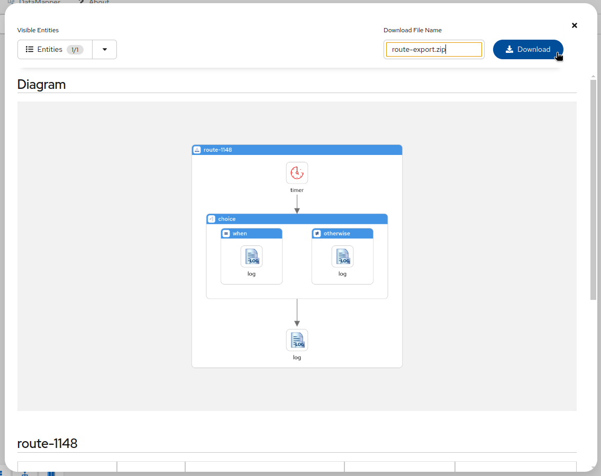

### Enhanced the configuration form
We’re introducing a new Kaoto Form, a redesigned form engine with improved field behavior, better keyboard navigation and filtering for dropdowns, the possibility to wrap the values in a `RAW()` function call and a new `Clear` button to completely remove the value of a field.
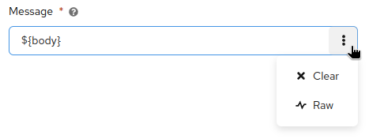

### Canvas Improvements
We reworked the auto-fitting process to retain the original position and zoom level of the canvas when you add a new step. This means that the canvas will no longer automatically zoom out to fit the entire route, allowing you to maintain your preferred view.

### Filter flows in the flows list
You can now filter the flows in the flows list by name, making it easier to find specific routes in larger projects.
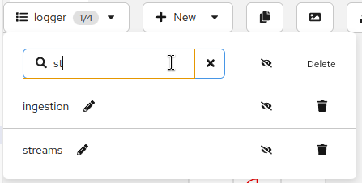

### Dark mode
For those who fancy a darker theme, Kaoto now supports dark mode in the VS Code extension. You can switch to dark mode in the settings.
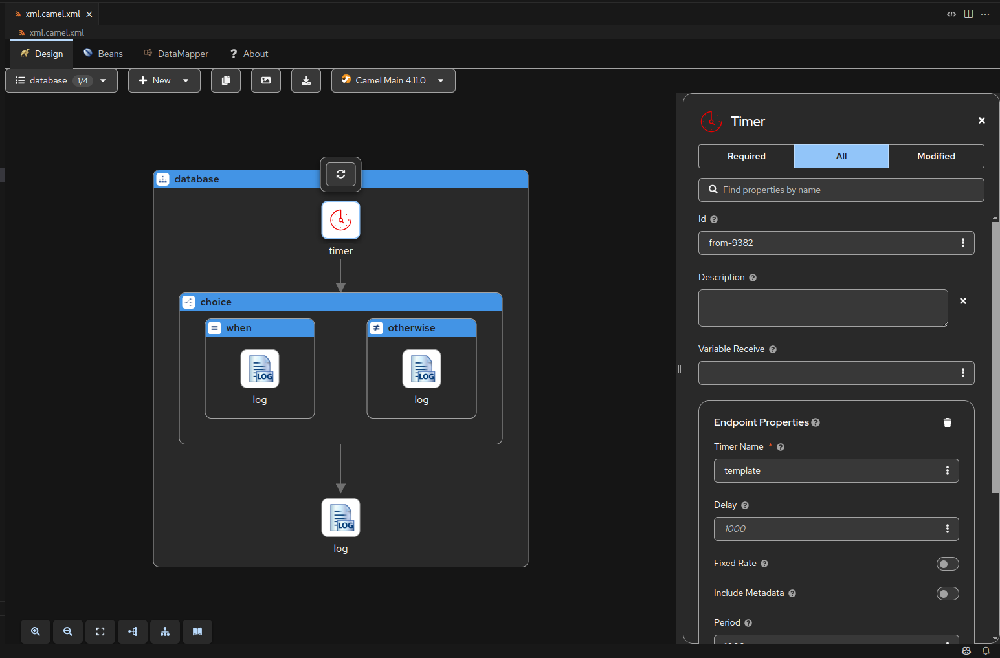

### Camel catalog versions
This version includes the latest Camel catalog version 4.11.0, which brings new components and features to enhance your integration capabilities, alongside the latest LTS version 4.10.3.
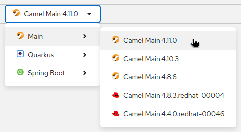

### DataMapper Enhancements
* Support adding multiple mappings on the collection target field
* UI polish for better drag-and-drop experience
* Update generated XSLT version to 3.0
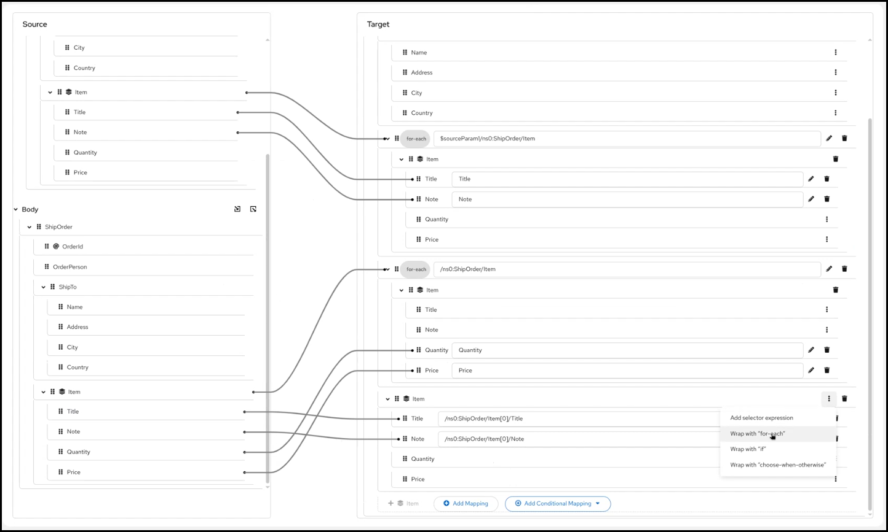

### DevSpaces Ready with Devfile Support
Kaoto now includes an OpenShift-compatible devfile.yaml, making it easier to develop Kaoto in OpenShift Dev Spaces or similar cloud-based workspaces.
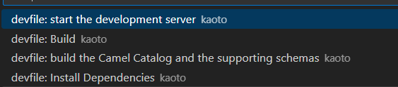
