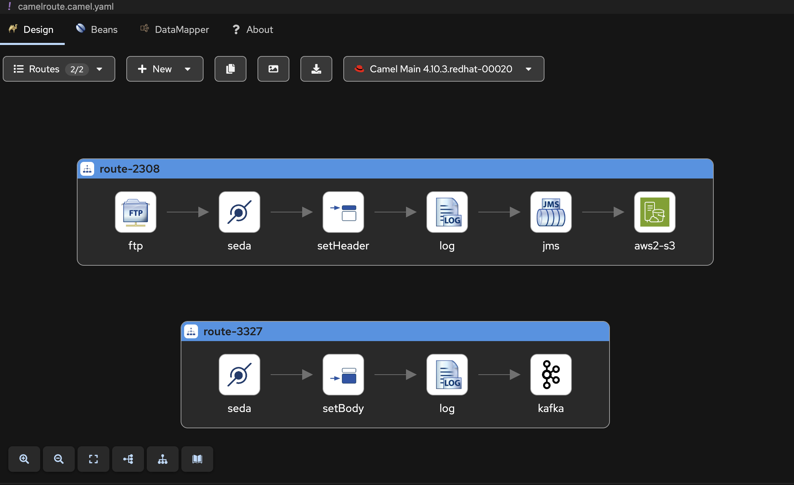

## Introduction

In this blog post, we'll explore how [Apache Camel JBang's Infrastructure Command](/manual/camel-jbang.html#_infrastructure) can help you rapidly prototype end-to-end integration scenarios and adapt to changing requirements. We'll walk through a realistic development scenario where requirements evolve over time, demonstrating how Camel's flexibility makes it an ideal choice for proof-of-concept development.

## Camel JBang Infrastructure: Your Prototyping Toolkit

We already know and love [Camel JBang](/manual/camel-jbang.html) (if you don't, check out [Claus Ibsen's YouTube channel](https://www.youtube.com/@ClausIbsen/videos) for excellent tutorials). One of recent additions is the infra command, which can list and run external services like brokers, databases, FTP servers, and more.
To see available services, simply run:

```console
$ camel infra list
```

Apache Camel excels at integrating multiple systems, and the infra command streamlines the process of setting up these systems for development and testing. With just a few commands and minimal configuration, you can create sophisticated proof-of-concepts.

## Scenario: A Typical Development Journey

Let's walk through a realistic scenario that many developers face: building a proof-of-concept with requirements that evolve during development.

This is something that happens all the time in IT, picture this, you are a developer, and you have a manager asking for a POC, and you know, requirements are always shady, especially in IT, and they change, A LOT!

let's start with something simple. The initial requirement is: `We need a simple file processing system. Files appear in the /data folder occasionally, and we want to upload them to an S3 bucket called my-bucket. We don't have S3 credentials set up yet for this POC.` This is a common situation - you need to demonstrate functionality before infrastructure is fully provisioned.

### Implementation

The goal is straightforward: poll a given folder and upload files to an S3 bucket. Let's see how this can be easily prototyped with Apache Camel.

First of all, make sure that [JBang is installed](https://www.jbang.dev/documentation/jbang/latest/installation.html) and let's install Camel JBang:

```console
$ jbang app install --name camel --force camel@apache/camel
```

At the time of writing this blogpost, the version is:

```console
$ camel version
JBang version: 0.122.0
Camel JBang version: 4.13.0
```

Let's see how `camel infra` can help with AWS services

```console
$ camel infra list
ALIAS             IMPLEMENTATION                          DESCRIPTION
aws               cloud-watch, config, dynamo-db,         Local AWS Services with LocalStack
                   dynamodb, ec2, event-bridge, iam,
                   kinesis, kms, lambda, s3,
                   secrets-manager, sns, sqs, sts
```

Perfect! We can run a local S3 service for our POC:

```console
$ camel infra run aws s3
{
  "accessKey" : "accesskey",
  "amazonAWSHost" : "localhost:4566",
  "getConnectionProperties" : {
    "aws.access.key" : "accesskey",
    "aws.host" : "localhost:4566",
    "aws.protocol" : "http",
    "aws.region" : "us-east-1",
    "aws.secret.key" : "secretkey"
  },
  "protocol" : "http",
  "region" : "us-east-1",
  "secretKey" : "secretkey"
}
```

Notice how the JSON output provides all the configuration details we need for the AWS S3 component. There's almost a 1:1 mapping between the infra output and component configuration.

let's write some code and create a simple Camel route that uploads files to S3. For this purpose, we'll use the [Apache Camel AWS S3 component](/components/4.10.x/aws2-s3-component.html), the JSON provided by the `camel infra run aws s3` command contains all the informations to get started with the component:

```java
import org.apache.camel.builder.RouteBuilder;

public class CamelRoute extends RouteBuilder {

    @Override
    public void configure() throws Exception {
        from("file:/data")
                .setHeader("CamelAwsS3Key", simple("${headers.CamelFileName}"))
                .log("Uploading file ${headers.CamelFileName} to S3")
                .to("aws2-s3:my-bucket" +
                        "?accessKey=accesskey" +
                        "&secretKey=secretkey" +
                        "&region=us-east-1" +
                        "&overrideEndpoint=true" +
                        "&uriEndpointOverride=http://localhost:4566" +
                        "&forcePathStyle=true" +
                        "&autoCreateBucket=true");
    }
}
```

Save this route to a file named `CamelRoute.java` and we can finally execute it with Camel JBang

```console
$ camel run CamelRoute.java
2025-07-18 13:59:02.820  INFO 16070 --- [           main] org.apache.camel.main.MainSupport        : Apache Camel (JBang) 4.13.0 is starting
2025-07-18 13:59:02.968  INFO 16070 --- [           main] org.apache.camel.main.MainSupport        : Running Mac OS X 15.5 (aarch64)
2025-07-18 13:59:02.968  INFO 16070 --- [           main] org.apache.camel.main.MainSupport        : Using Java 21.0.2 (OpenJDK 64-Bit Server VM) with PID 16070
2025-07-18 13:59:02.968  INFO 16070 --- [           main] org.apache.camel.main.MainSupport        : Started by fmariani in /private/tmp/test2
2025-07-18 13:59:03.048  INFO 16070 --- [           main] org.apache.camel.main.ProfileConfigurer  : The application is starting with profile: dev
2025-07-18 13:59:03.692  INFO 16070 --- [           main] he.camel.cli.connector.LocalCliConnector : Camel JBang CLI enabled
2025-07-18 13:59:04.363  INFO 16070 --- [           main] .main.download.MavenDependencyDownloader : Downloaded: org.apache.camel:camel-aws2-s3:4.13.0 (took: 580ms) from: central@https://repo1.maven.org/maven2
2025-07-18 13:59:04.385  INFO 16070 --- [           main] e.camel.impl.engine.AbstractCamelContext : Apache Camel 4.13.0 (CamelRoute) is starting
2025-07-18 13:59:04.859  INFO 16070 --- [           main] e.camel.impl.engine.AbstractCamelContext : Routes startup (total:1)
2025-07-18 13:59:04.859  INFO 16070 --- [           main] e.camel.impl.engine.AbstractCamelContext :     Started route1 (file://data)
2025-07-18 13:59:04.859  INFO 16070 --- [           main] e.camel.impl.engine.AbstractCamelContext : Apache Camel 4.13.0 (CamelRoute) started in 474ms (build:0ms init:0ms start:474ms boot:1s562ms)
```

Test it by creating a file, such as `test.txt`, and copy it into the `/data` folder

```console
$ echo "Test content" > /data/test.txt
```

The output shows successful processing:

```console
2025-07-18 13:59:16.397  INFO 16070 --- [5 - file://data] CamelRoute.java:9                        : Uploading file test.txt to S3
```

### The first feature request

After the initial demo, new requirements emerge: `I forgot to mention, every time a file is picked up, a message with the following informations (...) has to be sent to a kafka topic named myTopic`

Luckily, `camel infra list` exposes a kafka service that can be easily run with:

```console
$ camel infra run kafka
{
  "brokers" : "localhost:9092",
  "getBootstrapServers" : "localhost:9092"
}
```

In this case we have a perfect 1:1 match between the properties from the `infra run` command and the [Apache Camel Kafka component](/components/4.10.x/kafka-component.html), the only required property for the Kafka component is `brokers`, let's update the previous route with the new requirements:

```java
import org.apache.camel.builder.RouteBuilder;

public class CamelRoute extends RouteBuilder {

    @Override
    public void configure() throws Exception {
        from("file:/data")
                .to("seda:kafka")
                .setHeader("CamelAwsS3Key", simple("${headers.CamelFileName}"))
                .log("Uploading file ${headers.CamelFileName} to S3 with content ${body}")
                .to("aws2-s3:my-bucket" +
                        "?accessKey=accesskey" +
                        "&secretKey=secretkey" +
                        "&region=us-east-1" +
                        "&overrideEndpoint=true" +
                        "&uriEndpointOverride=http://localhost:4566" +
                        "&forcePathStyle=true" +
                        "&autoCreateBucket=true");

        from("seda:kafka")
                .setBody(simple("Uploading ${headers.CamelFileNameOnly} with content ${body}"))
                .log("Sending event to Kafka Topic")
                .to("kafka:myTopic?brokers=localhost:9092");
    }
}
```

Re-run the route using Camel JBang, add a file to the `/data` folder, and a similar log will be printed:

```console
$ camel run CamelRoute.java
...
2025-07-18 14:06:43.097  INFO 16427 --- [5 - file://data] CamelRoute.java:10                       : Uploading file test.txt to S3 with content Body!
2025-07-18 14:06:43.097  INFO 16427 --- [ - seda://kafka] CamelRoute.java:22                       : Sending event to Kafka Topic
```

The file is uploaded to AWS S3, and a message is sent to the kafka topic.

## Another requirment change

`Ooops, my bad, the file is not on the file system where the application is running, but it is on an FTP server`

Checking the `camel infra list` we get lucky another time (I wonder why... :D)—there is an FTP service that can be used:

```console
camel infra run ftp
{
  "directoryName" : "myTestDirectory",
  "getFtpRootDir" : "file:///Users/fmariani/Repositories/croway/camel/target/ftp/camel-test-infra-test-directory/camel-test-infra-configuration-test-directory",
  "getPort" : 2221,
  "host" : "localhost",
  "hostname" : "localhost",
  "password" : "admin",
  "port" : 2221,
  "username" : "admin"
}
```

> Note: For most infra services, Docker images via Testcontainers are executed behind the scenes. The infra command exposes most of the components from the [Apache Camel test infra](https://github.com/apache/camel/tree/main/test-infra). There's no magic behind it—we're reusing the same infrastructure that we use to test Camel itself. Some services, like the FTP one, don't need Docker; instead, an embedded FTP service is spun up.

Let's update the previous route. Instead of the file component, the [Apache Camel FTP component](/components/4.10.x/ftp-component.html) has to be used, using Java DSL there is not an easy 1:1 mapping between the component and the `infra run ftp` JSON, but we would have 1:1 mapping using YAML DSL. 

```java
import org.apache.camel.builder.RouteBuilder;

public class CamelRoute extends RouteBuilder {

    @Override
    public void configure() throws Exception {
        from("ftp:admin@localhost:2221/myTestDirectory?password=admin&noop=true")
                .to("seda:kafka")
                .setHeader("CamelAwsS3Key", simple("${headers.CamelFileName}"))
                .log("Uploading file ${headers.CamelFileName} to S3 with content ${body}")
                .to("aws2-s3:my-bucket" +
                        "?accessKey=accesskey" +
                        "&secretKey=secretkey" +
                        "&region=us-east-1" +
                        "&overrideEndpoint=true" +
                        "&uriEndpointOverride=http://localhost:4566" +
                        "&forcePathStyle=true" +
                        "&autoCreateBucket=true");

        from("seda:kafka")
                .setBody(simple("Uploading ${headers.CamelFileNameOnly} with content ${body}"))
                .log("Sending event to Kafka Topic")
                .to("kafka:myTopic?brokers=localhost:9092");
    }
}
```

We can use any software to interact with the FTP, such as FileZilla, but is it really needed? we can easily automate the upload part to the FTP server with Camel, we can do it with [Camel JBang](/manual/camel-jbang.html#_sending_messages_via_camel):

```console
$ echo "Test content" > test.txt
$ camel cmd send --body=file:test.txt --uri='ftp:admin@localhost:2221/myTestDirectory?password=admin'
2025-07-18 14:23:55.104  17196 --- ftp://admin@localhost:2221/myTestDirecto : Sent (success) (192ms)
```

Finally, we can observe the following in the log of the Camel Route:

```console
2025-07-18 14:24:16.629  INFO 17266 --- [myTestDirectory] CamelRoute.java:10                       : Uploading file 7A28171126F2E65-0000000000000000 to S3 with content Body!
2025-07-18 14:24:16.629  INFO 17266 --- [ - seda://kafka] CamelRoute.java:22                       : Sending event to Kafka Topic
```

## The AI Feature request

`Finally, each file contains informations that we would like to be available to our LLM, let's decouple the process though, when a file is picked up, send the file to an Artemis queue, then, parse the content of the file, apply the following logic, and insert the content in Qdrant`

Let's open a couple of console and run the services

```console
$ camel infra run artemis
{
  "brokerPort" : 61616,
  "password" : "artemis",
  "remoteURI" : "tcp://localhost:61616",
  "restart" : null,
  "serviceAddress" : "tcp://localhost:61616",
  "userName" : "artemis"
}

```console
$ camel infra run qdrant
{
  "getGrpcHost" : "localhost",
  "getGrpcPort" : 6334,
  "getHttpHost" : "localhost",
  "getHttpPort" : 6333,
  "host" : "localhost",
  "port" : 6334
}
```

For a plain Camel scenario, the [Apache Camel JMS component](/components/4.10.x/jms-component.html) configuration is a little bit cumbersome, [luckily there are examples](https://github.com/apache/camel-kamelets-examples/tree/main/jbang/artemis) that shows how this can be done.

Let's create an `application.properties` file and add the following configuration, in this case, we'll use `camel infra run artemis` informations to fill the `application.properties`

```properties
# artemis connection factory
camel.beans.artemisCF = #class:org.apache.activemq.artemis.jms.client.ActiveMQConnectionFactory
# URL for broker
camel.beans.artemisCF.brokerURL = tcp://localhost:61616

# if broker requires specific login
camel.beans.artemisCF.user = artemis
camel.beans.artemisCF.password = artemis

# pooled connection factory
camel.beans.poolCF = #class:org.messaginghub.pooled.jms.JmsPoolConnectionFactory
camel.beans.poolCF.connectionFactory = #bean:artemisCF
camel.beans.poolCF.maxSessionsPerConnection = 500
camel.beans.poolCF.connectionIdleTimeout = 20000
# more options can be configured
# https://github.com/messaginghub/pooled-jms/blob/main/pooled-jms-docs/Configuration.md

# setup JMS component to use connection factory
camel.component.jms.connection-factory = #bean:poolCF
```

Let's update the CamelRoute file to send the message to the queue:

```java
import org.apache.camel.builder.RouteBuilder;

public class CamelRoute extends RouteBuilder {

    @Override
    public void configure() throws Exception {
        from("ftp:admin@localhost:2221/myTestDirectory?password=admin&noop=true")
                .to("seda:kafka")
                .setHeader("CamelAwsS3Key", simple("${headers.CamelFileName}"))
                .log("Uploading file ${headers.CamelFileName} to S3 with content ${body}")
                .to("jms:myQueue")
                .to("aws2-s3:my-bucket" +
                        "?accessKey=accesskey" +
                        "&secretKey=secretkey" +
                        "&region=us-east-1" +
                        "&overrideEndpoint=true" +
                        "&uriEndpointOverride=http://localhost:4566" +
                        "&forcePathStyle=true" +
                        "&autoCreateBucket=true");

        from("seda:kafka")
                .setBody(simple("Uploading ${headers.CamelFileNameOnly} with content ${body}"))
                .log("Sending event to Kafka Topic")
                .to("kafka:myTopic?brokers=localhost:9092");
    }
}
```

The `camel run` command has to be updated, to include the `application.properties` file:

```console
$ camel run CamelRoute.java application.properties
```

Finally, let's create the Camel route that consumes from the queue and inserts data into Qdrant. Of course, before doing that, we need to create embeddings from the content of the body. This can be easily done with the [Apache Camel Langchain4j Embeddings component](/components/4.10.x/langchain4j-embeddings-component.html).

Before that, the collection has to be created in Qdrant, let's use Camel to achieve this:

```java
import org.apache.camel.builder.RouteBuilder;
import io.qdrant.client.grpc.Collections;
import org.apache.camel.component.qdrant.Qdrant;
import org.apache.camel.component.qdrant.QdrantAction;
import org.apache.camel.spi.DataType;

public class CreateEmbeddingsCollection extends RouteBuilder {

    @Override
    public void configure() throws Exception {

        from("timer://runOnce?repeatCount=1")
                .log("Creating collection")
                .setHeader(Qdrant.Headers.ACTION)
                .constant(QdrantAction.CREATE_COLLECTION)
                .setBody()
                    .constant(
                        Collections.VectorParams.newBuilder()
                                .setSize(384)
                                .setDistance(Collections.Distance.Cosine).build())
                .to("qdrant:embeddings")
                .log("Collection embeddings created");
    }
}
```

Running this route once via Camel JBang we'll get the following output

```console
camel run CreateEmbeddingsCollection.java --dependency=camel-qdrant
...
2025-07-18 15:42:06.157  INFO 20614 --- [           main] e.camel.impl.engine.AbstractCamelContext : Apache Camel 4.13.0 (CreateEmbeddingsCollection) started in 403ms (build:0ms init:0ms start:403ms boot:1s150ms)
2025-07-18 15:42:07.098  INFO 20614 --- [timer://runOnce] CreateEmbeddingsCollection.java:13       : Creating collection
2025-07-18 15:42:07.299  INFO 20614 --- [ducer:endpoint2] CreateEmbeddingsCollection.java:22       : Collection embeddings created

```

Let's create the `CamelRouteQueueConsumer.java` route that consumes from the queue, creates an embedding from the body using a local LLM and inserts the resulting vector in Qdrant:

```java
import org.apache.camel.builder.RouteBuilder;
import dev.langchain4j.model.embedding.onnx.allminilml6v2.AllMiniLmL6V2EmbeddingModel;
import org.apache.camel.component.qdrant.Qdrant;
import org.apache.camel.component.qdrant.QdrantAction;
import org.apache.camel.spi.DataType;

public class CamelRouteQueueConsumer extends RouteBuilder {

    @Override
    public void configure() throws Exception {
        getCamelContext().getRegistry().bind("embedding-model", new AllMiniLmL6V2EmbeddingModel());

        from("jms:myQueue")
                // Do complex logic with the body ${body}
                .convertBodyTo(String.class)
                .to("langchain4j-embeddings:test")
                .transform(new DataType("qdrant:embeddings"))
                .setHeader(Qdrant.Headers.ACTION, constant(QdrantAction.UPSERT))
                .to("qdrant:embeddings")
                .log("Embedding inserted successfully");
    }
}
```

In this case, the body sent to the jms queue is the content of the file. The `langchain4j-embeddings:test` will generate the embedding using `AllMiniLmL6V2EmbeddingModel` which is then transformed `.transform(new DataType("qdrant:embeddings"))` to a format that can be easily inserted in Qdrant. Finall, the actual insertion into the vector store `.setHeader(Qdrant.Headers.ACTION, constant(QdrantAction.UPSERT)).to("qdrant:embeddings")`.

Run the following route with this command (extra dependencies are needed):

```console
camel run CamelRouteQueueConsumer.java application.properties --dependency=dev.langchain4j:langchain4j-embeddings-all-minilm-l6-v2:0.36.2,camel-qdrant
```

## The final architecture

Our final architecture now includes:

* AWS S3 (LocalStack) - File storage
* Kafka - Event streaming
* FTP - File input source
* ActiveMQ Artemis - Message queuing
* Qdrant - Vector database for AI embeddings

All services are orchestrated through Camel routes, demonstrating how complex integration scenarios can be built incrementally.

Testing the complete pipeline:

```console
$ camel cmd send --body=file:test.txt --uri='ftp:admin@localhost:2221/myTestDirectory?password=admin'
```

Results in successful processing across all components:

```console
camel run CamelRouteQueueConsumer.java application.properties --dependency=dev.langchain4j:langchain4j-embeddings-all-minilm-l6-v2:0.36.2,camel-qdrant
...
2025-07-18 15:50:45.877  INFO 22126 --- [           main] e.camel.impl.engine.AbstractCamelContext : Apache Camel 4.13.0 (CamelRouteQueueConsumer) started in 530ms (build:0ms init:0ms start:530ms boot:2s811ms)
2025-07-18 15:50:56.331  INFO 22126 --- [ducer:endpoint3] CamelRouteQueueConsumer.java:20          : Embedding inserted successfully
```

## Conclusion

This walkthrough demonstrates how Apache Camel JBang's infrastructure command enables rapid prototyping of complex integration scenarios. Key benefits include:

* Rapid Infrastructure Setup - Services can be started with single commands
* Consistent Configuration - Infrastructure output maps directly to component configuration
* Iterative Development - Requirements can evolve without major architectural changes
* Production Readiness - Prototypes can be refined into production-ready solutions

The `camel infra` command significantly reduces the time between concept and working prototype, making it invaluable for proof-of-concept development and architectural exploration.

## Visual development

For those who prefer visual development, [Kaoto](https://kaoto.io) provides a graphical interface for designing Camel routes:



as you can see from the image, a `camelroute.camel.yaml` file is created, and everything that was discussed in this blog post applies here as well, in particular, we can run the yaml route via jbang

`camel run camelroute.camel.yaml application.properties`

This visual approach can be particularly helpful when demonstrating integration flows to stakeholders or when collaborating with team members who prefer graphical representations of system architecture.

The code for this blog post is available at https://github.com/Croway/camel-infra-blogpost/tree/main