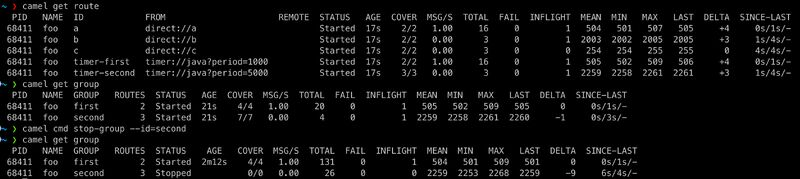

Apache Camel 4.14 LTS has just been [released](/blog/2025/08/RELEASE-4.14.0/).

This release introduces a set of new features and noticeable improvements that we will cover in this blog post.

## Camel Core

Camel consumers will now eager setup MDC logging which makes it possible to include details such as `routeId` in logs while the consumer
is being created and startup.

The Intercept EIP now includes more details where the message was intercepted (node id and other information).

## Camel Management

We made it easier to control routes by their grouping, for example to stop a set of routes.

Stopping routes will keep their JMX processor MBeans making troubleshooting easier, as you can investigate all the statistics of the processors.

There are now _dump_ methods to dump statistics in JSon format as well.

## Camel JBang

The Camel JBang now uses JDK21 as default instead of 17.

We added support for controlling Camel routes by groups, so you can start and stop entire set of routes, using `camel cmd start-group` and `camel cmd stop-group`.

You can now enable and disable EIPs dynamically using the `camel cmd enable-processor` and `camel cmd disable-processor`.

The `camel debug` has many improvements and now runs a bit faster.

The `camel debug` now supports debugging Camel Spring Boot applications, by executing `camel debug pom.xml` which will
detect that it's a Camel Spring Boot Maven project, and then startup Spring Boot via `mvn spring-boot:run` and attach
the Camel route debugger automatic.

The `camel debug` can now step forward to a given _index_ which makes it fast to jump to a position such as if you restart
the application and want to debug from a problematic spot during troubleshooting.

The `camel kubernetes` plugin now better support running and exporting a project by a directory name, and to refer to a relative directory
from where the command is being executed; making it more similar to `camel run` command.

The `camel infra` command has been overhauled to better control and manage multiple processors.

## Camel Groovy

You can now preload shared groovy sources such as DTOs and common functions, and make those available on the classpath,
for entire Camel to use, such as from other components, dataformats, and Java.

All you have to do is putting the groovy files in `src/main/resources/camel-groovy`, and add `camel-groovy` as dependency.

This also works to hot update in Camel JBang dev mode, so you can edit the source, and automatic update Camel, making it
very fast for coding in low-code style.

## Camel AI

TODO:

## Camel Spring Boot

`camel-spring-boot` is upgraded to the latest Spring Boot 3.5.4 release.

## Java 25

We have prepared the code-base for the upcoming Java 25 release. However, this release does
not officially support Java 25, but we are not aware of any issues (feedback is welcome).
We will work on official Java 25 support in the following releases.

## Miscellaneous

Upgraded many third-party dependencies to the latest releases at the time of release.

We made `camel-smb` more resilient and better recover when there are connectivity problems.

The `camel-rabbitmq` has improved performance in the producer.

## New Components

- `camel-iso8583` - Create, edit and read ISO-8583 messages
- `came-langchain4j-agent` - AI Agent

## Upgrading

Make sure to read the [upgrade guide](/manual/camel-4x-upgrade-guide-4_14.html) if you are upgrading from a previous
Camel version.

If you are upgrading from, for example, 4.4 to 4.8, then make sure to follow the upgrade guides for each release
in-between, i.e.
4.4 -> 4.5, 4.5 -> 4.6, and so forth.

The Camel Upgrade Recipes tool can also be used to automate upgrading.
See more at: https://github.com/apache/camel-upgrade-recipes

## Release Notes

You can find additional information about this release in the list of resolved JIRA tickets:

- [Release notes 4.14](/releases/release-4.14.0/)

## Roadmap

The following 4.15 release is planned for October 2025.

