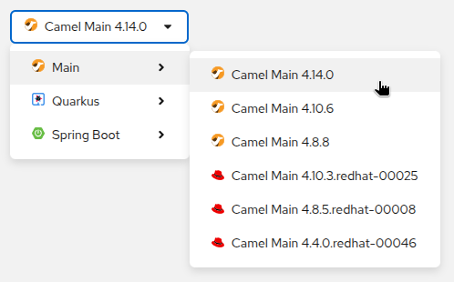

## What’s New in Kaoto 2.7?

We're excited to announce the release of Kaoto 2.7, bringing significant enhancements to the visual integration design experience for Apache Camel. This release focuses on expanding DataMapper capabilities, improving developer productivity, and delivering a more intuitive canvas experience.

## Here are the key highlights of this release

### DataMapper JSON Support
One of the most significant additions in Kaoto 2.7 is comprehensive JSON support for the DataMapper. Building on the XML support introduced in previous releases, the DataMapper now enables you to:

* Serialize and deserialize JSON data structures for visual mapping
* Attach JSON schemas to visualize data structures in tree view
* Create mappings between JSON and XML formats
* Choose root elements when working with schemas containing multiple root elements



### Updating maven dependencies
When using the VS Code Kaoto extension, upon saving the route, the necessary maven dependencies get added to the pom.xml file

### Enhanced Canvas Experience
We've made several improvements to make working with the canvas more productive:

* Copy and Paste Functionality
* Copy steps and entire containers across your routes



### Drag and Drop Improvements
* Reorder steps directly on the canvas by dragging them to new positions
* Drag and drop across root containers for better route organization
* Enhanced visual feedback during move operations



### Step Duplication
* Duplicate nodes with a single click to quickly replicate configured steps
* Preserve all configuration when duplicating complex containers



### Undo/Redo Support
* Full undo/redo functionality for canvas operations
* Navigate through your design changes with confidence
* Recover from accidental modifications easily



### Form and UI Enhancements
* Intelligent Form Suggestions
* Form suggestions help you complete configurations faster
* Simple expression language suggestions for better expression authoring
* Application.properties suggestions with metadata-driven completions



### Flexible Component Configuration
* Switch between to, toD, and poll variants directly in the form
* Preserve expression strings when switching between expression language types
* Improved parameter handling with URI parsing enhancements

### Camel catalog versions
This version includes the latest Camel catalog version 4.14.0

