## What's New in Kaoto 2.8?

This release represents a major step forward in DataMapper maturity, with extensive XML Schema support improvements, better visual feedback, and numerous stability fixes. We've also enhanced the canvas experience with contextual menus and improved the forms system for better configuration management.

## Here are the key highlights of this release:

### DataMapper XML Schema Support Enhancements
Kaoto 2.8 brings improvements to XML Schema handling in the DataMapper:

- **Advanced Schema Features**: Full support for `xs:extension`, `xs:restriction`, allowing you to work with sophisticated XML schemas
- **Field Type Visualization**: Field type icons now appear in the tree view, making it easier to identify data types at a glance

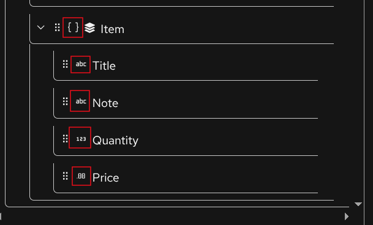

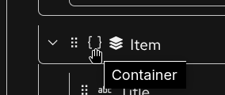

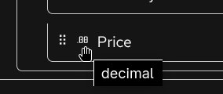

- **Occurrence Indicators**: Display of `minOccurs` and `maxOccurs` attributes helps you understand cardinality requirements directly in the UI

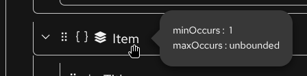

- **Improved XPath Handling**: Better support for relative xpath with parent (`..`) notation and `current()` function in expressions

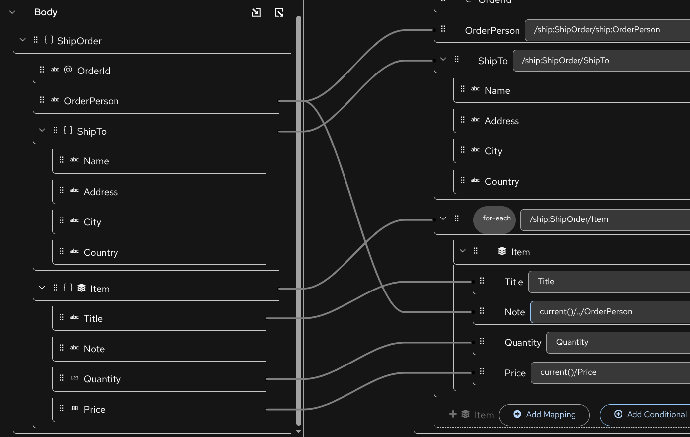

- **Parameter Renaming**: Rename parameters directly within the DataMapper interface

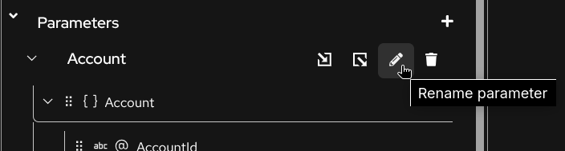

- **Smart Deletion**: Warning prompts when deleting mappings with child mappings to prevent accidental data loss

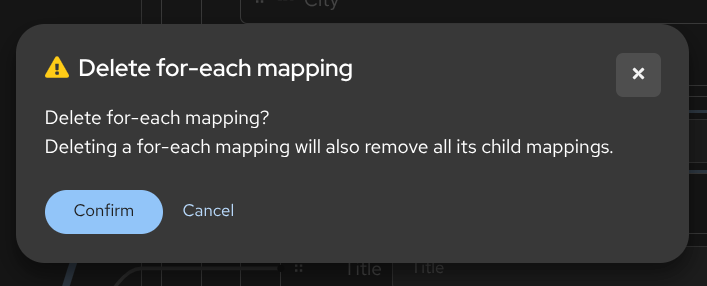

### VS Code Extension Improvements
- **What's new**: When opening the VS Code Kaoto extension a "What's New" dialog appears to inform users about the latest features and improvements

- **Walkthrough Tutorial**: A new interactive tutorial guides users through the main features of Kaoto within VS Code
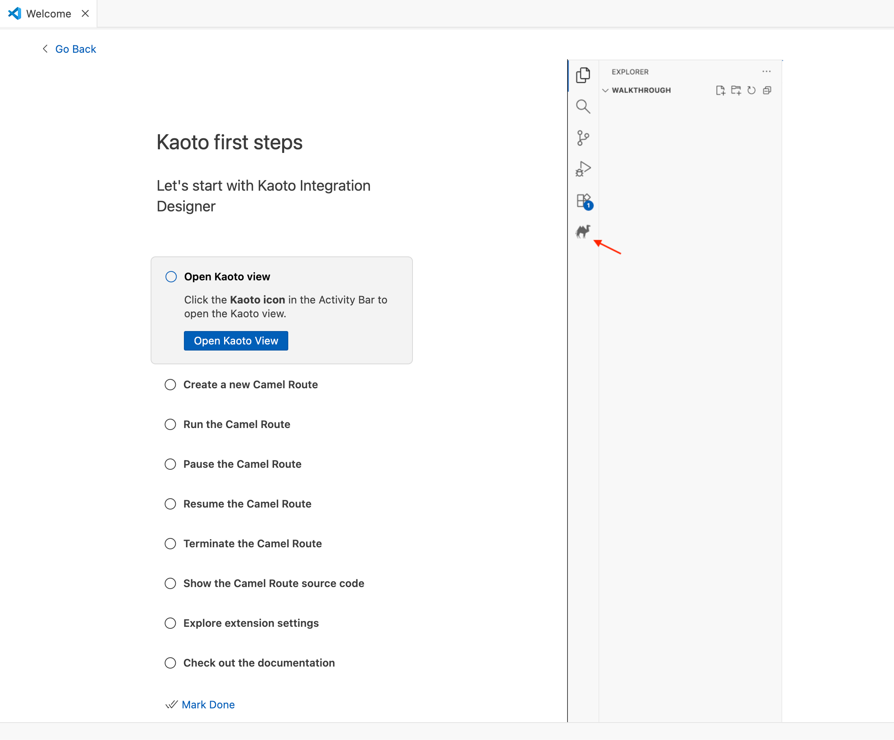

### Canvas Enhancements
- **Contextual Menu**: Right-click on canvas nodes to access relevant actions directly where you need them


- **Keyboard Support**: Delete steps quickly by selecting them and pressing the Delete key
- **Improved Drag Feedback**: Different mouse pointer styles clearly indicate which nodes are draggable and which are not
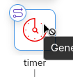
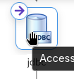

### Forms and Configuration
- **Enum Field Support**: Improved component’s options when `enum` type is available
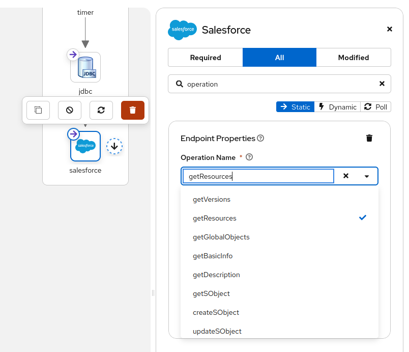
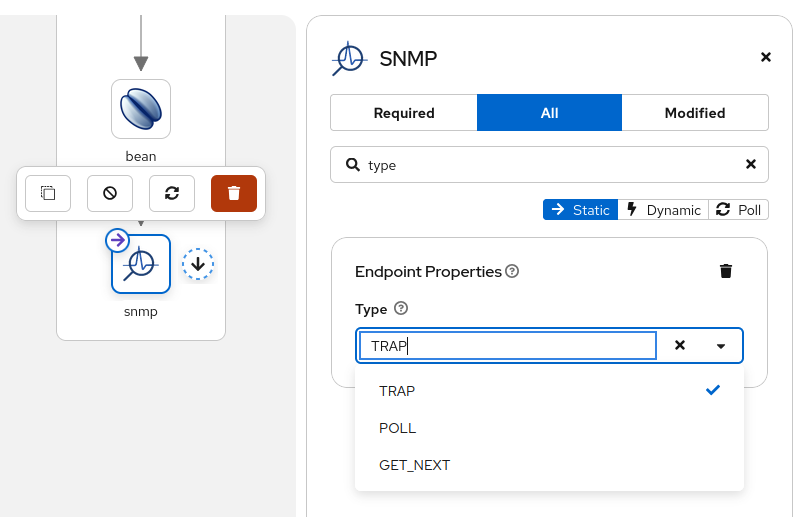
- **Beans EIP**: The beans EIP now shows a list of defined beans in the Camel route
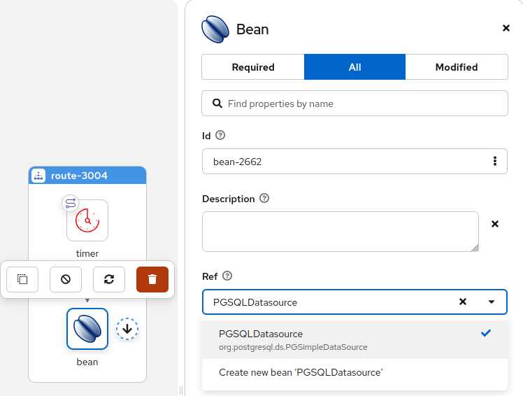
- **JDBC component**: The JDBC now shows the `default` and `dataSource` options and offers a list of beans to pick a dataSource from
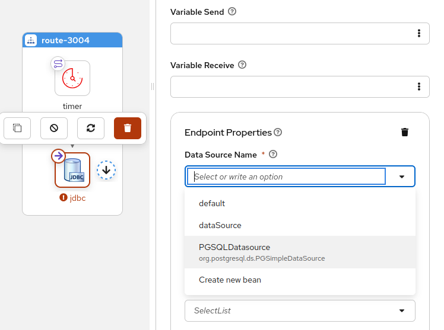
- **OnException Validation**: Enhanced validation for exception handling configurations
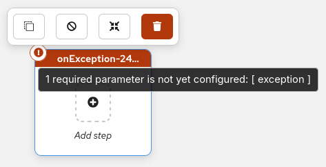

### Bugfixes
- **URI Serialization**: Improved component parameter handling in XML URI serialization when no syntax is present
- **Route Ordering**: Fixed the order of Intercept* elements to ensure correct processing sequence

### Camel Catalog Version
This version includes:
* Camel main: 4.16.0
* Camel extensions for Quarkus: 3.29.0
* Camel Spring-boot: 4.14.1

## Get Started with Kaoto 2.8
Ready to try Kaoto 2.8? You can:

- Install the [VS Code extension](https://marketplace.visualstudio.com/items?itemName=redhat.vscode-kaoto) from the marketplace
- Try the [web version](https://kaoto.io) directly in your browser
- Check out the [documentation](https://kaoto.io/docs) to learn more

## Feedback Welcome
We're always looking to improve Kaoto based on your needs. If you have suggestions, encounter issues, or want to contribute, please reach out through:

- [GitHub Issues](https://github.com/KaotoIO/kaoto/issues)
- [GitHub Discussions](https://github.com/KaotoIO/kaoto/discussions)
- The Apache Camel community channels

Thank you to all the contributors who made this release possible!
