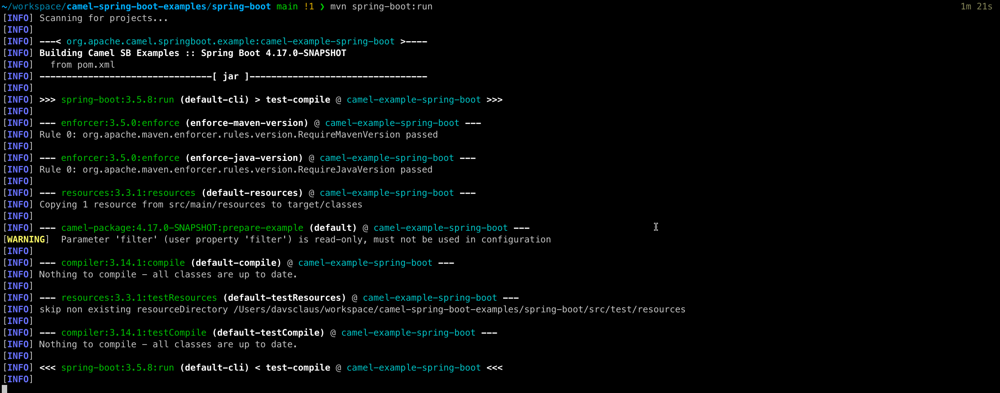

Apache Camel 4.17 has just been [released](/blog/2026/01/RELEASE-4.17.0/).

This release introduces a set of new features and noticeable improvements that we will cover in this blog post.

## Camel Core

We have marked up important headers in various EIPs and components for tooling and troubleshooting assistance.

If you have the need to trigger only once and are using a timer such as `timer:tick?repeatCount=1`,
then we have added the `once` component to trigger only once on startup, and made it much easier to pre configure
the message body and headers as needed.

When using Rest DSL with _contract first_, Camel now also captures JMX performance metrics, just as it does with _code first_.


## Camel JBang

We continue to improve the Camel JBang experience. 

For example, we made it easier to do remote debugging for Spring Boot or Quarkus (or any other runtime).
Add the `camel-cli-debug` JAR as dependency to your project, and then run `mvn spring-boot:run` and the debugger
will be activated, and prints the CLI command to execute to attach the Camel JBang debugger, as shown below:



Camel JBang now also comes automatic with history for the last message. This makes it very easy to see what happened.
Suppose you build a Camel application and then try by sending a message into Camel or active something, and then want
to know exactly what happened at each step in the routes. The `camel get history` command can show you all of that.

In this release we improved this command, and also added the `--it` mode as shown below:


You can now also load new routes into existing running Camel JBang applications with the `camel cmd load` command:

```shell
$ camel cmd load --source=cheese.java
```

And if you load the same route then its updated, and you can use `--restart` to force restarting all routes.


## Camel Test

We have added `camel-test` modules for JUnit 6 support.

## Camel OpenAI

The OpenAI component provides integration with OpenAI and OpenAI-compatible APIs for chat completion using the official openai-java SDK.
For example, you can then use LLM models to ask questions very easily from Camel routes:

```java
from("direct:chat")
    .setBody(constant("What is Apache Camel?"))
    .to("openai:chat-completion")
    .log("Response: ${body}");
```

Stay tuned for more examples and blog posts in the future about this component.

## Observability

You can now collect various metrics directly from Camel routes using OtEL in the new `camel-opentelemtry-metrics` component.
For example to increment metric counters from your Camel routes, by calling `opentelemetry-metrics:counter:my.counter?increment=1`

## Camel Spring Boot

`camel-spring-boot` has been upgraded to the latest Spring Boot 3.5.9 release.

### Spring AI Integration

Camel 4.17 introduces comprehensive integration with [Spring AI](https://docs.spring.io/spring-ai/reference/), providing four new components that bring AI/LLM capabilities to Camel routes:

- **camel-spring-ai-chat**: Perform chat operations with any LLM supported by Spring AI. Features include prompt templates, conversation memory (message-based and vector-based semantic memory), Retrieval Augmented Generation (RAG) with VectorStore, multimodal support (images, audio, documents), SafeGuard content filtering, structured output conversion, and token usage tracking.

- **camel-spring-ai-tools**: Enable function calling / tool use that allows AI models to invoke Camel routes as tools during conversations. This enables building agentic AI applications where LLMs can execute business logic, query databases, call external APIs, and more.

- **camel-spring-ai-embeddings**: Compute embeddings using Spring AI embedding models for semantic similarity search, text clustering, and RAG pipelines.

- **camel-spring-ai-vector-store**: Store and retrieve documents in vector databases with similarity search and metadata filtering.

Together, these components provide a foundation for integrating AI capabilities into Camel integration flows, leveraging the AI models and vector stores supported by Spring AI.

## Java 25

We continue to prepare the codebase for the upcoming Java 25 release. However, this release does
not officially support Java 25, but we are not aware of any issues (feedback is welcome).
We will work on official Java 25 support later in 2026.

There are some 3rd-party libraries that are not yet Java 25 compatible, and we are waiting for those
to release compatible versions.

## Miscellaneous

Upgraded many third-party dependencies to the latest releases at the time of release.

The `camel-ftp` component now supports producer-based health checks (this feature must be explicitly enabled).

And the `camel-sql` can now dynamically select the `DataSource` (ie database) in the producer (ie `to` / `toD`).
We also made the SQL stored procedure component support named parameters, just like the regular SQL component.

The `camel-smb` component now uses atomic move IO operations instead of copy & delete (faster).

## New Components

We have added many new components to this release.

- `camel-aws2-rekognition` - Manage and invoke AWS Rekognition
- `camel-aws2-s3-vectors` - Store and query vector embeddings using AWS S3 Vectors with similarity search
- `camel-chroma` - Perform operations on the Chroma Vector Database
- `camel-cli-debug` - Remote CLI debugger
- `camel-cyberark-vault` - Retrieve secrets from CyberArk Conjur Vault
- `camel-google-vertexai` - Interact with Google Cloud Vertex AI generative models
- `camel-ibm-watson-speech-to-text` - Convert speech audio to text using IBM Watson Speech to Text
- `camel-ibm-watson-text-to-speech` - Convert text to natural-sounding speech using IBM Watson Text to Speech
- `camel-iggy` - Send and receive message to Apache Iggy streaming platform
- `camel-once` - Trigger a single message only once at startup (useful for development and testing purposes)
- `camel-openai` - OpenAI endpoint for chat completion
- `camel-opentelemetry-metrics` - Camel metrics based on the Camel Telemetry spec
- `camel-spring-ai-chat` - Perform chat operations using Spring AI
- `camel-spring-ai-embeddings` - Spring AI Embeddings
- `camel-spring-ai-tools` - Spring AI Tools and Function Calling Features
- `camel-spring-ai-vector-store` - Spring AI Vector Store
- `camel-stripe` - Interact with the Stripe payment platform
- `camel-test-junit6` - Camel unit testing with JUnit 6
- `camel-test-main-junit6` - Camel unit testing with Main and JUnit 6
- `camel-test-spring-junit6` - Camel unit testing with Spring and JUnit 6

## Upgrading

Make sure to read the [upgrade guide](/manual/camel-4x-upgrade-guide-4_17.html) if you are upgrading from a previous
Camel version.

If you are upgrading from, for example, 4.4 to 4.8, then make sure to follow the upgrade guides for each release
in-between, i.e.
4.4 -> 4.5, 4.5 -> 4.6, and so forth.

The Camel Upgrade Recipes tool can also be used to automate upgrading.
See more at: https://github.com/apache/camel-upgrade-recipes

## Release Notes

You can find additional information about this release in the list of resolved JIRA tickets:

- [Release notes 4.17](/releases/release-4.17.0/)

## Roadmap

The next 4.18 LTS release is planned for February/March 2026.

This will be the last release that supports Spring Boot 3.5.x.

From Camel 4.19 onwards we are on a journey to migrate to Spring Boot v4, Spring Framework v7, JUnit v6, 
Jackson v3, Groovy v5, and other major upgrades that would be a bumpy road to travel.
