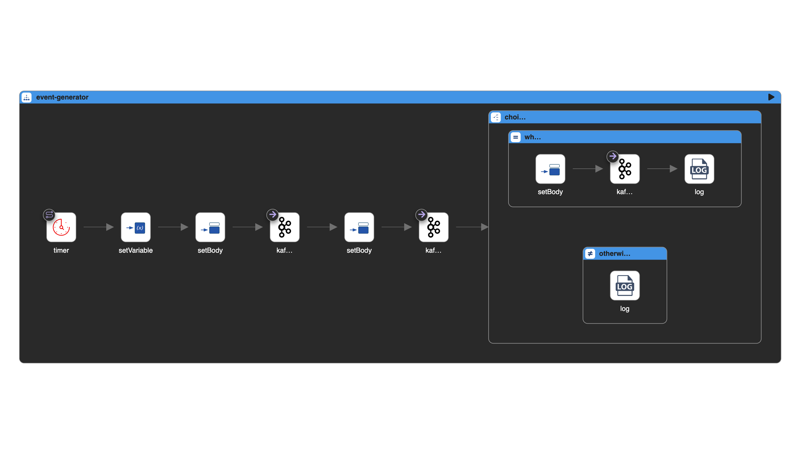
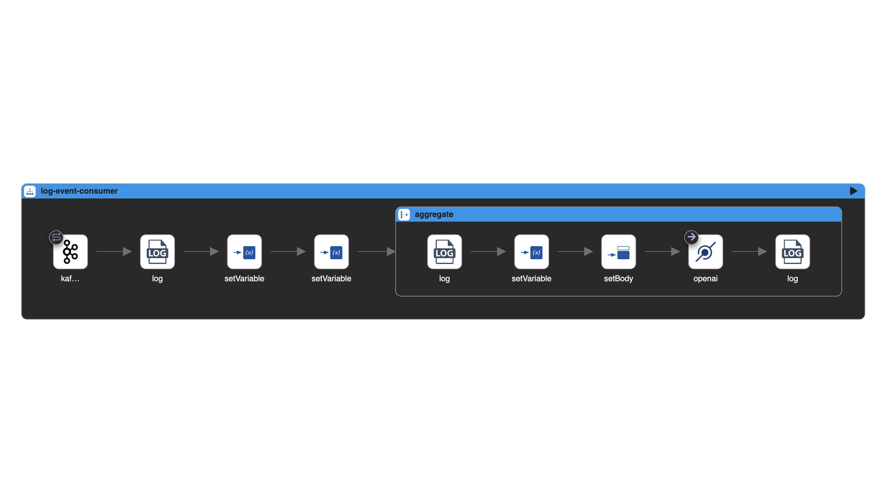
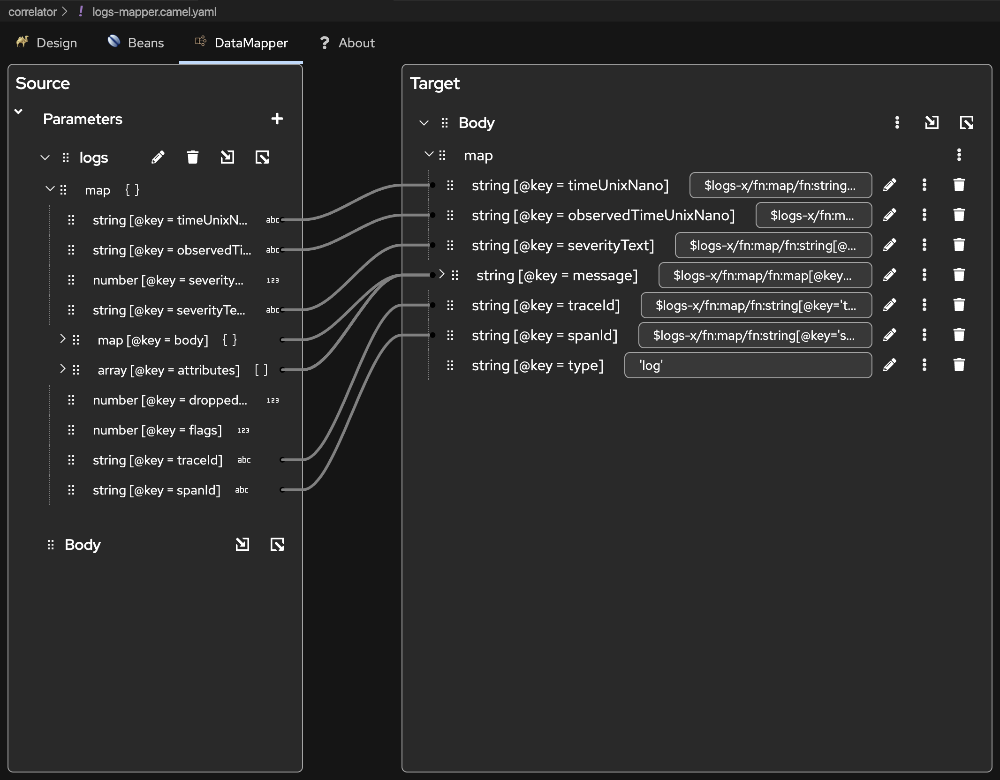
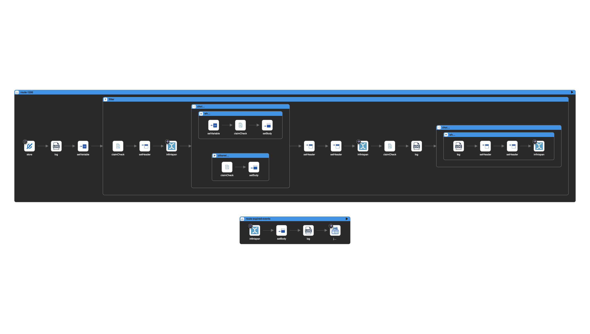
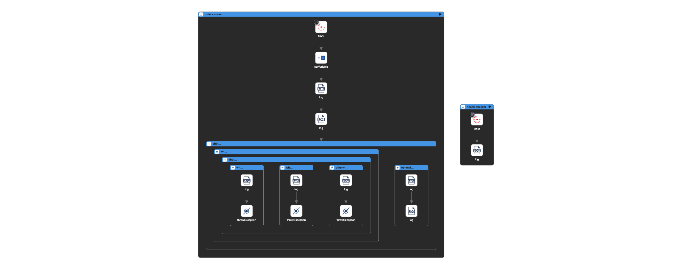
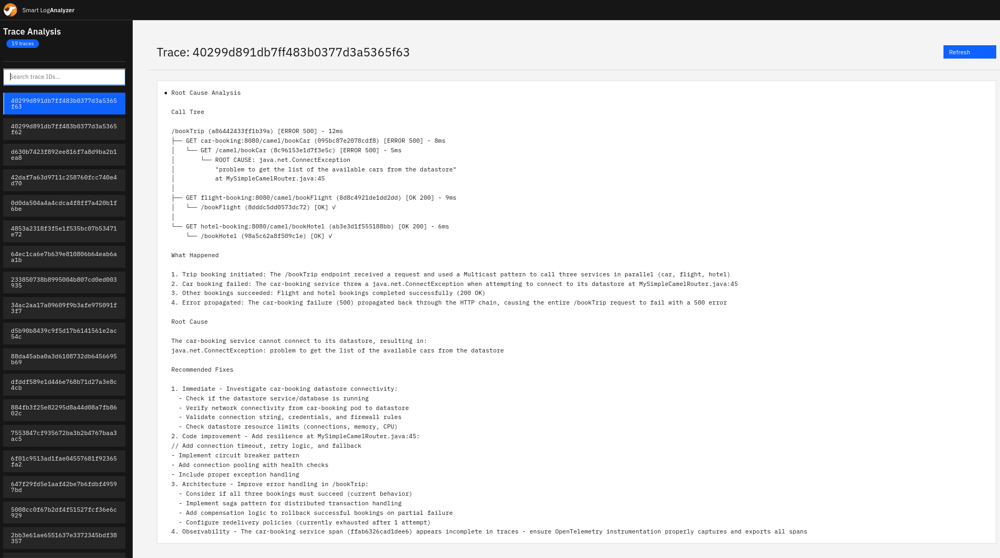

In this blogpost, we'll walk through a modern approach to developing Apache Camel applications. We'll build a distributed log analyzer that automatically detects errors and uses an LLM for root cause analysis. Along the way, we'll explore how tools like Camel JBang and Kaoto make development incredibly productive, and why Apache Camel's YAML DSL is a perfect match for LLM-assisted development.

## Why Apache Camel?

Before diving into the implementation, let's address why Apache Camel is an excellent choice for this kind of system.

What makes Camel particularly compelling today is how well LLMs understand it. Modern Large Language Models tend to produce high-quality Apache Camel routes because Camel's DSLs (Java, XML and YAML) are declarative and well-documented. This means you can describe your integration use case to an LLM and receive working Camel YAML DSL routes in return. The generated code is:

- **Human-readable**: YAML DSL is declarative and easy to understand at a glance. Moreover tools like Kaoto can be used to visualize the generated routes
- **Production-ready**: Behind the simple DSL, you get access to Camel's robust runtime, error handling, and enterprise integration patterns
- **Maintainable**: The generated routes can be easily reviewed, modified, and extended

This represents the best of both worlds: you can leverage LLMs to quickly prototype and implement integration solutions, while the output uses a well-understood, battle-tested framework rather than opaque generated code. The Camel framework handles the complexity, connection pooling, error recovery, and scaling concerns while you focus on the business logic.

## The Use Case: Distributed Log Analysis

We'll build a system that:
- Collects logs from distributed applications via Kafka
- Correlates related log events by trace ID
- Automatically triggers LLM analysis when errors are detected
- Provides actionable insights for root cause analysis

Let's build this in two iterations: first a simple prototype to validate the concept, then a production-ready implementation using OpenTelemetry.

## First Iteration: Quick Prototype

### Prerequisites

This tutorial requires **Java 17 or later**. Apache Camel 4.17 (the latest release at the time of writing) supports Java 17+.

### Setting Up Kafka

If you haven't already, install [JBang](https://www.jbang.dev/) and the Apache Camel CLI:

```bash
jbang app install camel@apache/camel
```

Starting Kafka is now a single command (requires [Docker](https://www.docker.com/)):

```bash
camel infra run kafka
```

```
Starting service kafka (PID: XYZ)
{
  "brokers" : "localhost:9092",
  "getBootstrapServers" : "localhost:9092"
}
Press ENTER to stop the execution
```

Behind the scenes, a Kafka broker is running via Docker and we can use the `brokers` property to configure our Camel routes.

### Creating a Load Generator

Our applications need to generate logs with a trace ID so we can group related events. Here's a simple load generator that simulates this:

```yaml
- route:
    id: event-generator
    from:
      uri: timer:eventGenerator
      parameters:
        period: 5000
      steps:
        # Generate a new traceId for each timer event
        - setVariable:
            name: traceId
            simple: "${random(10000,99999)}-${date:now:yyyyMMddHHmmssSSS}"

        # Send first INFO event
        - setBody:
            simple: '{"traceId": "${variable.traceId}", "level": "INFO", "message": "Application started processing request", "timestamp": "${date:now:yyyy-MM-dd''T''HH:mm:ss.SSSZ}"}'
        - to:
            uri: kafka:log-events
            parameters:
              brokers: localhost:9092

        # Send second INFO event
        - setBody:
            simple: '{"traceId": "${variable.traceId}", "level": "INFO", "message": "Request validation completed successfully", "timestamp": "${date:now:yyyy-MM-dd''T''HH:mm:ss.SSSZ}"}'
        - to:
            uri: kafka:log-events
            parameters:
              brokers: localhost:9092

        # 30% chance of generating an ERROR event
        - choice:
            when:
              - simple: "${random(1,10)} <= 3"
                steps:
                  - setBody:
                      simple: '{"traceId": "${variable.traceId}", "level": "ERROR", "message": "Unexpected error occurred during processing", "timestamp": "${date:now:yyyy-MM-dd''T''HH:mm:ss.SSSZ}"}'
                  - to:
                      uri: kafka:log-events
                      parameters:
                        brokers: localhost:9092
                  - log:
                      message: "ERROR event sent for traceId: ${variable.traceId}"
            otherwise:
              steps:
                - log:
                    message: "No error generated for traceId: ${variable.traceId}"
```

Save this as `simple-load-generator.camel.yaml`. You can visualize and edit this route using [Kaoto](https://kaoto.io/), the visual editor for Apache Camel:



Run it with:

```bash
camel run simple-load-generator.camel.yaml
```

### Creating the Analyzer

Now let's create the analyzer that consumes events from Kafka, aggregates them by trace ID, and sends them to an LLM when an error is detected.

For the LLM, we'll use [Ollama](https://ollama.com/) running locally. Install Ollama and pull the granite4:3b model:

```bash
ollama pull granite4:3b
```

> **Note**: The granite4:3b model is remarkably capable for its size. It provides fast inference and handles log analysis well. We've also tested it successfully with more complex scenarios like tool calling in Apache Camel's LangChain4j integration.

Here's the analyzer route:

```yaml
# Consumes log events from Kafka, aggregates by traceId, and sends
# to LLM for analysis when an ERROR level event is detected.
# If no ERROR is detected within the timeout, messages are discarded.
- route:
    id: log-event-consumer
    from:
      uri: kafka:log-events
      parameters:
        autoOffsetReset: earliest
        brokers: localhost:9092
        groupId: log-analyzer
      steps:
        - log:
            loggingLevel: DEBUG
            message: "Received event from Kafka: ${body}"
        - setVariable:
            name: traceId
            jq:
              expression: .traceId
              resultType: java.lang.String
        - setVariable:
            name: level
            jq:
              expression: .level
              resultType: java.lang.String
        - aggregate:
            correlationExpression:
              simple:
                expression: ${variable.traceId}
            aggregationStrategy: "#stringAggregationStrategy"
            completionPredicate:
              simple:
                expression: ${variable.level} == 'ERROR'
            completionTimeout: 30000
            discardOnCompletionTimeout: true
            steps:
              - log:
                  message: "Aggregation completed for traceId: ${variable.traceId} - sending to LLM"
              - setVariable:
                  name: eventsJson
                  simple: ${body}
              - setBody:
                  simple: "Analyze the following log events for traceId ${variable.traceId}.\n\nAn ERROR was detected. Identify the root cause, explain what happened in the sequence of events, and suggest possible fixes.\n\nEvents: ${variable.eventsJson}"
              - to:
                  uri: openai:chat-completion
                  parameters:
                    apiKey: not-needed
                    baseUrl: http://localhost:11434/v1
                    model: granite4:3b
                    systemMessage: "Analyze log events to identify errors, their root causes, and provide actionable recommendations. Be concise and focus on the error chain and sequence of events."
              - log:
                  message: "LLM Analysis for traceId ${variable.traceId}: ${body}"
- beans:
    - name: stringAggregationStrategy
      type: org.apache.camel.processor.aggregate.StringAggregationStrategy
```

The aggregation configuration is worth explaining:

- **correlationExpression**: Groups messages by `traceId`, so all log events from the same request are collected together
- **completionPredicate**: Triggers analysis immediately when an ERROR-level message arrives
- **completionTimeout**: Keeps the aggregation window open for 30 seconds to collect related messages
- **discardOnCompletionTimeout**: If the timeout is reached without an ERROR, the aggregated messages are silently discarded. This ensures we only consume LLM resources for traces that actually contain errors.

Here's how this route looks in Kaoto:



Save it as `simple-analyzer.camel.yaml` and run it:

```bash
camel run simple-analyzer.camel.yaml --dep=org.apache.camel:camel-openai
```

You should see the LLM analysis appear in the console output whenever an error is detected.

### The Limitation

This first iteration works great for prototyping, but the in-memory aggregation won't work correctly in a distributed environment where multiple instances of the analyzer are running. Let's address this in a production-ready implementation.

## Second Iteration: Production-Ready with OpenTelemetry

For a production deployment, we'll make several improvements:

1. **OpenTelemetry integration**: Instead of custom log formats, we'll use the OpenTelemetry standard for collecting traces and logs
2. **Distributed state**: We'll use Infinispan for distributed caching to handle correlation across multiple instances
3. **Decoupled architecture**: We'll separate the correlator (event collection) from the analyzer (LLM processing) for independent scaling

### Architecture Overview

The flow will be the following:

1. Applications instrumented with OpenTelemetry send traces and logs to the OTEL Collector
2. The OTEL Collector exports data to Kafka topics (`otlp_spans` and `otlp_logs`)
3. The **Correlator** consumes from Kafka, transforms the OTEL format to a simplified JSON, and stores events in Infinispan grouped by trace ID
4. When an ERROR is detected, the trace ID is added to a separate cache with a 20-second TTL (to allow time for related events to arrive)
5. When the cache entry expires, the trace ID is sent to a JMS queue
6. The **Analyzer** picks up the trace ID, retrieves all events from Infinispan, and sends them to the LLM for analysis

### Starting the Infrastructure

First, clone the project repository:

```bash
git clone git@github.com:apache/camel-jbang-examples.git
cd camel-jbang-examples/smart-log-analyzer
```

The infrastructure is defined in a Docker Compose file in the [containers](https://github.com/apache/camel-jbang-examples/tree/main/smart-log-analyzer/containers) folder:

```bash
cd containers
docker-compose up
```

This starts:

| Service | Port | Purpose |
|---------|------|---------|
| Kafka | 9092 | Message broker for OTEL data |
| Infinispan | 11222 | Distributed event cache |
| OTEL Collector | 4317, 4318 | Telemetry receiver (gRPC, HTTP) |
| ActiveMQ Artemis | 61616, 8161 | JMS broker for error queue |

### The Correlator

The correlator consists of three Camel routes working together. A key challenge here is transforming the verbose OpenTelemetry JSON format into something simpler and more suitable for LLM analysis.

OpenTelemetry defines a comprehensive but complex JSON schema for logs and traces. For our use case, we don't need all that detail. We use the [Kaoto Data Mapper](https://kaoto.io/docs/datamapper) to visually define the transformation from the OTEL schema to a simplified, flattened structure that contains only the fields relevant for error analysis (traceId, spanId, timestamp, severity, message, etc.).

The Data Mapper generates XSLT transformations that are executed at runtime. This approach gives us the best of both worlds: a visual, no-code way to define mappings, with the performance of compiled XSLT transformations.



**1. Logs Consumer** - Consumes OpenTelemetry logs from Kafka and transforms them:

```yaml
- route:
    id: log-consumer
    from:
      uri: kafka:{{camel.kafka.topic.logs}}
      parameters:
        autoOffsetReset: earliest
        groupId: correlator
      steps:
        - split:
            expression:
              jsonpath:
                expression: $.resourceLogs[*].scopeLogs[*].logRecords[*]
                writeAsString: true
            steps:
              - setHeader:
                  name: logs
                  expression:
                    simple: ${body}
              - setBody:
                  constant: <dummy/>
              - to:
                  uri: xslt-saxon:kaoto-datamapper-4a94acc3.xsl
                  parameters:
                    allowStAX: true
              - to:
                  uri: direct:store
```

**2. Traces Consumer** - Similar processing for OpenTelemetry traces:

```yaml
- route:
    id: trace-consumer
    from:
      uri: kafka:{{camel.kafka.topic.spans}}
      parameters:
        autoOffsetReset: earliest
        groupId: correlator
      steps:
        - split:
            expression:
              jsonpath:
                expression: $.resourceSpans[*].scopeSpans[*].spans[*]
                writeAsString: true
            steps:
              - setHeader:
                  name: traces
                  expression:
                    simple: ${body}
              - setBody:
                  constant: <dummy/>
              - to:
                  uri: xslt-saxon:kaoto-datamapper-8f5bb2dd.xsl
                  parameters:
                    allowStAX: true
              - to:
                  uri: direct:store
```

**3. Storage and Error Detection** - Stores events in Infinispan and triggers analysis for errors:



Infinispan acts as a distributed cache, allowing multiple correlator instances to share state. The cache uses the `traceId` as the key, while the value is a JSON array containing all transformed events for that trace. When a new event arrives, the route retrieves any existing events for that traceId, appends the new event to the array (sorted by timestamp), and writes it back.

When an ERROR event is detected, the traceId is added to a separate `events-to-process` cache with a short TTL (20 seconds). This delay ensures that related spans and logs have time to arrive before analysis begins. When the cache entry expires, an Infinispan event triggers the route that sends the traceId to the JMS queue for the Analyzer to pick up.

```yaml
- route:
    id: store-events
    from:
      uri: direct:store
      steps:
        - setVariable:
            name: traceId
            jq:
              expression: .traceId
              resultType: java.lang.String
        - filter:
            expression:
              simple: ${variable.traceId} != null && ${variable.traceId} != ''
            steps:
              # Store/append event to Infinispan
              - claimCheck:
                  operation: Set
                  key: currentRecord
              - setHeader:
                  name: CamelInfinispanKey
                  simple: otel-${variable.traceId}
              - to:
                  uri: infinispan:events
                  parameters:
                    operation: GET
              - choice:
                  when:
                    - simple: ${body} != null && ${body} != ''
                      steps:
                        - setVariable:
                            name: existingRecords
                            simple: ${body}
                        - claimCheck:
                            operation: Get
                            key: currentRecord
                        - setBody:
                            jq:
                              expression: (variable("existingRecords") | fromjson) + [.] | sort_by(.timeUnixNano)
                              resultType: java.lang.String
                  otherwise:
                    steps:
                      - claimCheck:
                          operation: Get
                          key: currentRecord
                      - setBody:
                          jq:
                            expression: "[.]"
                            resultType: java.lang.String
              - setHeader:
                  name: CamelInfinispanValue
                  simple: ${body}
              - to:
                  uri: infinispan:events
                  parameters:
                    operation: PUT
              # If ERROR, add to events-to-process cache (triggers analysis after TTL)
              - claimCheck:
                  operation: GetAndRemove
                  key: currentRecord
              - choice:
                  when:
                    - jq:
                        expression: .severityText == "ERROR"
                      steps:
                        - setHeader:
                            name: CamelInfinispanKey
                            simple: ${variable.traceId}
                        - setHeader:
                            name: CamelInfinispanValue
                            simple: ${variable.traceId}
                        - to:
                            uri: infinispan:events-to-process
                            parameters:
                              operation: PUTIFABSENT

# Listen for cache expiration and send to JMS
- route:
    id: route-expired-events
    from:
      uri: infinispan:events-to-process
      parameters:
        eventTypes: CLIENT_CACHE_ENTRY_EXPIRED
      steps:
        - setBody:
            simple: ${header.CamelInfinispanKey}
        - log:
            message: "Expired cache entry, sending to JMS: ${body}"
        - to:
            uri: jms:{{camel.jms.queue.error-logs}}
```

### The Analyzer


The Analyzer uses JMS to receive traceIds from the Correlator. This decoupling provides robustness: if the Analyzer is temporarily unavailable, messages remain in the queue and are processed when it comes back online. It also allows the Analyzer to scale independently based on LLM processing capacity.

When a traceId arrives, the Analyzer queries Infinispan to retrieve all correlated events (both traces and logs) for that trace. The events are already sorted by timestamp, providing the LLM with a clear chronological view of what happened. The route then constructs a prompt and sends it to the LLM for root cause analysis.

```yaml
- route:
    id: error-log-analyzer
    from:
      uri: jms:{{camel.jms.queue.error-logs}}
      steps:
        - setVariable:
            name: traceId
            simple: ${body}
        - log:
            message: "Retrieving events for traceId: ${variable.traceId}"
        - setHeader:
            name: CamelInfinispanKey
            simple: otel-${variable.traceId}
        - to:
            uri: infinispan:events
            parameters:
              operation: GET
        - choice:
            when:
              - simple: ${body} != null && ${body} != ''
                steps:
                  - setVariable:
                      name: recordCount
                      jq:
                        expression: length
                        resultType: java.lang.String
                  - log:
                      message: Sending ${variable.recordCount} records to LLM
                  - setVariable:
                      name: eventsJson
                      simple: ${body}
                  - setBody:
                      simple: "Analyze the following OpenTelemetry logs and traces for traceId ${variable.traceId}.\n\nIdentify the root cause of the error, explain what happened, and suggest possible fixes.\n\nEvents (sorted by timestamp):\n${variable.eventsJson}"
                  - to:
                      uri: openai:chat-completion
                      parameters:
                        systemMessage: "Analyze OpenTelemetry logs and traces to identify errors, their root causes, and provide actionable recommendations. Build a tree of calls by associating each span with its parent where parentSpanId corresponds to the parent caller's spanId."
                  - log:
                      message: "LLM Analysis for traceId ${variable.traceId}: ${body}"
            otherwise:
              steps:
                - log:
                    loggingLevel: WARN
                    message: "No events found for traceId: ${variable.traceId}"
```

### The Log Generator

To demonstrate the system, we include a log generator that simulates an order processing application with a 30% failure rate. What's remarkable is how easy it is to add OpenTelemetry observability to any Apache Camel application.

Integrating Camel with OpenTelemetry requires just two things:

**1. Enable Camel's OpenTelemetry integration** in `application-dev.properties`:

```properties
camel.opentelemetry2.enabled = true
camel.jbang.dependencies=org.apache.camel:camel-opentelemetry2
```

**2. Configure the OpenTelemetry Java Agent** in `agent.properties`:

```properties
otel.service.name=log-generator
otel.traces.exporter=otlp
otel.logs.exporter=otlp
otel.metrics.exporter=none
```

That's it. With this minimal configuration, Apache Camel automatically provides rich telemetry data to OpenTelemetry:

- **Traces**: Every route execution, including sub-routes and external calls, is traced with proper parent-child span relationships
- **Logs**: All log statements are correlated with the active trace, so logs and spans share the same traceId
- **Camel-specific attributes**: Route IDs, exchange IDs, and other Camel metadata are included in spans

The log generator itself is a simple Camel route that simulates order processing:



```yaml
- route:
    id: order-processor
    from:
      uri: timer:orderProcessor
      parameters:
        period: "{{timer.order.period:2000}}"
        fixedRate: true
      steps:
        - setVariable:
            name: orderId
            simple: "ORD-${random(10000,99999)}"

        - log:
            message: "Received new order ${variable.orderId} from customer ${random(1000,9999)}"
            loggingLevel: INFO
            logName: com.example.order.OrderService

        - log:
            message: "Validating order ${variable.orderId}: checking inventory and pricing"
            loggingLevel: INFO
            logName: com.example.order.ValidationService

        # 30% chance of failure with different error types
        - choice:
            when:
              - simple: "${random(0,100)} < 30"
                steps:
                  - throwException:
                      message: "Database connection failed for order ${variable.orderId}"
                      exceptionType: java.lang.RuntimeException
            otherwise:
              steps:
                - log:
                    message: "Order ${variable.orderId} completed successfully"
                    loggingLevel: INFO
                    logName: com.example.order.OrderService
```

Run it with the OpenTelemetry Java agent (included in the [log-generator](https://github.com/apache/camel-jbang-examples/tree/main/smart-log-analyzer/log-generator) folder):

```bash
jbang --javaagent=./opentelemetry-javaagent.jar \
  -Dotel.javaagent.configuration-file=./agent.properties \
  camel@apache/camel run log-generator.camel.yaml
```

For a more complete example of Camel with OpenTelemetry, including Spring Boot integration, see the [camel-spring-boot-examples/opentelemetry](https://github.com/apache/camel-spring-boot-examples/tree/main/opentelemetry) example.

For detailed instructions on running the complete system, see the [project README](https://github.com/apache/camel-jbang-examples/tree/main/smart-log-analyzer).

### The UI Console

The project also includes a simple web console to browse and view the LLM analysis results. Built entirely with Camel's REST DSL, it serves a lightweight HTML interface and exposes API endpoints to list and retrieve analyzed traces.



The screenshot above shows the analysis of logs and traces generated by the [camel-spring-boot-examples/opentelemetry](https://github.com/apache/camel-spring-boot-examples/tree/main/opentelemetry) example. The console demonstrates how Camel can serve as a complete solution—not just for backend integration, but also for exposing results through a web interface with minimal code.

## Key Takeaways

This exercise demonstrates several important principles for modern Camel development:

### Low-Code, High-Value

With Camel JBang and YAML DSL, we built a distributed log analyzer without any Maven projects, build configurations, or boilerplate. The routes are pure configuration that expresses business intent. The framework handles the complexity.

### Visual Development with Kaoto

While no-code tools like [Kaoto](https://kaoto.io/) are useful for developing and understanding Camel routes visually, they become even more powerful when combined with LLM-generated routes. You can ask an LLM to implement your use case in Camel YAML DSL, then visualize and refine the result in Kaoto.

### LLMs Know Camel

Modern LLMs have extensive knowledge of Apache Camel and its DSL. You can describe an integration use case and receive working Camel routes. The output is easy to understand, review, and maintain because it's declarative YAML. Behind the scenes, it leverages Camel's battle-tested runtime, enterprise patterns, and extensive connector library.

### Separation of Concerns

By separating the correlator from the analyzer, each component can scale independently. The correlator handles the high-volume event ingestion, while the analyzer focuses on LLM-based analysis. This pattern is enabled by Camel's natural support for distributed messaging.

### Standards-Based Observability

Using OpenTelemetry for instrumentation means any application in your stack can participate in the log analysis, regardless of language or framework. The correlator normalizes the OTEL format for LLM consumption.

## Conclusion

Apache Camel continues to evolve as a framework that embraces modern development practices while maintaining its core strength: reliable, scalable integration. With Camel JBang for rapid development, Kaoto for visual editing, and LLM integration for intelligent processing, building sophisticated integration solutions has never been more accessible.

Modern LLMs have been trained extensively on Apache Camel documentation, examples, and real-world implementations, which means they understand Camel and its DSLs remarkably well. This creates a unique opportunity: you get the best of both worlds. LLMs can generate routes that deliver high business value, built on top of a battle-tested framework with decades of production use. Unlike typical LLM-generated code that can quickly become opaque and difficult to maintain, Camel routes remain human-readable and easy to understand with basic Camel knowledge. The declarative YAML DSL means you can review, modify, and extend the generated routes with confidence. You won't end up with a tangled mess of spaghetti code—instead, you get clean, maintainable integration logic that leverages Camel's enterprise patterns and robust runtime.

The complete source code for this project is available at [github.com/apache/camel-jbang-examples/tree/main/smart-log-analyzer](https://github.com/apache/camel-jbang-examples/tree/main/smart-log-analyzer).
