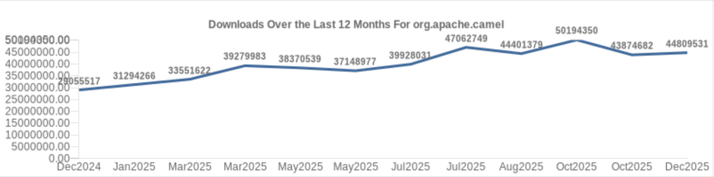

In 2025, Apache Camel's adoption continued to surge, as shown by monthly download statistics from Maven Central.

The graph below tracks downloads over the last 12 months (December 2024 to December 2025).
It starts at approximately 29 million downloads in December 2024 and shows steady overall growth,
with some fluctuations along the way. Monthly figures rose progressively, reaching peaks around 47 million in July and
over 50 million in October, before settling at about 44.8 million by December 2025. Year-over-year growth
from December 2024 to December 2025 was roughly 54%, while peak months demonstrated even stronger increases—highlighting
robust demand.

(Note: There's a minor labeling error on the x-axis where some months appear duplicated, but the download numbers and
trend are accurate.)

This upward trajectory underscores the growing interest in Apache Camel's versatility for building cloud-native,
distributed, and microservices-based integration solutions.
